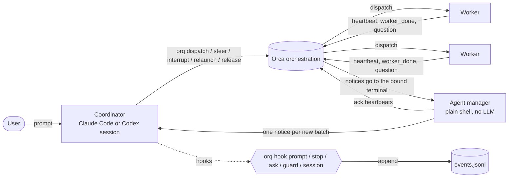
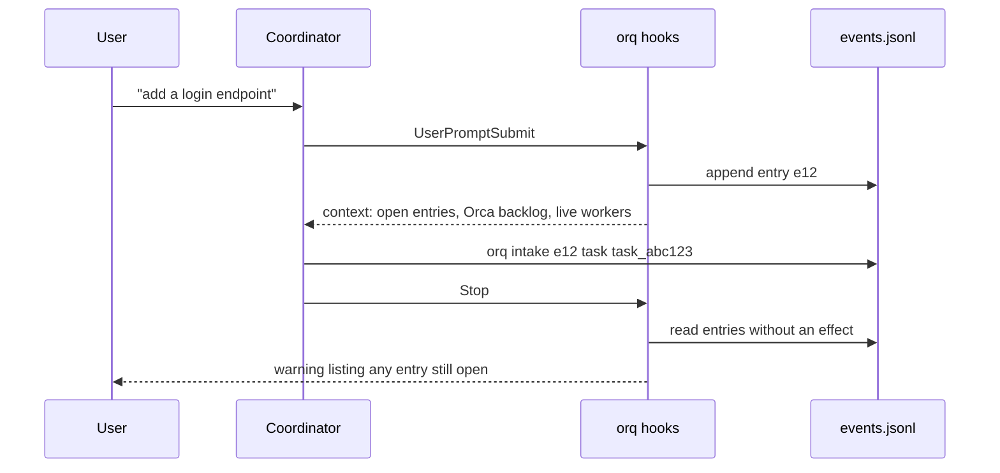

<picture>
  <source media="(prefers-color-scheme: dark)" srcset="assets/banner-dark.svg">
  
</picture>

# orq

A task register and noise filter for a Claude Code or Codex session that coordinates coding agents in [Orca](https://www.onorca.dev).


## Contents

[The problem](#the-problem) · [How it works](#how-it-works) · [Requirements](#requirements) · [Setup](#setup) · [Install](#install) · [Configuration](#configuration) · [Usage](#usage) · [Features](#features) · [Notice obligations](#notice-obligations) · [Backlog](#backlog) · [Projects](#projects) · [Claude Code and Codex](#claude-code-and-codex) · [Where things live](#where-things-live) · [Development](#development) · [Portability](#portability-and-lock-in) · [Language](#language)

## The problem

Orca runs several coding agents side by side: one coordinator session creates Runs and tasks with `orca orchestration`, and workers run in their own terminals. Two things go wrong once more than a couple of workers are busy.

The coordinator drowns in noise. Orca types "You have N orchestration messages" into the coordinator's terminal for every worker message, heartbeats included, and each notice is a new prompt that wakes the model and eats context.

Requests get dropped. The user asks for five things across a long session, the context gets compacted, and nothing records that the third request never became a task. Orca stores tasks, but it has no link between "the user asked for X at 14:02" and what that message turned into.

orq handles both. Hooks record every user prompt as an entry that stays open until the coordinator records what it became. A separate manager terminal soaks up heartbeats so the coordinator only wakes up for results, questions and escalations.

## How it works



The Runs are bound to the agent manager's terminal instead of the coordinator's, so Orca sends every notice there. The manager loop (`painel-agent-manager.sh`, which runs `orq manager absorb` every 10 s, or up to 30 s after a slow round: see `orq manager interval`) acknowledges batches that contain only heartbeats and types a single notice into the coordinator when something else arrives.

Intake runs through hooks:



Every state change is a line appended to `events.jsonl`. Open entries, live workers, pending gates and suspicious answers are all computed from that log by pure functions; nothing reads "the last line" as current state.

## Requirements

- macOS or Linux (`fcntl` locks and `SIGALRM`), Python 3.12+ with the standard library only. The code uses 3.12 syntax (nested same-quote f-strings), so every entry point checks the version before it imports `orqlib` and, under an older Python, exits 0 with "orq needs Python 3.12+; this is X (path)". The hooks run with whatever `python3` the harness's PATH finds, which can be the system 3.9: `orq start` resolves a 3.12+ (Homebrew, mise, uv, `python3.12`; `ORQ_PYTHON` forces one) and writes its absolute path into the hook commands and the `orq` link
- [Claude Code](https://docs.claude.com/en/docs/claude-code) or [Codex CLI](https://developers.openai.com/codex) for the coordinator and workers (either one, or both)
- [Orca](https://www.onorca.dev) with the `orca` CLI on `PATH`
- git

Optional: Node 20+ and `tasks-axi@0.2.6` (`npm i -g tasks-axi@0.2.6`), only if you turn on the backlog (see [Backlog](#backlog)); `gh` (PR state, branch cleanup), `engram` (the handoff is also saved there), `lavish-axi` for the decision page that `orq ask` builds, and [Bun](https://bun.sh) for `orq manager tui`.

## Setup

From scratch, the agent does the setup. You only clone and open the harness:

1. Clone this repository where you want it to live. The clone also holds the state, the plan and the integration worktrees, all gitignored (see [Where things live](#where-things-live)).
2. Open your harness (`claude` or `codex`) inside an Orca terminal, with the clone as the working directory.
3. Ask the agent to set orq up. It checks the tools (`orca`, `git`, `python3`, and the optional ones above), asks before installing anything, runs the steps in [Install](#install), then `orq start --objective "<what you are working on>"` to turn that session into the coordinator.
4. Add your projects by talking to it ("add my project at ~/code/my-app"): it runs `orq project add <path|url>` (see [Projects](#projects)), which writes `projects/<name>.json`, registers the repository in Orca and writes `orca.yaml`.
5. Tune the machine budget and the optional switches in [Configuration](#configuration).

## Install

```sh
git clone <this-repo-url> ~/Developer/orq   # anywhere you like
cd ~/Developer/orq
python3 orq.py install
```

`orq install` wires the harnesses to the clone it runs from. It is safe to run again: a second run changes nothing.

- Claude Code: it appends the groups of [`settings.hooks.example.json`](settings.hooks.example.json) that `~/.claude/settings.json` does not have yet, and points orq's commands that are already there (and an orq `statusline.sh` in `statusLine`) at this clone.
- Codex: the same with [`codex.hooks.example.json`](codex.hooks.example.json) and `~/.codex/hooks.json`. New groups go at the end of each event and nothing is reordered, because Codex records hook trust by position. Review the new or changed hooks once in `/hooks`.
- Links into the clone: `~/.claude/hooks/worker-routing-guard.py` and `limpar-mergeados-hook.py`; `~/.claude/scripts/limpar-mergeados.py`, `limpar-mergeados.keep`, `orca-wait-runs.py` and `trust-cwd.py`; `~/.claude/skills/worker-routing`; `~/.claude/commands/away.md` (the `/away` command); and, for Codex, `~/.agents/skills/worker-routing` and `~/.agents/skills/away` (`$away on|off|status`, since Codex has no user slash commands). A link that points anywhere else is replaced. A real file in its place is kept and reported.
- `~/.local/bin/orq`: a two-line wrapper that runs this clone's `orq.py` with a Python 3.12+. The manager loop calls `orq`.
- If the launchd agent of `orq manager serve` points at another folder, it says so. `orq manager serve --install` rewrites it.

The weekly retro skill is opt-in: `ln -s "$PWD/skills/orq-retro" ~/.claude/skills/orq-retro`.

The orq hooks exit at once outside an Orca terminal and in worker sessions, so they are safe to install globally. The worker-routing guard is the exception: it checks dispatch commands in every session.

Branch cleanup (`limpar-mergeados.py`) reads the branch patterns to keep from `~/.claude/scripts/limpar-mergeados.keep` (one glob per line; a missing file means none). It treats `main`, `development` and `staging` as protected branches (override with `ORQ_PROTECTED_BRANCHES`, comma-separated) and counts a branch as finished only when a PR into `main` merges it (`ORQ_FINAL_BASE`); a project that declares its environments ([Projects](#projects)) supplies both itself.

## Configuration

orq reads plain files on every call: no daemon, no cache. Everything lives under `ORQ_HOME` (default: the clone itself) unless noted. A file you never create means "use the defaults", so you can start with none and add them as you need.

On disk the keys are English; the older Portuguese key names are still read, so an old file keeps working.

### 1. `machine.json`: how many workers your machine can carry

Without a budget, a burst of dispatches can freeze a laptop: every worker is a live agent with its MCP servers, and each can start a test stack. `orq dispatch` checks `machine.json` and the machine itself (`vm_stat`, `memory_pressure`, load average, RSS of `claude`/`codex`/`node`/`docker` from `ps`). With no free slot, with the expensive-model ceiling reached, or under memory or load pressure, the request goes to a priority queue instead of starting.

Look at what you have now, and what orq would decide:

```sh
orq machine            # readings, the effective config and the decision now
orq machine --json
```

Choose the numbers from your machine. A starting recipe:

| Key | Default | How to choose it |
|---|---|---|
| `max_workers` | 4 | Live workers at once. Count about 1.5 to 2 GB of RAM per worker plus whatever one E2E stack needs. On a 16 GB machine, for example, 3 or 4; on 64 GB, 10 or more. |
| `max_expensive` | 2 | Workers on a model matching `expensive_models` at once. An expensive worker also counts toward `max_workers`. This is a cost limit, so it holds even for exempt Runs. |
| `expensive_models` | `["claude-opus-*", "gpt-6-astra*", "gpt-6-sol*"]` | Glob patterns (case-insensitive) of the models you consider expensive. |
| `mem_free_min_mb` | 3072 | Below this much free memory the pressure is high. Roughly 20% of your RAM: 3072 on 16 GB. |
| `free_pct_min` | 15 | Below this percent of free memory (from `memory_pressure`) the pressure is high. Either threshold trips it. |
| `max_load` | 12 | 1-minute load average above this is high pressure. Start at the number of CPU cores. |
| `mem_floor_mb` | 1024 | Safety floor: not even an exempt Run starts a worker below it. Keep it under `mem_free_min_mb`. |
| `exempt_runs` | `["Orquestrador*"]` | Glob patterns on a Run id or objective. Only service workers (`--service`) and P1 dispatches of a matching Run skip the queue for lack of resources; `max_expensive`, `mem_floor_mb` and `max_e2e` still hold. Set it to the objective of the Run that works on orq itself, or to `[]`. |
| `pause_under_pressure` | false | `true`: under pressure the manager pauses the lowest-priority worker itself. `false`: it only tells the coordinator which one to pause. |
| `stop_blocks` | false | `true`: the Stop hook blocks the end of a turn while any entry is open, not only the user entries from this turn. A decision for you to make. |
| `max_e2e` | 1 | For the record only: the E2E queue already serializes stacks. |

Write only what you change; the rest keeps its default:

```json
{
  "max_workers": 3,
  "max_expensive": 1,
  "mem_free_min_mb": 3072,
  "max_load": 8,
  "pause_under_pressure": false
}
```

Edit the file, or set a key without opening it. `orq machine set` takes the key names of `machine.json` (`max_workers`, `max_e2e`, `max_expensive`, `expensive_models`, `mem_free_min_mb`, `free_pct_min`, `max_load`, `mem_floor_mb`, `exempt_runs`, `pause_under_pressure`, `stop_blocks`); the older Portuguese spellings (`max_caros`, `carga_max`, ...) are accepted too. It refuses an unknown key or a value of the wrong type:

```sh
orq machine set max_workers 3
orq machine set expensive_models '["claude-opus-*"]'   # values are JSON
```

What the queue does: the manager starts one queued item per lap, P1 before P2, oldest first; a cheap model still starts while there is a general slot; a request never silently drops to a cheaper model. Pressure is split by owner: when most of the load comes from outside orq (a browser, a VM, indexing), the notice names the biggest outside processes and the manager holds new dispatches without suggesting a pause, because pausing a worker would not help. `orq status`, the digest and the dashboard show slots taken, slots free and the queue; `orq dispatch-queue list|rm <id>|discard <id> --reason "..."` manages it.

### 2. `projects/<name>.json`: one file per project

The easy way is `orq project add <path|url>`, which writes it. By hand:

```json
{
  "repo": "path:~/code/my-app",
  "harness": "codex",
  "group": "work",
  "environments": [
    {"branch": "development"},
    {"branch": "staging"},
    {"branch": "main", "production": true}
  ],
  "flow": "promocao",
  "e2e_queue": "~/.cache/my-app-e2e/queue",
  "deploy_check": "my-deploy-status --env {base} --commit {sha}"
}
```

Step by step:

1. `repo` is the only required key: the Orca repository selector (`path:`, `id:` or `name:`).
2. `harness` (`claude` or `codex`) is the default of `orq dispatch` for this project's workers. Without it, `claude`.
3. `group` is free text that only groups the listing.
4. `environments` is the ordered list of the project's branches; the one marked `production` is production (the last one when none is marked). `flow` is `"promocao"` when the same feature branch opens one PR into each environment in order, or `"direto"` for a single PR into production (the flow values keep their Portuguese spelling). With no `environments` block the project has one environment, the remote's default branch, and the direct flow. A malformed block makes the file show as invalid in `orq projects`. Nothing in orq names `development`, `staging` or `main`: `orq pr`, `orq queue`, the digest, the merge obligations and the base of new worktrees all read this block.
5. `e2e_queue` is the folder of the project's E2E queue (one `<order>-<pid>` ticket per arrival; `~` is expanded). `orq status`, the digest and the stuck-queue notice read it. Without the key there is no queue line. `E2E_LOCK_DIR` forces one folder.
6. `deploy_check` is optional: a command with `{base}` (the environment the PR entered) and `{sha}` (its merge commit) that tells orq whether a deploy finished. See [Notice obligations](#notice-obligations).
7. `transcripts` is optional: the folder where Claude Code keeps the coordinator's transcripts (`orq audit-answers`). Without it, the folder Claude Code names after the `repo: path:`.
8. `orca` holds overrides for the generated `orca.yaml` (see [Projects](#projects)).

Check it with `orq projects` (an invalid file shows `invalid: <why>` and is never picked on its own) and `orq flow --repo <path>`.

### 3. `groups/<group>.json`: a secondmate for a domain

You talk to one coordinator. When a domain gets big (say, everything about `my-app`), the coordinator can hand it to a secondmate ("mate"), a second coordinator with its own Run that coordinates that domain's workers. A group is one file:

```json
{
  "projects": ["~/code/my-app", "~/code/my-app-api"],
  "prefixes": ["app:", "api:"],
  "harness": "claude",
  "model": "<model-id>",
  "effort": "medium",
  "rules": "~/Developer/orq/rules-my-app.md",
  "cwd": "~/code/my-app",
  "mate_project": "~/code/my-app",
  "backlog": "~/Developer/orq/groups/my-app/backlog.md"
}
```

- `projects` (folders) and `prefixes` (title prefixes such as `app:`) decide where a request goes: an explicit group first, then the title prefix, then the cwd inside a project folder. Two groups matching, or none, keeps the request with the coordinator. `orq groups --title T [--cwd D] [--group G]` shows the decision.
- `harness`, `model` and `effort` are how the mate starts; `rules` is a file the mate reads first; `cwd` is where it opens; `mate_project` is the folder of the Orca repository the mate's terminal is grouped under (default: the first of `projects`); `backlog` is the group's own backlog (default `groups/<name>/backlog.md` next to the machine's, see [Backlog](#backlog)).
- Only `projects` and `prefixes` must be lists; every other key is optional.
- `mate_auto` (default `false`) and `mate_ready_min` (default: the machine's, 3) decide what happens when a group without a mate gathers ready tickets, see below.

Routing is deterministic. `orq dispatch` of a request that matches a group (title prefix, or the project's folder inside `projects`) whose mate is open or asleep does not start a worker: it sends the mate an `orq mate request` (which wakes a sleeping mate) and records `mate_dispatch`. `--direct` is the explicit escape: the worker starts in the coordinator's Run and the `dispatch` event keeps the reason in `direct`. A group with no mate, and a dispatch made by a mate itself (`ORQ_MATE`), start the worker as before.

Opening a mate is a proposal, not automatic. When a group with no mate gathers `mate_ready_min` ready tickets (`machine.json` or the group's own file, default 3), the manager tells the coordinator once, and the away-mode Stop lists "open the mate of group X". With `"mate_auto": true` in the group, the manager opens the mate itself, also once; a failure goes to the coordinator. `orq status` prints a line per group, `group <name>: N ready (…) | mate alive|sleeping|down|absent`, with the proposal when it applies.

How this compares with firstmate: there, creating a secondmate is an explicit decision of the model or the captain, and routing uses a natural-language `scope:` that the model judges; what is deterministic is the registry, the relaunch of a dead mate and the status channel. orq keeps the same decision for opening a mate (a proposal) but makes routing a rule, because the group file already says what belongs to it.

Commands: `orq groups` lists groups and mates; `orq mate open <group>` opens the mate (or resumes its session); `orq mate request <group> --text T [--deadline 120] [--answers eN]` sends it work; the mate answers with `orq mate raise --corr pN --type answer --text ...` and raises `decision`, `pr`, `blocker` and `summary` items, each an entry the coordinator closes with `orq intake`. A mate never opens AskUserQuestion and never pushes. An idle mate sleeps (`ORQ_MATE_OCIOSO_MIN`, `ORQ_MATE_DORMIR_MIN`; `orq mate sleep <group>` by hand) and wakes on the next request. See `docs/design.md`, "Secondmates by group".

### 4. Backlog switches

By default pending items live in a JSON file and tickets in markdown files. Optionally both move into a [tasks-axi](https://github.com/kunchenguid/tasks-axi) backlog (see [Backlog](#backlog)). Two switches, each either a file under `ORQ_HOME` (every process reads it, open sessions included) or an environment variable (only processes started after you set it):

| Switch | File | Environment variable |
|---|---|---|
| Pending list in a backlog | `backlog.path`: first line is the path of a `backlog.md` | `ORQ_BACKLOG=<path>` (empty turns it off for that process) |
| Tickets in the backlog | `backlog.tickets`: an empty file | `ORQ_BACKLOG_TICKETS=1` (empty turns it off) |

Neither set means nothing changes. To turn it off, delete the file. `orq backlog` shows the path, whether the `tasks-axi` version is the supported one, and the counts.

### 5. Environment variables

Most settings are files; these are the knobs worth knowing. Names of variables that point at folders or files: `ORQ_HOME`, `ORQ_ISSUES` (tickets), `ORQ_PENDENCIAS` (the pending list the dashboard reads), `ORQ_RELATORIOS` (where reports are kept before a worktree goes), `ORQ_RESUMOS` (summaries), `ORQ_LOG`, `ORQ_REPOS`, `ORQ_TRANSCRITOS`, `ORQ_PROJETOS`, `ORQ_TERMOS`, `ORQ_WT_ROOT`. Behavior: `ORQ_ORCA` (path to the Orca binary), `ORQ_ORCA_TIMEOUT` (seconds per Orca call, default 2.5), `ORQ_NO_BG=1` (no background refresh), `ORQ_HIBERNA_MIN`, `ORQ_COORD_OCIOSO_MIN`, `ORQ_OBRIGACAO_MIN`, `ORQ_PR_POLL_S`. Each is documented where it applies below.

### 6. Away mode (`/away`)

Away mode is for when you leave the keyboard. It changes what the coordinator does, enforced by hooks:

```
/away on        # Claude Code slash command (commands/away.md)
$away on        # Codex skill (skills/away): Codex has no user slash commands
orq away on|off|status     # the same thing from a shell
```

With it on: the Stop hook logs each reply and refreshes the digest; the AskUserQuestion guard denies the box and points to `orq pend add --type decision` (park the decision, keep going on what does not depend on it); `orq ask` builds the decision page but returns at once; the manager types notices into the coordinator whenever it is stopped (with it off, only when its prompt box is empty, ticket 182); and the Stop hook blocks the end of a turn (at most 3 times in 30 minutes) while there is work that needs no user. `orq away off` prints the away report (decisions first) and saves it to `digest/ausencia.md` and `$ORQ_RESUMOS/<date>-ausencia.md` (default `./.scratch/resumos`; the file names keep their Portuguese spelling). A bare `/away` toggles. `statusline.sh` adds `away since HH:MM` to the first HUD line while it is on. See `docs/design.md`, "Digest and away mode".

For a bounded unattended stretch, night mode adds a budget: `orq night on --until HH:MM [--max-dispatches N] [--max-failures 3]`. `orq dispatch` refuses past the end time, at the dispatch ceiling or after N failures in a row; push, PR merge, deploy and `--no-verify` are denied by the external-action guard; `orq night off` frees it. `orq summary --night` prints the morning card.

### 7. Hooks (Claude Code and Codex)

orq does its work in hooks, so the hooks are the one thing you must register. Both example files are complete; merge them, do not rewrite them.

| Event | Command | What it does |
|---|---|---|
| `UserPromptSubmit` | `orq hook prompt` | records the prompt as an entry, injects a short status |
| `Stop` | `orq hook stop` | warns about entries without an effect, blocks the turn in the cases listed in Features |
| `SessionStart` | `orq hook session` | injects status and open tickets; shows a handoff from the other harness |
| `PreToolUse` (`AskUserQuestion`) | `orq hook guard` | refuses the question widget while a worker runs, or in away mode |
| `PreToolUse` (`Bash`) | `orq hook external` | denies push, merge, deploy and other external actions in night mode |
| `PreToolUse` (`Bash\|Edit\|Write…`) | `orq hook place` | warns (never blocks) about a write in the wrong place: the main checkout off its default branch, or a worktree that is not the coordinator's |
| `PreToolUse` (`Bash\|Agent`) | `worker-routing-guard.py` | refuses a dispatch with no explicit model and effort |
| `PostToolUse` (`Bash`) | `orq hook prlink` | links a PR to its task when the coordinator runs `gh pr create` (also as `rtk proxy gh pr create`, in a loop); says "linked" only when it did, otherwise that the PR has no task and the `orq pr link` to run |
| `PostToolUse` (`AskUserQuestion`) | `orq hook ask` | records the answer |
| `PreCompact` / `SessionStart` (`compact`) | `precompact.py` | snapshots the coordinator's state and injects it back after `/compact` |

Claude Code: merge the `hooks` section of `settings.hooks.example.json` into `~/.claude/settings.json`. The example commands call `/opt/homebrew/bin/python3 /path/to/orq/orq.py hook <kind>`; `orq install` writes this clone's path and a Python 3.12+ in their place. `orq start` refuses to run if a hook of the orq is missing from the harness's hooks file, then replaces the loose `python3` in orq's hook commands with the absolute path of a Python 3.12+ and says so (`hooks: found: ...` for each interpreter that could not import `orqlib`). `orq doctor hooks` runs the same check without touching Orca (exit 1 while an interpreter cannot import `orqlib` or a `python3` is loose); `orq doctor hooks --pin` writes the path. Codex trusts a hook by what it says, so after pinning review the hooks once more in `/hooks`.

Codex: `orq hooks-codex` appends the missing groups from `codex.hooks.example.json` to `~/.codex/hooks.json` at the end of each event, and never reorders or removes anything. Codex records hook trust by position, so inserting a group in the middle would unset the trust of the ones after it. Then review the new hooks once in `/hooks`, or start Codex with `--dangerously-bypass-hook-trust`. Until they are trusted the orq does not see that terminal, and `orq status`, `orq agents` and the coordinator's session preamble start with a warning that says so. The Codex commands take a trailing `codex` argument (`orq hook prompt codex`).

Every hook that reads the Bash command (`external`, `place`, `prlink`, `worker-routing-guard.py`) goes through `cmdnorm.py`, which removes `rtk`, `rtk proxy`, `env VAR=x`, `command`, `time`, `sudo` and loop keywords and splits compound commands, so `rtk git push` is judged exactly like `git push`.

Hook names in English are `prompt`, `stop`, `ask`, `guard`, `session`, `place`, `external` and `prlink`. The old names `lugar`, `externas` and `prligar` are accepted for good, so hooks you installed earlier keep working without a new trust step. The hook path is fail-open but not silent: if `orqlib.py` fails to import, or a `session`, `prompt` or `stop` hook raises or runs out of time, the hook exits 0, logs the error to `orq.log`, writes `hook-failed.json` in `ORQ_HOME` (count, first and last time, exception, interpreter) and, at most once every 10 minutes, prints a `systemMessage` ("orq: hooks broken (SyntaxError in orqlib.py:4420), 3 failures since 13:20") and fires a macOS notification (`ORQ_ALARME=off` turns the notification off). `orq status` and the manager's round show "orq hooks broken since HH:MM (Python X): <error>" while the marker stands, and the manager types it once into the coordinator; the line goes away when the interpreter that failed imports and runs the hook again. When `orca orchestration run-current` times out, the session that already coordinated keeps its remembered Run; `hook session` that fails answers with a short "orq context did not load: run `orq status`".

## Usage

Start the manager in a plain shell terminal inside Orca, then bind your Run to it from the coordinator:

```sh
# manager terminal
~/Developer/orq/painel-agent-manager.sh   # from your clone

# coordinator, one command (creates the Run, raises the manager, binds the Run to it)
orq start --objective "Auth work"

# or by hand, after `orca orchestration run-create --objective "Auth work"`
orq manager bind --terminal <manager-terminal-handle>
orq manager unbind --run run_demo   # hand one Run back; without --run, all of them
```

`orq start [--objective "<stream>" | --run <r>] [--agent claude|codex] [--take-over]` turns the Claude or Codex you already opened into the coordinator and never opens another one. It finds the harness from the processes above it, refuses if a hook of the orq is missing, warns when the Codex hooks are not yet trusted, binds the Run, raises the manager or reuses the live one, and prints `orq status`. A manager that belongs to another live coordinator needs `--take-over`. Running it twice changes nothing.

The manager loop can also run outside any terminal, so closing its tab does not stop it:

```sh
orq manager serve              # foreground; log under `$ORQ_HOME/logs/`
orq manager serve --install    # launchd agent: starts at login, restarts if it dies
orq manager serve --status     # running?, pid, installed?, last lap
orq manager serve --stop
orq manager serve --uninstall
```

`serve` still needs the manager terminal from `orq start` or `orq manager bind`: Orca only accepts a handle that belongs to a terminal it has seen. Two `serve` processes at once is an error.

`orq manager tui` opens a read-only terminal UI ([OpenTUI](https://github.com/sst/opentui), needs Bun) with the manager, live workers, the integrator, the queues, pending items, machine load and the latest events. Without Bun it prints the install steps and exits 1.

The TUI follows the terminal theme. It never paints a background; text and borders come from a light or a dark palette whose colors keep a 4.5:1 contrast or better against the theme background (checked by `bun test`). The theme comes from, in order: `--theme light|dark|auto` or `ORQ_TUI_THEME`, the terminal itself (OSC 11, background color), `COLORFGBG`, the macOS appearance (`defaults read -g AppleInterfaceStyle`), and dark if nothing answers. Force it with `orq manager tui --theme light`, or `ORQ_TUI_THEME=light` in the environment.

Record what each entry became:

```sh
$ orq intake e12 task task_abc123
$ orq intake e13 conversation
$ orq intake e14 discarded --note "duplicate of e12"
```

Effects are `task`, `steer`, `pend`, `decision`, `conversation` and `discarded`. Tickets and dispatch:

```sh
$ orq ticket new --title "Add login endpoint" --spec-file spec.md --blocked-by 01
$ orq ticket list
01 Add session store (claimed)
02 Add login endpoint (ready-for-agent; Blocked by: 01)
$ orq dispatch --run run_demo --ticket 02 --model <model-id> --effort medium \
    --worktree new-top-level --name add-login-endpoint --entry e12
$ orq ticket close 02 --answer notes/login-done.md
```

Without a ticket, `orq dispatch --run r --title "..." --spec-file f --model m --effort e` creates the task itself. The spec for `ticket new` must contain a `## Acceptance criteria` section. A ticket file header uses the lines `Status:`, `Blocked by:`, `Run:`, `Task:`, and the optional `Model:`, `Effort:`, `Dispatch:` and `Waiting:` (model, effort, dispatch policy, wait condition; the older `Modelo:`, `Despacho:` and `Espera:` are read too).

Workers:

```sh
$ orq agents
stuck       task_abc123  Add login endpoint  <model-id>  <terminal>  implement 13:40 (22 min ago)
            -> orq steer task_abc123 "<adjustment>" --run run_demo
running     task_def456  Fix flaky test  <model-id>  <terminal>  test 14:01 (1 min ago)
delivered   task_789abc  Update the README  <model-id>  <terminal>
            -> orq release ctx_789abc
$ orq steer task_abc123 "Use the existing rate limiter instead of writing one" --run run_demo
$ orq release ctx_789abc
```

`orq agents` also takes `--json`, `--run r` and `--all` (includes released workers and terminals Orca retained).

The user's pending list:

```sh
$ orq pend add --id pick-db --type decision --title "Postgres or SQLite for sessions?" --task task_abc123
$ orq pend add --id rotate-key --type action --title "Rotate the staging API key" --waiting "ops team"
$ orq pend edit rotate-key --title "Rotate the production API key" --until 2026-10-10
$ orq pend done pick-db --answer "Postgres"
```

`--type` is `action`, `decision` or `notify`. A decision id is at most 12 characters because it doubles as the AskUserQuestion `header`, and answering that question closes it. `--task` creates an Orca gate that holds the task until the decision closes. `orq pend edit <id>` corrects `--title`, `--detail`, `--stream`, `--link`, `--command`, `--waiting` and `--until` of a live item (an empty value clears the field).

Status at any time (the same summary the prompt hook injects):

```sh
$ orq status
```

Ask the user a decision on a page, the same way on Claude Code and Codex: `orq ask --id <pend> --question "..." --option "A" --option "B" [--recommended N] [--wait-min M]`. It creates the decision if the id is new, builds a Lavish page (one radio per option, the recommended one only labelled, never preselected; free text, "decide later" and "let's talk"), opens it in Orca's browser, waits on `lavish-axi poll` and records the answer like `orq lavish-answer`. Only an explicit choice closes the decision, and a decision with a gate closes only after Orca confirms the gate resolved. No answer leaves it open with a warning. It blocks until the answer, so run it as the harness's background job.

Also available: `orq ingest [--refresh]`, `orq alert seen <task>`, `orq lavish-answer <file|->` and `orq audit-answers [--session id]`.

## Features

### Intake and the Stop hook

- Deterministic intake. `orq hook prompt` classifies each prompt by its origin (user, Orca notice, task notification, slash command, compaction summary, worker dispatch preamble) and records only user prompts as entries, then injects a status summary of at most five lines.
- Effects. `orq intake <entry> <effect> [ref]` closes an entry. It refuses a task or pending id that does not exist, and refuses `conversation` and `discarded` while the entry still has open obligations ([Notice obligations](#notice-obligations)).
- Implicit intake. `dispatch`, `ticket new`, `pend add`, `ask`, `steer` and `mate request` without `--entry` close the only open user entry of the terminal with the effect they imply and print `intake eN -> <effect> (implicit)` on stderr. With two or more open entries they record nothing and print the ids and the `orq intake` to run; a worker never records; a later `orq intake` on the same entry replaces the implicit effect.
- Stop reminder. `orq hook stop` lists the entries still without an effect. Two things can block the end of the turn, each at most 2 times in a row for the same set of open entries per session, then it lets go with a `systemMessage` and a `gate_failed` event: always, a user entry from the turn that is ending (or open for more than 30 min) with no `orq intake`; and, only with `stop_blocks` on, any open entry. An entry that is only an orq command (`/away`) gets an automatic `conversation` intake.
- Report ingestion. `orq ingest` turns completed Orca automation runs and `worker_done` messages carrying a `reportPath` into entries, one per numbered action item. A worker whose `worker_done` Orca refused and who left `final-report.md` in its worktree root counts as delivered.
- Delivery proof. When a `worker_done` cites commit shas, ingest checks them with `git` and, for a cited PR URL, with `gh`. A missing commit or a dirty tree logs a `delivery` event, shown as "delivery without commit" in `orq summary` and `orq agents`. It never blocks the worker.

### Noise filter and the manager

- Heartbeat absorption. Orca notices whose mailbox holds only heartbeats are acknowledged and blocked before they reach the model, in the prompt hook and in the manager loop.
- Agent manager. `orq manager bind|unbind|spawn|check|absorb` binds Runs to a separate terminal and rotates through several Runs, because Orca binds one Run per terminal. A round touches the `manager-alive` stamp at its start, after each Run and at its end. The coordinator is told the panel stopped only when the stamp is older than the larger of 90 s and 3x the average round; a stamp between 60 s and that limit reads "panel slow".
- Notices never land in the middle of what you type. The manager types into the coordinator only with away mode on; otherwise every notice waits for your next prompt. With away mode on it types only when your last prompt is older than 10 minutes (`ORQ_COORD_OCIOSO_MIN`); the line that wakes it for a worker's message waits 2 minutes (`ORQ_WAKE_OCIOSO_MIN`). Every typing reads the input box twice, 3 seconds apart (`ORQ_AVISO_GAP_S`), and a draft in either read cancels it. `"notify_macos": true` in `manager.json` adds a macOS notification for each deferred notice. Orca has its own notice that it types into the Run's `coordinator_handle` and that cannot be turned off; orq keeps the coordinator from being that handle.
- Typed notices are short. Everything orq types into a terminal stays at or under 150 characters (`NOTICE_MAX`). A longer text is written whole to `$ORQ_HOME/avisos/<hash>.txt` and the typed line is its beginning plus `... full text in <path>`, so the agent reads the rest from the file.
- Mailbox. `orq inbox [<run>] [--ack] [--all]` reads Orca's mailbox as the coordinator: one short line per message (heartbeats are only counted) and, with `--ack`, first runs each `worker_done` through the manager's ingest and then acknowledges it.

### Dispatch and workers

- `orq dispatch` starts a worker with an explicit model and effort, renames its tab, records the dispatch and links the entry. A guard hook refuses `orca orchestration worker-start`, `orq dispatch` or an Agent call with no explicit model and effort.
- `orq agents` shows every dispatch across all Runs as `running`, `stuck` (no heartbeat for 15 min), `asking`, `delivered`, `released`, `limit` (the plan limit is on the screen), `no_terminal` (lost its terminal without a `worker_done`), `hibernated`, `sent_back`, and two "not stuck, on purpose" states: `awaiting_integration` (the ticket is on the integrator queue, `orq integrate queue add <branch> <ticket>`) and `service` (a dispatch started with `--service`, such as an integrator or a secondmate, that stays alive after its first `worker_done`; it reports each cycle with `orq cycle done --dispatch <id> --hash <commit> [--note ...]`, which does not call Orca; `orq service mark <dispatch>` marks one by hand).
- Worker control. `orq interrupt <dispatch>` sends Orca's interrupt to a running worker. `orq end <dispatch> --reason <why>` stops and releases it. `orq relaunch <dispatch> --note <what changed>` stops it and starts another in the same worktree and task, keeping the model and effort unless `--model` and `--effort` say otherwise. Each step is an event, and `orq agents` prints the control history under the dispatch.
- `orq send-back <task|dispatch> "<reason>" [--run]` sends the worker a correction on a delivery whose task is already `completed`, where `orq steer` refuses. It types the notice into the worker's terminal, resumes the session when the terminal is gone, or wakes a hibernated worker, and sets the task back to `dispatched`.
- `orq steer` sends a correction to a running worker and, if Orca did not notify it, types the notice into its terminal (also in the middle of a turn, when the screen shows no menu and the input box is empty). The manager loop checks that the worker read it, retypes up to 3 times, then records a "steer not read" alert.
- Switching harness. `orq switch <dispatch> --to codex|claude` continues a worker on the other harness, in the same worktree and task. It refuses before stopping anything (same harness, worktree gone, no equivalent model, the other harness over its quota, no machine slot), then stops the old worker, writes `HANDOFF.md` in the worktree root, starts the new one with the equivalent model and effort, and steers it to read the file. `orq handoff <dispatch> [--to codex|claude]` writes the same file for a worker that has no turn left (it hit its plan limit), from facts only and without stopping or starting anything. `orq handoff coordinator [--to codex|claude]` hands the coordinator itself to the other harness through `precompact.py`'s snapshot; the other harness's `hook session` injects it once, fenced as the old session's state.
- `orq transcript <dispatch> [--last N] [--json]` reads the tail of a worker's transcript (Claude `.jsonl` or Codex rollout): visible messages plus tool calls and results, reasoning left out.
- `orq resume [--dry-run]` after a crash reopens the agent manager and resumes, with `claude --resume` or `codex resume`, each worker that has no `worker_done` and lost its terminal. `orq agents` and the hooks point at it when there are such workers.
- Hibernation. A worker parked at its prompt holds memory. `orq hibernate <task|dispatch>` stores the session in `cursor.json` and closes the terminal; the manager does it by itself, with no LLM, when the worker has been parked for more than 15 min (`ORQ_HIBERNA_MIN`), or delivered and not released for that long, or waiting for something outside that orq already knows (a pending item, an open PR, a blocked ticket) for 2 min (`ORQ_HIBERNA_EXTERNA_MIN`). Never a coordinator, a manager, a worker with a question or permission on screen, a spinner, a draft in the input box, or a live child process. `orq wake <task|dispatch> [--text ...]` resumes it; `orq steer` and `orq reply` wake it themselves.
- Plan limit and pause. When a worker's terminal ends with the usage-limit notice of its harness, `orq agents` shows it as `limit` and the manager tells the coordinator once. `orq usage [--agent codex]` reads each plan's quota; `orq dispatch` refuses when the chosen harness is over its limit. `orq pause` ends a worker's background processes, then closes its terminal; `orq priority <1|2|3>` sets a ticket's priority.
- `orq reply <msg_id> "<text>"` answers a worker's question through the manager's handle.
- `orq review <task|ticket>` runs only the review step of [no-mistakes](https://github.com/kunchenguid/no-mistakes) in the task's worktree and prints the findings. It uses its own `NM_HOME` (`ORQ_NM_HOME`), refuses at the pause level of `orq usage` and under machine pressure, and counts as one expensive slot. It does not replace the coordinator's checklist.

### Releasing and cleaning

- `orq release` acknowledges a finished worker's messages, releases it and closes its terminal when that is safe, including the setup shells of a worktree the orq asked Orca to create for that dispatch. A `worker_done` `succeeded` of an orq ticket that names a branch goes onto the integrator queue by itself and a short notice is typed into the integrator. `orq pause` on a dispatch that already sent its `worker_done` stops at once and says to use `orq release`.
- Processes left in a worktree. `orq release`, `orq clean --closed` and `limpar-mergeados.py` find every process whose `cwd` is inside a linked worktree (`lsof -a -d cwd`), send TERM, wait `ORQ_ENCERRA_ESPERA_S` (5 s) and send KILL only to what is left, then log a `processes` event. They never touch a process outside the worktree, the orq's own process or the ones above it, and never sweep the main checkout (a `.git` directory): it runs the coordinator, the manager and every `--worktree current` worker.
- Branch cleanup. `limpar-mergeados.py` removes a worktree and its branches once a PR into the final base merges the branch. Untracked files orq itself asked the worker for (`PAUSE.md`, `HANDOFF.md`, `final-report.md`) do not count as changes: they are copied to `ORQ_RELATORIOS` first. Any other untracked or modified file still blocks, with no `--force`. `orq pr poll` starts the cleanup in the background for each PR it sees merged.
- Closed PRs without a merge. When every PR linked to a task is closed without merge, `orq pr poll` records a `closed` event; after `ORQ_FECHADO_DIAS` days (default 1), or right away with `orq clean --closed [--dry-run]`, the orq saves the worktree's `final-report.md`, removes the worktree and deletes the local and remote branch. It never touches an environment branch, the head or base of an open PR, or a task with any open or merged PR.
- `orq worktrees clean [--dry-run]` removes the integration worktrees (`<ORQ_WT_ROOT>/<ticket>`) whose branch is already an ancestor of `origin/main`, with a clean tree and no process inside; never `--force` or `rm -rf`.
- `orq doctor tasks [--dry-run] [--json]` crosses the open Orca tasks of every Run with the tickets; `orq doctor backlog [--json]` crosses the backlog's tickets with the Orca tasks and prints the repair for each mismatch; `orq doctor antigos [--liberar]` lists dispatches released for over 24 h whose terminal is gone and whose ticket is resolved.

### Pull requests

The question "can I merge?" is answered by `orq queue list`: each step shows ready, the red check by name, a conflict (also between steps of the queue) or CI running, plus the next step to merge. GitHub ties checks to the commit, and one branch opens a PR per environment, so a red check from another environment's deploy workflow shows as "failure in another environment" and does not count.

- `orq pr link <task> <url> [--issue N]` registers the PRs of a feature. The `prlink` PostToolUse hook does it by itself when the coordinator runs `gh pr create`, and the PR joins the merge queue. `orq pr auto` finds the task by the worktree name (with or without the `leodiegoo/` prefix), by an already linked PR of the same branch (the PR to main after development and staging) or by the worktree; with no owner the PR goes under "PR without a task" and the hook warns.
- `orq pr open <dispatch|branch> --title "<conventional commit>" --body <file> [--environments development,staging]` publishes the delivery: it drops the user prefix Orca puts on the branch, runs `git merge-tree` against each environment and stops before any push on a conflict, pushes, opens one PR per environment in the project's order, links each to the task and prints the full links. It refuses an empty body, a generator footer or `Co-Authored-By`, and a title that is not a Conventional Commit. Production is only opened once the environments before it have a merged PR for the task.
- `orq pr poll` (also every manager lap, at most every 2 minutes) wakes the coordinator only when a linked PR is merged or closed. The next PR is only suggested, never opened.
- `orq queue add|done|rm|list` is the merge order the coordinator declares (each step: name, why, PR numbers); without one, the order comes from the tickets' `Blocked by`. `orq integrate queue add <branch> <ticket>|rm|list` is the separate queue of the integrator, which advances the orq's own `main` outside the live checkout.

### Digest, summaries, retro

- `orq digest [--since <ts>] [--html] [--open]` writes `$ORQ_HOME/digest/atual.json`, the file a dashboard reads: the merge queue, features, pending items, what happened, live workers and open tickets (each ticket carries `projeto`, the group `orq groups --title` would pick from its title, or null; ticket 193). It reads only orq's own files (no `gh`, no Orca call). The digest and the dashboard's pending list keep their Portuguese keys (contract `digest-v1`).
- `orq summary [--since <ts>]` prints, on demand, what waits on you, what came in, what is running, what comes next and the decisions made. `orq summary add "<text>" [--project <name>]` appends it to `<project repo>/.scratch/resumos/<date>.md`.
- `orq retro [--since D] [--until D] [--project FRAGMENT] [--json] [--no-gh] [--no-transcripts] [--save]` counts, with no LLM, the failure signals of a window (default 7 days): dispatches that never started, steers with no proof of reading, workers released dirty, deliveries with no commit, user rules broken in worker transcripts, PRs with a red check. The `orq-retro` skill reads it and proposes at most five changes; each carries a `causa` (`orq` or `projeto`, by what led to the error: orq's briefing/command or the repository) and a class (check, text, calibration or skill `gatilho`, which edits a skill's `description:`). `causa: orq` tickets go to the orq Run, never into the project's AGENTS.md. Nothing is applied without your ok.

## Notice obligations

A notice often implies work that has nothing to do with the notice being "seen". A PR merged into production means checking the deploy, updating the issue and cleaning the branch. orq writes that work down when the notice arrives, so it does not depend on the coordinator remembering it. The same hooks run it on Claude Code and Codex.

| Notice | Obligations (key: meaning) |
|---|---|
| PR merged into production | `deploy`: check the production deploy; `comentario`: update the comment on the linked issue; `limpeza`: check that the branch and worktree are gone; `ticket`: close the task's ticket |
| PR merged into another environment | `deploy`: check that environment's deploy; `proximo`: open the next PR, or postpone with the reason to hold |
| `worker_done`, a worker question, an automation report | none created: the worker list, `orq reply` and the report triage already hold them |

An obligation that needs a value it does not have is not created: `comentario` needs an issue (from `orq pr link --issue N` or an `issue: #N` line in the ticket header), `ticket` needs an open ticket, `proximo` needs a next environment. The keys are written as shown (they are data, read as is). Obligations hang on the notice's entry and show in the prompt's extra line until each is closed:

```sh
orq fulfill e484 comentario --proof "https://github.com/<org>/<repo>/issues/2045#issuecomment-1"
orq defer e484 deploy --reason "the deploy runs tomorrow"   # creates a "to do later" ticket with the reason
```

While an entry has an open obligation, `conversation` and `discarded` are refused; closing the last obligation closes the entry. The Stop hook blocks the end of the turn while an obligation is open for more than 10 minutes (`ORQ_OBRIGACAO_MIN`), at most 2 times per set of open obligations per session. A secondmate never blocks.

Some close by themselves, with the proof orq saw:

- `ticket`: `orq ticket close NN`.
- `limpeza`: the cleanup event for the task's branch, when something was removed and nothing was kept or skipped.
- `proximo`: `orq pr link` or `orq pr auto` of a request of the same task whose base is the environment the obligation asks for.
- `deploy`: needs `deploy_check` in `projects/<name>.json`. The manager lap runs the command for each open `deploy` obligation, at most every 2 minutes (`ORQ_PR_POLL_S`), in the project's folder. Exit 0 closes with the first stdout line as proof; exit 2 means "still building" and leaves it open; any other exit (or more than 60 s) warns the coordinator once. Without the key nothing runs. The command is the project's to write:

```json
{"repo": "path:~/code/my-app", "deploy_check": "my-deploy-status --env {base} --commit {sha}"}
```

## Backlog

Optional: move the register to [tasks-axi](https://github.com/kunchenguid/tasks-axi) (design in `docs/design.md`, "Backlog in the tasks-axi format"). **Requires Node 20+ and `npm i -g tasks-axi@0.2.6`**, only when a backlog is on; the rest of orq stays Python 3, stdlib only. The switches are in [Configuration](#4-backlog-switches). With them off nothing changes.

- Pending list. It lives in the backlog (`repo: pend`, one item per pending entry). `orq pend`, the guard hook, `orq lavish-answer`, `orq ask`, the status line, the digest and the compaction handoff all read and write it, and the dashboard's `pendencias.json` is regenerated after every change.
- Reads are done in Python (`backlog.py`; the hooks never start `tasks-axi`). Writes call the `tasks-axi` CLI and are refused unless `tasks-axi --version` is exactly `0.2.6`. A symlinked `backlog.md` is refused.
- Tickets. With `backlog.tickets` on, a ticket is the item `tNN` and its state lives there. `orq ticket new` writes the file (the text), creates the Orca task and then the backlog item with one `blocked-by` per blocker. `orq dispatch --ticket NN` is gated: the item must exist, have no active hold and no open blocker. `orq ticket close NN` marks it done first, then appends `## Answer` to the file, completes the Orca task and lists the dependents it freed.
- Closing a ticket frees what waited on it: it moves the dependents' Orca tasks from `blocked` to `ready`. A freed ticket of priority 1 or 2 whose header declares `Model:` and `Effort:` goes into the dispatch queue and the manager starts it when a slot opens; priority 3 never starts by itself. `Dispatch: manual[, reason]` keeps a ticket out of the automatic queue, and `Waiting: integrator empty` enters it only while the integrator queue is empty. A freed ticket goes up with `--worktree current` for an orq ticket and `new-top-level` for a project ticket.
- Backlog by group. A secondmate's group may have its own backlog (`backlog` in `groups/<name>.json`). `orq backlog move NN... --group G` moves tickets there, all or nothing: only Queued tickets go and the whole connected set has to be named. `orq mate open` starts the mate with `ORQ_BACKLOG` pointing at its backlog.
- `orq doctor backlog [--json]` prints one line per mismatch between the backlogs and the Orca tasks, with the repair command. It writes nothing and exits 1 when it finds something.

Turning it off: delete `backlog.path` (or run a command with `ORQ_BACKLOG=`), and `backlog.tickets` for the tickets. The dashboard file is already current; the ticket files stay.

Migrate with a rehearsal on a fresh file, then point `ORQ_BACKLOG` at it:

```sh
python3 scripts/converte-backlog.py --saida /tmp/rehearsal/backlog.md   # reads the tickets and the pending list; never writes them
ORQ_BACKLOG=/tmp/rehearsal/backlog.md orq backlog
```

It writes only to a new file, runs `tasks-axi render`, and exits 1 if Done, blocking edges or ready counts differ from the sources. Do not install the tasks-axi SessionStart hook (`tasks-axi setup hooks`): it injects the whole panel in every session, and `orq hook session` already injects the lines that matter.

Publication audit: `githooks/pre-push` runs `orq audit-publication <base>..<head>` on every ref pushed, and the integrator runs it before fast-forwarding `main`. It refuses a commit whose author or committer is not the configured noreply (`ORQ_AUTOR`, default `git config user.email`), with a `Co-Authored-By` trailer or generator footer, with a forbidden term in the added lines or the message, and a range that changes `orqlib.py` or `orq.py` without touching `README.md`. `git config core.hooksPath githooks` also runs `scripts/audiencia-check.py` before each commit: it scans tracked files for the terms in a private list outside the repo (`ORQ_TERMOS`, one term per line, `re:` prefix for a regex).

## Projects

`orq project add <path|url> [--name N] [--harness claude|codex] [--group G] [--orca-yaml FILE] [--replace-orca-yaml] [--dry-run] [--json]` adds a project in one step. A URL is cloned into `--dest` (default `~/Developer/<name>`). It writes `projects/<name>.json` (kept as is when it exists, but refused when it points at another repository), registers the repository in Orca when `orca repo list` does not have it (`orca repo add`, then `orca repo set-base-ref origin/<production>`) and writes `orca.yaml` at the repository root. Everything is validated before anything is touched.

- **Environments from the remote.** A new project file gets an `ambientes` block when the remote has branches besides its default one: the default branch is production and every other remote branch without a `/` (so not `feat/x`) is an environment before it, in name order. A remote with only its default branch gets no block, which means the direct flow. Edit the file when the guess is wrong.
- **`orca.yaml`.** The fixed part is always there: trust the folder in the project's harness (`trust-cwd.py` for Claude, `orq project trust` for Codex) and the `.scratch` sync in (`setup`) and back (`archive`). The rest is a block per marker the repository has, never a default: `install` (a lockfile: `pnpm-lock.yaml`, `yarn.lock`, `package-lock.json`, `bun.lock`, `uv.lock`), `setup_script` (`scripts/setup-worktree.sh`), `graphify` (`graphify-out/`), `meteor` and `e2e` (`scripts/e2e-infra.sh` with a `destroy)` case, else `docker-compose.e2e.yml`).
- **The agent proposes.** When the agent adds a project, it reads the repository, writes the `setup` and `archive` blocks that make sense for it into a file, shows `orq project add ... --dry-run` to the user, and passes the file with `--orca-yaml`. The proposal replaces the detected blocks; the fixed part is added around it. orq only validates: it reads the subset Orca understands (top-level keys `scripts`, `setupAgentStartupPolicy`, `issueCommand`, `defaultTabs`, `environmentRecipes`, `worktree`; under `scripts` only `setup` and `archive`) and refuses anything else with the line, before writing.
- **Overrides in the project file**, for when the detection is wrong: `"orca": {"blocks": {"meteor": false, "graphify": true}, "setup_extra": ["make bootstrap"], "archive_extra": ["rm -rf .cache"]}`. `false` removes a detected block, `true` adds one the detection missed, the `*_extra` lists are appended last.
- **An `orca.yaml` already in the repository is never overwritten.** The command prints the unified diff, leaves the file and says so; run it again with `--replace-orca-yaml` if the user accepts. `--dry-run` touches nothing.
- `orq projects [--json]` lists the projects. `orq run project <name> [--run <id>]` ties a Run to a project (orq's log keeps the link; Orca keeps only the Run's objective).
- `orq dispatch` resolves the project as `--project <name>`, then the Run's project, then the project whose `repo: path:` contains the current directory, the longest path winning. A name that no longer exists or is invalid refuses before any task is created. The harness is `--agent`, then the project's, then `claude`. With a project the dispatch calls `worker-start --repo <selector> --worktree new-top-level`, and for a Codex worker trusts the project's repository root. When the project declares `environments` and `--base-branch` is absent, the work branch is born from `origin/<production>`.
- `orq mate open <group>` creates the mate's terminal inside the project in Orca when `orca repo list` has that repository, so it shows up grouped with the project.
- With no project file the behavior is the plain one: one coordinator for all projects, Orca's own defaults.

## Claude Code and Codex

**Waiting without turns.** Every spec `orq dispatch` builds, and the task `orq ticket new` creates, ends with a block that tells the worker: end the turn after an `ask` or an escalation; run an external wait (CI, PR, merge) as one blocking command with the tool's maximum timeout; if it returns unchanged, repeat the same command with no check in between; never background a command to poll it. A worker that sleeps in a loop burns a full context per turn and never looks idle to `orq hibernate`.

The coordinator can be a Claude Code or a Codex session, and each worker can be either: `orq dispatch --agent codex --model <model-id> --effort low ...` (the default is `claude`, or the harness of the project). What changes per agent sits in one table, `HARNESS` in `orqlib.py`: the resume command, the screen patterns and the accepted efforts. Orca builds the launch command from `worker-start --agent`. The rest goes through Orca for both: `orq resume` finds a session the hooks never recorded through `orca search <dispatch id>`; `orq usage` reads each plan from `orca account list`; `orq switch` moves a worker to the other harness.

The `worker-routing` skill maps the Claude roles to Codex models and sets the model and effort to use per kind of task; read it before dispatching.

Weaker on Codex: there is no AskUserQuestion, so decisions go through `orq ask`; `/away` becomes the `away` skill; and an untrusted Codex hook does not run, which leaves that session invisible to orq's turn tracking. Details in [`docs/design.md`](docs/design.md#harnesses-claude-code-and-codex-ticket-73).

## Where things live

| Path | Contents | Override |
|---|---|---|
| the clone | runtime state: `events.jsonl`, `cursor.json`, `open.json`, `manager.json`, `manager-alive`, `machine.json`, `merge-queue.json`, `dispatch-queue.json`, `turns.json`, locks, `handoff/` (all gitignored) | `ORQ_HOME` |
| `projects/`, `groups/` under `ORQ_HOME` | one JSON per project and per group | `ORQ_HOME` |
| `avisos/`, `retro/`, `digest/` under `ORQ_HOME` | full text of long notices; numbers of each saved retro; the digest | `ORQ_HOME` |
| `plan/` in the clone (gitignored) | the plan: tickets in `issues/` (`NN-<slug>.md`), reports in `relatorios/`, the design map `desenho.md`, `termos-proibidos.txt` | `ORQ_PLAN` (`ORQ_ISSUES` for the tickets alone) |
| `.worktrees/` in the clone (gitignored) | the orq ticket worktrees and the integrator's | `ORQ_WT` |
| a `backlog.md` you pick, outside this repo | the tasks-axi backlog | `ORQ_BACKLOG`, or the first line of `backlog.path` |
| the dashboard's `pendencias.json` | the user's pending list (a mirror when a backlog is on) | `ORQ_PENDENCIAS` |
| `~/.claude/logs/orq.log` | errors from hooks that failed open; uses of the Portuguese aliases | `ORQ_LOG` |
| `hook-failed.json` | marker of the hook that is failing: what `orq status` and the manager show | `ORQ_HOME` |
| `~/.claude/projects/` | Claude Code transcripts, read by `orq release`, `orq retro` and `orq audit-answers` | `ORQ_PROJETOS`, `ORQ_TRANSCRITOS` |
| `~/.codex/config.toml` | `orq dispatch --agent codex` adds `trust_level = "trusted"` for the repository root and the new worktree | `ORQ_CODEX_CONFIG` (or `CODEX_HOME`) |

`orq audit-answers` reads the coordinator's transcripts from `ORQ_TRANSCRITOS`; by default that is the Claude Code project folder for the current directory, so run it from the coordinator's working directory or set the variable. Files the workers write in their worktree: `HANDOFF.md`, `PAUSE.md`, `final-report.md`.

## Principle: an obligation is a hook

An obligation of the coordinator or a worker that depends on someone remembering a command gets forgotten: intake of an entry, adding a branch to the integrator queue, closing the terminal after a release, the audit before a push, closing a ticket after integrating, the deploy check after a merge. So an obligation is fired by an event (a Claude or Codex hook, the ingest of an Orca message, a manager lap, a git hook), and a manual command is left for decisions, lookups and as an escape. The inventory of every command is in `docs/design.md`, "Obligations are hooks".

- Automatic: entry recording and ingest, the status summary, heartbeat absorption, `pr poll`, linking a PR and joining the merge queue, steer redelivery, hibernating and waking workers, the digest, the dispatch queue, the merge obligations, branch cleanup, the model and effort guard, the intake a command implies, closing what the integrator merged (`orq integrate conclude`: queue entry out, ticket closed, worker released), and reading and acknowledging the Orca inbox (the prompt hook runs `orq inbox --ack` itself on the Orca notice and injects each non-heartbeat message whole; ticket 182).
- Manual, by design: everything that is a decision (`dispatch`, `steer`, `reply`, `end`, `relaunch`, `switch`, `pause`, `ask`, `pend add`, `defer`, `away`, `night`), lookups (`agents`, `status`, `queue list`, `machine`) and setup (`start`, `project add`, `manager serve`).

## Development

```sh
python3 test_orq.py              # fake Orca, temporary ORQ_HOME
python3 test_precompact.py
python3 scripts/limpar-mergeados.py --self-test
```

The test runner fails on any `def test_` placed after `if __name__ == "__main__":` (it would never run); define tests above that block.

Editing orq: hooks and the manager panel execute `orq.py` while it runs, so a half-edited file stops them. Work in a separate worktree (`git worktree add .worktrees/<topic>`), run the tests there, and move the live copy only through `scripts/integrar.py <branch>...`, never `git merge`, `git pull` or `git checkout` inside the live checkout. It merges in a separate worktree, runs the tests there and advances `main` by fast-forward only when they pass; on a conflict you resolve in that worktree, commit, and run `integrar.py --avancar <worktree>`. Right after the fast-forward it runs `orq integrate conclude --hash <new main> <branch>...`. The `githooks/pre-commit` hook refuses a commit on `main` of the live checkout (a checkout that is not a linked worktree) and says to create a worktree; `ORQ_INTEGRADOR=1` is the explicit bypass. If `orqlib.py` fails to import, the hooks exit 0 with no output and log the failure instead of breaking the worker's turn. See `docs/design.md`, "Integrating branches outside the live checkout".

## Portability and lock-in

orq is a personal tool tuned for Claude Code or Codex plus Orca. It works, it has a large test suite, and it is shaped by one person's workflow.

Tied to the harness: the hook events and their JSON formats (UserPromptSubmit, PreToolUse, PostToolUse, PreCompact, SessionStart, Stop), which Claude Code and Codex share almost field for field; the AskUserQuestion tool (Claude Code only); the transcript formats; the skill file format.

Tied to Orca: the `orca orchestration` CLI and its JSON (Runs, tasks, gates, dispatches, the mailbox, the inbox), `orca terminal`, `orca search`, `orca account list`, `orca automations runs`, the notice text Orca types into terminals, and the dispatch preamble that identifies a worker session.

Generic: the Python core, the append-only `events.jsonl` and the functions that derive state from it, the markdown tickets, and the entry and effect state machine.

A third agent would mean one more `HARNESS` entry (resume command, screen patterns, efforts), its hook config, and a transcript reader for `orq release`.

## Language

The interface is English: command, subcommand and flag names, choice values, `--help`, the messages orq prints and the text the hooks inject into agents, this README and `docs/design.md`. State on disk is English too: file names, JSON keys, event types and recorded values; orq reads both the English and the older Portuguese form.

Identifiers, comments and docstrings in the code are English too (ticket 133). What still carries Portuguese is data the code parses as written or reads from the outside: the dict keys the code keeps in memory (translated to English only at the disk boundary, see `docs/design.md`), the `ORQ_*` environment variable names, the flow values `promocao` and `direto`, the obligation keys `comentario`, `limpeza` and `proximo`, the older ticket header lines (`Modelo:`, `Despacho:`, `Espera:`, read next to the English ones) and the keys of the digest contract `digest-v1`.

The Portuguese command names still work as aliases until the aliases are removed, and each use is logged to `orq.log` as `apelido pt:`. This table is the only place they appear:

| Portuguese alias | English |
|---|---|
| `feito`, `adiar` | `fulfill`, `defer` |
| `pend lista` | `pend list` |
| `pr ligar`, `lista`, `desligar`, `abrir` | `pr link`, `list`, `unlink`, `open` |
| `fila add`, `feito`, `rm`, `lista` | `queue add`, `done`, `rm`, `list` |
| `ausente` | `away` |
| `responder`, `iniciar`, `ocupadas`, `resumo`, `alerta`, `agentes` | `reply`, `start`, `busy`, `summary`, `alert`, `agents` |
| `liberar`, `interromper`, `responder-tela`, `encerrar`, `relancar` | `release`, `interrupt`, `answer-screen`, `end`, `relaunch` |
| `passagem`, `passar`, `transcrito` | `handoff`, `switch`, `transcript` |
| `noite`, `despachar` | `night`, `dispatch` |
| `projetos`, `projeto`, `fluxo`, `run projeto` | `projects`, `project`, `flow`, `run project` |
| `ciclo feito`, `servico marcar` | `cycle done`, `service mark` |
| `integrar fila add`, `rm`, `lista`; `integrar concluir` | `integrate queue add`, `rm`, `list`; `integrate conclude` |
| `limpar`, `worktrees limpar`, `devolver`, `revisar`, `caixa` | `clean`, `worktrees clean`, `send-back`, `review`, `inbox` |
| `ticket novo`, `fechar`, `editar`, `lista` | `ticket new`, `close`, `edit`, `list` |
| `lavish-resposta`, `perguntar`, `auditar-respostas`, `auditar-publicacao` | `lavish-answer`, `ask`, `audit-answers`, `audit-publication` |
| `gerente ligar`, `desligar`, `checar`, `subir`, `absorver`, `intervalo` | `manager bind`, `unbind`, `check`, `spawn`, `absorb`, `interval` |
| `retomar`, `hibernar`, `acordar`, `pausar`, `prioridade`, `uso` | `resume`, `hibernate`, `wake`, `pause`, `priority`, `usage` |
| `maquina`, `fila-despacho`, `grupos` | `machine`, `dispatch-queue`, `groups` |
| `mate abrir`, `dormir`, `pedir`, `subir`, `pedidos` | `mate open`, `sleep`, `request`, `raise`, `requests` |

Flags have English names too (`--title`, `--spec-file`, `--model`, `--entry`, `--note`, `--proof`, `--reason`, `--until`, `--since`, `--all`, `--project`, `--group`, ...); the Portuguese spellings are accepted alongside them. Choice values follow: `on|off`, `action|decision|notify`, `answer|decision|pr|blocker|summary`, `budget|decision|limit`.

## License

MIT. See [LICENSE](LICENSE). Copyright Leonardo Diego Barbosa.
