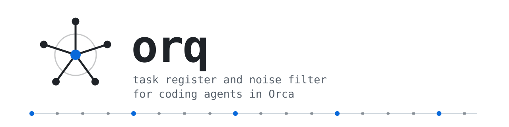
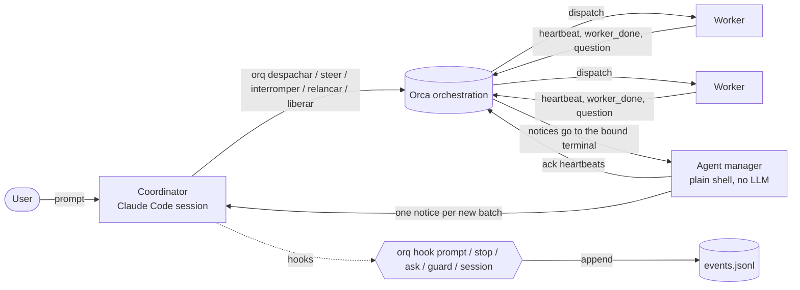

<picture>
  <source media="(prefers-color-scheme: dark)" srcset="assets/banner-dark.svg">
  
</picture>

# orq

A task register and noise filter for a Claude Code or Codex session that coordinates coding agents in [Orca](https://www.onorca.dev).


## The problem

Orca runs several coding agents side by side: one coordinator session creates Runs and tasks with `orca orchestration`, and workers run in their own terminals. Two things go wrong once more than a couple of workers are busy.

The coordinator drowns in noise. Orca types "You have N orchestration messages" into the coordinator's terminal for every worker message, heartbeats included, and each notice is a new prompt that wakes the model and eats context.

Requests get dropped. The user asks for five things across a long session, the context gets compacted, and nothing records that the third request never became a task. Orca stores tasks, but it has no link between "the user asked for X at 14:02" and what that message turned into.

orq handles both. Hooks record every user prompt as an entry that stays open until the coordinator records what it became. A separate manager terminal soaks up heartbeats so the coordinator only wakes up for results, questions and escalations.

## How it works



The Runs are bound to the agent manager's terminal instead of the coordinator's, so Orca sends every notice there. The manager loop (`painel-agent-manager.sh`, which runs `orq gerente absorver` every 10 s) acknowledges batches that contain only heartbeats and types a single notice into the coordinator when something else arrives.

Intake runs through Claude Code hooks:


Every state change is a line appended to `events.jsonl`. Open entries, live workers, pending gates and suspicious answers are all computed from that log by pure functions; nothing reads "the last line" as current state.

## Features

- Deterministic intake. `orq hook prompt` classifies each prompt by its origin (user, Orca notice, task notification, slash command, compaction summary, worker dispatch preamble) and records only user prompts as entries, then injects a status summary of at most five lines.
- Effects. `orq intake <entry> <effect> [ref]` closes an entry as `tarefa` (task), `steer`, `pend`, `decisao` (decision), `conversa` (nothing to do) or `descartado` (discarded, with a note). It refuses a task or pending id that does not exist.
- Stop reminder. `orq hook stop` lists the entries still without an effect. It only warns for now; blocking the end of the turn is planned but not built.
- Report ingestion. `orq ingest` turns completed Orca automation runs and `worker_done` messages carrying a `reportPath` into entries, one per numbered action item in the report.
- Heartbeat absorption. Orca notices whose mailbox holds only heartbeats are acknowledged and blocked before they reach the model, both in the prompt hook and in the manager loop.
- Agent manager. `orq gerente ligar|desligar|subir|checar|absorver` binds Runs to a separate terminal and rotates through several Runs, because Orca binds one Run per terminal.
- `orq despachar` starts a worker with an explicit model and effort, renames its tab, records the dispatch and links the entry.
- Night mode. `orq noite ligar --ate HH:MM [--max-despachos N] [--max-falhas 3]` gives the coordinator a budget: the hooks tell it the rules for an unattended night, and `orq despachar` refuses past the end time, at the dispatch ceiling or after N failures in a row (`orq noite desligar` frees it). See `docs/design.md`, "Night mode". With night mode on, `orq hook externas` also denies push, PR merge, deploy, `--no-verify` and a few destructive commands (see "External-action guard"), and workers start without git prompts.
- Morning card. `orq resumo --noite` prints, in at most 40 lines, how each dispatch of the last night ended (`entregue`, `falhou`, `parou: orçamento|decisão pendente|limite de uso`, `sem worker_done`), dirty worktrees, unpushed commits, parked decisions, whether the manager stayed alive, log gaps that may be sleep, and the commands to paste. `orq liberar` records the ending as `fim_dispatch`; `orq encerrar --parada orcamento|decisao|limite` names a stop. SessionStart adds the first line for 12 hours after the night ends.
- `orq agentes` shows every dispatch across all Runs as running, stuck (no heartbeat for 15 min), asking, delivered or released.
- `orq resumo [--desde <ts>]` prints, on demand and since the last user message, what waits on you, what came in (and what each entry became), what is running, what comes next (ready and blocked tickets) and the decisions made. It is a command, not part of the per-prompt summary.
- Delivery proof: when a `worker_done` cites commit shas, ingest checks them with `git` (worker worktree, then `ORQ_REPOS`, default this repo) and, for a cited PR URL, with `gh` when available. A missing commit or a dirty tree logs an `entrega` event, shown as "entrega sem commit" in `orq resumo` and `orq agentes`. It never blocks the worker.
- `orq liberar` acknowledges a finished worker's messages, releases it and closes its terminal when that is safe.
- Worker control. `orq interromper <dispatch>` sends Orca's interrupt to a running worker's terminal. `orq encerrar <dispatch> --motivo <why>` stops it (`worker-stop`) and releases it. `orq relancar <dispatch> --nota <what changed>` stops it and starts another in the same worktree and task (`worker-start --task --retry-of`), keeping the old model and effort unless `--modelo` and `--effort` say otherwise. Each step is an event, and `orq agentes` prints the control history under the dispatch. If the model you asked for does not start, the old one does; if nothing starts, the worktree stays and the error prints the command to repeat.
- `orq retomar [--dry-run]` after a crash: reopens the agent manager and resumes, with `claude --resume` or `codex resume`, each worker that has no `worker_done` and lost its terminal (session id and cwd come from the worker's hooks).
- `orq steer` sends a correction to a running worker and, if Orca did not notify it and it sits idle at its prompt, types the notice into its terminal. A worker in the middle of a turn gets the notice too, with up to 300 characters of the correction, when its screen shows the spinner (`esc to interrupt`), the input box is empty and no menu is waiting for an answer; Claude Code queues the text and injects it at the next tool result (`steer_digitado_ocupado` event). The manager loop (or `orq steers`) then checks that the worker read it: with no read after 90 s and the worker idle it types the notice again, up to 3 times, and then records a "steer não lido" alert in the summary and in `orq agentes`. A read is the message's `read` flag in Orca's inbox or its id in the worker's transcript, because Orca only sets `read` on `check --ack`.
- `orq responder <msg_id> "<text>"` answers a worker's question through the manager's handle, binding the manager to the message's Run first (a bare `orca orchestration reply` fails with `consumer_fenced` from another Run).
- Pull requests linked to a task. `orq pr ligar <task> <url> [--issue N]` registers the requests of a feature (development, staging, main). A light poll outside the hooks (`orq pr poll`, and every manager lap, at most every 2 minutes) wakes the coordinator only when a linked request is merged or closed, with a line such as "PR #1216 entrou em development", and `orq status` shows where each feature stands and what comes next. The next request is only suggested, never opened. The `orq hook prligar` PostToolUse hook links the request by itself when the coordinator runs `gh pr create` (by the branch's worktree or dispatch name); a branch with no known task is listed as "PR sem tarefa" in `orq status`, and the wake-up says when development and staging both went in and only main is left. See `docs/design.md`, "Pull requests linked to a task".
- Digest and away mode. `orq digest [--desde <ts>] [--html] [--abrir]` writes `~/.claude/orq/digest/atual.json`, the file the dashboard reads: the merge queue, features, pending items, what happened, and live workers. The queue is what the coordinator declares with `orq fila add|feito|rm|lista` (each step: name, why, PR numbers) or, when none is declared, the order from the tickets' `Blocked by`. `--html` adds a page, `--abrir` opens it in an Orca tab. `orq ausente ligar|desligar` (alias `orq away [on|off|status]`, no Claude Code `/away`; bare `/away` toggles and, when turning off, prints the panel link and the timeline count without opening a tab) makes the coordinator's Stop hook log each reply and refresh the file. It reads only orq's own files: no `gh`, no Orca call, so PR state is as fresh as the last `orq pr poll`. See `docs/design.md`, "Digest and away mode". The digest also carries `tickets_orq`: the open tickets from `issues/` (grouped as in progress, ready or blocked, with the open blockers and the live worker state) plus the 5 latest resolved ones.
- Tickets as markdown files (`orq ticket novo|fechar|lista`), each backed by an Orca task with dependencies.
- A pending list for the user (`orq pend add|done`), stored as JSON for a dashboard to read. A decision can hold an Orca gate on a task until it is answered.
- AskUserQuestion guard. While any worker is running, the question widget is refused and the decision goes through a separate page (see [design](docs/design.md#askuserquestion-guard)).
- Compaction handoff. `precompact.py` snapshots the coordinator's state on PreCompact and injects it back after `/compact`; `orq hook session` injects status and open tickets on every session start.
- `worker-routing` skill plus a PreToolUse guard that refuses `orca orchestration worker-start`, `orq despachar` or an Agent call without an explicit model and effort.

## Requirements

- macOS or Linux (`fcntl` locks and `SIGALRM`), Python 3 with the standard library only (developed and tested on 3.14)
- [Claude Code](https://docs.claude.com/en/docs/claude-code) or [Codex CLI](https://developers.openai.com/codex) for the coordinator and workers (either one, or both)
- [Orca](https://www.onorca.dev) with the `orca` CLI on `PATH`
- git

Optional: `gh` (open PRs in the handoff, branch cleanup), `engram` (the handoff is also saved there), and `lavish-axi` if you want to use the decision page the guard points to. orq never runs `lavish-axi` itself; it only parses its `poll` output in `orq lavish-resposta`.

## Install

```sh
git clone https://github.com/leodiegoo/orq.git ~/.claude/orq
mkdir -p ~/.claude/hooks ~/.claude/scripts ~/.claude/skills ~/.local/bin
mkdir -p ~/.claude/orquestrador-plan/issues

for f in worker-routing-guard.py limpar-mergeados-hook.py; do
  ln -s ~/.claude/orq/hooks/$f ~/.claude/hooks/$f
done
for f in limpar-mergeados.py orca-wait-runs.py trust-cwd.py; do
  ln -s ~/.claude/orq/scripts/$f ~/.claude/scripts/$f
done
ln -s ~/.claude/orq/skills/worker-routing ~/.claude/skills/worker-routing
mkdir -p ~/.claude/commands
ln -s ~/.claude/orq/commands/away.md ~/.claude/commands/away.md   # /away slash command
ln -s ~/.claude/orq/orq.py ~/.local/bin/orq   # the manager loop calls `orq`
```

Then merge the `hooks` section of [`settings.hooks.example.json`](settings.hooks.example.json) into `~/.claude/settings.json`, next to any hooks you already have.

For Codex, merge [`codex.hooks.example.json`](codex.hooks.example.json) into `~/.codex/hooks.json`, adding each group at the end of its event: Codex records hook trust by position (`hooks.json:<event>:<group>:<hook>`), so inserting a group in the middle unsets the trust of the ones after it. Review the new hooks once in `/hooks`, or start Codex with `--dangerously-bypass-hook-trust`. Then link the skills where Codex reads them:

```sh
mkdir -p ~/.agents/skills
ln -s ~/.claude/orq/skills/worker-routing ~/.agents/skills/worker-routing
ln -s ~/.claude/orq/skills/away ~/.agents/skills/away   # $away, the Codex side of /away
``` The orq hooks exit at once outside an Orca terminal and in worker sessions, so they are safe to install globally. The worker-routing guard is the exception: it checks dispatch commands in every session.

The branch cleanup reads branch patterns to keep from `~/.claude/scripts/limpar-mergeados.keep` (one glob per line; a missing file means none). Write your own. It treats `main`, `development` and `staging` as protected branches (override with `ORQ_PROTECTED_BRANCHES`, comma-separated) and counts a branch as finished only when a PR into `main` merges it (`ORQ_FINAL_BASE`).

### Where things live

| Path | Contents | Override |
|---|---|---|
| `~/.claude/orq/` | runtime state: `events.jsonl`, `cursor.json`, `aberto.json`, `gerente.json`, `gerente-vivo` (the manager panel's heartbeat), locks, `handoff/` (all gitignored) | `ORQ_HOME` |
| `~/.claude/orquestrador-plan/issues/` | tickets, `NN-<slug>.md` | `ORQ_ISSUES` |
| `~/.claude/orquestrador-plan/desenho.md` | your own design notes; orq only prints this path at session start and in the handoff | `ORQ_MAPA`, `ORQ_DESENHO` (precompact) |
| `~/.claude/dashboard/data/pendencias.json` | the user's pending list | `ORQ_PENDENCIAS` |
| `~/.claude/logs/orq.log` | errors from hooks that failed open | `ORQ_LOG` |
| `~/.claude/projects/` | Claude Code transcripts, read by `orq liberar` | `ORQ_PROJETOS` |
| `~/.codex/config.toml` | `orq despachar --agente codex` adds `trust_level = "trusted"` for the repository root and the new worktree | `ORQ_CODEX_CONFIG` (or `CODEX_HOME`) |

`orq auditar-respostas` reads the coordinator's transcripts from `ORQ_TRANSCRITOS`. By default that is the Claude Code project folder for the current directory (`~/.claude/projects/` plus the cwd with every character outside `[A-Za-z0-9]` turned into `-`), so run it from the coordinator's working directory or set the variable. Other knobs: `ORQ_ORCA` (path to the Orca binary), `ORQ_ORCA_TIMEOUT` (seconds per Orca call, default 2.5), `ORQ_NO_BG=1` (no background refresh), `ORQ_GERENTE_PRESO_S`, `ORQ_OCIOSO_MS`, `ORQ_STEER_ESPERA_S`, `ORQ_WAIT_POLL`, `ORQ_WAIT_MAX`.

## Usage

Start the manager in a plain shell terminal inside Orca, then bind your Run to it from the coordinator:

```sh
# manager terminal
echo $ORCA_TERMINAL_HANDLE          # term_manager
~/.claude/orq/painel-agent-manager.sh

# coordinator, after `orca orchestration run-create --objective "Auth work"`
orq gerente ligar --terminal term_manager
orq gerente desligar --run run_demo  # hand one Run back; without --run, all of them
```

Record what each entry became:

```sh
$ orq intake e12 tarefa task_abc123
{"tipo": "intake", "entrada": "e12", "efeito": "tarefa", "ref": "task_abc123", "run": "run_demo", "origem": "usuario", "texto": "add a login endpoint with rate limiting"}
$ orq intake e13 conversa
$ orq intake e14 descartado --nota "duplicate of e12"
```

Tickets and dispatch:

```sh
$ orq ticket novo --titulo "Add login endpoint" --spec-arquivo spec.md --blocked-by 01
{"ticket": "02", "arquivo": "~/.claude/orquestrador-plan/issues/02-add-login-endpoint.md", "task": "task_abc123", "run": "run_demo"}
$ orq ticket lista
01 Add session store (claimed)
02 Add login endpoint (ready-for-agent; Blocked by: 01)
$ orq despachar --run run_demo --ticket 02 --modelo <model-id> --effort medium \
    --worktree new-top-level --name add-login-endpoint --entrada e12
{"dispatchId": "ctx_abc123", "taskId": "task_abc123", "run": "run_demo", "terminal": "term_abc123", "espera": "python3 ~/.claude/scripts/orca-wait-runs.py run_demo", "entrada": "e12"}
$ orq ticket fechar 02 --answer notes/login-done.md
```

Without a ticket, `orq despachar --run r --titulo "..." --spec-arquivo f --modelo m --effort e` creates the task itself. The spec for `ticket novo` must contain a `## Acceptance criteria` section.

Workers:

```sh
$ orq agentes
travado     task_abc123  Add login endpoint  <model-id>  term_abc123  implement 13:40 (há 22 min)
            -> orq steer task_abc123 "<ajuste>" --run run_demo
rodando     task_def456  Fix flaky test  <model-id>  term_def456  test 14:01 (há 1 min)
entregue    task_789abc  Update the README  <model-id>  term_789abc
            -> orq liberar ctx_789abc
$ orq steer task_abc123 "Use the existing rate limiter instead of writing one" --run run_demo
$ orq liberar ctx_789abc
```

`orq agentes` also takes `--json`, `--run r` and `--todos` (includes released workers and terminals Orca retained).

The user's pending list:

```sh
$ orq pend add --id pick-db --tipo decisao --titulo "Postgres or SQLite for sessions?" --task task_abc123
$ orq pend add --id rotate-key --tipo acao --titulo "Rotate the staging API key" --espera "ops team"
$ orq pend done pick-db --resposta "Postgres"
```

`--tipo` is `acao`, `decisao` or `avisar`. A decision id is at most 12 characters because it doubles as the AskUserQuestion `header`, and answering that question closes it. `--task` creates an Orca gate that holds the task until the decision closes.

Status at any time (the same summary the prompt hook injects):

```sh
$ orq status
[orq] Sem efeito: e9 ('Fix flaky test in the auth suite').
Aberto (cache de 14:02): backlog 3 (task_abc1… 'Add session store', 4 d), rodando 2, bloqueado 0, gates 0. Vivos: task_def4… test 14:01.
Com você: 2 (1 decisões).
Efeito: orq intake <e> tarefa <task>|steer <task>|pend <id>|decisao <id>|conversa|descartado --nota <motivo>
```

Also available: `orq ingest [--refresh]`, `orq alerta visto <task>`, `orq lavish-resposta <file|->` and `orq auditar-respostas [--sessao id]`.

## Tests

```sh
python3 test_orq.py              # fake Orca, temporary ORQ_HOME
python3 test_precompact.py
python3 scripts/limpar-mergeados.py --self-test
```

Editing orq: hooks and the manager panel execute `~/.claude/orq/orq.py` while it runs, so a half-edited file stops them (the panel once died ten laps in a row on a `NameError`). Work in a separate worktree (`git worktree add ../orq-<topic>`), run the tests there, and update the live copy with `git pull` only after the commit is green. The panel writes `gerente-vivo` on every lap from its own shell; `orq status`, `orq resumo` and the prompt hook warn when it is older than 60 s.

Audience check: `git config core.hooksPath githooks` runs `scripts/audiencia-check.py` before each commit. It scans tracked files for the terms in a private list outside the repo (`ORQ_TERMOS`, default `~/.claude/orquestrador-plan/termos-proibidos.txt`: one term per line, `re:` prefix for a regex) and prints `file:line`. Without the list it skips with a warning.

## Claude Code and Codex

The coordinator can be a Claude Code or a Codex session, and each worker can be either: `orq despachar --agente codex --modelo gpt-6-sol --effort low ...` (the default is `claude`). What changes per agent sits in one table, `HARNESS` in `orqlib.py`: the resume command, the screen patterns and the accepted efforts. Orca builds the launch command itself from `worker-start --agent`. The rest goes through Orca for both:

- `orq retomar` finds a session the hooks never recorded through Orca's session index (`orca search <dispatch id>`);
- `orq uso [--agente codex]` reads each plan from `orca account list`, because the quotas are separate (Claude reads the HUD frame first);
- `orq despachar` refuses a dispatch when the quota of the chosen harness is over the limit.

The `worker-routing` skill maps the Claude roles to Codex models (Luna for clear, repeatable work, Sol for ambiguous or hard work, Astra low and medium only in place of Opus xhigh and max, no Terra). OpenAI publishes no equivalence with Claude models; the table follows OpenAI's own model guidance (<https://learn.chatgpt.com/docs/models>) and independent benchmarks cited in the skill.

Weaker on Codex: there is no AskUserQuestion, so decisions go through text or the Lavish page and stay open until `orq pend done`; `/away` becomes the `away` skill; and an untrusted Codex hook does not run, which leaves that session invisible to orq's turn tracking. The details are in [`docs/design.md`](docs/design.md#harnesses-claude-code-and-codex-ticket-73).

## Portability and lock-in

orq is a personal tool tuned for Claude Code or Codex plus Orca. It works, it has a large test suite, and it is shaped by one person's workflow.

Tied to the harness: the hook events and their JSON formats (UserPromptSubmit, PreToolUse, PostToolUse, PreCompact, SessionStart, Stop), which Claude Code and Codex share almost field for field; the AskUserQuestion tool and its `questions`/`answers`/`annotations` payload (Claude Code only); the transcript formats (`~/.claude/projects`, Codex rollouts); the skill file format.

Tied to Orca: the `orca orchestration` CLI and its JSON (Runs, tasks, gates, dispatches, the mailbox with `check --peek`/`--ack`, the inbox), `orca terminal` (send, wait, read, rename, close), `orca search`, `orca account list`, `orca automations runs`, the notice text Orca types into terminals, and the dispatch preamble that identifies a worker session.

Generic: the Python core, the append-only `events.jsonl` and the functions that derive state from it, the markdown tickets, and the entry/effect state machine.

A third agent would mean one more `HARNESS` entry (resume command, screen patterns, efforts), its hook config, and a transcript reader for `orq liberar`.

## Language

Code comments, docstrings, CLI names and messages are in Brazilian Portuguese, the author's language. A short glossary:

| pt-BR | English |
|---|---|
| entrada / efeito | entry / effect |
| tarefa, decisao, conversa, descartado | task, decision, conversation, discarded |
| pend, pendência | pending item for the user |
| acao, avisar, espera | action, notify, waiting on a third party |
| despachar / liberar | dispatch / release |
| gerente, ligar / desligar, absorver | manager, bind / unbind, absorb |
| agentes: rodando, travado, perguntando, entregue, liberado | agents: running, stuck, asking, delivered, released |
| ticket novo / fechar / lista | ticket new / close / list |
| sem efeito, com você, aberto | without effect, with you, open |

## License

MIT. See [LICENSE](LICENSE). Copyright Leonardo Diego Barbosa.
