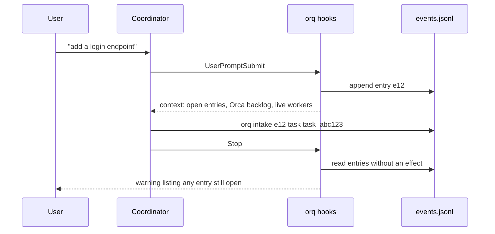

<picture>
  <source media="(prefers-color-scheme: dark)" srcset="assets/banner-dark.svg">
  
</picture>

# orq

A task register and noise filter for a Claude Code or Codex session that coordinates coding agents in [Orca](https://www.onorca.dev).


## Contents

[The problem](#the-problem) · [How it works](#how-it-works) · [Requirements](#requirements) · [Setup](#setup) · [Install](#install) · [Configuration](#configuration) · [Usage](#usage) · [Features](#features) · [Notice obligations](#notice-obligations) · [Backlog](#backlog) · [Projects](#projects) · [Claude Code and Codex](#claude-code-and-codex) · [Where things live](#where-things-live) · [Development](#development) · [Portability](#portability-and-lock-in) · [Language](#language)

## The problem

Orca runs several coding agents side by side: one coordinator session creates Runs and tasks with `orca orchestration`, and workers run in their own terminals. Two things go wrong once more than a couple of workers are busy.

The coordinator drowns in noise. Orca types "You have N orchestration messages" into the coordinator's terminal for every worker message, heartbeats included, and each notice is a new prompt that wakes the model and eats context.

Requests get dropped. The user asks for five things across a long session, the context gets compacted, and nothing records that the third request never became a task. Orca stores tasks, but it has no link between "the user asked for X at 14:02" and what that message turned into.

orq handles both. Hooks record every user prompt as an entry that stays open until the coordinator records what it became. A separate manager terminal soaks up heartbeats so the coordinator only wakes up for results, questions and escalations.

## How it works


The Runs are bound to the agent manager's terminal instead of the coordinator's, so Orca sends every notice there. The manager loop (`painel-agent-manager.sh`, which runs `orq manager absorb` every 10 s, or up to 30 s after a slow round: see `orq manager interval`) acknowledges batches that contain only heartbeats and types a single notice into the coordinator when something else arrives.

When the coordinator takes a Run the manager holds with `run-use` (Orca binds one Run per terminal), the coordinator's Stop at the end of the turn gives it back: `orq manager bind --terminal <manager>` for that Run, plus a `gerente` event with `op: devolver`. The manager's queue never stays without commanding the Run.

Intake runs through hooks:



Every state change is a line appended to `events.jsonl`. Open entries, live workers, pending gates and suspicious answers are all computed from that log by pure functions; nothing reads "the last line" as current state.

## Requirements

- macOS or Linux (`fcntl` locks and `SIGALRM`), Python 3.12+ with the standard library only. The code uses 3.12 syntax (nested same-quote f-strings), so every entry point checks the version before it imports `orqlib` and, under an older Python, exits 0 with "orq needs Python 3.12+; this is X (path)". The hooks run with whatever `python3` the harness's PATH finds, which can be the system 3.9: `orq start` resolves a 3.12+ (Homebrew, mise, uv, `python3.12`; `ORQ_PYTHON` forces one) and writes its absolute path into the hook commands and the `orq` link
- [Claude Code](https://docs.claude.com/en/docs/claude-code) or [Codex CLI](https://developers.openai.com/codex) for the coordinator and workers (either one, or both)
- [Orca](https://www.onorca.dev) with the `orca` CLI on `PATH`
- git

Optional: Node 20+ and `tasks-axi@0.2.6` (`npm i -g tasks-axi@0.2.6`), only if you turn on the backlog (see [Backlog](#backlog)); `gh` (PR state, branch cleanup), `engram` (the handoff is also saved there), `lavish-axi` for the decision page that `orq ask` builds, and [Bun](https://bun.sh) for `orq manager tui`.

## Setup

From scratch, the agent does the setup. You only clone and open the harness:

1. Clone this repository where you want it to live. The clone also holds the state, the plan and the integration worktrees, all gitignored (see [Where things live](#where-things-live)).
2. Open your harness (`claude` or `codex`) inside an Orca terminal, with the clone as the working directory.
3. Ask the agent to set orq up. It checks the tools (`orca`, `git`, `python3`, and the optional ones above), asks before installing anything, runs the steps in [Install](#install), then `orq start --objective "<what you are working on>"` to turn that session into the coordinator.
4. Add your projects by talking to it ("add my project at ~/code/my-app"): it runs `orq project add <path|url>` (see [Projects](#projects)), which writes `projects/<name>.json`, registers the repository in Orca and writes `orca.yaml`.
5. Tune the machine budget and the optional switches in [Configuration](#configuration).

## Install

```sh
git clone <this-repo-url> ~/Developer/orq   # anywhere you like
cd ~/Developer/orq
python3 orq.py install
```

`orq install` wires the harnesses to the clone it runs from. It is safe to run again: a second run changes nothing.

- Claude Code: it appends the groups of [`settings.hooks.example.json`](settings.hooks.example.json) that `~/.claude/settings.json` does not have yet, and points orq's commands that are already there (and an orq `statusline.sh` in `statusLine`) at this clone.
- Codex: the same with [`codex.hooks.example.json`](codex.hooks.example.json) and `~/.codex/hooks.json`. New groups go at the end of each event and nothing is reordered, because Codex records hook trust by position. Review the new or changed hooks once in `/hooks`.
- Links into the clone: `~/.claude/hooks/worker-routing-guard.py` and `limpar-mergeados-hook.py`; `~/.claude/scripts/limpar-mergeados.py`, `limpar-mergeados.keep`, `orca-wait-runs.py` and `trust-cwd.py`; `~/.claude/skills/worker-routing`; `~/.claude/commands/away.md` (the `/away` command); and, for Codex, `~/.agents/skills/worker-routing` and `~/.agents/skills/away` (`$away on|off|status`, since Codex has no user slash commands). A link that points anywhere else is replaced. A real file in its place is kept and reported.
- `~/.local/bin/orq`: a two-line wrapper that runs this clone's `orq.py` with a Python 3.12+. The manager loop calls `orq`.
- If the launchd agent of `orq manager serve` points at another folder, it says so. `orq manager serve --install` rewrites it.

The weekly retro skill is opt-in: `ln -s "$PWD/skills/orq-retro" ~/.claude/skills/orq-retro`.

The orq hooks exit at once outside an Orca terminal and in worker sessions, so they are safe to install globally. The worker-routing guard is the exception: it checks dispatch commands in every session.

Branch cleanup (`limpar-mergeados.py`) reads the branch patterns to keep from `~/.claude/scripts/limpar-mergeados.keep` (one glob per line; a missing file means none). It treats `main`, `development` and `staging` as protected branches (override with `ORQ_PROTECTED_BRANCHES`, comma-separated) and counts a branch as finished only when a PR into `main` merges it (`ORQ_FINAL_BASE`); a project that declares its environments ([Projects](#projects)) supplies both itself.

## Configuration

orq reads plain files on every call: no daemon, no cache. Everything lives under `ORQ_HOME` (default: the clone itself) unless noted. A file you never create means "use the defaults", so you can start with none and add them as you need.

On disk the keys are English; the older Portuguese key names are still read, so an old file keeps working.

### 1. `machine.json`: how many workers your machine can carry

Without a budget, a burst of dispatches can freeze a laptop: every worker is a live agent with its MCP servers, and each can start a test stack. `orq dispatch` checks `machine.json` and the machine itself (`vm_stat`, `memory_pressure`, load average, RSS of `claude`/`codex`/`node`/`docker` from `ps`). With no free slot, with the expensive-model ceiling reached, or under memory or load pressure, the request goes to a priority queue instead of starting.

Look at what you have now, and what orq would decide:

```sh
orq machine            # readings, the effective config and the decision now
orq machine --json
```

Choose the numbers from your machine. A starting recipe:

| Key | Default | How to choose it |
|---|---|---|
| `max_workers` | 4 | Live workers at once. Count about 1.5 to 2 GB of RAM per worker plus whatever one E2E stack needs. On a 16 GB machine, for example, 3 or 4; on 64 GB, 10 or more. |
| `max_expensive` | 2 | Workers on a model matching `expensive_models` at once. An expensive worker also counts toward `max_workers`. This is a cost limit, so it holds even for exempt Runs. |
| `expensive_models` | `["claude-opus-*", "gpt-6-astra*", "gpt-6-sol*"]` | Glob patterns (case-insensitive) of the models you consider expensive. |
| `mem_free_min_mb` | 3072 | Below this much free memory the pressure is high. Roughly 20% of your RAM: 3072 on 16 GB. |
| `free_pct_min` | 15 | Below this percent of free memory (from `memory_pressure`) the pressure is high. Either threshold trips it. |
| `max_load` | 12 | 1-minute load average above this is high pressure. Start at the number of CPU cores. |
| `mem_floor_mb` | 1024 | Safety floor: not even an exempt Run starts a worker below it. Keep it under `mem_free_min_mb`. |
| `exempt_runs` | `["Orquestrador*"]` | Glob patterns on a Run id or objective. Only service workers (`--service`) and P1 dispatches of a matching Run skip the queue for lack of resources; `max_expensive`, `mem_floor_mb` and `max_e2e` still hold. Set it to the objective of the Run that works on orq itself, or to `[]`. |
| `pause_under_pressure` | false | `true`: under pressure the manager pauses the lowest-priority worker itself. `false`: it only tells the coordinator which one to pause. |
| `stop_blocks` | false | `true`: the Stop hook blocks the end of a turn while any entry is open, not only the user entries from this turn. A decision for you to make. |
| `max_e2e` | 1 | For the record only: the E2E queue already serializes stacks. |

Write only what you change; the rest keeps its default:

```json
{
  "max_workers": 3,
  "max_expensive": 1,
  "mem_free_min_mb": 3072,
  "max_load": 8,
  "pause_under_pressure": false
}
```

Edit the file, or set a key without opening it. `orq machine set` takes the key names of `machine.json` (`max_workers`, `max_e2e`, `max_expensive`, `expensive_models`, `mem_free_min_mb`, `free_pct_min`, `max_load`, `mem_floor_mb`, `exempt_runs`, `pause_under_pressure`, `stop_blocks`, `age_colors`); the older Portuguese spellings (`max_caros`, `carga_max`, ...) are accepted too. It refuses an unknown key or a value of the wrong type:

```sh
orq machine set max_workers 3
orq machine set expensive_models '["claude-opus-*"]'   # values are JSON
```

What the queue does: the manager starts one queued item per lap, P1 before P2, oldest first; a cheap model still starts while there is a general slot; a request never silently drops to a cheaper model. A ticket item whose Run belongs to a mate (the coordinator does not command it) is not retried: the manager sends the mate an `orq mate request` with the dispatch command (`orq dispatch --run … --ticket … --model … --effort … --priority … --worktree …`) and the item leaves the queue as `despacho_fila` `op: mate`, not as a giving up; the `mate_pedido` carries the queue item id in `fila`. Pressure is split by owner: when most of the load comes from outside orq (a browser, a VM, indexing), the notice names the biggest outside processes and the manager holds new dispatches without suggesting a pause, because pausing a worker would not help. `orq status`, the digest and the dashboard show slots taken, slots free and the queue; `orq dispatch-queue list|rm <id>|priority <id> <1|2|3>|discard <id> --reason "..."` manages it. `list` shows the task, ticket and owning mate when there are any; `priority` (also `orq priority fdXXXXXX <1|2|3>`) moves the item without losing its entry date, for the coordinator and the mate that owns it.

**How long each item has waited (ticket 345).** Every item of the dispatch queue and of the integrator queue carries the instant it entered (`ts`), and the digest sends it as `desde` under `idade.filas`, with the open obligations under `idade.obrigacoes`. Delivered workers waiting on the integrator, workers and pending items carry `desde` in their own entries. The dashboard counts the age in the browser and refreshes it every 30 s without reloading: "há 14 min", "há 2 h 05". The color never stands alone: the text is always there, and a critical item adds a ▲.

The scale is `age_colors` in `machine.json`, minutes at which an item turns yellow, orange and red; the default is `[[5,"warn"],[15,"hot"],[30,"crit"]]`. Below the first limit the text stays neutral; from there the color blends continuously (not in steps) from yellow through orange to red, in the GitHub palette of the light and dark themes. The limits scale by kind: a P1 item uses half (15 min is already red), a delivery waiting for the integrator three times, an open obligation three times, a pending item twelve times (it tolerates hours). `orq status` prints `Queues: 13 items, the oldest waiting 47 min ▲` (in ANSI color on a terminal, plain with `NO_COLOR` or a pipe), and `orq manager tui` colors the age of each queue, worker and pending line with the same levels (neutral, yellow, orange, red, in the palette's own colors, ▲ and bold once critical).

```sh
orq machine set age_colors '[[10,"warn"],[30,"hot"],[60,"crit"]]'
```

An item that crosses the critical limit records one `queue_item_aged` event (once per item, from the manager's lap or the digest, whichever runs first). It shows up in the digest's `linha` as a `sec` entry.

What the queue does: the manager starts one queued item per lap, P1 before P2, oldest first; a cheap model still starts while there is a general slot; a request never silently drops to a cheaper model. Pressure is split by owner: when most of the load comes from outside orq (a browser, a VM, indexing), the notice names the biggest outside processes and the manager holds new dispatches without suggesting a pause, because pausing a worker would not help. `orq status`, the digest and the dashboard show slots taken, slots free and the queue; `orq dispatch-queue list|rm <id>|discard <id> --reason "..."` manages it.

### 2. `projects/<name>.json`: one file per project

The easy way is `orq project add <path|url>`, which writes it. By hand:

```json
{
  "repo": "path:~/code/my-app",
  "harness": "codex",
  "group": "work",
  "environments": [
    {"branch": "development"},
    {"branch": "staging"},
    {"branch": "main", "production": true}
  ],
  "flow": "promocao",
  "e2e_queue": "~/.cache/my-app-e2e/queue",
  "deploy_check": "my-deploy-status --env {base} --commit {sha}",
  "caminhos_ui": ["web/app/**"],
  "tests": ["**/*.unit-test.js"]
}
```

Step by step:

1. `repo` is the only required key: the Orca repository selector (`path:`, `id:` or `name:`).
2. `harness` (`claude` or `codex`) is the default of `orq dispatch` for this project's workers. Without it, `claude`.
3. `group` is free text that only groups the listing.
4. `environments` is the ordered list of the project's branches; the one marked `production` is production (the last one when none is marked). `flow` is `"promocao"` when the same feature branch opens one PR into each environment in order, or `"direto"` for a single PR into production (the flow values keep their Portuguese spelling). With no `environments` block the project has one environment, the remote's default branch, and the direct flow. A malformed block makes the file show as invalid in `orq projects`. Nothing in orq names `development`, `staging` or `main`: `orq pr`, `orq queue`, the digest, the merge obligations and the base of new worktrees all read this block.
5. `e2e_queue` is the folder of the project's E2E queue (one `<order>-<pid>` ticket per arrival; `~` is expanded). `orq status`, the digest and the stuck-queue notice read it. Without the key there is no queue line. `E2E_LOCK_DIR` forces one folder.
6. `deploy_check` is optional: a command with `{base}` (the environment the PR entered), `{sha}` (its merge commit) and `{orq}` (orq's clone) that tells orq whether a deploy finished. See [Notice obligations](#notice-obligations).
7. `transcripts` is optional: the folder where Claude Code keeps the coordinator's transcripts (`orq audit-answers`). Without it, the folder Claude Code names after the `repo: path:`.
8. `orca` holds overrides for the generated `orca.yaml` (see [Projects](#projects)).
9. `tests` is optional: the globs of the unit-test files `orq prove-red` looks for in a branch (`["**/*.unit-test.js"]`), or `{"globs": [...], "command": "cd web && npx jest ../{file}"}` to also set the command (`{file}` is the test file). Without it: `test_*.py` for orq's own tickets, `**/*.unit-test.js` for a product's.
10. `sem_ci` is optional (`true`): the project has no CI. `orq fila` reads a PR with no registered check as `? no check registered for N min` and does not count it as ready (the workflow may not have fired, the checks may not be registered yet, or a conflicting PR gets no workflow); with `sem_ci: true` an empty list is ready. Checks that do show up keep counting.

Check it with `orq projects` (an invalid file shows `invalid: <why>` and is never picked on its own) and `orq flow --repo <path>`.

### 3. `groups/<group>.json`: a secondmate for a domain

You talk to one coordinator. When a domain gets big (say, everything about `my-app`), the coordinator can hand it to a secondmate ("mate"), a second coordinator with its own Run that coordinates that domain's workers. A group is one file:

```json
{
  "projects": ["~/code/my-app", "~/code/my-app-api"],
  "prefixes": ["app:", "api:"],
  "harness": "claude",
  "model": "<model-id>",
  "effort": "medium",
  "rules": "~/Developer/orq/rules-my-app.md",
  "cwd": "~/code/my-app",
  "mate_project": "~/code/my-app",
  "backlog": "~/Developer/orq/groups/my-app/backlog.md"
}
```

- `projects` (folders) and `prefixes` (title prefixes such as `app:`) decide where a request goes: an explicit group first, then the title prefix, then the cwd inside a project folder. Two groups matching, or none, keeps the request with the coordinator. `orq groups --title T [--cwd D] [--group G]` shows the decision.
- `harness`, `model` and `effort` are how the mate starts; `rules` is a file the mate reads first; `cwd` is where it opens; `mate_project` is the folder of the Orca repository the mate's terminal is grouped under (default: the first of `projects`); `backlog` is the group's own backlog (default `groups/<name>/backlog.md` next to the machine's, see [Backlog](#backlog)).
- Only `projects` and `prefixes` must be lists; every other key is optional.
- `mate_auto` (default `false`) and `mate_ready_min` (default: the machine's, 3) decide what happens when a group without a mate gathers ready tickets, see below.

Routing is deterministic. `orq dispatch` of a request that matches a group (title prefix, or the project's folder inside `projects`) whose mate is open or asleep does not start a worker: it sends the mate an `orq mate request` (which wakes a sleeping mate) and records `mate_dispatch`. `--direct` is the explicit escape: the worker starts in the coordinator's Run and the `dispatch` event keeps the reason in `direct`. A group with no mate, and a dispatch made by a mate itself (`ORQ_MATE`), start the worker as before.

Opening a mate is a proposal, not automatic. When a group with no mate gathers `mate_ready_min` ready tickets (`machine.json` or the group's own file, default 3), the manager tells the coordinator once, and the away-mode Stop lists "open the mate of group X". With `"mate_auto": true` in the group, the manager opens the mate itself, also once; a failure goes to the coordinator. `orq status` prints a line per group, `group <name>: N ready (…) | mate alive|sleeping|down|absent`, with the proposal when it applies.

How this compares with firstmate: there, creating a secondmate is an explicit decision of the model or the captain, and routing uses a natural-language `scope:` that the model judges; what is deterministic is the registry, the relaunch of a dead mate and the status channel. orq keeps the same decision for opening a mate (a proposal) but makes routing a rule, because the group file already says what belongs to it.

Commands: `orq groups` lists groups and mates; `orq mate open <group>` opens the mate (or resumes its session); `orq mate request <group> --text T [--deadline 120] [--answers eN]` sends it work; the mate answers with `orq mate raise --corr pN --type answer --text ...` and raises `decision`, `pr`, `blocker` and `summary` items, each an entry the coordinator closes with `orq intake`. A mate never opens AskUserQuestion and never pushes. Its Stop blocks (same 2-block cap as the coordinator's, then a warning) while an entry of its group has no effect, an obligation of its group is open for 10 minutes, or a request from the coordinator has no reply; `orq doctor hooks` warns when a project of the group turns hooks off (`disableAllHooks`), and the manager adds "no turn recorded" to the escalation of a request when the mate's hooks recorded no turn. An idle mate sleeps (`ORQ_MATE_OCIOSO_MIN`, `ORQ_MATE_DORMIR_MIN`; `orq mate sleep <group>` by hand) and wakes on the next request. See `docs/design.md`, "Secondmates by group".

### 4. Backlog switches

By default pending items live in a JSON file and tickets in markdown files. Optionally both move into a [tasks-axi](https://github.com/kunchenguid/tasks-axi) backlog (see [Backlog](#backlog)). Two switches, each either a file under `ORQ_HOME` (every process reads it, open sessions included) or an environment variable (only processes started after you set it):

| Switch | File | Environment variable |
|---|---|---|
| Pending list in a backlog | `backlog.path`: first line is the path of a `backlog.md` | `ORQ_BACKLOG=<path>` (empty turns it off for that process) |
| Tickets in the backlog | `backlog.tickets`: an empty file | `ORQ_BACKLOG_TICKETS=1` (empty turns it off) |

Neither set means nothing changes. To turn it off, delete the file. `orq backlog` shows the path, whether the `tasks-axi` version is the supported one, and the counts.

### 5. Environment variables

Most settings are files; these are the knobs worth knowing. Names of variables that point at folders or files: `ORQ_HOME`, `ORQ_ISSUES` (tickets), `ORQ_PENDENCIAS` (the pending list the dashboard reads), `ORQ_RELATORIOS` (where reports are kept before a worktree goes), `ORQ_RESUMOS` (summaries), `ORQ_LOG`, `ORQ_REPOS`, `ORQ_TRANSCRITOS`, `ORQ_PROJETOS`, `ORQ_TERMOS`, `ORQ_WT_ROOT`. Behavior: `ORQ_ORCA` (path to the Orca binary), `ORQ_ORCA_TIMEOUT` (seconds per Orca call, default 2.5), `ORQ_NO_BG=1` (no background refresh), `ORQ_NO_CLEAN=1` (the manager loop skips `orq clean`), `ORQ_CLAUDE_DIR` (the folder `orq clean` reads `settings.json.bak-*` and `backups/` from, default `~/.claude`), `ORQ_HIBERNA_MIN`, `ORQ_COORD_OCIOSO_MIN`, `ORQ_OBRIGACAO_MIN`, `ORQ_PR_POLL_S`. Each is documented where it applies below.

### 6. Away mode (`/away`)

Away mode is for when you leave the keyboard. It changes what the coordinator does, enforced by hooks:

```
/away on        # Claude Code slash command (commands/away.md)
$away on        # Codex skill (skills/away): Codex has no user slash commands
orq away on [--until HH:MM] [--max-dispatches N] [--max-failures 3] [--force]     # the same thing from a shell
orq away off|status
orq doctor away            # the preflight alone: turns nothing on, exits 1 on a hard failure
```

`away on` runs that preflight first, with no LLM (git with a 2 s timeout). Hard failures refuse and print the fixing command: no agent manager alive and bound to this coordinator (`orq manager spawn`, `orq start --take-over`), or no orq hooks in the harness you are running (`python3 orq.py install`). `--force` turns it on anyway and logs `away_preflight_forcado`. Warnings only go in the output: dirty or unpushed live checkout (naming the files), old dispatches with no terminal, more than 20 folders in the worktree root, under 10 GB free, an E2E queue owner stuck for over 2 h. The result is kept in `cursor.json` (`preflight`), and the report from `away off` opens with it under "Crooked when the night began". `ORQ_AWAY_PREFLIGHT=off` skips it.

With it on: the Stop hook logs each reply and refreshes the digest; the AskUserQuestion guard denies the box and points to `orq pend add --type decision` (park the decision, keep going on what does not depend on it); `orq ask` builds the decision page but returns at once; the manager types notices into the coordinator whenever it is stopped (with it off, only when its prompt box is empty, ticket 182); and the Stop hook blocks the end of a turn (at most 3 times in 30 minutes) while there is work that needs no user. The Stop that ends a turn records `coordenador_parou` (motive `trabalho_esperando`, `esperando_usuario` or `sem_trabalho`, computed from orq's files); the user's next prompt or a notice typed by the manager closes the interval. `orq away off` prints the away report (decisions first; then the coordinator's stops longer than 10 minutes with their motive, and the morning card's dispatch stop reasons, dirty worktrees, unpushed branches and commands to paste) and saves it to `digest/ausencia.md` and `$ORQ_RESUMOS/<date>-ausencia.md` (default `./.scratch/resumos`; the file names keep their Portuguese spelling). A bare `/away` toggles. `statusline.sh` adds `away since HH:MM` to the first HUD line while it is on. See `docs/design.md`, "Digest and away mode".

Away on also arms the night budget, so an unattended night is never unbounded: `--until` defaults to the next 08:00 local, `--max-failures` to 3, and `--max-dispatches` to no cap. `orq dispatch` refuses past the end, at the cap or after N failures in a row, parks "away: stopped dispatching: <reason>" as a decision (once per arming; `orq away off` lists it), and workers start with `GIT_TERMINAL_PROMPT=0` and `commit.gpgsign=false`. `orq away on --until HH:MM` re-arms it; `orq away off` disarms both. The external-action guard stays off under away alone (away pushes after the audit); `orq night on` turns it on.

For a bounded unattended stretch without away, night mode adds a budget: `orq night on --until HH:MM [--max-dispatches N] [--max-failures 3]`. `orq dispatch` refuses past the end time, at the dispatch ceiling or after N failures in a row; push, PR merge, deploy and `--no-verify` are denied by the external-action guard; `orq night off` frees it. `orq summary --night` prints the morning card.

### Reminders (`orq remind`)

`orq remind "<text>" --in 1h30` (also `90m`, `2h`) or `--at 15:00` (local time; tomorrow if it has passed) creates a reminder; `orq remind list [--all]` and `orq remind cancel <id>` manage them (pt: `orq lembrar`). They live in `reminders.json`, so they survive a restart of the manager or the machine. On the round when the time comes the manager fires each one once: a macOS notification with sound, a line in the panel and the TUI, and a short notice typed into the coordinator only with away mode on. A reminder that came due while the machine slept fires on the next round and says how late it is. When the user asks in plain language ("remind me to X in 1h30"), the coordinator runs `orq remind`, and the implicit intake records the effect.

### 7. Hooks (Claude Code and Codex)

orq does its work in hooks, so the hooks are the one thing you must register. Both example files are complete; merge them, do not rewrite them.

| Event | Command | What it does |
|---|---|---|
| `UserPromptSubmit` | `orq hook prompt` | records the prompt as an entry, injects a short status |
| `Stop` | `orq hook stop` | warns about entries without an effect, blocks the turn in the cases listed in Features |
| `SessionStart` | `orq hook session` | injects status and open tickets; shows a handoff from the other harness |
| `PreToolUse` (`AskUserQuestion`) | `orq hook guard` | refuses the question widget while a worker runs, or in away mode |
| `PreToolUse` (`Bash`) | `orq hook external` | denies push, merge, deploy and other external actions in night mode; warns (never blocks) when a `worker_done` goes out with no passing `orq check-delivery` on the current report |
| `PreToolUse` (`Bash\|Edit\|Write…`) | `orq hook place` | warns (never blocks) about a write in the wrong place: the main checkout off its default branch, or a worktree that is not the coordinator's |
| `PreToolUse` (`Bash\|Agent`) | `worker-routing-guard.py` | refuses a dispatch with no explicit model and effort |
| `PostToolUse` (`Bash`) | `orq hook prlink` | links a PR to its task when the coordinator runs `gh pr create` (also as `rtk proxy gh pr create`, in a loop); says "linked" only when it did, otherwise that the PR has no task and the `orq pr link` to run |
| `PostToolUse` (`AskUserQuestion`) | `orq hook ask` | records the answer |
| `PreCompact` / `SessionStart` (`compact`) | `precompact.py` | snapshots the coordinator's state and injects it back after `/compact` |

Claude Code: merge the `hooks` section of `settings.hooks.example.json` into `~/.claude/settings.json`. The example commands call `/opt/homebrew/bin/python3 /path/to/orq/orq.py hook <kind>`; `orq install` writes this clone's path and a Python 3.12+ in their place. `orq start` refuses to run if a hook of the orq is missing from the harness's hooks file, then replaces the loose `python3` in orq's hook commands with the absolute path of a Python 3.12+ and says so (`hooks: found: ...` for each interpreter that could not import `orqlib`). `orq doctor hooks` runs the same check without touching Orca (exit 1 while an interpreter cannot import `orqlib` or a `python3` is loose); `orq doctor hooks --pin` writes the path. Codex trusts a hook by what it says, so after pinning review the hooks once more in `/hooks`.

Codex: `orq hooks-codex` appends the missing groups from `codex.hooks.example.json` to `~/.codex/hooks.json` at the end of each event, and never reorders or removes anything. Codex records hook trust by position, so inserting a group in the middle would unset the trust of the ones after it. Then review the new hooks once in `/hooks`, or start Codex with `--dangerously-bypass-hook-trust`. Until they are trusted the orq does not see that terminal, and `orq status`, `orq agents` and the coordinator's session preamble start with a warning that says so. The Codex commands take a trailing `codex` argument (`orq hook prompt codex`).

Every hook that reads the Bash command (`external`, `place`, `prlink`, `worker-routing-guard.py`) goes through `cmdnorm.py`, which removes `rtk`, `rtk proxy`, `env VAR=x`, `command`, `time`, `sudo` and loop keywords and splits compound commands, so `rtk git push` is judged exactly like `git push`.

Hook names in English are `prompt`, `stop`, `ask`, `guard`, `session`, `place`, `external` and `prlink`. The old names `lugar`, `externas` and `prligar` are accepted for good, so hooks you installed earlier keep working without a new trust step. The hook path is fail-open but not silent: if `orqlib.py` fails to import, or a `session`, `prompt` or `stop` hook raises or runs out of time, the hook exits 0, logs the error to `orq.log`, writes `hook-failed.json` in `ORQ_HOME` (count, first and last time, exception, interpreter) and, at most once every 10 minutes, prints a `systemMessage` ("orq: hooks broken (SyntaxError in orqlib.py:4420), 3 failures since 13:20") and fires a macOS notification (`ORQ_ALARME=off` turns the notification off). `orq status` and the manager's round show "orq hooks broken since HH:MM (Python X): <error>" while the marker stands, and the manager types it once into the coordinator; the line goes away when the interpreter that failed imports and runs the hook again. When `orca orchestration run-current` times out, the session that already coordinated keeps its remembered Run; `hook session` that fails answers with a short "orq context did not load: run `orq status`".

## Usage

Start the manager in a plain shell terminal inside Orca, then bind your Run to it from the coordinator:

```sh
# manager terminal
~/Developer/orq/painel-agent-manager.sh   # from your clone

# coordinator, one command (creates the Run, raises the manager, binds the Run to it)
orq start --objective "Auth work"

# or by hand, after `orca orchestration run-create --objective "Auth work"`
orq manager bind --terminal <manager-terminal-handle>
orq manager unbind --run run_demo   # hand one Run back; without --run, all of them
```

`orq start [--objective "<stream>" | --run <r>] [--agent claude|codex] [--take-over]` turns the Claude or Codex you already opened into the coordinator and never opens another one. It finds the harness from the processes above it, refuses if a hook of the orq is missing, warns when the Codex hooks are not yet trusted, binds the Run, raises the manager or reuses the live one, and prints `orq status`. A manager that belongs to another live coordinator needs `--take-over`. Running it twice changes nothing.

The manager loop can also run outside any terminal, so closing its tab does not stop it:

```sh
orq manager serve              # foreground; log under `$ORQ_HOME/logs/`
orq manager serve --install    # launchd agent: starts at login, restarts if it dies; runs in this clone (WorkingDirectory)
orq manager serve --status     # running?, pid, installed?, last lap
orq manager serve --stop
orq manager serve --uninstall
```

Every `launchctl bootout`/`bootstrap` and every `--stop` SIGTERM appends a `launchd` event to `events.jsonl` with the caller's `pid`, `ppid`, `parent`, `cwd` and `argv`, so a job that vanishes from launchd has an author. The test suite sets `ORQ_TESTING=1`: without an `ORQ_LAUNCHCTL` fake it raises instead of calling the real launchctl.

`serve` still needs the manager terminal from `orq start` or `orq manager bind`: Orca only accepts a handle that belongs to a terminal it has seen. Two `serve` processes at once is an error.

`orq manager tui` opens a read-only terminal UI ([OpenTUI](https://github.com/sst/opentui), needs Bun) with the manager, the backlog, live workers, the integrator, the queues (each item with its age in the scale's color), pending items, machine load and the latest events. Without Bun it prints the install steps and exits 1.

The TUI follows the terminal theme. It never paints a background; text and borders come from a light or a dark palette whose colors keep a 4.5:1 contrast or better against the theme background (checked by `bun test`). The theme comes from, in order: `--theme light|dark|auto` or `ORQ_TUI_THEME`, the terminal itself (OSC 11, background color), `COLORFGBG`, the macOS appearance (`defaults read -g AppleInterfaceStyle`), and dark if nothing answers. Force it with `orq manager tui --theme light`, or `ORQ_TUI_THEME=light` in the environment.

The colors are GitHub's: Dark (`#0d1117` background, `#c9d1d9` text) and Light (`#ffffff`, `#1f2328`), key by key in `tui/src/tema.ts`. Green means ready, on time or done; yellow waiting or stopped; red blocked, stuck or failed; blue in progress; purple a decision with you; gray secondary. Color never carries a state alone: each one also has a symbol and a word (`● pronto`, `▶ andamento`, `■ bloqueado`, `⏸ retido`, `✓ feito`, `P1`/`P2`/`P3`).

The Backlog block lists the tasks of the `tasks-axi` backlog bound to the machine (`ORQ_BACKLOG`, or the first line of `ORQ_HOME/backlog.path`) and of each group's backlog. The title counts the tasks by state. Each row shows state, priority, id, short title, repo and group, sorted by priority and then state; a blocked task adds who blocks it and whether that blocker is in progress, stopped or blocked too, an in-flight one adds its worker (model, phase, minutes without a sign of life, from `orq agents`), and a ready task waiting for a week or more says how long. Done tasks show only under the `feito` filter. Keys: `j`/`k` or the arrows scroll, `PgUp`/`PgDn` scroll a page, `e` cycles the state filter, `g` the group filter, `0` clears both, `q` quits. On a narrow terminal the counts move into the block's first line and each row is cut to the width.

Record what each entry became:

```sh
$ orq intake e12 task task_abc123
$ orq intake e13 conversation
$ orq intake e14 discarded --note "duplicate of e12"
```

Effects are `task`, `steer`, `pend`, `decision`, `conversation` and `discarded`. Tickets and dispatch:

```sh
$ orq ticket new --title "Add login endpoint" --spec-file spec.md --blocked-by 01
$ orq ticket list
01 Add session store (claimed)
02 Add login endpoint (ready-for-agent; Blocked by: 01)
$ orq dispatch --run run_demo --ticket 02 --model <model-id> --effort medium \
    --worktree new-top-level --name add-login-endpoint --entry e12
$ orq ticket close 02 --answer notes/login-done.md
```

Without a ticket, `orq dispatch --run r --title "..." --spec-file f --model m --effort e` creates the task itself. The spec for `ticket new` must contain a `## Acceptance criteria` section. A ticket file header uses the lines `Status:`, `Blocked by:`, `Run:`, `Task:`, and the optional `Model:`, `Effort:`, `Dispatch:`, `Waiting:` and `Project:` (model, effort, dispatch policy, wait condition, project; the older `Modelo:`, `Despacho:`, `Espera:` and `Projeto:` are read too). `ticket new` writes `Project:` from `--project`, then the Run's project, then the project that contains the coordinator's directory; with none it writes no line.

Delivery order in waves (needs the tickets in the backlog). The tasks that can run in parallel share one blocker, a milestone, and a join waits for all of them:

```sh
$ orq wave new "Core"                            # Wave 2: milestone (blocked by wave 1's join) and join
$ orq ticket new --title "Parser" --spec-file a.md --wave 2     # blocked by the milestone; the join now waits for it
$ orq ticket new --title "Writer" --spec-file b.md --after 04   # same wave, named by its milestone's number
$ orq wave list
wave 1 Base: closed, 1/1 integrated
wave 2 Core: waiting, 0/2 integrated; waits for 02; open: 06, 07
```

The milestone and the join are backlog tickets with no spec and no worker. When the last blocker of one is integrated, orq closes it by itself (`orq ticket close` of the last task is enough), and that frees what waited on it: the milestone of wave N+1 waits for the join of wave N, so the waves go out in order, the tasks of a wave leave together, and the worker cap decides how many start. A join with no task never closes, so an empty wave waits for its tasks; a wave whose join closed takes no more. `orq status` and the manager panel list the waves; the PRs' merge order (`orq queue`) already follows `Blocked by`, so it follows the waves too.

Workers:

```sh
$ orq agents
stuck       task_abc123  Add login endpoint  <model-id>  <terminal>  implement 13:40 (22 min ago)
            -> orq steer task_abc123 "<adjustment>" --run run_demo
running     task_def456  Fix flaky test  <model-id>  <terminal>  test 14:01 (1 min ago)
delivered   task_789abc  Update the README  <model-id>  <terminal>
            -> orq release ctx_789abc
$ orq steer task_abc123 "Use the existing rate limiter instead of writing one" --run run_demo
$ orq release ctx_789abc
```

`orq agents` also takes `--json`, `--run r` and `--all` (includes released workers and terminals Orca retained).

The user's pending list:

```sh
$ orq pend add --id pick-db --type decision --title "Postgres or SQLite for sessions?" --task task_abc123
$ orq pend add --id rotate-key --type action --title "Rotate the staging API key" --waiting "ops team"
$ orq pend edit rotate-key --title "Rotate the production API key" --until 2026-10-10
$ orq pend done pick-db --answer "Postgres"
```

`--type` is `action`, `decision` or `notify`. A decision id is at most 12 characters because it doubles as the AskUserQuestion `header`, and answering that question closes it. `--task` creates an Orca gate that holds the task until the decision closes. `orq pend edit <id>` corrects `--title`, `--detail`, `--stream`, `--link`, `--command`, `--waiting` and `--until` of a live item (an empty value clears the field).

Status at any time (the same summary the prompt hook injects):

```sh
$ orq status
```

Ask the user a decision on a page, the same way on Claude Code and Codex: `orq ask --id <pend> --question "..." --option "A" --option "B" [--recommended N] [--wait-min M]`. It creates the decision if the id is new, builds a Lavish page (one radio per option, the recommended one only labelled, never preselected; free text, "decide later" and "let's talk"), opens it in Orca's browser, waits on `lavish-axi poll` and records the answer like `orq lavish-answer`. Only an explicit choice closes the decision, and a decision with a gate closes only after Orca confirms the gate resolved. No answer leaves it open with a warning. It blocks until the answer, so run it as the harness's background job.

Also available: `orq ingest [--refresh]`, `orq alert seen <task>`, `orq lavish-answer <file|->` and `orq audit-answers [--session id]`.

## Features

### Intake and the Stop hook

- Deterministic intake. `orq hook prompt` classifies each prompt by its origin (user, Orca notice, task notification, slash command, compaction summary, worker dispatch preamble) and records only user prompts as entries, then injects a status summary of at most five lines.
- Effects. `orq intake <entry> <effect> [ref]` closes an entry. It refuses a task or pending id that does not exist, and refuses `conversation` and `discarded` while the entry still has open obligations ([Notice obligations](#notice-obligations)).
- Implicit intake. `dispatch`, `ticket new`, `pend add`, `ask`, `steer` and `mate request` without `--entry` close the only open user entry of the terminal with the effect they imply and print `intake eN -> <effect> (implicit)` on stderr. With two or more open entries they record nothing and print the ids and the `orq intake` to run; a worker never records; a later `orq intake` on the same entry replaces the implicit effect.
- Automatic intake. Rules in the ingest (and in the prompt hook) close, with a note saying why, the entries whose effect orq already knows: a worker report whose delivery entered the integrator queue or went back to the worker for conformance (`discarded`); a merged PR with no obligation left, or whose `deploy` and `next` obligations went to a mate that got a `mate request` naming the entry, the PR URL or `#number` (those obligations close as `handed over`; the entry closes as `conversation`); a mate's `answer` or `summary` after the manager showed it to the coordinator; and the `machine under pressure` notice. What asks for a decision stays open: a new user prompt, a mate's `decision` or `block`, a PR a mate raised, and a PR entry that still has obligations only the coordinator can fulfil.
- Stop reminder. `orq hook stop` lists the entries still without an effect. Two things can block the end of the turn, each at most 2 times in a row for the same set of open entries per session, then it lets go with a `systemMessage` and a `gate_failed` event: always, a user entry from the turn that is ending (or open for more than 30 min) with no `orq intake`; and, only with `stop_blocks` on, any open entry. An entry that is only an orq command (`/away`) gets an automatic `conversation` intake.
- Report ingestion. `orq ingest` turns completed Orca automation runs and `worker_done` messages carrying a `reportPath` into entries, one per numbered action item. A worker whose `worker_done` Orca refused and who left `final-report.md` in its worktree root counts as delivered, and the coordinator gets an `entrega_recusada` alert for the idle terminal. A terminal reopened by `orq send-back` or `orq wake` carries the ticket title, not the dispatch id.
- Delivery proof. When a `worker_done` cites commit shas, ingest checks them with `git` and, for a cited PR URL, with `gh`. A missing commit or a dirty tree logs a `delivery` event, shown as "delivery without commit" in `orq summary` and `orq agents`. It never blocks the worker.

### Noise filter and the manager

- Heartbeat absorption. Orca notices whose mailbox holds only heartbeats are acknowledged and blocked before they reach the model, in the prompt hook and in the manager loop.
- Agent manager. `orq manager bind|unbind|spawn|check|absorb` binds Runs to a separate terminal and rotates through several Runs, because Orca binds one Run per terminal. A round touches the `manager-alive` stamp at its start, after each Run and at its end. The coordinator is told the panel stopped only when the stamp is older than the larger of 90 s and 3x the average round; a stamp between 60 s and that limit reads "panel slow". Alive is not progress (ticket 229): `manager-ok` is touched only at the end of a round whose absorb phase finished without error (and by the panel shell only when `orq manager absorb` exits 0). A Run that raises no longer aborts the round; the error goes to `manager.json` (`ultimo_erro`, `falhas_seguidas`), a serve child exiting non-zero counts as a failed round, and with a fresh `manager-alive` but a `manager-ok` older than the panel limit the coordinator prompt says no round finished well. Three failed rounds in a row write one `gerente_falha` event; the next good round writes `gerente_recuperado`. When the manager's terminal vanished from Orca, the coordinator's Stop, prompt and SessionStart hooks start `orq manager check` in the background, and it runs `orq manager spawn` by itself (one attempt, then up to 2 more 5 min apart; after the 3rd the notice goes back to the manual command). `orq manager spawn` stays for the manual case and `--force`.
- Notices never land in the middle of what you type. The manager types into the coordinator only with away mode on; otherwise every notice waits for your next prompt. With away mode on it types only when your last prompt is older than 10 minutes (`ORQ_COORD_OCIOSO_MIN`); the line that wakes it for a worker's message waits 2 minutes (`ORQ_WAKE_OCIOSO_MIN`). Every typing reads the input box twice, 3 seconds apart (`ORQ_AVISO_GAP_S`), and a draft in either read cancels it. `"notify_macos": true` in `manager.json` adds a macOS notification for each deferred notice. Orca has its own notice that it types into the Run's `coordinator_handle` and that cannot be turned off; orq keeps the coordinator from being that handle.
- Typed notices are short. Everything orq types into a terminal stays at or under 150 characters (`NOTICE_MAX`). A longer text is written whole to `$ORQ_HOME/avisos/<hash>.txt` and the typed line is its beginning plus `... full text in <path>`, so the agent reads the rest from the file.
- Mailbox. `orq inbox [<run>] [--ack] [--all]` reads Orca's mailbox as the coordinator: one short line per message (heartbeats are only counted) and, with `--ack`, first runs each `worker_done` through the manager's ingest and then acknowledges it. A Run that neither the coordinator nor the agent manager commands is read from Orca's global inbox (`inbox --full`) without `run-use`, so the Run never leaves the manager; there `--ack` only runs the ingest and nothing is acknowledged (the coordinator binds the Run when it needs to command it).

### Dispatch and workers

- `orq dispatch` starts a worker with an explicit model and effort, renames its tab, records the dispatch and links the entry. A guard hook refuses `orca orchestration worker-start`, `orq dispatch` or an Agent call with no explicit model and effort.
- `orq agents` shows every dispatch across all Runs as `running`, `stuck` (no heartbeat for 15 min), `asking`, `delivered`, `released`, `limit` (the plan limit is on the screen), `no_terminal` (lost its terminal without a `worker_done`), `hibernated`, `sent_back`, and two "not stuck, on purpose" states: `awaiting_integration` (the ticket is on the integrator queue, `orq integrate queue add <branch> <ticket>`) and `service` (a dispatch started with `--service`, such as an integrator or a secondmate, that stays alive after its first `worker_done`; it reports each cycle with `orq cycle done --dispatch <id> --hash <commit> [--note ...]`, which does not call Orca; `orq service mark <dispatch>` marks one by hand).
- Worker control. `orq interrupt <dispatch>` sends Orca's interrupt to a running worker. `orq end <dispatch> --reason <why>` stops and releases it. `orq relaunch <dispatch> --note <what changed>` stops it and starts another in the same worktree and task, keeping the model and effort unless `--model` and `--effort` say otherwise. Each step is an event, and `orq agents` prints the control history under the dispatch.
- Delivery conformance (ticket 201). `orq dispatch` numbers what the delivery must prove (each `- [ ]` item and each bullet of `## Acceptance criteria`, from the spec, from the ticket it executes and from the scratch ticket it was born from, the only `.scratch/<feature>/issues/NN-*.md` cited whose number the title names) and appends them to the spec, or once to the ticket file with `--ticket`, under `## Delivery conformance`. The worker answers with a `## Conformance` section in its final report: one numbered line per item with the proof in backticks. Before the `worker_done` the worker runs `orq check-delivery [--dispatch <id>] [--report-path <file>]` (ticket 329): it reads the report against the same items, lists what has no proof (exit 1) and records the report's hash, and the `orq hook external` PreToolUse hook warns when a `worker_done` leaves with no passing check on the current report. When the `worker_done` arrives, the ingest checks it again; a missing line sends the delivery back (`orq send-back`) with the list, and it enters neither the integrator queue nor `orq pr open`. After two send-backs of the same dispatch, the next incomplete delivery raises the `conformidade_repetida` alert for the coordinator instead (the count follows the dispatches a send-back opened); `orq accept-delivery <task|dispatch> --by <who> --summary "<text>"` then lets a delivery through when a mate already checked the diff, recording who did (`conformidade_aceita`, `conferido_por`) and adding it to the integrator queue. A ticket whose title or items describe production behavior (at startup, every N s, a cron) also needs one line marked `[real entry]`, proved through the server boot or the E2E.
- `orq send-back <task|dispatch> "<reason>" [--run]` sends the worker a correction on a delivery whose task is already `completed`, where `orq steer` refuses. Orca revokes a dispatch's capability at its first `worker_done`, so the return opens a new dispatch (ticket 329): the task goes back to `ready` and `orca orchestration dispatch --task <task> --to <terminal> --inject` re-engages the worker's terminal (the live one, a hibernated one woken, or `claude --resume` in the same worktree when it is gone) with a fresh preamble and capability; the reason goes to the new dispatch. The delivery enters the integrator queue only after the new dispatch's `worker_done`.
- `orq prove-red <ticket|task> [--command CMD] [--worktree PATH] [--base BRANCH] [--timeout S]` proves that the new tests fail without the change. It finds the test files the branch created or changed (the `tests` globs of the project file), makes a throwaway worktree at the merge-base with the base (the project's first environment; the local branch first, because the integrator advances it before the push), copies only those files from the branch's head, links the worker worktree's `node_modules` and runs the command on each file (default `python3 {file}`, `npx --no-install jest {file}` for JavaScript; a command with `{test}` runs once per test function the branch added, and orq's own tickets default to `python3 {file} {test}`). Red is expected. A file that was red is then run in a throwaway worktree at the head. Each file prints `red on base / green on head`, `green on base (proves nothing)`, `red on head` or `not verifiable` (exit 126/127, timeout, or JavaScript with no `node_modules`: never read as a failure of the base). One deadline (`--timeout`, 600 s) covers every run. It records the `red_proof` event (`task`, `ticket`, `head`, `files`, `result`). Limit: fast unit tests only (Jest, pytest/unittest); a test whose subject lives in the same test file is green on base by construction; a Playwright spec or a Meteor integration test is out, and for those the proof is the before/after of the evidence. The ingest of the `worker_done` of a ticket whose `## Acceptance criteria` cites red→green (`red→green`, `red->green`, `red-green`) runs it in the background once, when the delivery enters the integrator queue. A file green on base adds a delivery notice that suggests `orq send-back <task> "..."` with the list; orq never sends it back by itself.
- `orq hold <ticket|dispatch|task> --reason "<why>"` holds a delivery you decided not to integrate (ticket 340): it leaves the away Stop ("delivered and not integrated") and the manager's "Delivered, not released" notice, and `orq agents` shows `HELD: <reason> (for 3h12m)` under it. The hold is kept by ticket, so a new dispatch of the same ticket inherits the reason. `orq hold <target> --release` puts the delivery back among the charges, and `orq send-back` drops the hold too (the worker redoes it, so the new delivery is charged again). Without it the only ways to quiet the Stop were closing the ticket or releasing the worker.
- `orq steer` sends a correction to a running worker and, if Orca did not notify it, types the notice into its terminal (also in the middle of a turn, when the screen shows no menu and the input box is empty). The manager loop checks that the worker read it, retypes up to 3 times, then records a "steer not read" alert.
- `orq steer` sends a correction to a running worker and, if Orca did not notify it, types the notice into its terminal (also in the middle of a turn, when the screen shows no menu and the input box is empty). An adjustment over 250 characters goes whole to `plan/steers/<task>-<n>.md` (`ORQ_STEERS`) and the message carries one line with that path and the request to run `orq reply <task> "<plan>"`, so nothing reaches the worker cut at Orca's 300 characters. The receipt is the inbox `read`, the message id in the worker's transcript, or that `orq reply`. The manager loop waits 5 minutes for a receipt, types the same line into the worker's terminal once (`orca terminal send`, noted in the timeline as `steer_redelivered`), and if 5 more minutes pass without a receipt it records the "steer not read" alert for the user. `orq agents` shows `steer without receipt for N min` under each worker with an open steer. The prompt hook of a worker, and of the integrator, which is a service worker, acks every older batch of its inbox before it reads the newest, so a worker that never acks still sees the steer on its first reread.
- Switching harness. `orq switch <dispatch> --to codex|claude` continues a worker on the other harness, in the same worktree and task. It refuses before stopping anything (same harness, worktree gone, no equivalent model, the other harness over its quota, no machine slot), then stops the old worker, writes `HANDOFF.md` in the worktree root, starts the new one with the equivalent model and effort, and steers it to read the file. `orq handoff <dispatch> [--to codex|claude]` writes the same file for a worker that has no turn left (it hit its plan limit), from facts only and without stopping or starting anything. `orq handoff coordinator [--to codex|claude]` hands the coordinator itself to the other harness through `precompact.py`'s snapshot; the other harness's `hook session` injects it once, fenced as the old session's state.
- `orq transcript <dispatch> [--last N] [--json]` reads the tail of a worker's transcript (Claude `.jsonl` or Codex rollout): visible messages plus tool calls and results, reasoning left out.
- `orq resume [--dry-run]` after a crash reopens the agent manager and resumes, with `claude --resume` or `codex resume`, each worker that has no `worker_done` and lost its terminal. `orq agents` and the hooks point at it when there are such workers.
- Hibernation. A worker parked at its prompt holds memory. `orq hibernate <task|dispatch>` stores the session in `cursor.json` and closes the terminal; the manager does it by itself, with no LLM, when the worker has been parked for more than 15 min (`ORQ_HIBERNA_MIN`), or delivered and not released for that long, or waiting for something outside that orq already knows (a pending item, an open PR, a blocked ticket) for 2 min (`ORQ_HIBERNA_EXTERNA_MIN`). Never a coordinator, a manager, a worker with a question or permission on screen, a spinner, a draft in the input box, or a live child process. `orq wake <task|dispatch> [--text ...]` resumes it; `orq steer` and `orq reply` wake it themselves.
- Plan limit and pause. When a worker's terminal ends with the usage-limit notice of its harness, `orq agents` shows it as `limit` and the manager tells the coordinator once. `orq usage [--agent codex]` reads each plan's quota; `orq dispatch` refuses when the chosen harness is over its limit. `orq pause` ends a worker's background processes, then closes its terminal; `orq priority <1|2|3>` sets a ticket's priority.
- `orq reply <msg_id> "<text>"` answers a worker's question through the manager's handle.
- `orq review <task|ticket>` runs only the review step of [no-mistakes](https://github.com/kunchenguid/no-mistakes) in the task's worktree and prints the findings. It uses its own `NM_HOME` (`ORQ_NM_HOME`), refuses at the pause level of `orq usage` and under machine pressure, and counts as one expensive slot. The ticket goes in whole as the intent, through stdin (`--intent -`), never cut: past no-mistakes' ceiling of 49,122 bytes only the title, `## What to build` and `## Acceptance criteria` go in, and past that it refuses. Needs no-mistakes v1.86.0 or newer. The `revisao_nm` event records `intent_bytes` and `nm_versao`. It does not replace the coordinator's checklist.

### Releasing and cleaning

- `orq release` acknowledges a finished worker's messages, releases it and closes its terminal when that is safe, including the setup shells of a worktree the orq asked Orca to create for that dispatch. A `worker_done` `succeeded` of an orq ticket that names a branch goes onto the integrator queue by itself and a short notice is typed into the integrator. `orq pause` on a dispatch that already sent its `worker_done` stops at once and says to use `orq release`.
- Processes left in a worktree. `orq release`, `orq clean --closed` and `limpar-mergeados.py` end the processes of a linked worktree that are the worker's: `cwd` inside the worktree (`lsof -a -d cwd`) **and** below a harness process (claude, codex) that was running in it. `cwd` only proves where a process is, not whose it is, so an editor, a `tail` or another agent that happens to sit in the folder is listed in the `processes` event (`restantes`) and left alone; the notice says `N worktree process(es) not terminated` and `orq release <dispatch> --processos` lifts that filter for one worktree. `release` takes the worker's tree before it closes the terminal, so what the agent left behind (parent gone) is still ended. Orca's `terminal show` exposes no pid or tty of the shell (only `handle`, `ptyId`, `incarnationId`; `ps eww` does not show the environment on this macOS either), so the harness process is the anchor; with none, nothing is ended. TERM, then `ORQ_ENCERRA_ESPERA_S` (5 s) and KILL only to what is left. Circuit breaker: a set over `ORQ_ENCERRA_MAX` (12) ends none, writes `processes` with `op: recusado` and the list, and opens a pending item (a hundred processes means the filter is wrong). The event carries the list (`pid`, `comando`, `cwd`), not just the count. Never touches the orq's own process or the ones above it, and never sweeps the main checkout (a `.git` directory): it runs the coordinator, the manager and every `--worktree current` worker.
- Branch cleanup. `limpar-mergeados.py` removes a worktree and its branches once a PR into the final base merges the branch. Untracked files orq itself asked the worker for (`PAUSE.md`, `HANDOFF.md`, `final-report.md`) do not count as changes: they are copied to `ORQ_RELATORIOS` first. Any other untracked or modified file still blocks, with no `--force`. `orq pr poll` starts the cleanup in the background for each PR it sees merged.
- Closed PRs without a merge. When every PR linked to a task is closed without merge, `orq pr poll` records a `closed` event; after `ORQ_FECHADO_DIAS` days (default 1), or right away with `orq clean --closed [--dry-run]`, the orq saves the worktree's `final-report.md`, removes the worktree and deletes the local and remote branch. It never touches an environment branch, the head or base of an open PR, or a task with any open or merged PR.
- `orq worktrees clean [--dry-run]` removes the integration worktrees (`<ORQ_WT_ROOT>/<ticket>`) whose branch is already an ancestor of `origin/main`, with a clean tree and no process inside; never `--force` or `rm -rf`.
- `orq clean [--apply] [--only <category>,...] [--test-lines] [--json]` (`limpar-residuos`) lists the residue nobody owns, by category with size, age and reason, and `--apply` removes it. The second pass prints `nothing to clean`. Categories: `notices` (files in `avisos/` older than 24 h, or whose `valid_while` condition no longer holds: E2E queue free, machine under no pressure), `state` (`*.antes-*` and dead-owner lock/pid files older than 24 h, `e2e-notice.json` and `hook-failed.json` once their state resolved), `worktrees` (what `orq worktrees clean` removes), `branches` (local branches already in `main`, not checked out, not on the integrator queue, not at the tip of `main`), `integra` (`<ORQ_WT>/integra-*` folders with no process, a clean tree and no commit for 1 h), `backups` (`backup-pt-*` and `plan/backups/*.bundle`: the 3 newest and anything under 7 days stay) and `claude` (`~/.claude/settings.json.bak-*` and `~/.claude/backups/*`: the 3 newest stay). Retention keys (`notice_hours`, `backups_keep`, `backups_days`, `settings_keep`, `integra_hours`, `state_hours`) go in `clean.json` or `machine.json` (`clean.json` wins). Never touched: a worktree with a live dispatch or on the integrator queue, a branch with a commit outside `main`, a versioned file, `plan/`, `events.jsonl`, `cursor.json`, `backlog.*`, `projects/`, `groups/`. A worktree or branch goes after a verified bundle in `plan/backups/` of the commits `main` lacks (a branch already in `main` has none: the `clean` event keeps its tip sha), and every removal is a `clean` event (`categoria`, `alvo`, `bytes`, `motivo`). The manager applies `notices` and `state` once an hour and the size categories once a day, outside away mode and with the machine under no pressure; the digest carries one line ("Cleaned 41 notices, 12 worktrees, 380 MB"). The test lines that a suite wrote into the real `events.jsonl` (task or run `x`, `run_a`, terminal `term_x`) are only listed, under "needs your approval"; `orq clean --test-lines --apply` removes them after copying the log to `plan/backups/events-<time>.jsonl.bak`. `orq clean --closed` keeps its old meaning.
- `orq doctor scratch [--json]` lists the `.scratch` tickets still `ready-for-agent` in a phase already declared integrated (a PR opened for the phase, or an "integrar a fase N" dispatch delivered), saying whether the ticket was delivered and only its Status was left behind, or whether the phase went out without it. A dispatch of an orq ticket that cites a scratch ticket links the two (`scratch:` in the backlog), and `orq ticket close` sets the scratch `**Status:**` to `resolved`.
- `orq doctor tasks [--dry-run] [--json]` crosses the open Orca tasks of every Run with the tickets; `orq doctor backlog [--json]` crosses the backlog's tickets with the Orca tasks and prints the repair for each mismatch; `orq doctor antigos [--liberar]` lists dispatches released for over 24 h whose terminal is gone and whose ticket is resolved.

### Pull requests

The question "can I merge?" is answered by `orq queue list`: each step shows ready, the red check by name, a conflict (also between steps of the queue) or CI running, plus the next step to merge. GitHub ties checks to the commit, and one branch opens a PR per environment, so a red check from another environment's deploy workflow shows as "failure in another environment" and does not count.

A failure is also checked against the tip of the PR's base: when the same check is red there, it shows as `✗ already red on <base>: <check>`, and a PR whose only failures are the base's shows `⛔ blocked by base` and does not count as ready. The coordinator hears about it once, with the date the base's red check finished; no worker is needed, the base has to be fixed. The base is read with one `gh api repos/<repo>/commits/<base>/check-runs` call per repository and base in each poll, and only when a PR has a failing check. A base that gh cannot read adds nothing: the failure stays the PR's.

- `orq pr link <task> <url> [--issue N]` registers the PRs of a feature. The `prlink` PostToolUse hook does it by itself when the coordinator runs `gh pr create`, and the PR joins the merge queue. `orq pr auto` finds the task by the worktree name (with or without the `leodiegoo/` prefix), by an already linked PR of the same branch (the PR to main after development and staging) or by the worktree; with no owner the PR goes under "PR without a task" and the hook warns.
- `orq pr open <dispatch|branch> --title "<conventional commit>" --body <file> [--environments development,staging]` publishes the delivery: it drops the user prefix Orca puts on the branch, runs `git merge-tree` against each environment and stops before any push on a conflict, pushes, opens one PR per environment in the project's order, links each to the task and prints the full links. It refuses an empty body, a generator footer or `Co-Authored-By`, a title that is not a Conventional Commit, a dispatch whose delivery went back for conformance, and a title or body that cites a phase (`fase 1`, `phase 2`) of a plan with a ticket of that phase still missing; the plan is the cited `.scratch/<feature>` folder, the `Plano:` file, or the scratch folder named after the cited issue (`#2039`). `orq phase "<text>"` runs the same check by hand. Production is only opened once the environments before it have a merged PR for the task. Before the push (ticket 227) it also audits the commits of `origin/<first environment>..<branch>`: author and committer must be the worktree repository's `git config user.email` and no `Co-Authored-By` or generator footer (the forbidden-terms list and the README rule stay with orq's own pre-push, since the list names the product), and it refuses a branch that carries a commit only on the local `main` or that carries `origin/<environment before production>` without `origin/main` having it (`merge/<feature>-<env>` is exempt from the second rule). It prints the count and subjects of the commits that go out.
- `orq pr open --head <branch> --title "<conventional commit>" [--body <file> | --report <file>] [--rename [NAME]] [--task <task>] [--cwd <repo>]` (ticket 338) opens the PRs of a branch with no worktree, local or only on `origin`, from the repo at `--cwd`. Before any push it checks that every commit against each environment carries the configured noreply author (`ORQ_AUTOR` or `git config user.email`) and no `Co-Authored-By` trailer or generator footer, and runs `branch_guard` and the `merge-tree` against each environment, refusing with the conflicting files and the `merge/<feature>-<env>` branch to create. The branch keeps its name unless `--rename` is given: bare, it drops the user prefix Orca adds (`leodiegoo/feat/x` becomes `feat/x`); with a value, that name. With no `--body`, the body is filled from `--report` or from the `final-report.md` committed on the branch: Summary (the summary/resumo section, else the text before the first heading), Evidence (evidence/evidência, else `## Conformance`) and Merge Danger (merge danger/risco), in the language the report was written in, with no generator footer; a section the report lacks is left out and warned about. `--task` links the PRs to that task when the branch name does not find it. It skips only what needs a worktree: the proof guard (`orq pr open` of a branch with a worktree still refuses commits after the last proof, `--no-proof` to waive). The branch guard, the author check, the `Evidence` rule of `caminhos_ui` (a UI diff needs an Evidence section, or `n/a: <reason>`, and opens the `evidencia` obligation for `orq pr evidence`) and the phase check run for `--head` as well.
- `caminhos_ui` (optional, in the project file) lists the globs of the UI. When the diff of `orq pr open` touches one, the body needs an `Evidence` section with content, or `n/a: <reason>`; otherwise it stops before the push. A PR with UI evidence due opens the `evidencia` obligation.
- `orq pr evidence <pr|url|task> --before <dir> --after <dir> [--scenarios <json>]` (`orq pr evidencia … --antes … --depois … --cenarios …`) publishes the images on the orphan branch `evidence/pr-<n>` without touching any worktree, checks each file with `gh api` at the commit SHA, and posts (or updates) one comment on the PR with a before/after table and links pinned to that SHA. `--scenarios` is a JSON list of `{name, before, after, live, evidence}` (`pass|fail|untested`); the comment shows the verdict (`go`, `no-go`, `inconclusive`, `no-surface`) and marks what did not run live. `untested` is never shown as passed.
- `orq pr poll` (also every manager lap, at most every 2 minutes) wakes the coordinator only when a linked PR is merged or closed. The next PR is only suggested, never opened.
- `orq queue add|done|rm|list` is the merge order the coordinator declares (each step: name, why, PR numbers); without one, the order comes from the tickets' `Blocked by`. `orq integrate queue add <branch> <ticket>|rm|list` is the separate queue of the integrator, which advances the orq's own `main` outside the live checkout.

### Digest, summaries, retro

- `orq digest [--since <ts>] [--html] [--open]` writes `$ORQ_HOME/digest/atual.json`, the file a dashboard reads: the merge queue, features, pending items, what happened, live workers, the queues' ages (`idade`) and open tickets (each ticket carries `projeto`, the group `orq groups --title` would pick from its title, or null; ticket 193). It reads only orq's own files (no `gh`, no Orca call). The digest and the dashboard's pending list keep their Portuguese keys (contract `digest-v1`).
- `orq summary [--since <ts>]` prints, on demand, what waits on you, what came in, what is running, what comes next and the decisions made. `orq summary add "<text>" [--project <name>]` appends it to `<project repo>/.scratch/resumos/<date>.md`.
- `orq retro [--since D] [--until D] [--project FRAGMENT] [--json] [--no-gh] [--no-transcripts] [--save]` counts, with no LLM, the failure signals of a window (default 7 days): dispatches that never started, steers with no proof of reading, workers released dirty, deliveries with no commit, user rules broken in worker transcripts, PRs with a red check. The `orq-retro` skill reads it and proposes at most five changes; each carries a `causa` (`orq` or `projeto`, by what led to the error: orq's briefing/command or the repository) and a class (check, text, calibration or skill `gatilho`, which edits a skill's `description:`). `causa: orq` tickets go to the orq Run, never into the project's AGENTS.md. Nothing is applied without your ok.
- `orq retro --save` also folds each case into the gap ledger, `$ORQ_HOME/retro/gaps.json`, so a gap that shows up once a week still adds up. `orq retro gaps [--json]` lists it (`open gaps: N`); `orq retro reject <id> --reason T` turns a proposal down until more sessions than today stand behind it; `orq retro accept <id> --ticket N` links the gap to the ticket that answers it, and the gap turns `coberta` when that ticket closes. A gap is a signal, or the broken rule for `regra_violada`; it counts distinct sessions (the same one never counts twice), becomes a proposal with 2, and is forgotten after 90 days without a sighting.
- `orq retro citacoes <report.md>` (`citations` in English; it is an `op` of `retro`, like `gaps`, `reject` and `accept`, with the report in `ref`) checks every pointer + quote of a report (`transcript:<file>:<line>` or `<file>:<line>`, and the quote in quotes, backticks or a `>` block under it) against that line of the file, spaces collapsed, quotes under 8 characters skipped. It prints a table (confere, not found, file missing) and exits 1 if any does not match; a report with no pointer says `citações: 0`. `orq ingest` runs it on every automation report that has pointers, records `citacao_nao_confere` (count and report) and warns the coordinator, so it does not depend on remembering the command.

## Notice obligations

A notice often implies work that has nothing to do with the notice being "seen". A PR merged into production means checking the deploy, updating the issue and cleaning the branch. orq writes that work down when the notice arrives, so it does not depend on the coordinator remembering it. The same hooks run it on Claude Code and Codex.

| Notice | Obligations (key: meaning) |
|---|---|
| PR merged into production | `deploy`: check the production deploy; `comentario`: update the comment on the linked issue; `limpeza`: check that the branch and worktree are gone; `ticket`: close the task's ticket |
| PR merged into another environment | `deploy`: check that environment's deploy; `proximo`: open the next PR, or postpone with the reason to hold |
| `worker_done`, a worker question, an automation report | none created: the worker list, `orq reply` and the report triage already hold them |

An obligation that needs a value it does not have is not created: `comentario` needs an issue (from `orq pr link --issue N` or an `issue: #N` line in the ticket header), `ticket` needs an open ticket, `proximo` needs a next environment. The keys are written as shown (they are data, read as is). Obligations hang on the notice's entry and show in the prompt's extra line until each is closed:

```sh
orq fulfill e484 comentario --proof "https://github.com/<org>/<repo>/issues/2045#issuecomment-1"
orq defer e484 deploy --reason "the deploy runs tomorrow"   # creates a "to do later" ticket with the reason
```

While an entry has an open obligation, `conversation` and `discarded` are refused; closing the last obligation closes the entry. The Stop hook blocks the end of the turn while an obligation is open for more than 10 minutes (`ORQ_OBRIGACAO_MIN`), at most 2 times per set of open obligations per session. The obligations of a PR dispatched by a mate's Run belong to the mate (the PR entry carries `grupo`): its prompt shows them, its Stop chases them and its `orq fulfill`/`orq defer` close them, and the coordinator does not see them. When such a PR enters a base, the manager panel does not type a notice into the coordinator: it sends the mate a request (`orq mate request`, which wakes a sleeping mate) with the obligations now assigned to it (check the deploy through quave-one and the errors Slack, open the PR for the next base) and closes the entry with the `mate` effect, so the coordinator only sees what the mate raises. A group without an open or sleeping mate keeps the notice in the coordinator.

Some close by themselves, with the proof orq saw:

- `ticket`: `orq ticket close NN`.
- `evidencia`: `orq pr evidence` on the PR, with the comment URL as proof.
- `limpeza`: the cleanup event for the task's branch, when something was removed and nothing was kept or skipped.
- `proximo`: `orq pr link` or `orq pr auto` of a request of the same task whose base is the environment the obligation asks for.
- `deploy`: needs `deploy_check` in `projects/<name>.json`. The manager lap runs the command for each open `deploy` obligation, at most every 2 minutes (`ORQ_PR_POLL_S`), in the project's folder. Exit 0 closes with the first stdout line as proof; exit 2 means "still building" and leaves it open; any other exit (or more than 60 s) warns the coordinator once. Without the key nothing runs. The command is the project's to write:

```json
{"repo": "path:~/code/my-app", "deploy_check": "my-deploy-status --env {base} --commit {sha}"}
```

`{orq}` stands for orq's own clone (shell-quoted), so a project file can point at a script that ships with orq without hardcoding where the clone lives: `{orq}/scripts/<script>`.

For projects on ZCloud (quave-one), `scripts/quave-deploy-check.py --env {base} --sha {sha} --ids <environment>=<appEnvId>[+<appEnvId>],…` is that command (ticket 184). The quave-one speaks MCP over HTTP, so the script posts a `tools/call get-app-env-status` to `https://mcp.quave.cloud/` (`QUAVE_MCP_URL` overrides it) with the Bearer token of `QUAVE_MCP_TOKEN` or of the `quave-one` server in `~/.claude.json`, with no Claude involved. The deploy covers the commit when `latestDeployment.gitCommitId` is the commit or a descendant of it (local git, in the project's folder). Exit 0: every id is DEPLOYED on it, and the proof is `v<version> <commit>`; exit 2: not covered yet, still building, or the quave-one did not answer; exit 1: the deploy that covers the commit failed; exit 3: it could not ask (no token, no id for that environment, no commit, HTTP error). `+` joins ids that must all be deployed. The ids live only in `projects/<name>.json`, which is state and stays out of the repository:

```json
{"deploy_check": "python3 {orq}/scripts/quave-deploy-check.py --env {base} --sha {sha} --ids development=<appEnvId>,staging=<appEnvId>,main=<appEnvId>+<appEnvId>"}
```

The production PR opens by itself (ticket 184). On each manager lap, a feature of a `promocao` project that has a merged PR in every environment before production, no open PR and no PR into production (not even one closed without merge) gets `orq pr open` for production: the title of the first environment's PR and its body, with the line `development and staging already entered (#a, #b)` on top. That opens the PR through the usual checks (`merge-tree` against production, push, `gh pr create`, link to the task, which closes the `proximo` obligation). It tries once per task: a conflict, a missing worktree or a gh failure records `pr`/`production_failed`, warns the coordinator and does not retry, so the fix is `merge/<feature>-<environment>` and a manual `orq pr open`.

## Backlog

Optional: move the register to [tasks-axi](https://github.com/kunchenguid/tasks-axi) (design in `docs/design.md`, "Backlog in the tasks-axi format"). **Requires Node 20+ and `npm i -g tasks-axi@0.2.6`**, only when a backlog is on; the rest of orq stays Python 3, stdlib only. The switches are in [Configuration](#4-backlog-switches). With them off nothing changes.

- Pending list. It lives in the backlog (`repo: pend`, one item per pending entry). `orq pend`, the guard hook, `orq lavish-answer`, `orq ask`, the status line, the digest and the compaction handoff all read and write it, and the dashboard's `pendencias.json` is regenerated after every change.
- Reads are done in Python (`backlog.py`; the hooks never start `tasks-axi`). Writes call the `tasks-axi` CLI and are refused unless `tasks-axi --version` is exactly `0.2.6`. A symlinked `backlog.md` is refused.
- Tickets. With `backlog.tickets` on, a ticket is the item `tNN` and its state lives there. `orq ticket new` writes the file (the text), creates the Orca task and then the backlog item with one `blocked-by` per blocker. `orq dispatch --ticket NN` is gated: the item must exist, have no active hold and no open blocker. `orq ticket close NN` marks it done first, then appends `## Answer` to the file, completes the Orca task and lists the dependents it freed.
- Closing a ticket frees what waited on it: it moves the dependents' Orca tasks from `blocked` to `ready`. A freed ticket of priority 1 or 2 whose header declares `Model:` and `Effort:` goes into the dispatch queue and the manager starts it when a slot opens; priority 3 never starts by itself. `Dispatch: manual[, reason]` keeps a ticket out of the automatic queue, and `Waiting: integrator empty` enters it only while the integrator queue is empty. A freed ticket goes up with `new-top-level` in its project's repo (`--worktree current` only for an orq ticket with no project). The project is resolved when the ticket is freed, in the coordinator's process: the ticket's `Project:`, then the Run's, then the coordinator's directory. The queue item keeps it, and the manager starts the item in that project.
- Backlog by group. A secondmate's group may have its own backlog (`backlog` in `groups/<name>.json`). `orq backlog move NN... --group G` moves tickets there, all or nothing: only Queued tickets go and the whole connected set has to be named. `orq mate open` starts the mate with `ORQ_BACKLOG` pointing at its backlog.
- `orq doctor backlog [--json]` prints one line per mismatch between the backlogs and the Orca tasks, with the repair command. It writes nothing and exits 1 when it finds something.

Turning it off: delete `backlog.path` (or run a command with `ORQ_BACKLOG=`), and `backlog.tickets` for the tickets. The dashboard file is already current; the ticket files stay.

Migrate with a rehearsal on a fresh file, then point `ORQ_BACKLOG` at it:

```sh
python3 scripts/converte-backlog.py --saida /tmp/rehearsal/backlog.md   # reads the tickets and the pending list; never writes them
ORQ_BACKLOG=/tmp/rehearsal/backlog.md orq backlog
```

It writes only to a new file, runs `tasks-axi render`, and exits 1 if Done, blocking edges or ready counts differ from the sources. Do not install the tasks-axi SessionStart hook (`tasks-axi setup hooks`): it injects the whole panel in every session, and `orq hook session` already injects the lines that matter.

Identity: `githooks/pre-commit` rejects a commit whose author or committer email is not the project's noreply (`ORQ_AUTOR`, else any `*@users.noreply.github.com`) and prints the `git config user.name` / `user.email` fix; `orq dispatch` writes the dispatching repo's `user.name` and `user.email` into the worker's worktree so it starts right.

Publication audit: `githooks/pre-push` runs `orq audit-publication <base>..<head>` on every ref pushed, and the integrator runs it before fast-forwarding `main`. It refuses a commit whose author or committer is not the configured noreply (`ORQ_AUTOR`, default `git config user.email`), with a `Co-Authored-By` trailer or generator footer, with a forbidden term in the added lines or the message, and a range that changes `orqlib.py` or `orq.py` without touching `README.md`. `git config core.hooksPath githooks` also runs `scripts/audiencia-check.py` before each commit: it scans tracked files for the terms in a private list outside the repo (`ORQ_TERMOS`, one term per line, `re:` prefix for a regex).

Proof pinned to the head: a `worker_done`, `orq review` and the other proving steps record a `prova` event with the commit they proved. `orq pr open` and `scripts/integrar.py` refuse a branch whose tip has commits after it (listing them) or is not its descendant, and tell you to run `orq review` again; `--no-proof "<reason>"` (alias `--sem-prova`) goes ahead and records the reason. A branch with no recorded head only warns. See `docs/design.md`, "Proof pinned to the head".

## Projects

`orq project add <path|url> [--name N] [--harness claude|codex] [--group G] [--orca-yaml FILE] [--replace-orca-yaml] [--dry-run] [--json]` adds a project in one step. A URL is cloned into `--dest` (default `~/Developer/<name>`). It writes `projects/<name>.json` (kept as is when it exists, but refused when it points at another repository), registers the repository in Orca when `orca repo list` does not have it (`orca repo add`, then `orca repo set-base-ref origin/<production>`) and writes `orca.yaml` at the repository root. Everything is validated before anything is touched.

- **Environments from the remote.** A new project file gets an `ambientes` block when the remote has branches besides its default one: the default branch is production and every other remote branch without a `/` (so not `feat/x`) is an environment before it, in name order. A remote with only its default branch gets no block, which means the direct flow. Edit the file when the guess is wrong.
- **`orca.yaml`.** The fixed part is always there: trust the folder in the project's harness (`trust-cwd.py` for Claude, `orq project trust` for Codex) and the `.scratch` sync in (`setup`) and back (`archive`). The rest is a block per marker the repository has, never a default: `install` (a lockfile: `pnpm-lock.yaml`, `yarn.lock`, `package-lock.json`, `bun.lock`, `uv.lock`), `setup_script` (`scripts/setup-worktree.sh`), `graphify` (`graphify-out/`), `meteor` and `e2e` (`scripts/e2e-infra.sh` with a `destroy)` case, else `docker-compose.e2e.yml`).
- **The agent proposes.** When the agent adds a project, it reads the repository, writes the `setup` and `archive` blocks that make sense for it into a file, shows `orq project add ... --dry-run` to the user, and passes the file with `--orca-yaml`. The proposal replaces the detected blocks; the fixed part is added around it. orq only validates: it reads the subset Orca understands (top-level keys `scripts`, `setupAgentStartupPolicy`, `issueCommand`, `defaultTabs`, `environmentRecipes`, `worktree`; under `scripts` only `setup` and `archive`) and refuses anything else with the line, before writing.
- **Overrides in the project file**, for when the detection is wrong: `"orca": {"blocks": {"meteor": false, "graphify": true}, "setup_extra": ["make bootstrap"], "archive_extra": ["rm -rf .cache"]}`. `false` removes a detected block, `true` adds one the detection missed, the `*_extra` lists are appended last.
- **An `orca.yaml` already in the repository is never overwritten.** The command prints the unified diff, leaves the file and says so; run it again with `--replace-orca-yaml` if the user accepts. `--dry-run` touches nothing.
- `orq projects [--json]` lists the projects. `orq run project <name> [--run <id>]` ties a Run to a project (orq's log keeps the link; Orca keeps only the Run's objective).
- `orq dispatch` resolves the project as `--project <name>`, then the Run's project, then the project whose `repo: path:` contains the current directory, the longest path winning. A name that no longer exists or is invalid refuses before any task is created. The harness is `--agent`, then the project's, then `claude`. A ticket dispatched with `--ticket` takes the project from its `Project:` line before the Run's. The manager never uses its own directory: a queue item with no project, while projects exist, fails (and the queue gives up after the usual number of errors and warns the coordinator with the command to run by hand). With a project the dispatch calls `worker-start --repo <selector> --worktree new-top-level`, and for a Codex worker trusts the project's repository root. When the project declares `environments` and `--base-branch` is absent, the work branch is born from `origin/<production>`.
- `orq mate open <group>` creates the mate's terminal inside the project in Orca when `orca repo list` has that repository, so it shows up grouped with the project.
- With no project file the behavior is the plain one: one coordinator for all projects, Orca's own defaults.

## Claude Code and Codex

**Waiting without turns.** Every spec `orq dispatch` builds, and the task `orq ticket new` creates, ends with a block that tells the worker: end the turn after an `ask` or an escalation; run an external wait (CI, PR, merge) as one blocking command with the tool's maximum timeout; if it returns unchanged, repeat the same command with no check in between; never background a command to poll it. A worker that sleeps in a loop burns a full context per turn and never looks idle to `orq hibernate`.

**Rule of the tests.** The same block (`SPEC_BLOCKS`) ends with a `## Tests` section: do not write a test whose only proof is reading or grepping the source text of the code, run the interface and check the observable behavior; a new test must fail without the change, and `orq prove-red` runs it against the base when the worker delivers.

The coordinator can be a Claude Code or a Codex session, and each worker can be either: `orq dispatch --agent codex --model <model-id> --effort low ...` (the default is `claude`, or the harness of the project). What changes per agent sits in one table, `HARNESS` in `orqlib.py`: the resume command, the screen patterns and the accepted efforts. Orca builds the launch command from `worker-start --agent`. The rest goes through Orca for both: `orq resume` finds a session the hooks never recorded through `orca search <dispatch id>`; `orq usage` reads each plan from `orca account list`; `orq switch` moves a worker to the other harness.

The `worker-routing` skill maps the Claude roles to Codex models and sets the model and effort to use per kind of task; read it before dispatching.

Weaker on Codex: there is no AskUserQuestion, so decisions go through `orq ask`; `/away` becomes the `away` skill; and an untrusted Codex hook does not run, which leaves that session invisible to orq's turn tracking. Details in [`docs/design.md`](docs/design.md#harnesses-claude-code-and-codex-ticket-73).

## Where things live

| Path | Contents | Override |
|---|---|---|
| the clone | runtime state: `events.jsonl`, `cursor.json`, `open.json`, `manager.json`, `manager-alive`, `machine.json`, `merge-queue.json`, `dispatch-queue.json`, `turns.json`, locks, `handoff/` (all gitignored) | `ORQ_HOME` |
| `projects/`, `groups/` under `ORQ_HOME` | one JSON per project and per group | `ORQ_HOME` |
| `avisos/`, `retro/`, `digest/` under `ORQ_HOME` | full text of long notices (`<hash>.txt`, with `<hash>.json` holding the `valid_while` condition that `orq clean` checks); numbers of each saved retro and the gap ledger (`retro/gaps.json`); the digest | `ORQ_HOME` |
| `plan/` in the clone (gitignored) | the plan: tickets in `issues/` (`NN-<slug>.md`), reports in `relatorios/`, the design map `desenho.md`, `termos-proibidos.txt` | `ORQ_PLAN` (`ORQ_ISSUES` for the tickets alone) |
| `.worktrees/` in the clone (gitignored) | the orq ticket worktrees and the integrator's | `ORQ_WT` |
| a `backlog.md` you pick, outside this repo | the tasks-axi backlog | `ORQ_BACKLOG`, or the first line of `backlog.path` |
| the dashboard's `pendencias.json` | the user's pending list (a mirror when a backlog is on) | `ORQ_PENDENCIAS` |
| `~/.claude/logs/orq.log` | errors from hooks that failed open; uses of the Portuguese aliases | `ORQ_LOG` |
| `hook-failed.json` | marker of the hook that is failing: what `orq status` and the manager show | `ORQ_HOME` |
| `~/.claude/projects/` | Claude Code transcripts, read by `orq release`, `orq retro` and `orq audit-answers` | `ORQ_PROJETOS`, `ORQ_TRANSCRITOS` |
| `~/.codex/config.toml` | `orq dispatch --agent codex` adds `trust_level = "trusted"` for the repository root and the new worktree | `ORQ_CODEX_CONFIG` (or `CODEX_HOME`) |

`orq audit-answers` reads the coordinator's transcripts from `ORQ_TRANSCRITOS`; by default that is the Claude Code project folder for the current directory, so run it from the coordinator's working directory or set the variable. Files the workers write in their worktree: `HANDOFF.md`, `PAUSE.md`, `final-report.md`.

## Principle: an obligation is a hook

An obligation of the coordinator or a worker that depends on someone remembering a command gets forgotten: intake of an entry, adding a branch to the integrator queue, closing the terminal after a release, the audit before a push, closing a ticket after integrating, the deploy check after a merge. So an obligation is fired by an event (a Claude or Codex hook, the ingest of an Orca message, a manager lap, a git hook), and a manual command is left for decisions, lookups and as an escape. The inventory of every command is in `docs/design.md`, "Obligations are hooks".

- Automatic: entry recording and ingest, the status summary, heartbeat absorption, `pr poll`, linking a PR and joining the merge queue, steer redelivery, waking the coordinator when a worker is stuck, not started or stopped (away on; the notice repeats every 30 min as `escalation N`, and the Stop blocks the same reason up to 3 times), hibernating and waking workers, bringing a vanished agent manager terminal back up (`orq manager spawn` runs by itself from the Stop, prompt and SessionStart hooks, up to 3 times 5 min apart; ticket 230), the digest, the dispatch queue, the merge obligations, branch cleanup, the model and effort guard, the intake a command implies, firing a due reminder (`orq remind`), closing what the integrator merged (`orq integrate conclude`: queue entry out, ticket closed, worker released), checking each delivery against its numbered items and sending back an incomplete one, refusing a PR that calls a phase complete while a ticket of it is missing, updating the scratch Status when its orq ticket closes, and reading and acknowledging the Orca inbox (the prompt hook runs `orq inbox --ack` itself on the Orca notice and injects each non-heartbeat message whole; ticket 182).
- Manual, by design: everything that is a decision (`dispatch`, `steer`, `reply`, `end`, `relaunch`, `switch`, `pause`, `ask`, `pend add`, `defer`, `away`, `night`, `remind`), lookups (`agents`, `status`, `queue list`, `machine`) and setup (`start`, `project add`, `manager serve`). The one gap the hooks cannot close is a coordinator that is idle and never gets a turn: for that, install `orq manager serve --install` (launchd `KeepAlive`).

## Development

```sh
orq test --affected              # only the tests your diff touches (what a worker runs)
python3 test_orq.py              # the full suite: fake Orca, temporary ORQ_HOME, -j min(4, CPUs/2)
python3 test_orq.py -j 1 ticket328 test_x   # one process at a time; a test's exact name, or a substring
python3 test_precompact.py
python3 test_noite_replay.py     # the night of 10/01 replayed against the real Stop and manager and the proof that each fix of that night, reverted, breaks it (~75 s)
python3 scripts/anonymize-night.py --in <folder with the real events.jsonl and cursor.json> --out fixtures/noite-2026-10-01   # rebuilds the fixture
python3 scripts/limpar-mergeados.py --self-test
```

The test runner fails on any `def test_` placed after `if __name__ == "__main__":` (it would never run); define tests above that block. It also fails when the suite wrote a line of its own into the real `events.jsonl` (the clone's or the old install's), and when the Stop or the manager reads an event type that no command writes (`EVENTOS_LIDOS` in `test_orq.py`). The night replay replays real events from `fixtures/noite-2026-10-01/` with a simulated clock and checks three invariants; `scripts/integrar.py` runs it before the tests and the fast-forward. The fixture is versioned, but it is the real log through `scripts/anonimizar-noite.py` (alias `anonymize-night.py`, ticket 349): the repository is public, so paths, GitHub URLs, terminal handles, Run and task ids and project names are swapped for fakes (the same input gives the same bytes), and nothing is written if a `/Users/` path, an e-mail or a term of `ORQ_TERMOS` is left. A missing fixture fails the replay with the command to generate it. See `docs/design.md`, "Night replay".

Each test runs in a forked process of its own, `-j` at a time, so no test sees another's globals or environment; the runner prints only the failures with their output, then the 15 slowest tests (wall and CPU) and the totals. The suites are hermetic: `test_orq.py`, `test_precompact.py` and the TUI test drop every `ORQ_*`, `ORCA_*`, `CLAUDE*` and `CODEX_*` variable of whoever runs them (a session's `ORQ_HOOK_TIMEOUT=15` once turned the 3 s alarm tests red) and the runner prints the names it ignored. `test_orq.py` keeps every temporary file, its subprocesses' included, in one folder under `/tmp` that it removes at the end, points the in-process `ORQ_HOME` there, and fails the run if a line naming that folder lands in the live `events.jsonl`. A run with no test names is a full suite and waits its turn in `~/.cache/orq-suite/queue` (`ORQ_SUITE_QUEUE`): one full suite at a time on the machine, in order of arrival, under `nice`, printing who is ahead while it waits.

`orq test --affected [--base <ref>]` diffs the worktree (uncommitted changes included) against the merge-base with `origin/main` and runs the tests that ran a changed function, plus every test changed or added in `test_orq.py`, plus `test_precompact.py` when precompact changed. Which test ran which function comes from `plan/test-map.json` (`ORQ_TEST_MAP`), which the integrator's full run writes with `test_orq.py --map`. Untracked files count as new. With no map, an import or other loose module-level line changed, a changed `.py` the map does not know and no test mentions, or a changed def no test in the map ran (untested, run only at import, or newer than the map), it runs the full suite and says why. A run whose names match no test fails. `--dry-run` prints the commands. A worker that runs a bare `python3 test_orq.py` gets a notice (not a block) pointing at `orq test --affected`.

Editing orq: hooks and the manager panel execute `orq.py` while it runs, so a half-edited file stops them. Work in a separate worktree (`git worktree add .worktrees/<topic>`), run the tests there, and move the live copy only through `scripts/integrar.py <branch>...`, never `git merge`, `git pull` or `git checkout` inside the live checkout. It merges in a separate worktree, runs the night replay (its time goes to the output; red, it writes a `[PENDENTE` line to `ciclos.log`) and the full suite there once, on the final tree (writing the test map), and advances `main` by fast-forward only when it passes; on a conflict you resolve in that worktree, commit, and run `integrar.py --avancar <worktree>`, which runs only `orq test --affected` when the conflict was in `test_orq.py`, `README.md` or `docs/design.md` alone (the next cycle runs the full suite). Right after the fast-forward it runs `orq integrate conclude --hash <new main> <branch>...`. The `githooks/pre-commit` hook refuses a commit on `main` of the live checkout (a checkout that is not a linked worktree) and says to create a worktree; `ORQ_INTEGRADOR=1` is the explicit bypass. If `orqlib.py` fails to import, the hooks exit 0 with no output and log the failure instead of breaking the worker's turn. See `docs/design.md`, "Integrating branches outside the live checkout".

## Portability and lock-in

orq is a personal tool tuned for Claude Code or Codex plus Orca. It works, it has a large test suite, and it is shaped by one person's workflow.

Tied to the harness: the hook events and their JSON formats (UserPromptSubmit, PreToolUse, PostToolUse, PreCompact, SessionStart, Stop), which Claude Code and Codex share almost field for field; the AskUserQuestion tool (Claude Code only); the transcript formats; the skill file format.

Tied to Orca: the `orca orchestration` CLI and its JSON (Runs, tasks, gates, dispatches, the mailbox, the inbox), `orca terminal`, `orca search`, `orca account list`, `orca automations runs`, the notice text Orca types into terminals, and the dispatch preamble that identifies a worker session.

Generic: the Python core, the append-only `events.jsonl` and the functions that derive state from it, the markdown tickets, and the entry and effect state machine.

A third agent would mean one more `HARNESS` entry (resume command, screen patterns, efforts), its hook config, and a transcript reader for `orq release`.

## Language

The interface is English: command, subcommand and flag names, choice values, `--help`, the messages orq prints and the text the hooks inject into agents, this README and `docs/design.md`. State on disk is English too: file names, JSON keys, event types and recorded values; orq reads both the English and the older Portuguese form.

Identifiers, comments and docstrings in the code are English too (ticket 133). What still carries Portuguese is data the code parses as written or reads from the outside: the dict keys the code keeps in memory (translated to English only at the disk boundary, see `docs/design.md`), the `ORQ_*` environment variable names, the flow values `promocao` and `direto`, the obligation keys `comentario`, `limpeza` and `proximo`, the older ticket header lines (`Modelo:`, `Despacho:`, `Espera:`, read next to the English ones) and the keys of the digest contract `digest-v1`.

The Portuguese command names still work as aliases until the aliases are removed, and each use is logged to `orq.log` as `apelido pt:`. This table is the only place they appear:

| Portuguese alias | English |
|---|---|
| `feito`, `adiar` | `fulfill`, `defer` |
| `pend lista` | `pend list` |
| `pr ligar`, `lista`, `desligar`, `abrir` | `pr link`, `list`, `unlink`, `open` |
| `fila add`, `feito`, `rm`, `lista` | `queue add`, `done`, `rm`, `list` |
| `ausente` | `away` |
| `responder`, `iniciar`, `ocupadas`, `resumo`, `alerta`, `agentes` | `reply`, `start`, `busy`, `summary`, `alert`, `agents` |
| `liberar`, `interromper`, `responder-tela`, `encerrar`, `relancar` | `release`, `interrupt`, `answer-screen`, `end`, `relaunch` |
| `passagem`, `passar`, `transcrito` | `handoff`, `switch`, `transcript` |
| `noite`, `despachar` | `night`, `dispatch` |
| `projetos`, `projeto`, `fluxo`, `run projeto` | `projects`, `project`, `flow`, `run project` |
| `ciclo feito`, `servico marcar` | `cycle done`, `service mark` |
| `integrar fila add`, `rm`, `lista`; `integrar concluir` | `integrate queue add`, `rm`, `list`; `integrate conclude` |
| `limpar`, `worktrees limpar`, `devolver`, `segurar`, `revisar`, `caixa` | `clean`, `worktrees clean`, `send-back`, `hold`, `review`, `inbox` |
| `provar-red` | `prove-red` |
| `ticket novo`, `fechar`, `editar`, `lista` | `ticket new`, `close`, `edit`, `list` |
| `onda novo`, `lista` | `wave new`, `list` |
| `lavish-resposta`, `perguntar`, `auditar-respostas`, `auditar-publicacao` | `lavish-answer`, `ask`, `audit-answers`, `audit-publication` |
| `gerente ligar`, `desligar`, `checar`, `subir`, `absorver`, `intervalo` | `manager bind`, `unbind`, `check`, `spawn`, `absorb`, `interval` |
| `retomar`, `hibernar`, `acordar`, `pausar`, `prioridade`, `uso` | `resume`, `hibernate`, `wake`, `pause`, `priority`, `usage` |
| `maquina`, `fila-despacho`, `grupos` | `machine`, `dispatch-queue`, `groups` |
| `mate abrir`, `dormir`, `pedir`, `subir`, `pedidos` | `mate open`, `sleep`, `request`, `raise`, `requests` |

Flags have English names too (`--title`, `--spec-file`, `--model`, `--entry`, `--note`, `--proof`, `--reason`, `--until`, `--since`, `--all`, `--project`, `--group`, ...); the Portuguese spellings are accepted alongside them. Choice values follow: `on|off`, `action|decision|notify`, `answer|decision|pr|blocker|summary`, `budget|decision|limit`.

## License

MIT. See [LICENSE](LICENSE). Copyright Leonardo Diego Barbosa.
