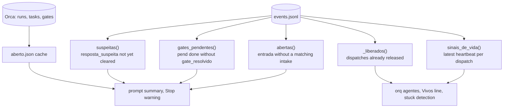
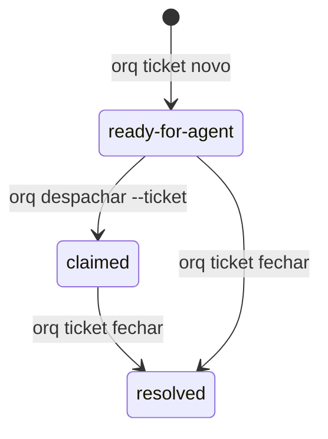
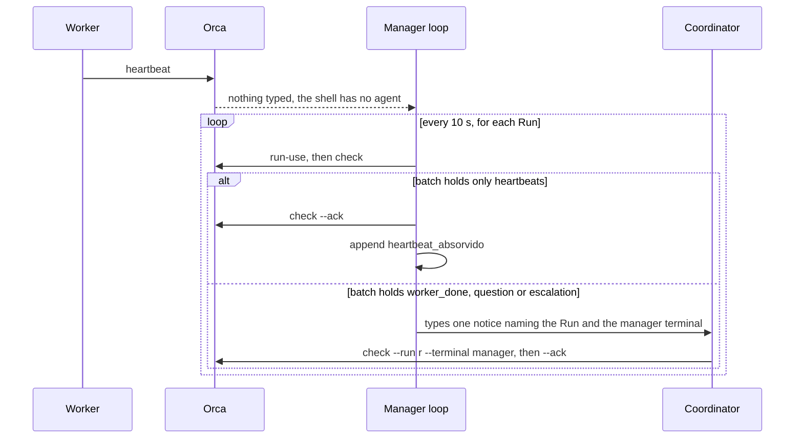
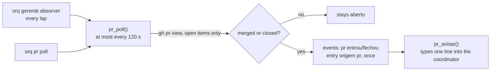

# orq design

This document explains the concepts behind orq and why it is built the way it is. The README covers installation and commands.

Names in code and in the event log are Portuguese (see the glossary in the README). They are kept verbatim here in `code` so you can grep for them.

## Roles

Three kinds of terminal take part.

The coordinator is the Claude Code session the user talks to. It creates Runs and tasks in Orca and dispatches workers.

Workers are Claude Code sessions Orca starts for a task. Their first prompt is always Orca's dispatch preamble.

The agent manager (`gerente`) is a plain shell running `painel-agent-manager.sh`. It has no model and costs no tokens.

The hooks are installed globally, so they run in every session, workers included. Each one first works out its role:

1. No `ORCA_TERMINAL_HANDLE` in the environment means the session is outside Orca, and the hook exits without calling anything.
2. A prompt that is the dispatch preamble marks the session as a worker in `cursor.json` (`papeis[session_id] = "worker"`). From then on the session stays a worker, even if it later runs `run-create` by mistake.
3. A session with no worker mark and a Run bound to its terminal (`orca orchestration run-current`) is the coordinator. orq remembers that session's Run so it can report a lost binding later, for example after hibernation or resume.

Orca's `worker-list` is not used as a role signal. Without `--run` it is scoped to the Run bound to the calling terminal, and a Run a worker created by mistake never lists that worker.

## Entries and effects

An entry (`entrada`) is something that demands a decision from the coordinator. There are four sources:

- a prompt typed by the user (`origem: usuario`)
- an action item from an automation report (`origem: relatorio`)
- a `worker_done` message that carries a `reportPath` (`origem: relatorio_worker`)
- a linked pull request that was merged or closed (`origem: pr`, see "Pull requests linked to a task")

Each entry gets a sequential id (`e1`, `e2`, ...). It stays open until an `intake` event with the same id records its effect:

| Effect | Meaning | Reference checked |
|---|---|---|
| `tarefa` | created or changed an Orca task | the task exists in the Run |
| `steer` | adjusted a running task (`orq steer`) | the task exists |
| `pend` / `decisao` | became something only the user can do or decide | the pending id exists in the file or in a `pend add` event |
| `conversa` | answered on the spot, nothing to track | none; refused for report items |
| `descartado` | dropped on purpose | none; `--nota` gives the reason |

The model does the classifying. The code only checks that a classification was recorded and that it points at something real, so closing an entry dishonestly would mean citing a task that exists and that the dashboard shows.

## events.jsonl

`events.jsonl` in `ORQ_HOME` is an append-only log with one JSON object per line and a `ts` field. Nothing is ever rewritten. Main event types:

| `tipo` | Written by |
|---|---|
| `entrada`, `intake` | prompt hook, ingest, `orq intake` |
| `pend` (`op: add/done`), `gate_resolvido`, `gate_falha` | `orq pend`, ask hook, ingest |
| `resposta`, `resposta_suspeita`, `resposta_lavish` | ask hook, `orq lavish-resposta` |
| `heartbeat_absorvido`, `heartbeat_visto` | prompt hook, manager loop, waiter |
| `nao_iniciou` | `orq despachar`: the prompt did not land, even after the Enter |
| `despacho`, `steer`, `liberar`, `ticket`, `gerente` | the matching commands |
| `fim_dispatch` | `orq liberar`: `dispatch`, `motivo` (`entregue`, `falhou`, `parou: orçamento`, `parou: decisão pendente`, `parou: limite de uso`, `sem worker_done`, `motivo desconhecido`), `caminho`, `sujo`, `sem_push` |
| `pr` (`op: ligar/desligar/sem_task/entrou/fechou/avisado`) | `orq pr`, the `prligar` hook, the poll, the manager loop |
| `worker_done` | ingest: `msg`, `task`, `dispatch`, `outcome`, `subject`, one per inbox message (no report needed) |
| `ausente_ligar`, `ausente_desligar` | `orq ausente` |
| `resposta_coordenador` | the coordinator's Stop hook while away mode is on: `texto`, `sessao` |
| `fila` (`op: add/feito/rm`) | `orq fila` |
| `controle` | `interromper`, `encerrar` and `relancar`: `acao`, `resultado` (`iniciado`, `ok`, `parcial`, `revertido`, `falhou`), `dispatch`, `novo_dispatch`, `motivo`, `nota`, `head`, `sujo`, `worktree_intacta` |
| `gate_aviso`, `binding_perdido`, `alerta`, `alerta_visto` | Stop hook, prompt hook, ingest |

Current state is always computed from the whole log by pure functions:



`aberto.json` is a cache of what is open across all Runs (backlog, running, blocked, gates, agents). Reading every Run takes seconds, so the prompt hook reads the cache left by the previous prompt and starts a background `orq ingest --refresh`. The cache is at most one prompt old and can be deleted at any time.

`cursor.json` holds bookkeeping that does not belong in the log: the next entry number, ingest positions, session roles and the last Run per session. The next id is `max(cursor counter, highest eN in the log) + 1`, so losing `cursor.json` never reuses an id. An unreadable `cursor.json` is moved aside as `cursor.json.corrompido-<time>` and rebuilt, and the summary reports the recovery for 24 hours.

Concurrency. Hooks, the manager loop, the waiter and manual commands can run at the same moment, so every shared file is protected:

- `flock` on one lock file per resource: `cursor.lock` (log appends and cursor), `pend.lock` (pending list), `ticket.lock` (ticket numbering), `gerente.lock` (the manager's Run binding), plus non-blocking `ingest.lock` and `refresh.lock` so only one ingest or refresh runs. When two are needed, the order is fixed: `pend.lock`, then `cursor.lock`.
- JSON files and tickets are written to a temporary file in the same directory and renamed into place, so a reader (such as a dashboard using `fs.watch`) never sees a half-written file.
- Two-step writes, such as updating the pending file and appending its event, block `SIGALRM` until both are done, so the hook's time limit cannot leave one without the other.

## Intake and the Stop hook

`orq hook prompt` (UserPromptSubmit) classifies the prompt with a regex on its start:

| Origin | Rule | Becomes an entry |
|---|---|---|
| `notificacao` | starts with `<task-notification` | no |
| `orca` | starts with `You have N orchestration` | no; may be absorbed as a heartbeat |
| `comando` | `<command-`, `<local-command`, `/compact` | no |
| `resumo` | `This session is being continued` | no |
| `despacho` | Orca's dispatch preamble | no; marks the session as a worker |
| `usuario` | anything else | yes |

Orca types its notice into the terminal even while the user is typing, so a user prompt that ends with the notice is split: the text before it becomes the entry (flagged `com_aviso`), and the notice is handled as an Orca notice.

For a user prompt the hook appends the entry and injects at most five lines of context: the new entry id and the entries still without effect, one line for alerts (stuck workers, suspicious or free-text answers, pending gates, untriaged reports), the open work in Orca with the live workers, the size of the user's pending list, and the `orq intake` syntax.

`orq hook stop` computes the open entries. If there are any, it appends a `gate_aviso` event and shows the user a `systemMessage` naming up to three of them. Today it only warns. The plan is to measure how many entries end a turn without an effect before deciding to block, and then block at most once per turn using Claude Code's `stop_hook_active` flag, so a blocked turn can never loop.

## Report ingestion

`orq ingest` runs in the background after each prompt and after each Orca notice. It reads two sources.

Completed automation runs (`orca automations runs`). orq finds the report file the run's output cites under `.scratch/` in the run's repository and turns each numbered item under an action heading (`Itens de ação`, or two older titles) into its own entry. A report without that section becomes a single "ler <file>" (read the file) entry, so a report can never vanish. Orca marks a terminal automation complete before the agent writes the file, so a run without a readable report waits up to an hour.

`worker_done` messages from the inbox. One with a `reportPath` becomes an entry. A task whose title starts with `[scout]` is expected to produce a report; if its `worker_done` has none, orq raises an alert in the summary until `orq alerta visto <task>`.

Every message and run is isolated: a bad one is logged and skipped, and a transient Orca failure is retried up to three times. Anything already in the log (matched by its `ref`) is never ingested twice, even if `cursor.json` is lost.

## Tickets

A ticket is a markdown file in `ORQ_ISSUES`, `NN-<slug>.md`, numbered from 01 without reusing numbers:

```
# 02: Add login endpoint

Status: ready-for-agent
Blocked by: 01
Run: run_demo
Task: task_abc123

## What to build
...
## Acceptance criteria
...
## Answer          (added when the ticket closes)
```

The file is the only copy of the content. `orq ticket novo` creates the Orca task with the ticket title and a one-line spec, "read and execute the ticket at <path>", with `--deps` pointing at the tasks of any open blockers in the same Run. If `task-create` fails, the file is removed, so no ticket exists without a task.



`orq ticket fechar` writes the `## Answer` section and sets `Status: resolved` first, then completes the Orca task. If Orca fails at that point the ticket stays resolved and the command prints the manual fix. Completing a blocker's task lets Orca move the dependent task from `pending` to `ready`.

## Pending list (pendências)

The user's own to-do items live in `pendencias.json`, which a dashboard can watch. orq is the only writer: `orq pend add` and `orq pend done` change the file under a lock and log each change as a `pend` event.

An item has an `id`, a type (`acao` for an action, `decisao` for a decision, `avisar` for someone to notify), a title and optional fields (`detalhe`, `frente`, `link`, `comando`, `espera`). `espera` marks an item waiting on a third party, and such an item is never asked as a question.

A decision is asked in the same turn it is created, with the AskUserQuestion `header` equal to its id (hence the 12-character limit). The PostToolUse hook `orq hook ask` records the answer and closes the decision only when exactly one option was picked. Free text, "Other", or an option with a note attached is recorded with `livre: true` and leaves the decision open, because orq cannot tell whether the user has decided. The summary keeps asking the coordinator to close it with the decided wording. A multi-select question with the header `ja-fez` ("already done?") closes every item whose option description starts with `[<id>]`.

A decision created with `--task` also creates an Orca gate that holds that task. Closing the decision resolves the gate with the answer. Orca only resolves a gate from a terminal bound to the gate's Run, so orq records the Run, waits until it is bound, and retries from the next ingest.

## Agent manager

Orca types "You have N orchestration messages" into the terminal bound to a Run, and only if that terminal runs a recognized agent. A plain shell gets nothing typed. Orca also identifies the caller by `ORCA_TERMINAL_HANDLE`, so another process can act for the bound terminal by setting that variable.

orq uses both facts. `orq gerente ligar --terminal <manager>` runs `run-use` with the manager's handle and writes `gerente.json` (`{coordenador, gerente, runs}`). After that, every Orca call orq makes from the coordinator goes out with the manager's handle, and Orca's notices go to a terminal that ignores them.

Orca binds one Run per terminal, and binding another Run fences the first. To serve several Runs, the manager rotates: before any command that has to come from the bound terminal (`worker-start`, `send`, `check`, `task-create`, `task-update`, `worker-release`), orq rebinds the manager to that command's Run, holding `gerente.lock` across the bind, the read and the acknowledgement. The lock matters because a delivery read under one binding cannot be acknowledged after the terminal has left the Run and come back. `orq despachar` into a new Run adopts that Run into the manager first, so the coordinator is never left bound to it.

A Run the manager does not hold goes out under the coordinator's own handle instead, so a Run the coordinator created with a raw `run-create` stays reachable. Which Run a command targets never comes from the manager's `run-current`: that is wherever the panel stopped and changes every lap. Without `--run`, orq uses the Run bound to the coordinator's own terminal, or the manager's only Run, and refuses when the manager holds several. Decision gates are created in the task's Run and resolved under the same lock as the check that the coordinator commands that Run. The panel writes `gerente-vivo` from its own shell on every lap; when it is older than 60 s, `orq status`, `orq resumo` and the prompt hook say the panel stopped, because Orca notices reach the coordinator only through it.



Repeated notices. `gerente-aviso.json` stores, per Run, the ids of messages already announced and the time of the last notice. A notice goes out only for ids not seen before, and ids are marked seen only after the text was actually submitted. Before typing, orq checks that the coordinator is idle (`orca terminal wait --for tui-idle`) and that the user has no half-typed draft (`orca terminal read`). Orca itself refuses to type into a busy agent (`agent_prompt_blocked`), which catches the cases `tui-idle` misses. If the coordinator is busy, the loop tries again next round.

While a notice waits to be read, the loop stays on that Run for up to 120 s (`ORQ_GERENTE_PRESO_S`), because the coordinator's raw `check` only works while the manager is bound to it.

End of life of Runs. Orca has no command to close a Run and Runs have no status, so orq decides. Each `absorver` round, a Run with no task in `ready`/`pending`/`dispatched`/`blocked`, no unread message, and no task activity for `RUN_PARADO_MIN` minutes (30, `ORQ_RUN_PARADO_MIN`) leaves `gerente.json` (`gerente` event, `op: soltar`, with the reason). The last Run always stays, and `orq despachar` into a released Run adopts it again. Activity is the newest task creation or completion, not the Run's `updated_at`, which the manager itself moves with every `run-use`. The summary and `aberto.json` list only Runs with open work or activity in the last 24 h (`RUN_RECENT_H`), and never a Run whose objective says "teste" or "descartável"; `orq runs` prints Run, objective, open/completed tasks, manager membership and last activity, and `orq runs --todos` includes the archive.

## Heartbeat handling

There are three paths, all built on the same rule: only a batch made entirely of heartbeats is ever acknowledged. Any other type, including an unknown or missing one, lets the notice through untouched.

Notice for the coordinator's own Run (or a Run of its manager). The prompt hook peeks at the mailbox (`check --peek`). If everything unacknowledged is a heartbeat, it consumes and acknowledges up to four consecutive batches, records `heartbeat_absorvido` with each heartbeat's dispatch, task and phase, and blocks the prompt with `decision: block`, so the model never sees it. A batch that is not all heartbeats stays open for the coordinator.

Late notices. A busy coordinator receives queued notices one after another. The first absorbs the whole mailbox and the rest find it empty. An empty mailbox within 120 s of an absorbed batch is blocked too; outside that window the notice passes.

Notice for another Run. `check` on a Run the terminal is not bound to fails, so orq reads the global inbox instead. If every unread message addressed to that Run is a heartbeat, the prompt is blocked and `heartbeat_visto` is recorded, but nothing is consumed; the messages come out in a batch when the coordinator binds that Run.

The waiter script (`orca-wait-runs.py`) acknowledges heartbeats with the same function. Acknowledging the same delivery twice is harmless in Orca, so the hook, the waiter and the manager loop can race without losing messages. The recorded heartbeats feed `orq agentes`: a running dispatch whose last heartbeat is older than 15 minutes is shown as stuck, with the `orq steer` command to send.

## Releasing workers

`orq liberar <dispatch>` acknowledges pending messages that belong only to that dispatch (a batch mixing another worker's messages is left alone), calls `worker-release`, and, if Orca reports the terminal as `retained`, decides whether to close it.

It closes a terminal Orca owns with no retention reason. Orca also marks a terminal `user_takeover` whenever any data passes through its xterm, including the terminal's automatic replies, so that flag does not prove a person typed anything. orq therefore closes a `user_takeover` terminal only when it was created by this dispatch and the worker's own Claude Code transcript shows no human prompt. It never closes the coordinator's terminal, the Run's coordinator terminal, a terminal reused by another running dispatch, or one retained for any other reason.

## Worker control

Three commands act on a worker that is running (or, for `encerrar` and `relancar`, already stopped). Each is an event of type `controle`, and `orq agentes` prints the last five under the dispatch (`controle: interromper ok 14:02; relancar ok 14:03 (novo ctx_…)`); the new dispatch of a relaunch lists it too, as `(de ctx_…)`.

| Command | Steps | If a step fails |
|---|---|---|
| `orq interromper <dispatch>` | `terminal send --interrupt` to the worker's terminal | Event `falhou`. Nothing to undo: the worker stays alive. Claude Code does not confirm a cancelled turn, so the event says so |
| `orq encerrar <dispatch> --motivo <why>` | `worker-stop` if it still runs, then `orq liberar` | Stop fails: event `falhou`, nothing changed. Release fails: event `parcial`, the worker is stopped, its terminal retained and the worktree where it was; `orq liberar` finishes it. Stopping cannot be undone |
| `orq relancar <dispatch> --nota <what changed>` | checks, `worker-stop`, `worker-start --task <same task> --retry-of <old dispatch> --worktree <same worktree>`, the note as a steer, `liberar` of the old dispatch | see below |

`relancar` refuses before it stops anything when the worktree is gone, the coordinator is not bound to the worker's Run, the task is missing or the old model and effort are unknown. Orca's `worker-stop` fences the dispatch, closes its agent terminal and never touches the worktree; the task becomes `blocked`, which `worker-start --retry-of` accepts. The relaunch records the worktree's head and dirty-file count first and checks afterwards that the worktree exists and the head is still in its history (`worktree_intacta`).

Going back after the stop is limited to what can be brought back. If the requested `--modelo`/`--effort` does not start, the worker starts with the old profile (`revertido`, the first error in `erro` and in the warning). If nothing starts (`falhou`), the old terminal stays retained for inspection, the worktree is untouched and the error prints `orq relancar <dispatch> --nota '<the note>'`; running it again skips the stop, because the dispatch is already settled. A `worker-start` that times out is never retried, since a second worker would land in the same worktree.

An Orca task keeps its spec, so the note cannot go into it. It goes as the first steer of the new worker (`Relançado depois de <dispatch>. O que mudou: …`), with the usual notice and read check. If that steer or the release of the old dispatch fails, the event still says `ok` and the warning names the command to run.

## Resuming after a crash

A power cut kills every Orca terminal, but Orca keeps the dispatches as `dispatched` and Claude keeps each session's transcript. `orq retomar` brings the work back.

What is recorded. The worker's prompt hook already writes `turnos.json` per dispatch; it now also stores `cwd` from the dispatch preamble (the launch directory, kept when the worker later `cd`s) next to `sessao`, the Claude session id. The model comes from `worker-show`, or the `despacho` event.

What `orq retomar` does, in this order:

1. Reads `orca terminal list`. A truncated or failed list refuses the whole command: without proof of who died nothing is started.
2. Agent manager. When `gerente.json` belongs to this coordinator, or to a coordinator whose terminal is gone, and its manager terminal is gone (or only the coordinator changed), it opens a tab running `sh painel-agent-manager.sh` and calls `gerente_ligar` with the old Run list, so `gerente.json` ends as `{coordenador: <this one>, gerente: <new tab>, runs: <all old Runs>}`. A `gerente.json` of a live coordinator is left alone.
3. Workers. Every dispatch with `dispatchStatus: dispatched` whose `agentTerminalHandle` is not in the terminal list gets `orca terminal create --worktree path:<cwd> --title "<title> (retomado)" --command "claude --resume <session> --model <model> --dangerously-skip-permissions '<continue message>'"`. The message is the one used by hand on 30/09: check `git status`, rerun the suite that was pending, send `worker_done` as before, and write `relatorio-final.md` at the worktree root if Orca refuses the new handle.
4. Writes a `retomada` event (dispatch, new terminal, old terminal, session, cwd). `_workers_todos` applies it, so `agentes`, `liberar` and `steer` see the new terminal as the dispatch's own, and a second `retomar` does not list it again.
5. Reads the new terminal's screen for up to `ORQ_RETOMAR_ESPERA_S` (20 s). `esc to interrupt`, or a screen that changed between reads, is `retomado`; `No conversation found` or no activity is `sem_atividade`. A dispatch with no stored session or cwd is `sem_sessao`, and one whose folder is gone is `sem_worktree`; none of these starts a terminal, and each warning carries the `orq relancar <dispatch>` line that starts a fresh worker from the task spec. The `retomada` event also stores the worktree's `head` and dirty-file count.

From firstmate (`docs/agent-control.md`, `bin/fm-control.sh`): the session id is read from what the worker's own hook recorded, never guessed from the newest transcript; a missing worktree refuses before anything starts, and the head and dirty state are checkpointed; when the session cannot resume, the durable spec (here `relancar`) replaces it. firstmate does not copy: it has no `resume` verb (its relaunch restarts from the brief on disk), and orq adds one because Claude Code's `--resume <id>` is deterministic when the id and the folder are known.

`--dry-run` lists the same rows and creates nothing. `--run` limits it to one Run, `--json` prints the raw result.

`worker_done` from a resumed session carries the same `dispatchId` in its payload, which is how ingest matches it, so the changed handle does not matter to orq. When Orca itself refuses the message the worker leaves `relatorio-final.md`; orq does not read it yet.

`orq gerente desligar` used to refuse after a crash because `gerente.json` named the old coordinator. It now takes over when that coordinator's terminal is gone. `orq gerente ligar` does the same, and keeps the old Run list when the old coordinator or manager is gone (with both alive, a new manager still restarts the list).

## Worker idle state

Orca reports a working state for a dispatch (`projection.stage.activity` in `worker-list` and `worker-show`, fed by the terminal title), but it stays `working` from the moment the input is accepted until `worker_done`. Measured on a live worker sitting at its prompt for 100 s, with the terminal title already showing the idle glyph, the field never changed. It cannot tell a working worker from one that stopped, so orq records the turns itself.

`orq hook prompt` and `orq hook stop` run in every Claude Code session, including a worker's. In a session already decided as a worker (the dispatch preamble was its first prompt), they write `turnos.json` (`{dispatch: {task, sessao, inicio, fim}}`) and do nothing else: no Orca call, no Run, about 65 ms. The preamble carries the dispatch (`--dispatch-id`) and the task (`Your task ID is`) and opens the record; later prompts (a steer, a notice) reopen the newest record of that session, and Stop closes it. Slash commands are not turns. A session without a decided role writes nothing, and records older than 7 days are dropped on the next write.

`orq agentes`, the summary and the panel then split an open dispatch that has no `worker_done`, after the question check:

| State | Rule |
|---|---|
| `nao_comecou` | No turn recorded and no heartbeat `NAO_COMECOU_S` (120 s) after the dispatch: the `worker-start` that never got its Enter. Immediate when the log has a `nao_iniciou` event for the dispatch (see below) |
| `parado` | The last turn ended at least `PARADO_S` (60 s) ago and no heartbeat came after it: the worker stopped at the prompt, shown as minutes since the turn ended |
| `travado` | A turn is open and there is no heartbeat for `TRAVADO_S` (15 min), as before |
| `rodando` | Anything else |

`orq despachar` does not trust Orca's `input_accepted`. After `worker-start` it waits up to `INICIO_ESPERA_S` (8 s, `ORQ_INICIO_ESPERA_S`) for the prompt to land: the worker's prompt hook wrote a turn for the dispatch in `turnos.json`, or the terminal tail shows the title outside the input box. If not, it sends one Enter (harmless on an empty box, `enter: true` in the output) and waits again. If the prompt still did not land it logs `nao_iniciou` (`run`, `task`, `dispatch`, `terminal`), prints `estado: nao_iniciou` with an `aviso` (also on stderr) and the dispatch shows as `nao_comecou` from then on. Limit: a worker whose hooks are not installed also ends up here when the tail does not show the title.

`entregue` needs a `worker_done` for the dispatch in the inbox. A dispatch that is no longer dispatched, has an open terminal and no `worker_done` (stopped, cancelled, inbox window passed) is `encerrado`, never `entregue`.

A heartbeat whose phase is `esperando: <reason>` (optionally `esperando: <reason> até HH:MM`, local time) declares a wait. The dispatch stays `rodando` until the declared time, or `ESPERA_TETO_S` (60 min) after the heartbeat when no time is given. Past that it is `travado` with the reason `espera vencida`. Any other phase keeps the 15 min rule. The summary shows the phase once in `Vivos:`.

Three more signals count as waiting when no phase declares it. `waiting…` (English) reads like `esperando:`. A worker whose screen footer says `N shell still running` or `monitor still running` stays `rodando` with the reason in `espera`, until `TELA_TETO_S` (45 min) without a heartbeat; then it is `travado` with the reason `shell sem heartbeat`. A worker the coordinator paused with `orq interromper` stays `rodando` (`interrompido pelo coordenador`) until it gives a sign after the interrupt (a newer heartbeat or a new turn). The screen is read only by `orq agentes` and the refresh (`terminal read --screen`, one read per running Claude worker, in parallel) and cached in `aberto.json`; the prompt hooks never read it, and a cached read stops counting once a heartbeat or a new turn is newer than it.

The three states that need a nudge print the `orq steer` command. `turno` in each row is `nao_comecou`, `parado`, `aberto` or `unknown`. `unknown` is never idle: it is what a dispatch gets when the agent is not Claude Code (no orq hooks), when Orca did not report the agent, or while it is still inside the 120 s window. `turnos.json` is read fresh by the summary, so a steered worker leaves `parado` on the next prompt instead of waiting for the cache.

Limits: a Stop that another hook turns into a continuation is recorded as an end, so a worker can show `parado` for a moment while it is still going (a heartbeat after the end clears it). A dispatch that was already running when the hooks shipped has no record and shows `nao_comecou` only if it also has no heartbeat.

## Steer delivery

`orq steer` writes the message with `send --to dispatch:<id> --priority high`. Orca then types its own notice into the worker's terminal and stamps `delivered_at` on the message row; when it does not (seen with a normal-priority message), the worker sits at its prompt with an unread message. `orq` types the notice itself only when `delivered_at` is empty, so the worker never gets two.

**User request in the spec.** `orq despachar --entrada eNNN` (without `--ticket`) puts the literal text of that entry (up to the 2000 characters the hook stores) in a `## Pedido do usuário` section at the top of the spec, right under the title and before what the coordinator wrote; the `worker-routing` skill tells the worker's review to check "done" against it. `orq steer <task> <text> --entrada eNNN` appends the new request to the message body under `## Pedido do usuário (acréscimo)` and records it as `pedido` on the `steer` event. Without `--entrada` nothing changes. A bare `orq intake <e> steer <task>` only records the effect; it sends nothing.

Orca's only read state on a message is `read`, and a `check --terminal <worker>` without `--ack` leaves it at 0: the delivery stays outstanding, the next `check` replays it, and newer messages hide behind it. `orq` therefore counts a steer as read when `read` is 1 or when the message id shows up in the tail of the worker's transcript (found through the session id in `turnos.json`).

Each manager loop looks at the open steers. Ninety seconds after the send, or after the last retype, an unread steer to a worker in `parado` (the hooks' idle state) gets the notice typed again through the same guarded typing the coordinator notices use, so a running turn or a user draft blocks it and costs no attempt. After three retypes and 90 more seconds the loop records an `alerta` event (`steer_nao_lido`) and stops. The alert shows in the summary and as `alerta` in `orq agentes`, and goes away with `orq alerta visto <task>`, `orq liberar` or a delivered worker. A steer that is read, or whose dispatch already delivered, is closed with a `steer_fim` event. Steers older than 30 minutes fall out of the loop. A worker at its prompt with a draft that Orca typed and never submitted is blocked as well, so it never reaches the alert: a known gap.

`orq responder <msg_id> "<text>"` looks the message up in the inbox and takes its `run_id`, binds the manager to that Run under the manager lock and calls `reply`. Orca refuses the reply from any terminal not bound to the message's Run.

## Compaction handoff

`precompact.py` runs on PreCompact in the coordinator. Within a 20 s budget (the hook timeout is 30 s) it writes `handoff/<date>.md` with the bound Run, the last ten user entries with their effects, the design notes path, live and delivered agents (with the `orq liberar` and waiter commands), the pending list, open tickets and the user's open PRs. Each section fails on its own. `handoff/ultimo.md` is a symlink to the newest file, and the snapshot is also saved to `engram` when that CLI exists.

After compaction, `precompact.py retomar` (SessionStart with source `compact`) injects the first 60 lines of `ultimo.md`, and flags it as stale if it is older than 15 minutes. The most important sections come first so the cut never drops them. `orq hook session` runs on every session start and adds a fresh status, the open tickets and the notes path in at most 12 lines, so a new coordinator session can resume without the user explaining anything.

## AskUserQuestion guard

Orca's notice is typed into the coordinator's terminal. When an AskUserQuestion widget is open, that text lands in the widget, and Enter picks the first (recommended) option on the user's behalf.

Two defenses follow.

`orq hook guard` (PreToolUse on AskUserQuestion) refuses the widget in a worker session always (see below) and, in the coordinator, while any worker is dispatched in any Run, apart from Runs another live terminal coordinates. The refusal tells the coordinator to put the decision on a review page instead, a browser page whose answer cannot be typed by a terminal notice. In the author's setup that page is built with `lavish-axi`, and `orq lavish-resposta` records its answers under the same rules as the widget: only an explicit choice closes a decision. The list of active dispatches is cached for 10 s. `touch ~/.claude/orq/ask-guard.off` disables the guard if a dispatch is stuck.

Without active workers the widget is allowed, and `orq hook ask` still checks each answer. It is marked suspicious (recorded, but closing nothing) if the prompt hook saw an Orca notice in the previous 3 s, if the answer text is itself a notice, or if Orca delivered a message within 5 s and the answer is just the recommended option. `orq auditar-respostas` scans a past transcript for answers that picked only the recommended option within 2 s of an Orca delivery and lists them for the user to check.

## Prompts stuck on a worker's screen

Claude Code asks for a human in three ways that never reach the coordinator: a permission prompt ("Dangerous rm operation on possibly-empty variable path… Do you want to proceed?", shown even with permissions bypassed), an open `AskUserQuestion`, and "trust this folder". Only someone looking at the terminal sees them, so the worker sits there.

**Detection.** `tela_pergunta` reads the last `TELA_LINHAS` (30) lines of a worker's screen, the same read that finds `N shell still running`. A menu counts as open when it ends the screen with consecutive numbered options starting at 1, one carrying the `❯` cursor, and at most `TELA_RODAPE_MAX` (4) footer lines after it; the question text decides the kind (`trust`, `permissao`, `pergunta`). A `❯ 1. …` left in the history, a numbered list in the assistant's answer, or a menu the screen has scrolled past do not match (`fixtures/tela-*.txt`). `orq agentes` and the refresh show such a worker as `perguntando` with `PERGUNTA NA TELA (<kind>): <text> [1) … | 2) …]`.

**One notice.** On each loop the manager (`telas_avisar`) reads the screens of the Claude workers that have a turn record, types one line into the coordinator (the question, the options and `orq responder-tela <task> <opção>`) and logs `pergunta_tela`. The same menu is not announced again; when it leaves the screen the manager logs `pergunta_tela_fim`, so a repeat later is announced anew. A busy coordinator or one with a draft is left alone and the next loop tries again, as for every other notice.

**Answering.** `orq responder-tela <task> <opção>` reads the screen again, refuses if no menu is open or the option does not exist (a number typed into an ordinary prompt would become a message to the worker), types the option number with Enter into the worker's terminal and logs a `controle` event `responder-tela` with `por` (the terminal that answered), the option and the question. `<opção>` is the number or the start of the label. Limit: the number is sent with Enter, so a menu that takes the digit alone also receives an empty Enter, harmless on the next empty prompt.

**Avoiding it.** The `AskUserQuestion` PreToolUse hook (`orq hook guard`) now also runs in worker sessions, decided by the role recorded from the dispatch preamble: it denies the box and tells the worker to escalate with `orca orchestration ask` or `send --type escalation`. It reads `cursor.json` only, no Orca call. The coordinator's branch is unchanged. The `worker-routing` skill asks specs for commands that do not trip Claude Code's guard (`rm -rf "${S:?}"/*.exit` instead of `$S/*.exit`).

**Resumed sessions.** `orq retomar` adds to the continuation message the coordinator's handle and the escalation command (`orca orchestration send --from "$ORCA_TERMINAL_HANDLE" --to run:<run> --type escalation … --task-id … --dispatch-id …`), because a `claude --resume` session has lost the dispatch preamble that carried them.

## Worker-routing guard

`hooks/worker-routing-guard.py` (PreToolUse on Bash and Agent) refuses `orca orchestration worker-start` without `--model` and `--effort`, `orq despachar` without `--modelo` and `--effort`, an Agent call without `model` (forks excepted), and `orca worktree rm` without `--run-hooks`. It only matches `orq despachar` in command position, so text inside quotes such as a commit message does not trigger it. The refusal points to the `worker-routing` skill, which picks the model from how ambiguous the task is and the effort from how much reasoning this run needs.

## Night mode

`orq noite ligar --ate HH:MM [--max-despachos N] [--max-falhas 3]` stores `noite` in `cursor.json` (end time as the next HH:MM, dispatch ceiling, failure limit, start time) and logs `noite_ligar`. `orq noite desligar` clears it and logs `noite_desligar`; `orq noite` prints the state. Off, nothing changes.

While on, `orq status`, `orq hook prompt` (user prompts and Orca notices) and `orq hook session` give the coordinator two lines: the rules (no AskUserQuestion, park decisions with `orq pend add` and keep going on what is independent, no push or merge, stop dispatching when the budget runs out) and the budget or, after a refusal, the stop reason. `orq agentes` prints the stop reason once. The hooks only read `cursor.json` and the log, never Orca.

`orq despachar` checks before doing anything and refuses, logging `noite_parou` with the reason, in three cases: past the end time, at the dispatch ceiling (`despacho` events since `noite_ligar`), or at the failure limit in a row. A failure is counted from the dispatches since `noite_ligar`, in order, using the `worker_done` messages of the last 200 inbox messages and the `liberar` events:

- counts: `worker_done` with `outcome: failed` and no `reportPath`, or a dispatch released with no `worker_done` (the worker died);
- resets to zero: `outcome: succeeded`, or `failed` with a `reportPath` (the worker wrote up why it cannot be done, which is its decision and not a broken environment);
- a dispatch still running neither counts nor resets.

If the inbox call fails, the time and ceiling checks still apply and the failure count is skipped (logged). The refusal exits non-zero with a message that points to `orq pend add` and `orq noite desligar`. Limit: the hooks do not stop the coordinator from other Orca commands, only `orq despachar` refuses.

### External-action guard

`orq hook externas` (PreToolUse on Bash, in every session, workers included) denies these commands while night mode is on: `git push` (any flags), `gh pr merge`, `gh workflow run`, `git commit --no-verify` or `-n` (also inside a cluster such as `-anm`), `orca worktree rm --force`, and `git reset --hard` outside a linked worktree (a worker's own worktree is fine; the main checkout and `git -C <main>` are not). The reason points to `orq pend add` and `orq noite desligar`. Off, it prints nothing.

It matches only in command position, after stripping heredoc bodies and quoted text, so a commit message or an `echo` that mentions `git push` does not trigger it (the same rule as `worker-routing-guard.py`). It reads `cursor.json` and, for the reset, the local git dir; no Orca call. A commit that fails the pre-commit hook stays as it is: the worker repairs what the hook flagged.

While night mode is on, `orq despachar` starts the worker with `GIT_TERMINAL_PROMPT=0` and `commit.gpgsign=false` through `GIT_CONFIG_*` in the `orca` process environment, adding to any `GIT_CONFIG_COUNT` already set instead of replacing it, and logs the variable names in the `despacho` event (`ambiente`). Limit: the variables go to the `orca` CLI; whether the Orca runtime copies them into the agent terminal is checked by the real-Run test, not by the fake Orca. The hook is regex on the command text: `bash -c "git push"`, a script that pushes, or `gh api` calls are not caught.

### Morning card

Every `orq liberar` writes a `fim_dispatch` event with the dispatch's final state as a named reason, read from the inbox and the log: `entregue` or `falhou` (the `worker_done` outcome), `parou: orçamento|decisão pendente|limite de uso` (from `orq encerrar --parada orcamento|decisao|limite`; without `--parada` a stopped worker with no `worker_done` is `sem worker_done`), and `motivo desconhecido` when the inbox call fails (it never guesses). The event also keeps the worktree as it was at release: `caminho`, `sujo` (files with uncommitted changes) and `sem_push` (commits outside `origin/main`). A repeated release keeps the last event per dispatch; `release_pending` writes none.

`orq resumo --noite` prints the card for the latest `noite_ligar`, in at most 40 lines and pt-BR: one line per dispatch with its reason (`rodando` while it has no `fim_dispatch`), why dispatching stopped (`noite_parou`), dirty worktrees, branches with commits not pushed, parked decisions (`pend add` during the night, still open), whether the manager was alive, the longest gap in the log, and the commands to paste (`git -C <worktree> status --short` and `git -C <worktree> log --oneline origin/main..HEAD`, only for the worktrees that need them). `cartao_noite` is a pure function of the log, `cursor.json` and the pending file; for dispatches without `fim_dispatch` the command adds the worktree seen now through `worker-show` (best effort, at most 10). Lists cap at 8 dispatches and 3 per section, with `+N` for the rest.

The manager panel stamps `gerente_volta` in `cursor.json` at every `orq gerente absorver` round. The card calls the manager alive when the last round was at most 5 minutes before the end of the night, and prints when it stopped otherwise. A gap is 10 minutes with no event in the log between two consecutive events (or the start and end of the night); the card prints the longest as "a máquina pode ter dormido às HH:MM". A quiet log is not proof of sleep, so the wording stays a maybe. The SessionStart hook adds the first line of the card (how many dispatches, how many per reason) while the night ended less than 12 hours ago, whether by `orq noite desligar` or by reaching its end time.

## Pull requests linked to a task

A feature moves through environments by the same branch: a pull request into `development`, then `staging`, then `main`, plus a `merge/<feature>-<environment>` request when a conflict shows up. Orca's task holds only a spec, so orq keeps the link in `prs.json` (`{itens, ultimo_poll}`), written under `pr.lock` with a temporary file and a rename like the other state files.

`orq pr ligar <task> <url> [--issue N]` registers a request, `orq pr lista [--task]` lists them and `orq pr desligar <task> <url>` drops one. An item holds the task, URL, number, base branch, `estado` (`aberto`, `mergeado` or `fechado`), the optional GitHub issue and `avisado`. Linking asks `gh pr view` once for the state and base, but does not need the answer: without it the request enters `aberto` with no base and the poll fills it in. A request that is already merged or closed enters resolved and already announced, because whoever links it knows. One URL belongs to one task. The task id is not checked against Orca, since linking makes no Orca call.



The poll runs outside every hook (`orq hook prompt`, `stop`, `session` never call `gh`). The manager loop calls it on each lap and `orq pr poll` calls it by hand. It spaces `gh` calls by `PR_POLL_S` (120 s, `ORQ_PR_POLL_S`; `--forcar` skips the wait), does nothing when no request is open, holds a non-blocking `pr-poll.lock` so only one poll runs, and queries the open requests four at a time. A `gh` that fails or is missing leaves the request open for the next round.

A merge or close moves the item to its new state and appends an event `entrou` or `fechou` and an entry (`origem: pr`, `ref` = the URL) in one locked step. Because the entry's `ref` is the URL, running the step again never adds a second entry. The entry text reads `PR #1216 entrou em development (task_abc, issue #1210): pronto para staging`. It stays open until the coordinator records an effect with `orq intake`, and the prompt summary lists it in the extra line as `PR: ... [eN]`. Then `pr_avisar()` types `orq: <text>. Entrada eN.` into the coordinator through `digita`, the guarded typing the manager already uses, and only after that marks `avisado` and appends `avisado`. A busy coordinator or a draft in its box types nothing and the next lap tries again. A prompt that starts with `orq: PR ` has origin `aviso_orq`: the hook records no entry for it, since the poll already did. Without a manager, the entry still exists and shows in the next prompt summary; nobody types the line.

`orq status` adds one line per feature: `PR task_abc: #1216 development ✓ · #1220 staging aberto`, plus the next step. The suggestion (`pr_proximo`) comes from the furthest merged base along development, staging, main: `pronto para staging`, `pronto para main`, or `em main` at the end. It is empty while a request of that feature is still open, or when only closed requests exist. orq never opens the next request; the line is a hint for the coordinator. A feature whose requests were all resolved more than 7 days ago leaves the status line. The per-prompt context never carries this list, only the open entry.

### Linking on `gh pr create`

The coordinator does not have to remember `orq pr ligar`. The PostToolUse hook `orq hook prligar` (matcher `Bash`, coordinator session only, no Orca call) reads the output of `gh pr create`, takes the pull request URL, and starts `orq pr auto <url> --head <branch> [--wt <dir>]` outside the hook (detached; with `ORQ_NO_BG` it runs to the end, as the tests need). The branch is the `--head` value, or the cwd's branch (a leading `cd <dir> &&` changes the cwd). The hook skips a URL that is already linked or already listed.

`orq pr auto` finds the owning task in `task_do_ramo`: first a dispatch whose `--name` is the branch (or its suffix after `<prefix>/`), which needs no network; then the dispatch whose worktree (`worker-show`, the 12 newest dispatches) is the worktree holding the branch (`git worktree list`). The owner gets the same `pr_ligar` as a manual link. With no owner the URL goes to `sem_task` in `prs.json` (event `pr`, `op: sem_task`) and `orq status` prints `PR sem tarefa: #N (<branch>) <url>` until someone runs `orq pr ligar`, which removes it from the list.

When the `development` and `staging` requests of a feature are both merged, none is open and none is in `main`, the suggestion becomes `pronto para main (development e staging entraram: abrir o de main)`, and the poll's entry carries it, so the coordinator is woken with that text.

Register the hook in `settings.json` (see `settings.hooks.example.json`). Limits: two tasks dispatched to the same worktree (`current`) resolve to the newest one; a branch renamed after the dispatch and never named with `--name` has no owner and lands in `sem_task`; the hook confirms only that a link was started, not that it succeeded.

Limits: a `merge/` request counts as entering its base environment, so its merge can hide that the feature's own request has not gone in. The panel's lap waits for its slowest `gh` call (15 s at most). `gh` is asked by URL, so a private repository needs the user's own `gh` login. The order development, staging, main is fixed in `AMBIENTES`.

## Digest and away mode

`orq digest [--desde ISO] [--html] [--abrir]` writes `ORQ_HOME/digest/atual.json`, the file the dashboard reads (contract: `orquestrador-plan/contratos/digest-v1.md`, version 1), replaced in one step, and prints its path plus a count line. `--html` also writes a page, `digest/<YYYY-MM-DD>.html` (self-contained, light and dark by the system, every outside string through `html.escape`). `--abrir` writes the page and opens it in an Orca tab (`orca tab create --url file://…`, in the worktree of the terminal that calls); if Orca does not answer, the paths are still printed and the exit code stays 0.

The JSON has `fila`, `features`, `pendencias`, `linha` and `rodando`, plus `versao`, `geradoEm` and `ausente {ligado, desde}`:

- `fila`: steps `{passo, nome, por, prs, feito}`. When the coordinator declared steps with `orq fila`, those are the list. With none declared, the order comes from the tickets' `Blocked by`: one step per feature (the task that has PRs linked), where a feature waits for the features of the tickets its own ticket depends on, directly or through a ticket in the middle that has no PR; without a ticket or a dependency the link order holds, and a cycle cannot block the page (link order, warning on the page). Each PR carries `numero`, `url`, `base`, `estado` (`OPEN`, `MERGED`, `CLOSED`, from the last poll) and `titulo` (from `gh` when the PR was linked, else `PR #N`), development before staging before main. `feito` is: marked with `orq fila feito`, or every PR of the step MERGED or CLOSED. In the derived list a step is done when it has PRs, none is open and nothing is left to promote (`pr_proximo` is empty or `em main`).
- `features`: one group per task with linked PRs, in the merge order from the tickets: `{tag, nome, nota, prs}`. `nome` is the ticket title (the task id without a ticket); `tag` and `nota` come from `orq pr ligar --tag --nota` (null and empty when not given).
- `pendencias`: the pending file items as they are, plus `depois` (true for those the summary hides in "Depois").
- `linha`: empty unless away mode is on; then every event since it was turned on (or since `--desde`): worker deliveries and failures (`worker_done`: `ok` or `sec`), PRs that went in (`ok`) or were closed (`sec`), the coordinator's replies to workers and its own replies (`info`), and decisions (`ok`). At most 100, newest kept. The page always shows a window (away-mode start, else the user's last message, skipping the request that started the digest).
- `rodando`: one item per live worker, `{titulo, estado, desde}`, the state in plain words (the phase it declared, `parado no prompt`, `esperando a sua resposta`…), with no task, Run or terminal id.

`orq fila add --passo N --nome <name> --por <why> <PR>…` declares (or replaces) step N, refusing PR numbers that are not linked to a task with `orq pr ligar`; `feito N` marks it done by hand (valid even with an open PR); `rm N` drops it; `lista` prints each step with its PRs as the poll last saw them. The steps live in `fila.json` (`{passos}`, under `fila.lock`, tmp plus rename) and each change is logged as a `fila` event. A PR unlinked later disappears from its step.

Everything is read from orq's own files (`events.jsonl`, `prs.json`, `fila.json`, the pending file, `aberto.json`, the tickets). No `gh`, no Orca call (except `--abrir`). PR state is whatever the last poll left in `prs.json`, and the page says when that was, or that no poll has run. `worker_done` exists in the log because ingest now writes one event per inbox message, once (`msg` is the dedup key); before, only messages with a `reportPath` left a trace.

`orq ausente ligar` stores `ausente` in `cursor.json` and logs `ausente_ligar`; `desligar` clears it; `orq ausente` prints the state (with a warning when no manager is connected, since nobody then runs the PR poll). While it is on, `orq hook stop` of the coordinator records its reply as a `resposta_coordenador` event (`last_assistant_message` from the Stop input, else the last assistant text at the end of `transcript_path`) and calls `digest_gerar`, so each reply refreshes `atual.json`. It is fail-open: a failure goes to the log and the Stop goes on, including its unmatched-entry warning. The hook never runs `gh` or Orca for this; a worker's Stop never gets here. It stays on until `orq ausente desligar`.

Limits: the file is only as fresh as the last PR poll (the manager loop or `orq pr poll`). PR numbers are taken as unique (one repository). Delivery warnings (`entrega`) are not in the digest. A feature with no ticket shows its task id. A reply of the coordinator that has no text (only tool calls) leaves no entry. `linha` turns empty the moment away mode is turned off, although the events stay in the log.

## Design decisions

Orca stays the source of truth for tasks. It already stores backlog, dependencies, gates, dispatches and a durable mailbox. A separate `tasks.json` would be a second truth that drifts. orq stores only what Orca lacks: the link from a request to what it became, and the user's own to-do items.

The Python standard library only. The hooks run in every Claude Code session, workers included, so they must start fast and install with a `git clone`. There is no virtualenv to break and no dependency to audit.

An append-only log instead of a database. A log can be inspected with `grep`, cannot be corrupted by a partial update, and makes every state a pure function over past events, which the tests exercise directly with fixture events. A lost or corrupt cursor can be rebuilt from it. The cost is that every read scans the whole file and nothing rotates it yet.

Scripts own the mechanics and the model owns the judgment. Asking the model to remember every request fails exactly when context is compacted. So hooks record entries deterministically, the model classifies each one with a single command, and the code rejects a classification that points at nothing.

Warn before blocking. The Stop hook only warns until real usage shows how often entries end a turn without an effect. A block costs a turn and can annoy, so it has to be justified by data first.

Heartbeats stay out of the coordinator's context. Orca has no option to silence notices, and each one is a prompt that wakes the model. Blocking in UserPromptSubmit stops them at no model cost. A shell as the manager, rather than a second Claude session, costs no tokens per message and does not depend on a model to relay messages correctly.

In doubt, wake the coordinator. Anything not provably a heartbeat passes. A spurious wake-up costs a few tokens; a swallowed `worker_done` or question stalls a worker.

Hooks fail open, fast. A hook that crashes or hangs must never stand between the user and the model. Every hook has an internal 3 s `SIGALRM` limit (inside a 5 s timeout in `settings.json`) that also covers a stdin that never closes and a stuck lock. Errors go to `orq.log`, and the slow work (reading every Run) happens in a detached background process.

Files with locks and atomic renames. The state is small, several processes touch it, and a dashboard reads it with file watchers. `flock` plus rename gives consistency without a server.

One gateway to Orca. Every call goes through `orca()`, which handles the manager's handle and rebinding. `ORQ_ORCA` points it at a fake Orca in tests, and the fake reproduces the real scoping and fencing rules, since tests against a lenient fake once hid a real bug.

Do not trust a signal that cannot bear weight. `user_takeover` fires without a person, and `tui-idle` is satisfied early in a turn. orq checks such signals against a second source (the worker's transcript, Orca's own refusal to type) before acting on them.

The ticket file is the only copy of its content. Orca's task only points at the file, so there is one place to edit and nothing to keep in sync.

A visible mark instead of colour. Messages orq shows the user start with a fixed emoji prefix, because ANSI colour in hook messages could not be shown to render and would show up as escape codes if it did not.

## Non-goals and known limits

Non-goals: replacing Orca's task store, scheduling work in code (the model decides what to dispatch and with which model), and shipping a UI. A dashboard can read `pendencias.json`, `events.jsonl` and `aberto.json`, but none is included here.

Known limits:

- The Stop hook warns and never blocks.
- `events.jsonl` is never rotated, and every read scans all of it.
- `orq agentes` and the guard look at the 300 newest dispatches; the "asking" state looks at the last 200 inbox messages.
- Everything about the manager depends on its loop running. With the loop stopped nothing is acknowledged or announced, and a notice can take one round (about 10 s plus the `orq agentes` call) to arrive. While a notice is waiting, the other Runs are not visited for up to 120 s.
- Raw `orca` commands against a manager-bound Run need `env ORCA_TERMINAL_HANDLE=<manager>` and only work while the manager is bound to that Run. Gate creation and resolution do not rebind.
- A worker is recognized only if its first prompt passed through an orq hook.
- `orq ticket novo`, `orq steer` and `orq intake ... tarefa` only work on the Run bound to the coordinator or its manager, because Orca refuses task writes from other terminals.
- The worker's tab title set by `orq despachar` does not stick; Claude Code rewrites it.
- `orq liberar` reads the worker's whole transcript and needs it under `~/.claude/projects`, so non-Claude workers keep their terminals open.
- Some constants are tuned to the author's setup: the ingest start date, reports living under `.scratch/`, the Portuguese action headings, and the default protected branch names in the cleanup script (overridable with `ORQ_PROTECTED_BRANCHES` and `ORQ_FINAL_BASE`).
- macOS and Linux only, single user, one machine.

## Orphan worktrees (ticket 45)

`limpar-mergeados.py` used to remove a worktree only when a PR into `main` had merged its branch, so a branch that landed by cherry-pick, a research branch without a PR and a branch the user left behind stayed forever. `decide_orfa` now covers a worktree with no merged PR: it goes (removed through Orca with `--run-hooks`, then the local branch deleted) when `git cherry origin/main HEAD` shows no `+` commit, the tree is clean, no live orq worker uses it, no PR is open from the branch and its last activity is more than 24 h old (a worktree that was just created has no commit either). `prototype/*`, anything in `limpar-mergeados.keep` and the protected branches never go. `orq ocupadas` prints the paths with a worker not yet released (dispatched, or terminal not `released`); if it fails the cleanup treats every worktree as busy. Deleting the branch with `-D` is safe there because the cherry already proved every commit is in `main`.

`orq status` adds one line, at most once a day (`worktrees-aviso.json` keeps the day): `Worktrees paradas (2): feat/x (15 dias, 0 commits fora da main); …`. A worktree is stopped when it has no live worker and no activity (`lastActivityAt` of `orca worktree list`) for more than 3 days; the main worktree and archived ones are left out, three are listed and `+k` counts the rest. The day is written only when the line is printed, and an Orca failure gives no line. Tests: `test_worktrees_paradas_*` in `test_orq.py` and the cherry-pick, `prototype/*` and busy-worktree cases of `limpar-mergeados.py --self-test`.


## Hook latency (ticket 49)

Every hook runs as `python3 orq.py hook <kind>`, and Python recompiles a script on every run (only imported modules get a `.pyc`). At 292 KB, compiling `orq.py` alone took the ticket-24 worker hook past its 100 ms ceiling. The code now lives in `orqlib.py`; `orq.py` is a 10-line entry point that imports it (cached in `__pycache__`), runs `orqlib.main()`, and swaps itself for `orqlib` in `sys.modules`, so `import orq` (tests, `hooks/limpar-mergeados-hook.py`) still sees the same globals. The `settings.json` commands are unchanged. The two self-spawns (`ingest`, `_orq_cmd`) call `orq.py` next to `orqlib.py`. `ThreadPoolExecutor`, `tempfile` and `hashlib` are imported on first use, which drops about 20 ms of stdlib imports from every hook. Keep new heavy imports out of the module top level.

Measured with `Amb` (fake Orca, isolated `ORQ_HOME`), median of 15 runs, machine under load 48 (so the ceiling has slack on an idle one):

| hook | before | after |
|---|---|---|
| worker `stop` (ticket 24) | 103 ms | 53 ms |
| worker `prompt` | 98 ms | 52 ms |
| coordinator `lugar` | 96 ms | 56 ms |
| coordinator `externas` | 100 ms | 52 ms |
| coordinator `prligar` | 96 ms | 52 ms |
| coordinator `prompt` | 129 ms | 82 ms |

The coordinator `prompt` hook was never under the ceiling (it calls Orca); the tests that hold 100 ms are the worker, `lugar` and `externas` ones.
