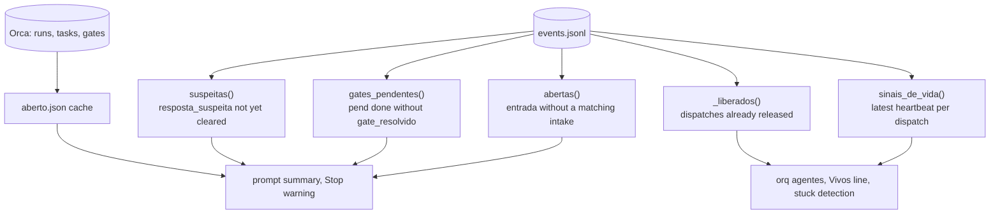
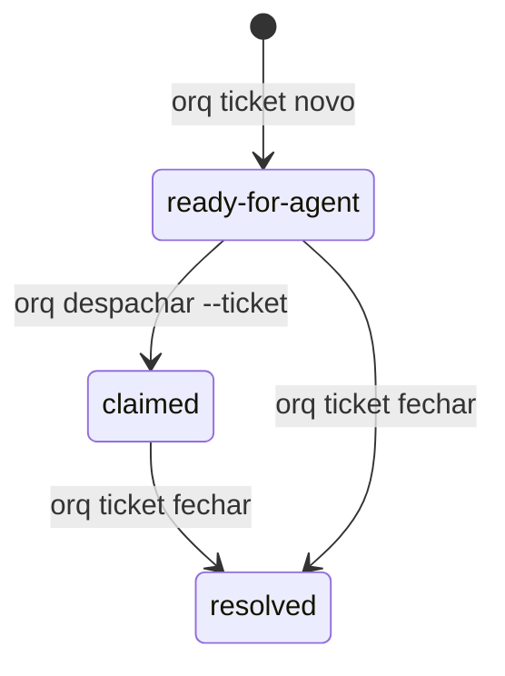
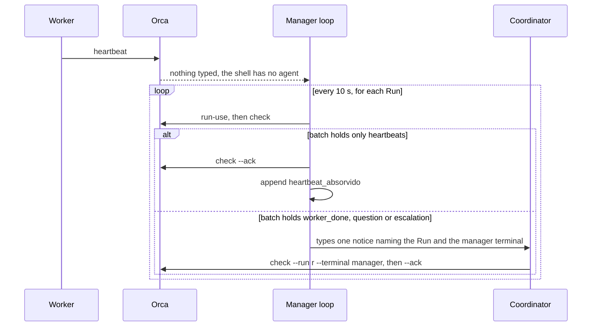

# orq design

This document explains the concepts behind orq and why it is built the way it is. The README covers installation and commands.

Names in code and in the event log are Portuguese (see the glossary in the README). They are kept verbatim here in `code` so you can grep for them.

## Roles

Three kinds of terminal take part.

The coordinator is the Claude Code or Codex session the user talks to. It creates Runs and tasks in Orca and dispatches workers.

Workers are Claude Code or Codex sessions Orca starts for a task (`orq despachar --agente claude|codex`). Their first prompt is always Orca's dispatch preamble.

A secondmate (`mate`, ticket 80) is a coordinator for one group of projects: a Claude Code or Codex session opened by `orq mate abrir` with `ORQ_MATE=<group>` in its environment, bound to its own Run. It talks to the coordinator only through `events.jsonl` (see "Secondmates by group").

The agent manager (`gerente`) is a plain shell running `painel-agent-manager.sh`. It has no model and costs no tokens.

The hooks are installed globally, so they run in every session, workers included. Each one first works out its role:

1. No `ORCA_TERMINAL_HANDLE` in the environment means the session is outside Orca, and the hook exits without calling anything.
2. A prompt that is the dispatch preamble marks the session as a worker in `cursor.json` (`papeis[session_id] = "worker"`). From then on the session stays a worker, even if it later runs `run-create` by mistake.
3. A session with no worker mark and a Run bound to its terminal (`orca orchestration run-current`) is the coordinator. orq remembers that session's Run so it can report a lost binding later, for example after hibernation or resume.

Orca's `worker-list` is not used as a role signal. Without `--run` it is scoped to the Run bound to the calling terminal, and a Run a worker created by mistake never lists that worker.

## Entries and effects

An entry (`entrada`) is something that demands a decision from the coordinator. There are four sources:

- a prompt typed by the user (`origem: usuario`)
- an action item from an automation report (`origem: relatorio`)
- a `worker_done` message that carries a `reportPath` (`origem: relatorio_worker`)
- a linked pull request that was merged or closed (`origem: pr`, see "Pull requests linked to a task")

Each entry gets a sequential id (`e1`, `e2`, ...). It stays open until an `intake` event with the same id records its effect:

| Effect | Meaning | Reference checked |
|---|---|---|
| `tarefa` | created or changed an Orca task | the task exists in the Run |
| `steer` | adjusted a running task (`orq steer`) | the task exists |
| `pend` / `decisao` | became something only the user can do or decide | the pending id exists in the file or in a `pend add` event |
| `conversa` | answered on the spot, nothing to track | none; refused for report items |
| `descartado` | dropped on purpose | none; `--nota` gives the reason |

The model does the classifying. The code only checks that a classification was recorded and that it points at something real, so closing an entry dishonestly would mean citing a task that exists and that the dashboard shows.

## events.jsonl

`events.jsonl` in `ORQ_HOME` is an append-only log with one JSON object per line and a `ts` field. Nothing is ever rewritten. Main event types:

| `tipo` | Written by |
|---|---|
| `entrada`, `intake` | prompt hook, ingest, `orq intake` |
| `pend` (`op: add/done`), `gate_resolvido`, `gate_falha` | `orq pend`, ask hook, ingest |
| `resposta`, `resposta_suspeita`, `resposta_lavish` | ask hook, `orq lavish-resposta` |
| `heartbeat_absorvido`, `heartbeat_visto` | prompt hook, manager loop, waiter |
| `nao_iniciou` | `orq despachar`: the prompt did not land, even after the Enter |
| `despacho`, `steer`, `liberar`, `ticket`, `gerente` | the matching commands |
| `fim_dispatch` | `orq liberar`: `dispatch`, `motivo` (`entregue`, `falhou`, `parou: orçamento`, `parou: decisão pendente`, `parou: limite de uso`, `sem worker_done`, `motivo desconhecido`), `caminho`, `sujo`, `sem_push` |
| `pr` (`op: ligar/desligar/sem_task/entrou/fechou/avisado`) | `orq pr`, the `prligar` hook, the poll, the manager loop |
| `uso_aviso`, `uso_parou` | the manager loop warns the coordinator once per level and window; `orq despachar` refuses on budget |
| `prioridade` | `orq prioridade <task> <1-3>`: `task`, `valor` |
| `despacho_fila` (`op: entrou/subiu/saiu/removido/desistiu`), `maquina_aviso` | the dispatch queue of the machine budget; the manager loop warns the coordinator once per pressure episode |
| `pausa_plano`, `pausa_fim` | `orq pausar` parked a worker (session, cwd, model, `encerrados`: the background processes it ended, `{pid, args, sinal}`); `orq retomar --pausados` resumed it |
| `hibernar`, `acordar` | `orq hibernar` (or the manager loop) closed an idle worker's terminal (`motivo`, `rss_antes_mb`, `rss_depois_mb`, `rss_liberado_mb`); `orq acordar`, `steer`, `responder` or the loop's triggers resumed it (`terminal`, `motivo`) |
| `worker_done` | ingest: `msg`, `task`, `dispatch`, `outcome`, `subject`, one per inbox message (no report needed) |
| `ausente_ligar`, `ausente_desligar` | `orq ausente` |
| `resposta_coordenador` | the coordinator's Stop hook while away mode is on: `texto`, `sessao` |
| `fila` (`op: add/feito/rm`) | `orq fila` |
| `controle` | `interromper`, `encerrar`, `relancar` and `passar`: `acao`, `resultado` (`iniciado`, `ok`, `parcial`, `revertido`, `falhou`), `dispatch`, `novo_dispatch`, `motivo`, `nota`, `head`, `sujo`, `worktree_intacta` |
| `passagem` | `orq passar`: `de` (old dispatch), `agente_de`, `para` (new dispatch), `agente_para`, `head`, `sujo`, `pacote` (sha of `PASSAGEM.md`, 12 hex), `escrito_por` (`orq`), `aceita` (the new worker's first turn was seen), `task`, `run` |
| `gate_aviso`, `binding_perdido`, `alerta`, `alerta_visto` | Stop hook, prompt hook, ingest |
| `mate` (`op: abrir`), `mate_pedido`, `mate_entregue`, `mate_reenvio`, `mate_escalado` | `orq mate abrir`, `orq mate pedir`, the manager loop (`mate_volta`) |
| `mate_dormiu`, `mate_acordou` | `orq mate dormir` and the manager loop (`mates_dormir`); the resume done by `orq mate abrir` or `orq mate pedir` |

`orq retro` reads all of these (see "Retro"); a new failure event should get a signal there.

Current state is always computed from the whole log by pure functions:



`aberto.json` is a cache of what is open across all Runs (backlog, running, blocked, gates, agents). Reading every Run takes seconds, so the prompt hook reads the cache left by the previous prompt and starts a background `orq ingest --refresh`. The cache is at most one prompt old and can be deleted at any time.

`cursor.json` holds bookkeeping that does not belong in the log: the next entry number, ingest positions, session roles and the last Run per session. The next id is `max(cursor counter, highest eN in the log) + 1`, so losing `cursor.json` never reuses an id. An unreadable `cursor.json` is moved aside as `cursor.json.corrompido-<time>` and rebuilt, and the summary reports the recovery for 24 hours.

Concurrency. Hooks, the manager loop, the waiter and manual commands can run at the same moment, so every shared file is protected:

- `flock` on one lock file per resource: `cursor.lock` (log appends and cursor), `pend.lock` (pending list), `ticket.lock` (ticket numbering), `gerente.lock` (the manager's Run binding), plus non-blocking `ingest.lock` and `refresh.lock` so only one ingest or refresh runs. When two are needed, the order is fixed: `pend.lock`, then `cursor.lock`.
- JSON files and tickets are written to a temporary file in the same directory and renamed into place, so a reader (such as a dashboard using `fs.watch`) never sees a half-written file.
- Two-step writes, such as updating the pending file and appending its event, block `SIGALRM` until both are done, so the hook's time limit cannot leave one without the other.

## Intake and the Stop hook

`orq hook prompt` (UserPromptSubmit) classifies the prompt with a regex on its start:

| Origin | Rule | Becomes an entry |
|---|---|---|
| `notificacao` | starts with `<task-notification` | no |
| `orca` | starts with `You have N orchestration` | no; may be absorbed as a heartbeat |
| `comando` | `<command-`, `<local-command`, `/compact` | no |
| `resumo` | `This session is being continued` | no |
| `despacho` | Orca's dispatch preamble | no; marks the session as a worker |
| `usuario` | anything else | yes |

Orca types its notice into the terminal even while the user is typing, so a user prompt that ends with the notice is split: the text before it becomes the entry (flagged `com_aviso`), and the notice is handled as an Orca notice.

For a user prompt the hook appends the entry and injects at most five lines of context: the new entry id and the entries still without effect, one line for alerts (stuck workers, suspicious or free-text answers, pending gates, untriaged reports), the open work in Orca with the live workers, the size of the user's pending list, and the `orq intake` syntax.

`orq hook stop` computes the open entries. If there are any, it appends a `gate_aviso` event and shows the user a `systemMessage` naming up to three of them. Today it only warns. The plan is to measure how many entries end a turn without an effect before deciding to block, and then block at most once per turn using Claude Code's `stop_hook_active` flag, so a blocked turn can never loop.

## Report ingestion

`orq ingest` runs in the background after each prompt and after each Orca notice. It reads two sources.

Completed automation runs (`orca automations runs`). orq finds the report file the run's output cites under `.scratch/` in the run's repository and turns each numbered item under an action heading (`Itens de ação`, or two older titles) into its own entry. A report without that section becomes a single "ler <file>" (read the file) entry, so a report can never vanish. Orca marks a terminal automation complete before the agent writes the file, so a run without a readable report waits up to an hour.

`worker_done` messages from the inbox. One with a `reportPath` becomes an entry. A task whose title starts with `[scout]` is expected to produce a report; if its `worker_done` has none, orq raises an alert in the summary until `orq alerta visto <task>`.

Every message and run is isolated: a bad one is logged and skipped, and a transient Orca failure is retried up to three times. Anything already in the log (matched by its `ref`) is never ingested twice, even if `cursor.json` is lost.

## Tickets

A ticket is a markdown file in `ORQ_ISSUES`, `NN-<slug>.md`, numbered from 01 without reusing numbers:

```
# 02: Add login endpoint

Status: ready-for-agent
Blocked by: 01
Run: run_demo
Task: task_abc123

## What to build
...
## Acceptance criteria
...
## Answer          (added when the ticket closes)
```

The file is the only copy of the content. `orq ticket novo` creates the Orca task with the ticket title and a one-line spec, "read and execute the ticket at <path>", with `--deps` pointing at the tasks of any open blockers in the same Run. If `task-create` fails, the file is removed, so no ticket exists without a task.



`orq ticket fechar` writes the `## Answer` section and sets `Status: resolved` first, then completes the Orca task, then frees the dependents (ticket 105): the closed number leaves the `Blocked by:` line of every dependent (as does any blocker that is already resolved). A dependent left with no blocker and still `ready-for-agent` is *liberado*. The command lists them by priority (`prioridade_de`), records them in the `fechar` event, and `orq status` shows `liberados: 91, 88 (P1, P2)` for as long as the ticket stays `ready-for-agent` with no blocker. A liberado of priority 1 or 2 whose header carries both `Modelo:` and `Effort:` enters the dispatch queue (`_enfileirar_despacho`, so the manager starts it by slot and priority); without them the command warns; priority 3 never starts by itself. The dependent's Orca task, if `blocked`, goes to `ready` (a `pending` one is left to Orca, which releases it when its deps complete). Orca failures here are warnings: the files are already right. `orq doctor tasks` is the sweep for what was left behind: a `blocked`/`pending` task whose ticket is resolved becomes `completed` with `{ticket, supersededBy}`, and one with no ticket is only listed. If Orca fails when completing the task, the ticket stays resolved and the command prints the manual fix.

Binding the Run. `ticket novo`, `ticket fechar`, `steer`, `liberar` and `doctor tasks` run inside `_no_run(run)`: when the coordinator does not command the Run, orq runs `run-use` for it under the coordinator's own handle and, on exit, binds back the Run that was bound before (Orca binds one Run per terminal). With the manager linked to this coordinator it does not switch: the coordinator's terminal owns the loose Runs and a `run-use` to a manager Run would take it out, so the old refusal (`orq gerente ligar --terminal … --run …`) stands.

## Pending list (pendências)

The user's own to-do items live in `pendencias.json`, which a dashboard can watch. orq is the only writer: `orq pend add` and `orq pend done` change the file under a lock and log each change as a `pend` event.

An item has an `id`, a type (`acao` for an action, `decisao` for a decision, `avisar` for someone to notify), a title and optional fields (`detalhe`, `frente`, `link`, `comando`, `espera`). `espera` marks an item waiting on a third party, and such an item is never asked as a question.

A decision is asked in the same turn it is created, with the AskUserQuestion `header` equal to its id (hence the 12-character limit). The PostToolUse hook `orq hook ask` records the answer and closes the decision only when exactly one option was picked. Free text, "Other", or an option with a note attached is recorded with `livre: true` and leaves the decision open, because orq cannot tell whether the user has decided. The summary keeps asking the coordinator to close it with the decided wording. A multi-select question with the header `ja-fez` ("already done?") closes every item whose option description starts with `[<id>]`.

A decision created with `--task` also creates an Orca gate that holds that task. Closing the decision resolves the gate with the answer. Orca only resolves a gate from a terminal bound to the gate's Run, so orq records the Run, waits until it is bound, and retries from the next ingest.

## Agent manager

Orca types "You have N orchestration messages" into the terminal bound to a Run, and only if that terminal runs a recognized agent. A plain shell gets nothing typed. Orca also identifies the caller by `ORCA_TERMINAL_HANDLE`, so another process can act for the bound terminal by setting that variable.

orq uses both facts. `orq gerente ligar --terminal <manager>` runs `run-use` with the manager's handle and writes `gerente.json` (`{coordenador, gerente, runs}`). After that, every Orca call orq makes from the coordinator goes out with the manager's handle, and Orca's notices go to a terminal that ignores them.

Orca binds one Run per terminal, and binding another Run fences the first. To serve several Runs, the manager rotates: before any command that has to come from the bound terminal (`worker-start`, `send`, `check`, `task-create`, `task-update`, `worker-release`), orq rebinds the manager to that command's Run, holding `gerente.lock` across the bind, the read and the acknowledgement. The lock matters because a delivery read under one binding cannot be acknowledged after the terminal has left the Run and come back. `orq despachar` into a new Run adopts that Run into the manager first, so the coordinator is never left bound to it.

A Run the manager does not hold goes out under the coordinator's own handle instead, so a Run the coordinator created with a raw `run-create` stays reachable. Which Run a command targets never comes from the manager's `run-current`: that is wherever the panel stopped and changes every lap. Without `--run`, orq uses the Run bound to the coordinator's own terminal, or the manager's only Run, and refuses when the manager holds several. Decision gates are created in the task's Run and resolved under the same lock as the check that the coordinator commands that Run. The panel writes `gerente-vivo` from its own shell on every lap; when it is older than 60 s, `orq status`, `orq resumo` and the prompt hook say the panel stopped, because Orca notices reach the coordinator only through it.



Repeated notices. `gerente-aviso.json` stores, per Run, the ids of messages already announced and the time of the last notice. A notice goes out only for ids not seen before, and ids are marked seen only after the text was actually submitted. Before typing, orq checks that the coordinator is idle (`orca terminal wait --for tui-idle`) and that the user has no half-typed draft (`orca terminal read`). Orca itself refuses to type into a busy agent (`agent_prompt_blocked`), which catches the cases `tui-idle` misses. If the coordinator is busy, the loop tries again next round.

Slow rounds are not a dead panel (ticket 105). With a high load one round took more than 60 s and the coordinator was told the panel was stopped while the process was alive. `gerente absorver` now touches the `gerente-vivo` stamp at the start of the round, after each Run and at the end, and appends the round's duration to `gerente.json` (`voltas_s`, the last `VOLTAS_LEMBRADAS` = 10). `painel_limite_s` is the larger of 90 s (`PAINEL_LIMITE_MIN_S`) and 3× (`PAINEL_VOLTAS_X`) the average round. A stamp older than 60 s but inside the limit reads "painel lento (N s por volta)"; past the limit it reads "painel parado há N min", as before. The shell loop still touches the stamp before calling orq, so a broken `orq.py` is still caught.

The interval follows the load (ticket 120). Measured on 01/10 with 10 Runs bound: one round is 60 to 76 subprocesses, almost all `orca` calls (about 0.1 s each; `worker-list`, `task-list` and `run-show` dominate, and the last two run once per Run in `_run_parado`), 4 to 5 s idle and 7 to 16 s in the real panel. `gh` does not show up, because `pr poll` keeps its 120 s floor. Since the cost is the `orca` calls, not `gh`, sleeping longer does cut the calls per minute, in proportion. `painel_intervalo_s` returns the last round's duration clamped to `PAINEL_INTERVALO_S` = 10 and `PAINEL_INTERVALO_MAX_S` = 30, so a slow round keeps the panel busy at most half of the time, and a fast one brings it back to 10 s. The shell asks `orq gerente intervalo` and sleeps 10 s if that fails. The per-Run `_run_parado` calls are the next thing to cut, and stay out of this ticket.

While a notice waits to be read, the loop stays on that Run for up to 120 s (`ORQ_GERENTE_PRESO_S`), because the coordinator's raw `check` only works while the manager is bound to it.

End of life of Runs. Orca has no command to close a Run and Runs have no status, so orq decides. Each `absorver` round, a Run with no task in `ready`/`pending`/`dispatched`/`blocked`, no unread message, and no task activity for `RUN_PARADO_MIN` minutes (30, `ORQ_RUN_PARADO_MIN`) leaves `gerente.json` (`gerente` event, `op: soltar`, with the reason). The last Run always stays, and `orq despachar` into a released Run adopts it again. Activity is the newest task creation or completion, not the Run's `updated_at`, which the manager itself moves with every `run-use`. The summary and `aberto.json` list only Runs with open work or activity in the last 24 h (`RUN_RECENT_H`), and never a Run whose objective says "teste" or "descartável"; `orq runs` prints Run, objective, open/completed tasks, manager membership and last activity, and `orq runs --todos` includes the archive.

## Heartbeat handling

There are three paths, all built on the same rule: only a batch made entirely of heartbeats is ever acknowledged. Any other type, including an unknown or missing one, lets the notice through untouched.

Notice for the coordinator's own Run (or a Run of its manager). The prompt hook peeks at the mailbox (`check --peek`). If everything unacknowledged is a heartbeat, it consumes and acknowledges up to four consecutive batches, records `heartbeat_absorvido` with each heartbeat's dispatch, task and phase, and blocks the prompt with `decision: block`, so the model never sees it. A batch that is not all heartbeats stays open for the coordinator.

Late notices. A busy coordinator receives queued notices one after another. The first absorbs the whole mailbox and the rest find it empty. An empty mailbox within 120 s of an absorbed batch is blocked too; outside that window the notice passes.

Notice for another Run. `check` on a Run the terminal is not bound to fails, so orq reads the global inbox instead. If every unread message addressed to that Run is a heartbeat, the prompt is blocked and `heartbeat_visto` is recorded, but nothing is consumed; the messages come out in a batch when the coordinator binds that Run.

The waiter script (`orca-wait-runs.py`) acknowledges heartbeats with the same function. Acknowledging the same delivery twice is harmless in Orca, so the hook, the waiter and the manager loop can race without losing messages. The recorded heartbeats feed `orq agentes`: a running dispatch whose last heartbeat is older than 15 minutes is shown as stuck, with the `orq steer` command to send.

## Releasing workers

`orq liberar <dispatch>` acknowledges pending messages that belong only to that dispatch (a batch mixing another worker's messages is left alone), calls `worker-release`, and, if Orca reports the terminal as `retained`, decides whether to close it.

It closes a terminal Orca owns with no retention reason. Orca also marks a terminal `user_takeover` whenever any data passes through its xterm, including the terminal's automatic replies, so that flag does not prove a person typed anything. orq therefore closes a `user_takeover` terminal only when it was created by this dispatch and the worker's own Claude Code transcript shows no human prompt. It never closes the coordinator's terminal, the Run's coordinator terminal, a terminal reused by another running dispatch, or one retained for any other reason.

## Worker control

Three commands act on a worker that is running (or, for `encerrar` and `relancar`, already stopped). Each is an event of type `controle`, and `orq agentes` prints the last five under the dispatch (`controle: interromper ok 14:02; relancar ok 14:03 (novo ctx_…)`); the new dispatch of a relaunch lists it too, as `(de ctx_…)`.

| Command | Steps | If a step fails |
|---|---|---|
| `orq interromper <dispatch>` | `terminal send --interrupt` to the worker's terminal | Event `falhou`. Nothing to undo: the worker stays alive. Claude Code does not confirm a cancelled turn, so the event says so |
| `orq encerrar <dispatch> --motivo <why>` | `worker-stop` if it still runs, then `orq liberar` | Stop fails: event `falhou`, nothing changed. Release fails: event `parcial`, the worker is stopped, its terminal retained and the worktree where it was; `orq liberar` finishes it. Stopping cannot be undone |
| `orq relancar <dispatch> --nota <what changed>` | checks, `worker-stop`, `worker-start --task <same task> --retry-of <old dispatch> --worktree <same worktree>`, the note as a steer, `liberar` of the old dispatch | see below |

`orq pausar` does not apply to a dispatch that already sent its `worker_done` (Orca can still list it as `dispatched` for a while): there is no turn to pause and no `PAUSA.md` will come, so it used to wait the full `ORQ_PAUSA_ESPERA_S` (300 s). With task or dispatch ids the command refuses at once, before any steer, and names `orq liberar <dispatch>`; by priority criterion it skips those workers and lists them as `entregue` with the same hint.

`relancar` refuses before it stops anything when the worktree is gone, the coordinator is not bound to the worker's Run, the task is missing or the old model and effort are unknown. Orca's `worker-stop` fences the dispatch, closes its agent terminal and never touches the worktree; the task becomes `blocked`, which `worker-start --retry-of` accepts. The relaunch records the worktree's head and dirty-file count first and checks afterwards that the worktree exists and the head is still in its history (`worktree_intacta`).

Going back after the stop is limited to what can be brought back. If the requested `--modelo`/`--effort` does not start, the worker starts with the old profile (`revertido`, the first error in `erro` and in the warning). If nothing starts (`falhou`), the old terminal stays retained for inspection, the worktree is untouched and the error prints `orq relancar <dispatch> --nota '<the note>'`; running it again skips the stop, because the dispatch is already settled. A `worker-start` that times out is never retried, since a second worker would land in the same worktree.

An Orca task keeps its spec, so the note cannot go into it. It goes as the first steer of the new worker (`Relançado depois de <dispatch>. O que mudou: …`), with the usual notice and read check. If that steer or the release of the old dispatch fails, the event still says `ok` and the warning names the command to run.

## Handing a worker to the other harness (ticket 87)

`orq passar <dispatch> --para codex|claude [--modelo m --effort e]` continues a worker on the other harness when the first one hit its plan limit. It copies the shape of `relancar` and adds the package. The analysis behind it (ai-memory, lessons 1 to 7) lives in the plan notes.

Order: (1) refuse before touching anything: `--para` is the same harness, worktree gone, Run not bound to the coordinator, no equivalent profile, `uso_checar` of the target harness at the pause level, no machine slot (`maquina_vaga`, the dispatch itself leaves the count), task missing; (2) `controle passar iniciado`; (3) `worker-stop` of the old dispatch if it still runs; (4) write `PASSAGEM.md`; (5) trust the folder for Codex (`confiar_codex`); (6) `worker-start --run --task --retry-of <old> --worktree <same> --agent <other> --model --effort`; (7) wait for the first turn of the new dispatch (`_conferir_inicio`: hook prompt, or the task title on screen, with one Enter); (8) `steer` "read PASSAGEM.md first" and `liberar` of the old terminal; (9) event `passagem`, then `controle passar ok`.

**Who runs it.** Like `relancar`, `passar` runs from the terminal that Orca binds to the worker's Run (the consumer): `worker-start` and `steer` fail with `consumer_fenced` anywhere else, and the check (`run_do_coordenador`) refuses first with the `run-use` hint. A worker terminal cannot run it. The real proof (Claude to Codex, ending in `worker_done`) only worked once the coordinator had the proof Run bound to its own terminal.

**Profile.** `PASSAGEM_PERFIL` follows the `worker-routing` table: Sonnet low/medium/high/xhigh/max → Luna low/medium/xhigh/max and Sol low; Opus low/medium/high → Sol; Opus xhigh/max → Astra low/medium. Back to Claude: Luna → Sonnet, Sol → Opus (Sol low → Sonnet high), Astra low/medium → Opus xhigh/max. Haiku, Fable and any pair outside the table are refused with "pass --modelo and --effort".

**The package.** `PASSAGEM.md` in the worktree root, written by the orq from facts, so the old worker needs no turn (path B of the design; the old worker never writes it). First line `<!-- orq-passagem v1 de=<old dispatch> para=<harness> -->`. Sections, action before prose: Próximo passo, Perguntas abertas (`decisao` pendências bound to the task), Decisões já tomadas (the task's `steer` events and the dispatch's `resposta_worker`), Estado do git (head, branch, `status --porcelain`, commits and `diff --stat` since `origin/main`), Relatório parcial (last heartbeat phase, `PAUSA.md`, `relatorio-final.md`), Fim do transcrito, Onde está o resto (transcript path and the `orca search --agent <old>` command), Como agir. The end of the transcript is the last 20,000 characters of visible user and assistant messages (6,000 per message; no reasoning, meta records, tool calls or Codex environment context), between `<!-- historico-inicio -->` and `<!-- historico-fim -->`, with a line before it saying it is history and not instruction; `<!--` inside it is escaped. The transcript comes from `turnos.json` (`transcrito`) or Orca's session index. The file goes into the repository's `info/exclude` so the new worker does not commit it. The spec is not in it: the Orca task keeps it and `worker-start` delivers it again.

**Fallback `worker_done` from `relatorio-final.md` (ticket 92).** After the inbox, `ingest_relatorios_finais` walks `turnos.json`. A dispatch counts when it has no `worker_done` event, the hook stored its `cwd`, its turn is closed (`fim`), and `<cwd>/relatorio-final.md` is newer than both the turn start and the ingest start point (a file left by an earlier dispatch in the same worktree does not count). It writes a `worker_done` event (`origem: relatorio-final`, `msg: relatorio-final:<dispatch>`, outcome `succeeded`, because the worker only writes the file when it finishes) and an `entrada` of origin `relatorio_worker` with the file path. Ingest runs the inbox first, so a real `worker_done` wins; one that arrives after the fallback is skipped, so nothing is delivered twice. Divergence from the analysis: the design asked only for the fallback; the outcome is assumed, not read from the file.

**Open passages in `orq status`.** `linhas_passagens` prints `Passagens abertas (N)` for each `passagem` event older than 15 min (`PASSAGEM_ABERTA_MIN`) that was not `aceita` and whose new dispatch still has no turn in `turnos.json`. A turn that starts later closes it without a new event.

**Marker difference.** The design put the new dispatch id in the first line. The package is written before `worker-start`, so the new id does not exist yet; the line carries the harness, and the `passagem` event carries both dispatch ids.

**Failure.** After the stop there is no going back to the harness that hit the limit. If `worker-start` fails (`controle passar falhou`, `passo: worker-start`), the old dispatch stays stopped with its terminal retained, the worktree and `PASSAGEM.md` stay, and the error prints `orq passar <dispatch> --para <harness>`; running it again skips the stop. A `worker-start` that times out is never retried. A failed steer or release leaves `ok` with the command in `aviso`.

**Not in this ticket.** Perceiving the limit on the worker's screen, the neutral `orq transcrito` reader with tool calls, the open-passage alert in `orq status`, and the coordinator's own handoff are tickets 3 to 7 of the analysis. Here the end of the transcript is messages only.

### The package for a worker with no turn (ticket 88)

When the worker hit its plan limit it has no turn left, so the package cannot depend on it. `orq passagem <dispatch> [--para codex|claude]` writes `PASSAGEM.md` from facts only and touches nothing else: no stop, no `worker-start`, no message to the worker. `orq passar` builds the same text (`_texto_passagem`), so both paths give one file. Nothing in it comes from the model.

Sections, in the order of the analysis (2.3): Próximo passo, Perguntas abertas, Decisões já tomadas, Estado do git, Relatório parcial, Fim do transcrito, Onde está o resto, Como agir. What each one reads:

- **Próximo passo**: always "Desconhecido" when the worker left no note. If the last transcript record is a tool call, a tool result or a prompt with no answer, it starts with "a sessão parou sem fechar o turno" (lesson 3): the tool may have run halfway, so check `git status` first.
- **Perguntas abertas**: the worker's `question` or `escalation` in the Run inbox with no reply (`perguntas_abertas`), plus the pending decisions tied to the task.
- **Decisões já tomadas**: the task's steers and the coordinator's answers (`resposta_worker`), each answer next to the question it answered when the inbox still has it.
- **Estado do git**: head, branch, dirty paths with the count, commits and `diff --stat` since `origin/main`, and the PR linked to the task (`prs.json`).
- **Relatório parcial**: the last heartbeat phase, `PAUSA.md` and `relatorio-final.md` if present, and the worker's last visible answer from the transcript, fenced as history.
- **Onde está o resto**: transcript path, `claude --resume <id>` or `codex resume <id>` for the old session, and the `orca search` command. Any source that failed shows up here as "não li <fonte>".
- **Como agir**: fixed text, plus whether the old worker holds the E2E queue (`fila_e2e` matches its worktree), since that lock dies with nobody to release it.

**Deadline.** `PASSAGEM_PRAZO_S` is 20 seconds. The reads that can hang (inbox, the Orca session index, each git call) share what is left of it, with a cap per read; a read that fails or runs out becomes a "não li" line and the rest of the file is written as usual. `worker-show` (10 s) runs before and is not part of the budget. The tests cover a hung inbox (`FAKE_SLEEP_CMD=inbox:60`) and check the whole command ends within 20 s.

**Fixture.** `fixtures/tela-claude-limite.txt` is the limit screen the tests put in the worker's terminal. Its text is a stand-in for the real Claude message, which ticket 4 still has to capture. The package does not read the screen, so nothing here depends on that text.

## Resuming after a crash

A power cut kills every Orca terminal, but Orca keeps the dispatches as `dispatched` and Claude keeps each session's transcript. `orq retomar` brings the work back.

What is recorded. The worker's prompt hook already writes `turnos.json` per dispatch; it now also stores `cwd` from the dispatch preamble (the launch directory, kept when the worker later `cd`s) next to `sessao`, the Claude session id. The model comes from `worker-show`, or the `despacho` event.

What `orq retomar` does, in this order:

1. Reads `orca terminal list`. A truncated or failed list refuses the whole command: without proof of who died nothing is started.
2. Agent manager. When `gerente.json` belongs to this coordinator, or to a coordinator whose terminal is gone, and its manager terminal is gone (or only the coordinator changed), it opens a tab running `sh painel-agent-manager.sh` and calls `gerente_ligar` with the old Run list, so `gerente.json` ends as `{coordenador: <this one>, gerente: <new tab>, runs: <all old Runs>}`. A `gerente.json` of a live coordinator is left alone.
3. Workers. Every dispatch with `dispatchStatus: dispatched` whose `agentTerminalHandle` is not in the terminal list gets `orca terminal create --worktree path:<cwd> --title "<title> (retomado)" --command "claude --resume <session> --model <model> --dangerously-skip-permissions '<continue message>'"`. The message is the one used by hand on 30/09: check `git status`, rerun the suite that was pending, send `worker_done` as before, and write `relatorio-final.md` at the worktree root if Orca refuses the new handle.
4. Writes a `retomada` event (dispatch, new terminal, old terminal, session, cwd). `_workers_todos` applies it, so `agentes`, `liberar` and `steer` see the new terminal as the dispatch's own, and a second `retomar` does not list it again.
5. Reads the new terminal's screen for up to `ORQ_RETOMAR_ESPERA_S` (20 s). `esc to interrupt`, or a screen that changed between reads, is `retomado`; `No conversation found` or no activity is `sem_atividade`. A dispatch with no stored session or cwd is `sem_sessao`, and one whose folder is gone is `sem_worktree`; none of these starts a terminal, and each warning carries the `orq relancar <dispatch>` line that starts a fresh worker from the task spec. The `retomada` event also stores the worktree's `head` and dirty-file count.

From firstmate (`docs/agent-control.md`, `bin/fm-control.sh`): the session id is read from what the worker's own hook recorded, never guessed from the newest transcript; a missing worktree refuses before anything starts, and the head and dirty state are checkpointed; when the session cannot resume, the durable spec (here `relancar`) replaces it. firstmate does not copy: it has no `resume` verb (its relaunch restarts from the brief on disk), and orq adds one because Claude Code's `--resume <id>` is deterministic when the id and the folder are known.

`--dry-run` lists the same rows and creates nothing. `--run` limits it to one Run, `--json` prints the raw result.

`worker_done` from a resumed session carries the same `dispatchId` in its payload, which is how ingest matches it, so the changed handle does not matter to orq. When Orca itself refuses the message the worker leaves `relatorio-final.md`; ingest reads it as a fallback `worker_done` (ticket 92): see below.

`orq gerente desligar` used to refuse after a crash because `gerente.json` named the old coordinator. It now takes over when that coordinator's terminal is gone. `orq gerente ligar` does the same, and keeps the old Run list when the old coordinator or manager is gone (with both alive, a new manager still restarts the list unless `--assumir` is given; ticket 54).

## Plan usage budget and pause by priority (ticket 51)

Source of the numbers. Claude Code hands `rate_limits` (`five_hour` and `seven_day`, each `used_percentage` and `resets_at` in epoch seconds) to the statusline on stdin; the OMC HUD wrapper (`~/.claude/hud/omc-hud-cache.sh`) saves that JSON per session as `~/.claude/hud/cache/stdin.<session>.json` on every frame. It is the same figure as the footer (`5h:…% wk:…%`) and is account-wide, so `uso_plano` reads the newest frame (`ORQ_HUD_CACHE` overrides the folder). Reading a file means no network and no Orca call, so hooks can use it. A frame older than 30 min says nothing (level `desconhecido`, nothing is refused). A window whose `resets_at` already passed counts as 0%. Fixture: `fixtures/hud-stdin.json`.

Thresholds live in `ORQ_HOME/uso.json`, over the defaults `{"semana_avisa": 85, "semana_pausa": 92, "cinco_h": 90}`. Levels: `pausa` (week >= 92%), `segura` (5 h >= 90%), `avisa` (week >= 85%), `ok`. `orq uso` prints the level.

- `orq despachar` refuses at `pausa` and `segura` (`uso_checar`, next to the night-mode breaker). Priority 1 passes the 5 h hold but not the weekly pause. The refusal names the window and when it turns.
- The manager loop (`gerente absorver`) types one line into the coordinator per (level, window reset) through `uso_avisar`; going back to `ok` clears the memory, so the next crossing warns again. At `pausa`, if the other harness is at `ok` (week under `semana_avisa`, 5 h under its limit), the line also carries `orq passar <dispatch> --para <other>` for each worker of the paused harness that `orq pausar` would pick by default (`_propor_passagem`); with no room on the other side, or no number for it, the line only says to pause.

Priority. Every task has a priority, 1 (high) to 3 (low): the last `orq prioridade <task> <n>` event wins, then the `--prioridade` of the dispatch, then the default from the title (`prioridade_padrao`: security and production 1; failover, diagnostics, panel and digest 3; the rest 2). It shows in `orq agentes` (`P2`), in the "Vivos" line of `orq status`, and as `prioridade` on each `rodando` entry of `digest/atual.json`, sorted high first (the 8765 panel shows the same order with a `P<n>` badge). `orq pausar` and the budget refusal use it.

`orq pausar [--ate-prioridade N] [task…]`. Targets: named tasks/dispatches alone; else priority >= N; with no argument priority 3 plus workers whose last heartbeat phase is `investigating`. A worker in a final phase (`review`, `verif`, `final`) is spared in both automatic modes (listed as `preservados`). For each target: refuse if `turnos.json` has no session/cwd (no way back), `steer` the pause message (write `PAUSA.md` at the worktree root with where it stopped and the next step, stop any E2E, end the turn, no `worker_done`), wait up to `ORQ_PAUSA_ESPERA_S` (300) for a `PAUSA.md` newer than the one that existed, then `orca terminal close` and store the dispatch in `cursor.json` `pausados` (task, session, cwd, model, priority) with a `pausa_plano` event. Before the close, `encerrar_filhos` ends the worker's background processes (ticket 84): the descendants of every child of the agent that matches `HARNESS[agent]["filho"]` (test runs, `node`, `sleep`/`until` monitors; not the agent, not its MCP servers, which the close takes, not the ancestors of the `orq` process). SIGTERM to all, then SIGKILL after `ORQ_ENCERRA_ESPERA_S` (5) to those still in `ps`; nothing outside that tree is touched, and the worker's own E2E stack goes down through its destroy, not here. The list goes into the `pausa_plano` event and the `orq pausar` output. `orq hibernar` needs no kill: it refuses a worker with a live child. Under `ORQ_PROCESSOS`, `_sinal` edits the JSON instead of signalling (`ignora_term` on an entry survives SIGTERM). No new file in time: terminal stays open (`sem_pausa_md`) and nothing is killed. The dispatch stays `dispatched` in Orca with a dead terminal; plain `orq retomar` skips it.

`orq retomar --pausados` resumes those with `claude --resume` (same `_subir_sessao` as the crash recovery, message asking to read and delete `PAUSA.md`), highest priority first, and writes `retomada` plus `pausa_fim`. It refuses while usage is still at `pausa`/`segura` unless `--forcar`.

## Machine budget and dispatch queue (ticket 79)

Why. On 2026-10-01, with the weekly limit lifted, the coordinator started 14 new workers and resumed 6 more (plus the manager and itself); several brought up E2E stacks (Meteor, rspack, MySQL, Mongo, Redis). The 24 GB / 12 CPU machine froze and had to be restarted. `despachar` only looked at plan usage, never at what the machine could carry.

Config. `ORQ_HOME/maquina.json` over `MAQUINA_PADRAO`; a key of the wrong type or unknown counts as absent, and `orq maquina set <key> <json>` validates before writing. `max_workers` 4 live workers; `max_caros` 2 live workers whose model matches a glob in `modelos_caros` (`claude-opus-*`, `gpt-6-astra*`, `gpt-6-sol*`; an expensive worker also counts toward `max_workers`; an unknown model is not expensive); `mem_livre_min_mb` 3072, `livre_pct_min` 15 and `carga_max` 12 define high pressure; `pausar_sob_pressao` false; `mem_piso_mb` 1024 and `runs_isentos` (`["Orquestrador*"]`, globs against the Run id or objective) are the exemption of ticket 85, below; `max_e2e` 1 is informational, since `scripts/e2e-lock.sh` already runs one stack at a time.

Reading (`maquina_ler`, native macOS tools, no dependency). Free memory = (free + inactive + speculative + purgeable pages) x page size from `vm_stat`; free percentage = the `memory_pressure` line; load = 1-minute load average (the number behind `sysctl vm.loadavg`, read with `os.getloadavg`); RSS per process family from `ps -axo rss=,comm=`. A source that fails reads as unknown and never as high pressure. Tests replace the whole reading with the JSON file named by `ORQ_MAQUINA_LEITURA`; its optional `processos` key is the simulated process sample (`[{pid, ppid, cpu, rss (KB), args}]`) that `maquina_origem` reads.

Live workers (`maquina_ocupacao`). Dispatches with status `dispatched` whose terminal is in `orca terminal list` (all of them if that list is unavailable), model from the `despacho`/`retomada` event or `worker-show`. A delivered, released, paused or hibernated worker has no live terminal or is no longer `dispatched`, so its slot opens by itself.

Dispatch. `despachar` takes `despacho.lock`, then `maquina_barra`: pressure first, then slots, then the expensive ceiling. If blocked it writes an item to `fila-despacho.json` (the spec in a copy under `ORQ_HOME/fila-despacho/`, the same model and effort, priority, entry, ticket) and answers `estado: enfileirado`; the same ticket or title in the same Run is not queued twice. The lock covers the check and the `worker-start`, so parallel dispatches cannot all pass the ceiling. The model is never swapped for a cheaper one to start sooner. `uso_checar` and night mode still refuse before anything is queued.

Resume. `orq retomar` sorts the fallen dispatches by priority (`prioridade_de`), starts them while the budget allows and queues the rest as `retomada` items (`--dry-run` shows `a_enfileirar`). `orq retomar --pausados` stops at the ceiling and leaves the rest paused (`sem_vaga`). `orq relancar` swaps one worker for one: the dispatch itself leaves the count, so only an expensive model above the ceiling, or a relaunch of an already dead dispatch above `max_workers`, is refused before anything is stopped.

Manager loop (`maquina_volta`, one call per lap of `gerente absorver`). Under high pressure it starts nothing (but the exempt Run's items) and, once per episode (`cursor.json` `maquina_aviso`, cleared when pressure ends), types into the coordinator the reason, the queue length, how many background processes each live worker has (`_filhos_por_task`, also `filhos` in the `maquina_aviso` event) and, when the orq's own processes are the cause, `orq pausar <task>` for the lowest-priority live worker (final-phase workers are spared, as in `orq pausar`); with `pausar_sob_pressao` it runs that pause itself, so the lap lasts up to `ORQ_PAUSA_ESPERA_S`. When the load comes from outside it names the outsiders instead and neither suggests nor runs a pause. Without pressure `despacho_drenar` takes the queue in priority order (oldest first on a tie), skips an item whose expensive ceiling is full so a cheaper one behind it can start, drops a `retomada` whose dispatch already ended or came back, and starts one item per lap, so memory shows what the last one cost before the next. The drain runs `despachar(_drenando=True)` as the coordinator (`_como_coordenador`): the manager's own handle does not command the Runs. A held item (plan usage, night mode) waits `ESPERA_SEGURADO_S`; any other error counts in `falhas` and the third one removes the item and says so.

Who owns the load (ticket 85). On 2026-10-01 the manager advised pausing a worker at load 13.12, but Spotlight (`mds_stores` at 146% CPU, reindexing) and OrbStack (77%, with another project's buildkit container) caused it; the heaviest worker `node` sat at 13%, so pausing would only have delayed the work. `maquina_origem` reads `ps -axo pid=,ppid=,rss=,pcpu=,command=` and splits it: the orq's processes are every `claude`/`codex` and its descendants (workers, manager, coordinator, their MCP servers and test runners) plus any process with `e2e` in its command and its descendants; everything else is outside, grouped by app or executable name (`OrbStack` from `OrbStack.app/...`, `mds_stores`). `maquina_causa` then answers per cause of the high pressure: for the load motive, whether the orq holds half or more of the CPU; for a memory motive, of the RSS. Any motive owned by the orq makes the cause `orq`; otherwise it is `fora`, with the three biggest outsiders by CPU and by memory. An unknown sample (no `ps`) is treated as `orq`, the old behavior. Limits: the `ps` CPU of macOS is an average that decays over about a minute, a container of OrbStack counts as one outside process, and a user's own `claude` session outside the orq counts as the orq's.

Exemption (ticket 85). `run_isento` matches `runs_isentos` against the Run id or objective (one `run-show`, asked only when something would block). A dispatch, resume or drain of an exempt Run (`maquina_barra_item`) skips the pressure and the `max_workers` ceiling and stops at `max_caros` (a cost limit: an expensive model waits for a slot, as the user asked), at `mem_piso_mb`, the free-memory safety floor (`maquina_piso`), and at `max_e2e`, which holds through the global E2E queue, which has no exemption. Under high pressure the manager drains only the exempt items (`despacho_drenar(so_isentos=True)`), after the notice.

Where it shows. `orq status` prints `Máquina: 3/4 workers (2/2 caros), 1 vagas livres; N na fila de despacho: …` (and the high-pressure reason) when there is something to say. `aberto.json` carries `maquina` for the panel. The digest page has a "Máquina" line under "Rodando agora"; `atual.json` is unchanged because its key set is a contract.

Known limits. `retomar` does not hold the lock while it resumes many workers, so a drain lap during it can overshoot the ceiling by one. A relaunch counts the live set at the start, not after the stop. Load average lags: a burst of builds shows up after the next worker is already starting, which is why the queue drains one item per lap.

## Hibernating idle workers (ticket 60)

A worker is a live `claude` (node plus the session's MCP servers) and keeps its memory while it waits at the prompt for hours: delivered and not released, waiting for the user's decision, for a PR merge, for someone else's E2E. Hibernating records the session and closes the terminal; waking resumes the same session. It reuses what `orq pausar` (ticket 51) and `orq retomar` (ticket 48) already do, and the state lives in `cursor.json` `hibernados` (`{dispatch: {task, run, titulo, agente, modelo, effort, sessao, cwd, terminal, entregue, motivo, desde, rss_liberado_mb}}`), so it survives an Orca crash. Orca does not learn about it: the task stays as it was, and `worktrees_ocupadas` still protects the worktree.

Criterion (`motivo_hibernar`, pure, over a row of `agentes()`; `hibernar_ociosos`, once per `HIBERNA_VOLTA_S` = 60 s from the manager loop). It looks only at workers whose turn is closed in `turnos.json` (the Stop hook wrote `fim`, no later prompt or heartbeat): state `parado`, `rodando` with a declared wait, or `entregue` and not retained by Orca.

| Motivo | Condition |
|---|---|
| `ocioso no prompt` | parked more than N min, N = 15 (`ORQ_HIBERNA_MIN`; `hibernar.json` `min` wins) |
| `entregue e sem liberar` | `worker_done` given, terminal still open, more than N min since the turn ended |
| `esperando: pendência <id>` / `PR #n esperando merge` / `ticket NN bloqueado por MM` | the task has a pending item (`pend add --task` now stores `task` on the item), an open linked PR, or a ticket whose `Blocked by` is not `resolved`; more than `externa_min` = 2 min parked |

A wake-up inside N min of the last `acordar` does not count (the new turn may not be in `turnos.json` yet): the parked time starts at the later of the turn end and the `acordar` event.

Guards, in order, in `_hibernar_agente` (shared by the loop and `orq hibernar`): protected terminals (the caller's `ORCA_TERMINAL_HANDLE`, `gerente.json` coordinator and manager, the Run's `coordinator_handle`); session and cwd from the worker hooks (otherwise it is not an orq worker, or there is no way back); no question; the screen (`_tela_ocupada`: spinner `esc to interrupt`, `N shell still running` / `background terminals running`, or a menu waiting for an answer); `terminal_livre` (Orca's `tui-idle` and an empty input box); no child process. Child process: `_processos` reads `ps -axo pid=,ppid=,rss=,command=` and `lsof -a -d cwd -Fpn` for the agent processes only; the agent of the worktree is the `claude` whose cwd is the worker's, and a live child is any descendant matching `HARNESS[agent]["filho"]` (Claude: `/shell-snapshots/`, the `zsh -c source ~/.claude/shell-snapshots/…` that runs every Bash tool command, background ones included, while MCP servers are plain `node` children). No `ps`, no process at that cwd (the worker `cd`'d), or no pattern for the harness (Codex): no proof, the loop skips, `orq hibernar --forcar` goes ahead. A live child is never forced. Refusals in the loop are silent (logged); the next lap checks again. `ORQ_PROCESSOS` (a JSON list of `{pid, ppid, rss, args, cwd}`) replaces `ps`/`lsof` in tests.

The record is written before `orca terminal close`, so a crash in between never lets `orq retomar` start a worker that was meant to sleep; a failed close removes it. After the close, `rss_agentes_mb` (sum of RSS of the `claude`/`codex` processes and their descendants, the MCP servers included) is measured again, waiting up to `ORQ_HIBERNA_RSS_ESPERA_S` = 5 s for the process to leave `ps`. The difference is `rss_liberado_mb` in the `hibernar` event and in `hibernados`, and `orq agentes` closes with the total.

Waking is `acordar`: `_subir_sessao` (the resume of the harness in a new terminal in the worktree, a `retomada` event so `_workers_todos` applies the new terminal) with `MSG_ACORDA` (what arrived, check git status, how to finish) plus `MSG_ESCALAR` (the escalation command, because the resumed session lost the dispatch preamble). Triggers:

- `orq steer` on a hibernated worker (even a delivered one, which the plain steer refuses): no `send` to the dead terminal, the text goes in the resume; the `steer` event carries `acordado`.
- `orq responder` on a hibernated worker's message: replies through Orca as before, then wakes with the answer.
- The manager loop (`acordar_gatilhos`, after the PR poll): a `pend done` event with the worker's `task`, or a `pr` event `entrou`/`fechou` for it, newer than the hibernation. Not for workers hibernated after delivering. A failed terminal create keeps the entry and is retried every lap.
- `orq acordar <task|dispatch> [--texto]` by hand.

`orq retomar` skips hibernated dispatches (its `pausados` rule, extended); `orq liberar` and `_parar` (`encerrar`, `relancar`) drop the entry. `agentes()` keeps a hibernated dispatch even though its terminal is gone (and, if delivered, not released), as state `hibernado` with `hibernado_desde` and `motivo_hibernado`; the digest lists it under `rodando` as "hibernado desde HH:MM".

Known limits: the child-process proof matches by cwd, so a coordinator `claude` in the same worktree with a running command blocks the worker (safe side); Codex workers hibernate only by hand with `--forcar`; N is global, not per priority.

## Dead manager, takeover and PR heads (ticket 54)

Three bugs seen on 2026-09-30.

**A manager terminal that disappears.** After a terminal switch the agent manager's terminal was gone and six `worker_done` sat in the inbox unannounced, because Orca routes the notices to the manager and nothing noticed it was missing. The coordinator's `prompt` hook now runs `checar_gerente_bg`: when the `gerente-vivo` stamp is older than `PAINEL_PARADO_S` (60 s) or missing, and the last check is also older than 60 s, it starts `orq gerente checar` detached. That command asks `orca terminal list` whether the `gerente.json` manager still exists and writes `{ts, terminal, morto}` to `gerente-checagem.json`. The hook never waits for Orca; `aviso_painel` only reads the file, so the one-line warning (`o terminal do agent manager (<handle>) sumiu do Orca ... Suba de novo com: orq gerente subir`) shows on the next prompt, in `orq status` and in `orq resumo`. A fresh stamp means no Orca call at all, and a stale one costs at most one call a minute. A list that failed or was truncated proves nothing and does not mark the manager dead. A dead file whose `terminal` is no longer the one in `gerente.json` is ignored.

`orq gerente subir` replaces the by-hand recipe (move `gerente.json`, run `gerente ligar` per Run): it creates a terminal running `painel-agent-manager.sh` and rebinds every Run of `gerente.json` to it, taking the file over for this coordinator. It refuses while the old terminal is still listed (`--forcar` raises another anyway) and when Orca gave no reliable list.

**`gerente ligar` and `desligar` after a switch.** With the old coordinator still listed in Orca, `ligar` dropped its Runs and `desligar` refused. `--assumir` on both makes this coordinator take the file: `ligar` keeps the old Run list and adds the new ones, `desligar` hands every Run back. Without the flag another live coordinator's file is left alone, as before.

**`prligar` with several PRs from different branches.** A loop creating four PRs from two branches (`--head "$h"`) linked all four to the first branch. The hook now keeps a head only when it is sure: one literal `--head` for every URL (a loop over `--base`), one `--head` per URL in order, or the cwd's branch. A variable (`$h`) or a count that does not match leaves that URL without a head, and `orq pr auto <url> --cwd <dir>` asks `gh pr view <url> --json headRefName` (outside the hook, same 15 s ceiling as the poll) and finds the worktree of that branch from `<dir>`. If `gh` cannot answer, the PR lands in `sem_task` as before.

## Manager without a terminal: `orq gerente serve` and `orq gerente tui` (ticket 128)

The spike (`relatorios/t128-gerente-sem-terminal.md`, Orca 1.4.218) tested Orca calls from a process stripped of every `ORCA_*` variable except `ORCA_TERMINAL_HANDLE`. A handle of a live terminal with no agent works for `run-create`, `run-use`, `check` and `--ack`, no TTY needed. The same handle still works after `orca terminal close`, and messages sent while the terminal is gone wait in the mailbox. A handle Orca never saw fails with `stable_pane_required` or `no_active_sender_terminal`. Inside an Orca terminal, `ORCA_PANE_KEY` wins over a bad handle: a `run-create` from a worker terminal with a fake handle bound the Run to the worker. Nobody tested whether a closed terminal's handle survives an Orca restart, because the test would take every worker down.

The choice is the second option of the ticket. The terminal stays only as the binding's anchor, and the loop runs outside it. `serve` creates no terminal. It uses the `gerente` of `gerente.json`, which `orq iniciar`, `gerente ligar` and `gerente subir` already create, and rereads the file every lap, so a takeover applies without a restart.

- **Lap.** Every `SERVE_VOLTA_S` (10 s, `ORQ_GERENTE_VOLTA_S`): touch `gerente-vivo`, then run `orq gerente absorver --estado` as a child with `ORCA_TERMINAL_HANDLE` set to the manager's handle and every other `ORCA_*` removed, then `orq digest` every 6 laps. A fresh process per lap means a new `orqlib.py` takes effect on the next lap and a broken one cannot kill `serve`. One line per lap goes to `logs/gerente.log`.
- **State for the TUI.** `--estado` writes `gerente-estado.json` after the lap: `{ts, pid, terminal, linhas, agentes, maquina: {cfg, leitura}}`, where `agentes` is the same list as `orq agentes --json` and `leitura` is `maquina_ler()`.
- **One manager.** `gerente-serve.pid` is both the pid file and the lock: `serve` holds `flock` on it for its whole life, so a free lock means no `serve`, whatever pid is written there. A second `serve` exits 1 naming the pid. `orq gerente absorver` without `ORQ_SERVE_PID` set to the owner exits 3 and does nothing, and `painel-agent-manager.sh` on exit 3 shows the log tail instead of absorbing. The panel is therefore a standby: once `serve` stops, the next panel lap absorbs again.
- **launchd.** `--instalar` writes `~/Library/LaunchAgents/com.orq.gerente.plist` (`RunAtLoad`, `KeepAlive`, `ThrottleInterval` 30, stdout and stderr to the log, `PATH` from install time plus `ORQ_HOME`, no `ORCA_*`) and runs `launchctl bootout` then `bootstrap gui/<uid>`. `--parar` runs `bootout` when the plist exists, because `KeepAlive` would restart a killed process, then sends SIGTERM to the lock owner and waits for the lock. `serve` finishes the current lap on SIGTERM. `ORQ_LAUNCH_AGENTS` and `ORQ_LAUNCHCTL` replace the paths in tests.
- **Liveness.** Nothing changes for the coordinator. `serve` keeps `gerente-vivo` fresh, so `aviso_painel` and `checar_gerente_bg` stay quiet even when the anchor terminal is closed, which matches the spike: the closed handle keeps working. If Orca forgets the handle (after a restart, untested), every lap logs Orca's error and the fix is the usual `orq gerente subir` on the coordinator.

`orq gerente tui` runs `tui/src/index.ts` with Bun. `tui/src/dados.ts` reads the files and builds six text blocks. `tui/src/tela.ts` turns each block into an OpenTUI `BoxRenderable` with a border and title, and later refreshes only replace the text. It reads `gerente-estado.json` (counted as fresh for 60 s), the `gerente-vivo` mtime, `aberto.json`, `digest/atual.json`, `integrar-fila.json`, `fila-despacho.json`, `maquina.json` and the last 64 KB of `events.jsonl`, minus the noisy types (`intake`, `entrada`, `heartbeat_absorvido`, `gate_aviso`). It does not call Orca: the `serve` lap already brought the workers, and polling Orca from the TUI every 3 s would double the load. When the state file is stale, workers come from `aberto.json` and the title says how old it is. The machine block then shows no reading. `bun test` in `tui/` renders the fixtures in `tui/fixtures` with `createTestRenderer` and checks every block. The command is `orq gerente serve|tui` for now; the English migration (ticket 122) renames it to `orq manager serve|tui` with the old name as an alias.

## Integrating branches outside the live checkout (ticket 55)

`~/.claude/orq` is the repository and the installation at once: the hooks, `orq` and the manager panel run whatever is checked out there. A `git merge` with open conflicts in it leaves `<<<<<<<` in `orqlib.py`, and then `orq` dies with a `SyntaxError` on every command, every worker's PreToolUse and PostToolUse hooks fail, and the panel and the digest stop.

Two rules, one for each side of that failure:

- **Integration happens in a worktree.** `scripts/integrar.py <branch>...` adds `~/.claude/orq-wt/integra-<branches>` (branch `integra/<branches>`, from the live `main`; `ORQ_WT_DIR` moves the directory), merges each branch there, runs the tests (`ORQ_TESTES`, default `python3 test_orq.py && python3 test_precompact.py`) and only then runs `git merge --ff-only` in the live checkout, which is the only way `main` moves. It then removes the worktree and the branch. On a conflict it stops with the live checkout untouched; the worker resolves in the worktree, commits, and runs `integrar.py --avancar <worktree>`, which refuses uncommitted changes, leftover conflict markers and red tests before it advances. If `main` moved meanwhile the fast-forward fails and the message says to merge `main` into the worktree and run `--avancar` again. Nobody runs `git merge`, `git pull` or `git checkout <branch>` in `~/.claude/orq`.
- **A hook never breaks a turn.** The entry points `orq.py hook ...`, `precompact.py` and `hooks/limpar-mergeados-hook.py` wrap the import of `orqlib`; if it fails for any reason they call `falha_segura.sair`: exit 0, nothing on stdout or stderr, one line in `ORQ_LOG` (`~/.claude/logs/orq.log`). `falha_segura.py` imports nothing from orq, so it survives a broken `orqlib.py`. A command typed by hand (`orq status`) still raises, so the cause is visible. A silent hook means no guard for that call, so a line in `orq.log` with `import falhou` is the signal to look.

Limits: the fast-forward rewrites the live files one by one, so a process that starts in that instant can read a mix of old and new (milliseconds, and both are green). The hooks outside the orq repo (`worker-routing-guard.py`) do not import the orq and are not wrapped.

## Secondmates by group (ticket 80)

Why. The user talks to one coordinator, and the coordinator piles up the detail of every domain and compacts often. A secondmate holds one domain (a group of projects) and its workers; the coordinator keeps the decisions. The full design, with the alternatives, is `~/.claude/orquestrador-plan/secondmate-por-grupo.md`.

Groups. `ORQ_HOME/groups/<name>.json` (`grupos()`; a file that does not parse, or whose `projetos`/`prefixos` are not lists, is skipped and logged). `grupo_de(groups, titulo, cwd, grupo)` is pureads the filesystem to compare paths: an explicit group wins (an unknown one is an error), then a title prefix (case-insensitive), then a cwd inside a project folder (a real subfolder, not a string prefix; `_dentro` compares by file identity, `os.path.samefile`, so a symlink, `/tmp` against `/private/tmp` or a different case on a case-insensitive volume still match, and a project folder that no longer exists falls back to comparing strings). Two groups on the same criterion is ambiguous and, like no match, stays with the coordinator. `orq grupos --titulo` prints `{grupo, motivo, mate}`, where `mate` is the live terminal or null. `orq status` prints one line per group with a recorded mate terminal (or asleep), `mate <group>: trabalhando|ocioso há N min|dormindo|caiu (<terminal>)` plus ` | pedidos: <corr> <state>` for open requests (`linhas_mates()`); state and requests come from `_mate_do_grupo`, the same helper `texto_grupos` uses. A group with no mate has no line, and with no mate at all the status is unchanged and `orq status` does not call Orca for this.

Opening. `orq mate abrir <group>` refuses while the recorded terminal is still listed (one mate per group) and when Orca gives no reliable list. With a recorded session it resumes (`HARNESS[agent]["resume"]`, `MSG_MATE_VOLTA`); otherwise it starts the harness with `CHARTER_MATE` (`HARNESS[agent]["abrir"]`), both as `ORQ_MATE=<group> <command>` (not `env ORQ_MATE=…`: in the user's fish, `env` is a grc function that pipes the output through a colorizer, and Claude without a TTY on stdout runs non-interactively, `sdk-cli`, and exits after the turn; seen 2026-10-01) and preceded by `cd <cwd>;` (recorded, then the group's `cwd`, then its first project): Orca only creates a terminal in a worktree it knows, which `~/.claude/orq` is not, so the terminal opens in the current checkout and moves into the folder, where the resume finds the session. For Claude (`HARNESS["claude"]["digita_prompt"]`) the command carries no prompt: `_agente_pronto` waits up to `ORQ_MATE_ESPERA_S` (90 s; a resume took over 20 s on a loaded machine) for the Claude box on screen (`tela.pronto`: `bypass permissions`, `? for shortcuts`, `esc to interrupt`) and the charter or the resume message is typed as one line, so a long multi-line prompt never goes through the shell. Without the box in time, or with the failure screen, the terminal is closed rather than left as a shell that would receive the requests. The mate is not a dispatch: no preamble, so the hooks treat it as a coordinator once it binds its Run, and Orca has no capability to revoke. The charter tells it to reuse the Run `orq grupos` already lists for it before creating one. Its Run never joins `gerente.json` (`_adotar` only adopts Runs of the file's coordinator), so Orca types the Run's notices straight into the mate. Gotcha (ticket 106, Claude Code 2.1.287, 2026-10-01): in an Orca terminal (fish) `env ORQ_MATE=x claude …` runs non-interactively (`sdk-cli`, or `Input must be provided … --print` without a prompt) and exits after the turn, with or without a prompt on the command line. `ORQ_MATE=x claude …`, `claude '<prompt>'` and `claude --resume <session> '<msg>'` stay interactive (`cli`, live `❯`, accepts a steer after the first turn), so the mate is launched with the plain assignment and no orq path puts `env` in front of an agent (`test_ticket106_nenhum_comando_do_orq_lanca_o_agente_atras_de_env`).

Hooks in a mate (`ORQ_MATE` set). `prompt` opens and `stop` closes a turn in `cursor.json` `mates[<group>].turnos` (the last 20, `[inicio, fim]`), next to the session, the terminal and the first cwd (`mate_turno`); `coordenador()` adds each Run the mate binds to `mates[<group>].runs`. An entry typed into the mate carries `grupo`, and so does a `relatorio_worker` entry from one of its Runs (`_grupo_do_run`). `abertas(events, grupo)` returns only the reader's entries: the mate's own (`ORQ_MATE`), or, without a group, the coordinator's; `coordenador_ativo` ignores entries with `grupo`, so typing into a mate never defers the coordinator's notices. `guard` refuses AskUserQuestion with the `orq mate subir --tipo decisao` command.

Channel. Both ways go through `events.jsonl`, and typing into a terminal is only the doorbell. `orq mate pedir <group> --texto T [--prazo S] [--responde eN]` writes `mate_pedido` (`corr` `pN`, the next number under `cursor.lock`, and `prazo`, default 120 s) before typing `orq ▸ pedido pN ...` into the mate; a `digita` that went through writes `mate_entregue`. `--responde eN` closes the mate's entry `eN` with the new intake effect `mate` (its reference must be an existing `pN`). `orq mate subir --tipo resposta|decisao|pr|bloqueio|resumo --texto T [--corr pN] [--link]` (from the mate, or with `--grupo`) appends an `entrada` with `origem: mate`, `mate`, `tipo_mate` and `corr`; `resposta` needs `--corr`, and an unknown `corr` is refused so an answer cannot vanish. The typed texts start with `orq ▸ pedido ` and `orq ▸ mate ` (a prefix nobody types), which `origem()` classifies as `aviso_orq`: not entries.

Deadline (`mate_pendentes`, pure). Only an `entrada` origin `mate` with the same `corr` resolves a request. Without `mate_entregue` it is `a_entregar`. With `prazo` 0 delivery is enough. Otherwise the clock starts at the delivery or at the repost, whichever is later: the first mate turn that started after it decides (later turns, such as Orca notices or heartbeats, never push the deadline): still open, `aguardando`, up to `TURNO_ABERTO_TETO_S` (30 min, for a turn whose Stop never ran); ended, the deadline is that end plus `prazo`; no turn started, the delivery plus `prazo`. `mate_entregue` and `mate_reenvio` carry the time taken before typing, because the mate's prompt hook records the turn start before `digita` returns. Past the deadline it is `reenviar`, past it again after the repost `escalar`, and then `escalado` for good. This is firstmate's rule (`bin/fm-pending-reply-lib.sh`, commit `1f2c9548`): count from the end of the turn, repost once, escalate once, never loop, never resolve from chat.

Manager loop (`mate_volta`, every lap, before the machine queue). Delivers what waited for the mate to be idle, reposts (`mate_reenvio`), escalates to the coordinator (`mate_escalado`), announces each new mate entry once (`cursor.json` `mate_avisada_ate`, the highest entry number announced) with the `orq intake` and `orq mate pedir --responde` commands, and announces once per terminal (`mates[<group>].morto`) a mate whose terminal left `orca terminal list`. Notices to the coordinator go through `avisa_coordenador`, so they follow the ticket 82 deferral; `adiado` counts as delivered.

Idle mate (ticket 127). The study of firstmate's secondmate is `~/.claude/orquestrador-plan/relatorios/t127-firstmate-secondmate-ocioso.md` (commit `6af8331`): firstmate never puts a mate to sleep (idle is the healthy state, `AGENTS.md:141`, `:287`), so the thresholds and the sleep are orq's own; what it copies is the rule that only positive proof authorizes an action (`bin/fm-secondmate-liveness-lib.sh:14-18`) and that an open request is never ignored. `mate_situacao` (pure; `_ocioso_min` holds the clock) says `dormindo` (`dormiu` set and no terminal), `ocioso há N min` or `trabalhando`. Idle needs all of: the last turn in `mates[<group>].turnos` closed for `ORQ_MATE_OCIOSO_MIN` (10) minutes, counted from the later of its end and `aberto_em` (set by `mate_abrir`, so a mate that just woke does not go back to sleep on its old turn; a turn open longer than `TURNO_ABERTO_TETO_S` counts from its start); no open request from `mate_pendentes`; no worker in the mate's Runs other than released or ended (`_mate_tem_worker`; hibernated, delivered and `aguardando_integracao` all count, since their notices are typed into the mate's terminal). Without a turn or `aberto_em` recorded, or without the Orca terminal list, the mate is `trabalhando`: no proof, no action. `mates_dormir` (manager loop, after `hibernar_ociosos`) sleeps a mate idle for `ORQ_MATE_DORMIR_MIN` (20) minutes through `mate_dormir`, which refuses the coordinator's, the manager's and the caller's terminal, a missing session id, an open request, a live worker, and a screen that is busy or holds a draft (`_tela_ocupada`, `terminal_livre`, the same checks as a worker); a refusal is logged and the next lap checks again. It writes `dormiu` and clears `terminal` before `orca terminal close` (a fall in between leaves a sleeping mate, not a "caiu" notice or a resume), keeps `sessao` and `cwd`, and records `mate_dormiu`. If the group has a `ready` ticket (`grupo_de` on the title prefix) and `maquina_painel` shows a free slot, it tells the coordinator through `avisa_coordenador` ("mate orq ocioso, tem 104 e 117 prontos") once per idle episode (`prontos_avisados`) and does not sleep. Waking: `mate_pedir` on a sleeping mate runs `mate_abrir` first (resume with `MSG_MATE_ACORDA`, `mate_acordou`) and then records and types the request; `mate_abrir` clears `dormiu`. `orq retomar` skips a sleeping mate (`dormiu`), and `mate_volta` never reports it as fallen (no terminal). Not done: a limit on sleep/wake cycles and the freed memory (RSS) in the event.

Recovery and budget. `orq retomar` resumes every mate whose terminal is gone and whose session is known (`mates` in its result, `a_retomar` with `--dry-run`). The mate's workers go through the same machine budget, since `orq despachar` is the same; a queued item from a mate stores `mate` and `coord` (its terminal), and the drain runs it with that handle and `ORQ_MATE` (`_como_coordenador(it)`), because the coordinator's handle does not command the mate's Run. The mate itself does not count toward `max_workers`.

A resume that does not come back (`_agente_pronto` for Claude, `_voltou` for Codex) closes the new terminal and forgets the session, so the next `orq mate abrir` starts from the charter instead of leaving a shell that would receive the requests. The mate's prompt hook leaves the coordinator's deferred notices alone, and its Stop hook writes nothing to the away-mode digest. A queued item from a mate drains with the mate's current terminal. A mate can only answer requests of its own group, `--responde` is checked before anything is written, and the typed request is one line.

Known limits. No automatic relaunch of a fallen mate (the coordinator runs `orq mate abrir`). No `max_mates`. `aberto.json`, the "Vivos" line and `orq agentes` still list the mate's workers to the coordinator. Push and PR stay with the coordinator.

## Worker idle state

Orca reports a working state for a dispatch (`projection.stage.activity` in `worker-list` and `worker-show`, fed by the terminal title), but it stays `working` from the moment the input is accepted until `worker_done`. Measured on a live worker sitting at its prompt for 100 s, with the terminal title already showing the idle glyph, the field never changed. It cannot tell a working worker from one that stopped, so orq records the turns itself.

`orq hook prompt` and `orq hook stop` run in every Claude Code session, including a worker's. In a session already decided as a worker (the dispatch preamble was its first prompt), they write `turnos.json` (`{dispatch: {task, sessao, inicio, fim}}`) and do nothing else: no Orca call, no Run, about 65 ms. The preamble carries the dispatch (`--dispatch-id`) and the task (`Your task ID is`) and opens the record; later prompts (a steer, a notice) reopen the newest record of that session, and Stop closes it. Slash commands are not turns. A session without a decided role writes nothing, and records older than 7 days are dropped on the next write.

`orq agentes`, the summary and the panel then split an open dispatch that has no `worker_done`, after the question check:

| State | Rule |
|---|---|
| `nao_comecou` | No turn recorded and no heartbeat `NAO_COMECOU_S` (120 s) after the dispatch: the `worker-start` that never got its Enter. Immediate when the log has a `nao_iniciou` event for the dispatch (see below) |
| `parado` | The last turn ended at least `PARADO_S` (60 s) ago and no heartbeat came after it: the worker stopped at the prompt, shown as minutes since the turn ended |
| `travado` | A turn is open and there is no heartbeat for `TRAVADO_S` (15 min), as before |
| `rodando` | Anything else |

`orq despachar` does not trust Orca's `input_accepted`. After `worker-start` it waits up to `INICIO_ESPERA_S` (8 s, `ORQ_INICIO_ESPERA_S`) for the prompt to land: the worker's prompt hook wrote a turn for the dispatch in `turnos.json`, or the terminal tail shows the title outside the input box. If not, it sends one Enter (harmless on an empty box, `enter: true` in the output) and waits again. If the prompt still did not land it logs `nao_iniciou` (`run`, `task`, `dispatch`, `terminal`), prints `estado: nao_iniciou` with an `aviso` (also on stderr) and the dispatch shows as `nao_comecou` from then on. Limit: a worker whose hooks are not installed also ends up here when the tail does not show the title.

`entregue` needs a `worker_done` for the dispatch in the inbox. A dispatch that is no longer dispatched, has an open terminal and no `worker_done` (stopped, cancelled, inbox window passed) is `encerrado`, never `entregue`.

A heartbeat whose phase is `esperando: <reason>` (optionally `esperando: <reason> até HH:MM`, local time) declares a wait. The dispatch stays `rodando` until the declared time, or `ESPERA_TETO_S` (60 min) after the heartbeat when no time is given. Past that it is `travado` with the reason `espera vencida`. Any other phase keeps the 15 min rule. The summary shows the phase once in `Vivos:`.

Three more signals count as waiting when no phase declares it. `waiting…` (English) reads like `esperando:`. A worker whose screen footer says `N shell still running` or `monitor still running` stays `rodando` with the reason in `espera`, until `TELA_TETO_S` (45 min) without a heartbeat; then it is `travado` with the reason `shell sem heartbeat`. A worker the coordinator paused with `orq interromper` stays `rodando` (`interrompido pelo coordenador`) until it gives a sign after the interrupt (a newer heartbeat or a new turn). The screen is read only by `orq agentes` and the refresh (`terminal read --screen`, one read per running Claude worker, in parallel) and cached in `aberto.json`; the prompt hooks never read it, and a cached read stops counting once a heartbeat or a new turn is newer than it.

Two more states say the worker is not stuck (ticket 105). `aguardando_integracao`: the dispatch's ticket (from the `despacho` event) is on the integrator queue, `integrar-fila.json`, fed by the coordinator with `orq integrar fila add <branch> <ticket>` and emptied with `rm <ticket>`. It replaces `parado`, `travado` and `nao_comecou` only; a worker that is running stays `rodando`. The row names the branch and prints no steer command, and `motivo_hibernar` counts it as an outside wait the orq already knows (`esperando: integração de <branch> (ticket N)`), so it hibernates after `externa_min`. `servico`: `orq despachar --servico` marks the `despacho` event; Orca revokes the worker's capability after its first `worker_done`, so such a dispatch would sit forever as `entregue` (delivered, not released). It is `servico` instead, never counted in "Entregues sem liberar", never hibernated as delivered, and the row reads "serviço, último ciclo HH:MM <hash>: <nota>". The worker reports each cycle with `orq ciclo feito --dispatch <id> --hash <commit> [--nota …]`, which only appends a `ciclo` event (no Orca call, no capability) and refuses a dispatch that was not started as a service. `orq liberar` still ends one by hand.

The three states that need a nudge print the `orq steer` command. `turno` in each row is `nao_comecou`, `parado`, `aberto` or `unknown`. `unknown` is never idle: it is what a dispatch gets when the agent is not Claude Code (no orq hooks), when Orca did not report the agent, or while it is still inside the 120 s window. `turnos.json` is read fresh by the summary, so a steered worker leaves `parado` on the next prompt instead of waiting for the cache.

Limits: a Stop that another hook turns into a continuation is recorded as an end, so a worker can show `parado` for a moment while it is still going (a heartbeat after the end clears it). A dispatch that was already running when the hooks shipped has no record and shows `nao_comecou` only if it also has no heartbeat.

## Steer delivery

`orq steer` writes the message with `send --to dispatch:<id> --priority high`. Orca then types its own notice into the worker's terminal and stamps `delivered_at` on the message row; when it does not (seen with a normal-priority message), the worker sits at its prompt with an unread message. `orq` types the notice itself only when `delivered_at` is empty, so the worker never gets two.

**Worker in the middle of a turn.** Orca types its notice only when the worker is idle, so a long turn would deliver without seeing the correction. When the idle typing is refused (`ocupado`), `digita_ocupado` reads the screen and types `You have 1 orchestration message… Ajuste do coordenador: <up to 300 characters, one line>` only if the spinner (`esc to interrupt`, the same text in both agents) is on screen, the box has no draft, and `tela_pergunta` finds no menu in any harness; otherwise nothing is typed. Claude Code queues the text and injects it at the next tool result. The `steer` event gets `aviso_terminal: ocupado_digitado` and a `steer_digitado_ocupado` event is written; `reentrega_steers` is unchanged for the `parado` case. If Orca refuses the send (`agent_prompt_blocked`) the steer stays as before. Codex: the same typing is attempted through the shared screen patterns, but whether Codex queues input mid-turn was not verified, so there the notice may wait for the turn to end.

**User request in the spec.** `orq despachar --entrada eNNN` (without `--ticket`) puts the literal text of that entry (up to the 2000 characters the hook stores) in a `## Pedido do usuário` section at the top of the spec, right under the title and before what the coordinator wrote; the `worker-routing` skill tells the worker's review to check "done" against it. `orq steer <task> <text> --entrada eNNN` appends the new request to the message body under `## Pedido do usuário (acréscimo)` and records it as `pedido` on the `steer` event. Without `--entrada` nothing changes. A bare `orq intake <e> steer <task>` only records the effect; it sends nothing.

Orca's only read state on a message is `read`, and a `check --terminal <worker>` without `--ack` leaves it at 0: the delivery stays outstanding, the next `check` replays it, and newer messages hide behind it. `orq` therefore counts a steer as read when `read` is 1 or when the message id shows up in the tail of the worker's transcript (found through the session id in `turnos.json`).

Each manager loop looks at the open steers. Ninety seconds after the send, or after the last retype, an unread steer to a worker in `parado` (the hooks' idle state) gets the notice typed again through the same guarded typing the coordinator notices use, so a running turn or a user draft blocks it and costs no attempt. After three retypes and 90 more seconds the loop records an `alerta` event (`steer_nao_lido`) and stops. The alert shows in the summary and as `alerta` in `orq agentes`, and goes away with `orq alerta visto <task>`, `orq liberar` or a delivered worker. A worker with an open question (`perguntando`) gets neither a retype nor the alert: it is waiting for the coordinator, and the steer stays open until the worker is back. A steer that is read, or whose dispatch already delivered, is closed with a `steer_fim` event. Steers older than 30 minutes fall out of the loop. A worker at its prompt with a draft that Orca typed and never submitted is blocked as well, so it never reaches the alert: a known gap.

`orq responder <msg_id> "<text>"` looks the message up in the inbox and takes its `run_id`, binds the manager to that Run under the manager lock and calls `reply`. Orca refuses the reply from any terminal not bound to the message's Run.

## Compaction handoff

`precompact.py` runs on PreCompact in the coordinator. Within a 20 s budget (the hook timeout is 30 s) it writes `handoff/<date>.md` with the bound Run, the last ten user entries with their effects, the design notes path, live and delivered agents (with the `orq liberar` and waiter commands), the pending list, open tickets and the user's open PRs. Each section fails on its own. `handoff/ultimo.md` is a symlink to the newest file, and the snapshot is also saved to `engram` when that CLI exists.

After compaction, `precompact.py retomar` (SessionStart with source `compact`) injects the first 60 lines of `ultimo.md`, and flags it as stale if it is older than 15 minutes. The most important sections come first so the cut never drops them. `orq hook session` runs on every session start and adds a fresh status, the open tickets and the notes path in at most 12 lines, so a new coordinator session can resume without the user explaining anything.

## AskUserQuestion guard

Orca's notice is typed into the coordinator's terminal. When an AskUserQuestion widget is open, that text lands in the widget, and Enter picks the first (recommended) option on the user's behalf.

Two defenses follow.

`orq hook guard` (PreToolUse on AskUserQuestion) refuses the widget in a worker session always (see below) and, in the coordinator, while any worker is dispatched in any Run, apart from Runs another live terminal coordinates. The refusal tells the coordinator to put the decision on a review page instead, a browser page whose answer cannot be typed by a terminal notice. In the author's setup that page is built with `lavish-axi`, and `orq lavish-resposta` records its answers under the same rules as the widget: only an explicit choice closes a decision. The list of active dispatches is cached for 10 s. `touch ~/.claude/orq/ask-guard.off` disables the guard if a dispatch is stuck.

Without active workers the widget is allowed, and `orq hook ask` still checks each answer. It is marked suspicious (recorded, but closing nothing) if the prompt hook saw an Orca notice in the previous 3 s, if the answer text is itself a notice, or if Orca delivered a message within 5 s and the answer is just the recommended option. `orq auditar-respostas` scans a past transcript for answers that picked only the recommended option within 2 s of an Orca delivery and lists them for the user to check.

## `orq perguntar`: the decision page on either harness

Codex has no `AskUserQuestion`. Its `request_user_input` exists but is available only in Plan mode; in Default mode the call is refused (checked in codex-cli 0.159.3 and in the openai/codex issues asking to lift the limit). The official command reference, https://learn.chatgpt.com/docs/developer-commands?surface=cli, lists no question tool or slash command; the only pause it documents is the approval gate (`--ask-for-approval`), which asks about commands, not decisions. So the decision channel cannot depend on a harness tool.

`orq perguntar --id <pend> --pergunta ... --opcao ... --opcao ...` does the whole loop in one blocking command:

1. Creates the decision pending item if the id is new (a pending item of another type is refused).
2. Writes `perguntar/<id>.html` under `ORQ_HOME`: one radio per option, the recommended one labelled and never preselected (a stray Enter must not decide for the user), a free-text box, "decide later" and "let's talk". The page queues one `data.items` batch with `id`, `header` (the pending id), `resposta` and `disposicao`, the format `orq lavish-resposta` reads.
3. Opens it with `lavish-axi` and in an Orca browser tab (`orca tab create --url <session url>`; a failure only adds a warning with the URL).
4. Waits on `lavish-axi poll` (`--espera-min`, 30 by default, `ORQ_PERGUNTAR_MIN`) and feeds the output to `lavish_resposta`, so the rules are the same as the widget's: an explicit choice closes the decision and resolves its gate, free text keeps it open.

A timeout, a session ended without sending, or an empty choice leave the pending item open and print a warning. On Claude Code it coexists with `AskUserQuestion`, which the guard still refuses while a worker runs (and the refusal now names this command); on Codex it is the default path. Because it blocks, the coordinator runs it as the harness's tracked background job and the finished job wakes it.

## Prompts stuck on a worker's screen

Claude Code asks for a human in three ways that never reach the coordinator: a permission prompt ("Dangerous rm operation on possibly-empty variable path… Do you want to proceed?", shown even with permissions bypassed), an open `AskUserQuestion`, and "trust this folder". Only someone looking at the terminal sees them, so the worker sits there.

**Detection.** `tela_pergunta` reads the last `TELA_LINHAS` (30) lines of a worker's screen, the same read that finds `N shell still running`. A menu counts as open when it ends the screen with consecutive numbered options starting at 1, one carrying the `❯` cursor, and at most `TELA_RODAPE_MAX` (4) footer lines after it; the question text decides the kind (`trust`, `permissao`, `pergunta`). A `❯ 1. …` left in the history, a numbered list in the assistant's answer, or a menu the screen has scrolled past do not match (`fixtures/tela-*.txt`). `orq agentes` and the refresh show such a worker as `perguntando` with `PERGUNTA NA TELA (<kind>): <text> [1) … | 2) …]`.

**One notice.** On each loop the manager (`telas_avisar`) reads the screens of the Claude workers that have a turn record, types one line into the coordinator (the question, the options and `orq responder-tela <task> <opção>`) and logs `pergunta_tela`. The same menu is not announced again; when it leaves the screen the manager logs `pergunta_tela_fim`, so a repeat later is announced anew. A busy coordinator or one with a draft is left alone and the next loop tries again, as for every other notice.

**Answering.** `orq responder-tela <task> <opção>` reads the screen again, refuses if no menu is open or the option does not exist (a number typed into an ordinary prompt would become a message to the worker), types the option number with Enter into the worker's terminal and logs a `controle` event `responder-tela` with `por` (the terminal that answered), the option and the question. `<opção>` is the number or the start of the label. Limit: the number is sent with Enter, so a menu that takes the digit alone also receives an empty Enter, harmless on the next empty prompt.

**Avoiding it.** The `AskUserQuestion` PreToolUse hook (`orq hook guard`) now also runs in worker sessions, decided by the role recorded from the dispatch preamble: it denies the box and tells the worker to escalate with `orca orchestration ask` or `send --type escalation`. It reads `cursor.json` only, no Orca call. The coordinator's branch is unchanged. The `worker-routing` skill asks specs for commands that do not trip Claude Code's guard (`rm -rf "${S:?}"/*.exit` instead of `$S/*.exit`).

**Resumed sessions.** `orq retomar` adds to the continuation message the coordinator's handle and the escalation command (`orca orchestration send --from "$ORCA_TERMINAL_HANDLE" --to run:<run> --type escalation … --task-id … --dispatch-id …`), because a `claude --resume` session has lost the dispatch preamble that carried them.

## Worker-routing guard

`hooks/worker-routing-guard.py` (PreToolUse on Bash and Agent) refuses `orca orchestration worker-start` without `--model` and `--effort`, `orq despachar` without `--modelo` and `--effort`, an Agent call without `model` (forks excepted), and `orca worktree rm` without `--run-hooks`. It only matches `orq despachar` in command position, so text inside quotes such as a commit message does not trigger it. The refusal points to the `worker-routing` skill, which picks the model from how ambiguous the task is and the effort from how much reasoning this run needs.

## Night mode

`orq noite ligar --ate HH:MM [--max-despachos N] [--max-falhas 3]` stores `noite` in `cursor.json` (end time as the next HH:MM, dispatch ceiling, failure limit, start time) and logs `noite_ligar`. `orq noite desligar` clears it and logs `noite_desligar`; `orq noite` prints the state. Off, nothing changes.

While on, `orq status`, `orq hook prompt` (user prompts and Orca notices) and `orq hook session` give the coordinator two lines: the rules (no AskUserQuestion, park decisions with `orq pend add` and keep going on what is independent, no push or merge, stop dispatching when the budget runs out) and the budget or, after a refusal, the stop reason. `orq agentes` prints the stop reason once. The hooks only read `cursor.json` and the log, never Orca.

`orq despachar` checks before doing anything and refuses, logging `noite_parou` with the reason, in three cases: past the end time, at the dispatch ceiling (`despacho` events since `noite_ligar`), or at the failure limit in a row. A failure is counted from the dispatches since `noite_ligar`, in order, using the `worker_done` messages of the last 200 inbox messages and the `liberar` events:

- counts: `worker_done` with `outcome: failed` and no `reportPath`, or a dispatch released with no `worker_done` (the worker died);
- resets to zero: `outcome: succeeded`, or `failed` with a `reportPath` (the worker wrote up why it cannot be done, which is its decision and not a broken environment);
- a dispatch still running neither counts nor resets.

If the inbox call fails, the time and ceiling checks still apply and the failure count is skipped (logged). The refusal exits non-zero with a message that points to `orq pend add` and `orq noite desligar`. Limit: the hooks do not stop the coordinator from other Orca commands, only `orq despachar` refuses.

### External-action guard

`orq hook externas` (PreToolUse on Bash, in every session, workers included) denies these commands while night mode is on: `git push` (any flags), `gh pr merge`, `gh workflow run`, `git commit --no-verify` or `-n` (also inside a cluster such as `-anm`), `orca worktree rm --force`, and `git reset --hard` outside a linked worktree (a worker's own worktree is fine; the main checkout and `git -C <main>` are not). The reason points to `orq pend add` and `orq noite desligar`. Off, it prints nothing.

It matches only in command position, after stripping heredoc bodies and quoted text, so a commit message or an `echo` that mentions `git push` does not trigger it (the same rule as `worker-routing-guard.py`). It reads `cursor.json` and, for the reset, the local git dir; no Orca call. A commit that fails the pre-commit hook stays as it is: the worker repairs what the hook flagged.

While night mode is on, `orq despachar` starts the worker with `GIT_TERMINAL_PROMPT=0` and `commit.gpgsign=false` through `GIT_CONFIG_*` in the `orca` process environment, adding to any `GIT_CONFIG_COUNT` already set instead of replacing it, and logs the variable names in the `despacho` event (`ambiente`). Limit: the variables go to the `orca` CLI; whether the Orca runtime copies them into the agent terminal is checked by the real-Run test, not by the fake Orca. The hook is regex on the command text: `bash -c "git push"`, a script that pushes, or `gh api` calls are not caught.

### Morning card

Every `orq liberar` writes a `fim_dispatch` event with the dispatch's final state as a named reason, read from the inbox and the log: `entregue` or `falhou` (the `worker_done` outcome), `parou: orçamento|decisão pendente|limite de uso` (from `orq encerrar --parada orcamento|decisao|limite`; without `--parada` a stopped worker with no `worker_done` is `sem worker_done`), and `motivo desconhecido` when the inbox call fails (it never guesses). The event also keeps the worktree as it was at release: `caminho`, `sujo` (files with uncommitted changes) and `sem_push` (commits outside `origin/main`). A repeated release keeps the last event per dispatch; `release_pending` writes none.

`orq resumo --noite` prints the card for the latest `noite_ligar`, in at most 40 lines and pt-BR: one line per dispatch with its reason (`rodando` while it has no `fim_dispatch`), why dispatching stopped (`noite_parou`), dirty worktrees, branches with commits not pushed, parked decisions (`pend add` during the night, still open), whether the manager was alive, the longest gap in the log, and the commands to paste (`git -C <worktree> status --short` and `git -C <worktree> log --oneline origin/main..HEAD`, only for the worktrees that need them). `cartao_noite` is a pure function of the log, `cursor.json` and the pending file; for dispatches without `fim_dispatch` the command adds the worktree seen now through `worker-show` (best effort, at most 10). Lists cap at 8 dispatches and 3 per section, with `+N` for the rest.

The manager panel stamps `gerente_volta` in `cursor.json` at every `orq gerente absorver` round. The card calls the manager alive when the last round was at most 5 minutes before the end of the night, and prints when it stopped otherwise. A gap is 10 minutes with no event in the log between two consecutive events (or the start and end of the night); the card prints the longest as "a máquina pode ter dormido às HH:MM". A quiet log is not proof of sleep, so the wording stays a maybe. The SessionStart hook adds the first line of the card (how many dispatches, how many per reason) while the night ended less than 12 hours ago, whether by `orq noite desligar` or by reaching its end time.

## Pull requests linked to a task

A feature moves through the environments of its project by the same branch: a pull request into each environment in order (for example `development`, `staging`, `main`), plus a `merge/<feature>-<environment>` request when a conflict shows up. The environments come from the project file (`ambientes`, `fluxo`, see Projects); orq code never names them. Orca's task holds only a spec, so orq keeps the link in `prs.json` (`{itens, ultimo_poll}`), written under `pr.lock` with a temporary file and a rename like the other state files.

`orq pr ligar <task> <url> [--issue N]` registers a request, `orq pr lista [--task]` lists them and `orq pr desligar <task> <url>` drops one. An item holds the task, URL, number, base branch, `estado` (`aberto`, `mergeado` or `fechado`), the optional GitHub issue and `avisado`. Linking asks `gh pr view` once for the state and base, but does not need the answer: without it the request enters `aberto` with no base and the poll fills it in. A request that is already merged or closed enters resolved and already announced, because whoever links it knows. One URL belongs to one task. The task id is not checked against Orca, since linking makes no Orca call.


The poll runs outside every hook (`orq hook prompt`, `stop`, `session` never call `gh`). The manager loop calls it on each lap and `orq pr poll` calls it by hand. It spaces `gh` calls by `PR_POLL_S` (120 s, `ORQ_PR_POLL_S`; `--forcar` skips the wait), does nothing when no request is open, holds a non-blocking `pr-poll.lock` so only one poll runs, and asks `gh` once per repository (`gh pr list --state all --json …`) for every linked request, never once per request; a request the list does not carry falls back to `gh pr view`. Besides the state, the answer gives `mergeable` and the check rollup, which the poll keeps on each open request as `ci` (`mergeable`, `falhas`, `rodando`, `lido_em`) and its branch as `head`. A `gh` that fails or is missing leaves the request open for the next round.

A merge or close moves the item to its new state and appends an event `entrou` or `fechou` and an entry (`origem: pr`, `ref` = the URL) in one locked step. Because the entry's `ref` is the URL, running the step again never adds a second entry. The entry text reads `PR #1216 entrou em development (task_abc, issue #1210): pronto para staging`. It stays open until the coordinator records an effect with `orq intake`, and the prompt summary lists it in the extra line as `PR: ... [eN]`. Then `pr_avisar()` types `orq: <text>. Entrada eN.` into the coordinator through `digita`, the guarded typing the manager already uses, and marks `avisado` first, under the `pr.lock`, then types, so two panels or a restart in the middle of a lap never type the same notice twice (a refused or busy send clears the mark so the next lap retries; an `avisado` event in the log also counts as already noticed). A busy coordinator or a draft in its box types nothing and the next lap tries again. A prompt that starts with `orq: PR ` has origin `aviso_orq`: the hook records no entry for it, since the poll already did. Without a manager, the entry still exists and shows in the next prompt summary; nobody types the line.

`orq status` adds one line per feature: `PR task_abc: #1216 development ✓ · #1220 staging aberto`, plus the next step. The suggestion (`pr_proximo(itens, fx)`, `fx` = `fluxo_da_task(task)`) comes from the furthest merged base along the project's environments up to production: `pronto para <next>`, or `em <production>` at the end. With the direct flow only the production base counts, so it never asks for another environment. It is empty while a request of that feature is still open, or when only closed requests exist. orq never opens the next request; the line is a hint for the coordinator. A feature whose requests were all resolved more than 7 days ago leaves the status line. The per-prompt context never carries this list, only the open entry.

### Linking on `gh pr create`

The coordinator does not have to remember `orq pr ligar`. The PostToolUse hook `orq hook prligar` (matcher `Bash`, coordinator session only, no Orca call) reads the output of `gh pr create`, takes the pull request URL, and starts `orq pr auto <url> --head <branch> [--wt <dir>]` outside the hook (detached; with `ORQ_NO_BG` it runs to the end, as the tests need). The branch is the `--head` value, or the cwd's branch (a leading `cd <dir> &&` changes the cwd). The hook handles every PR URL in the output (a loop that opens the development and the staging PR in one command): each URL is paired with a `--head` in order when the command has one per URL, otherwise all share the single head or the cwd's branch. It skips a URL that is already linked or already listed.

`orq pr auto` finds the owning task in `task_do_ramo`: first a dispatch whose `--name` is the branch (or its suffix after `<prefix>/`), which needs no network; then the dispatch whose worktree (`worker-show`, the 12 newest dispatches) is the worktree holding the branch (`git worktree list`). The owner gets the same `pr_ligar` as a manual link. With no owner the URL goes to `sem_task` in `prs.json` (event `pr`, `op: sem_task`) and `orq status` prints `PR sem tarefa: #N (<branch>) <url>` until someone runs `orq pr ligar`, which removes it from the list.

When the requests into every environment before production are merged, none is open and none is in production, the suggestion becomes `pronto para main (development e staging entraram: abrir o de main)` (names from the project; `dev entrou` with a single earlier environment), and the poll's entry carries it, so the coordinator is woken with that text.

Register the hook in `settings.json` (see `settings.hooks.example.json`). Limits: two tasks dispatched to the same worktree (`current`) resolve to the newest one; a branch renamed after the dispatch and never named with `--name` has no owner and lands in `sem_task`; the hook confirms only that a link was started, not that it succeeded.

Limits: a `merge/` request counts as entering its base environment, so its merge can hide that the feature's own request has not gone in. The panel's lap waits for its slowest `gh` call (15 s at most). `gh` is asked by URL, so a private repository needs the user's own `gh` login. The order development, staging, main is fixed in `AMBIENTES`.

### Notice obligations (ticket 114)

A merge entry used to be closed with `orq intake eN conversa` while the work the merge asked for (production deploy, the issue comment, branch cleanup) was left to the coordinator's memory. Now `_aplica_prs` appends, right after the merge entry, one event `{"tipo": "obrigacao", "op": "nova", "entrada": "eN", "chave", "texto", "task"}` per row of `OBRIGACOES[base]` (`obrigacoes_do_merge`). A row whose text cites a field with no value is skipped: `{issue}` (from the linked request or the `issue:` header of the task's open ticket), `{ticket}` (that ticket's number) and `{proximo}` (the environment in `pr_proximo`'s `pronto para X`). A closed request creates none.

An obligation is open until an event `feito` (with `prova`) or `adiada` (with `motivo` and the `ticket` it created) for the same `(entrada, chave)` (`obrigacoes_abertas`, a pure read of the log). `orq feito` refuses an empty proof and an obligation that is not open; `orq adiar` creates the ticket with `ticket_novo` first and records `adiada` only after it exists, so a failure leaves the obligation open. The last close appends `intake conversa` with the note `obrigações cumpridas` when the entry has no effect yet. `intake` refuses `conversa` and `descartado` on an entry with an open obligation; `tarefa`, `steer`, `pend` and `decisao` still work, and the obligations stay in the preamble regardless of the entry. `ticket_fechar` closes the matching `ticket` obligation by itself.

`linha_obrigacoes` goes at the end of the prompt's extra line, outside its 560-character cap, so it neither cuts the warnings before it nor gets cut. `hook_prompt` adds it to the context of an `orq: PR ` notice, the line the manager types for a merge (other `aviso_orq` notices do not carry it). The Stop hook adds the obligations open for `OBRIGACAO_MIN` minutes (10) that have no `cobrada` event, names up to four and records `cobrada` only for those (the rest come in the next Stop), so each obligation is warned about once and the hook never loops (ticket 27's block budget is not used, since it only warns). A secondmate (`ORQ_MATE`) neither sees nor is warned about the coordinator's obligations.

Limits: `worker_done`, worker questions and automation reports create no obligation, since they already have their own path (the worker list, `orq responder`, report triage). `limpeza` is checked by hand until the post-merge cleanup (ticket 113) is in `main`. There is no `issue:` field in tickets made by `orq ticket novo`; write it by hand. The entry and its obligations are separate log lines: a poll killed between them leaves the entry with no obligation, and the next poll does not recreate them.

## Digest and away mode

`orq digest [--desde ISO] [--html] [--abrir]` writes `ORQ_HOME/digest/atual.json`, the file the dashboard reads (contract: `orquestrador-plan/contratos/digest-v1.md`, version 1), replaced in one step, and prints its path plus a count line. `--html` also writes a page, `digest/<YYYY-MM-DD>.html` (self-contained, light and dark by the system, every outside string through `html.escape`). `--abrir` writes the page and opens it in an Orca tab (`orca tab create --url file://…`, in the worktree of the terminal that calls); if Orca does not answer, the paths are still printed and the exit code stays 0.

The JSON has `fila`, `features`, `pendencias`, `linha` and `rodando`, plus `versao`, `geradoEm` and `ausente {ligado, desde}`:

- `fila`: steps `{passo, nome, por, prs, feito}`. When the coordinator declared steps with `orq fila`, those are the list. With none declared, the order comes from the tickets' `Blocked by`: one step per feature (the task that has PRs linked), where a feature waits for the features of the tickets its own ticket depends on, directly or through a ticket in the middle that has no PR; without a ticket or a dependency the link order holds, and a cycle cannot block the page (link order, warning on the page). Each PR carries `numero`, `url`, `base`, `estado` (`OPEN`, `MERGED`, `CLOSED`, from the last poll) and `titulo` (from `gh` when the PR was linked, else `PR #N`), development before staging before main. `feito` is: marked with `orq fila feito`, or every PR of the step MERGED or CLOSED. In the derived list a step is done when it has PRs, none is open and nothing is left to promote (`pr_proximo` is empty or `em main`).
- `features`: one group per task with linked PRs, in the merge order from the tickets: `{tag, nome, nota, prs}`. `nome` is the ticket title (the task id without a ticket); `tag` and `nota` come from `orq pr ligar --tag --nota` (null and empty when not given).
- `pendencias`: the pending file items as they are, plus `depois` (true for those the summary hides in "Depois").
- `linha`: empty unless away mode is on; then every event since it was turned on (or since `--desde`): worker deliveries and failures (`worker_done`: `ok` or `sec`), PRs that went in (`ok`) or were closed (`sec`), the coordinator's replies to workers and its own replies (`info`), and decisions (`ok`). At most 100, newest kept. The page always shows a window (away-mode start, else the user's last message, skipping the request that started the digest).
- `rodando`: one item per live worker, `{titulo, estado, desde}`, the state in plain words (the phase it declared, `parado no prompt`, `esperando a sua resposta`…), with no task, Run or terminal id.

`orq fila add --passo N --nome <name> --por <why> <PR>…` declares (or replaces) step N, refusing PR numbers that are not linked to a task with `orq pr ligar`; `feito N` marks it done by hand (valid even with an open PR); `rm N` drops it; `lista` prints each step with its PRs as the poll last saw them: `✓` ready to merge, `✗ <check names>` red checks, `⚠ conflito`, `⏳ CI rodando`, `ℹ falha em outro ambiente: <workflow>` (a failed check whose workflow name carries another environment's word — development, staging, production → main — is listed apart and neither marks the PR `✗` nor blocks it: GitHub ties checks to the commit, and one branch opens a PR per environment; the table is `WORKFLOW_AMBIENTE` in `orqlib.py`), `?` never read, and `(leitura velha, N min)` when the read is older than `ORQ_LEITURA_VELHA_MIN` (10; an old read does not count as ready). Under a step, `⚠ #B conflita com #A (passo N): files` appears when `git merge-tree --write-tree` between the branches of a PR and a PR of an earlier step conflicts (looked up in the `ORQ_REPOS` clones, `origin/<branch>` first; a branch it cannot find gives no warning). The last line, `Próximo a mergear: passo N`, is the first step still to do whose open PRs are all ready. This answers "can I merge?". The digest carries the same fields (`contratos/digest-v1.md`: `mergeable`, `falhas`, `rodando`, `lidoEm`, `velha`, `pronto` per PR; `pronto` and `avisos` per step; `proximoPasso`). The steps live in `fila.json` (`{passos}`, under `fila.lock`, tmp plus rename) and each change is logged as a `fila` event. A PR unlinked later disappears from its step.

Everything is read from orq's own files (`events.jsonl`, `prs.json`, `fila.json`, the pending file, `aberto.json`, the tickets). No `gh`, no Orca call (except `--abrir`). PR state is whatever the last poll left in `prs.json`, and the page says when that was, or that no poll has run. `worker_done` exists in the log because ingest now writes one event per inbox message, once (`msg` is the dedup key); before, only messages with a `reportPath` left a trace.

Statusline: `statusline.sh` (POSIX sh) wraps the OMC HUD launcher (`ORQ_HUD`, default `~/.claude/hud/omc-hud-cache.sh`), set as `statusLine.command` in `~/.claude/settings.json` so the generated HUD files stay untouched. `ausente_ligar` writes the local `HH:MM` to `estado/away` and `ausente_desligar` removes it; the wrapper only runs `cat` on that file, with no Python. Marker absent or unreadable: the HUD output passes through unchanged. Marker present: ` away desde HH:MM` in yellow is appended to the first line.

`orq away [on|off|status]` (slash command `/away`, `commands/away.md`) is the English alias over the same state: no op toggles, off prints the count of `linha` entries plus `http://localhost:8765/` and opens nothing. `orq ausente ligar` stores `ausente` in `cursor.json` and logs `ausente_ligar`; `desligar` clears it; `orq ausente` prints the state (with a warning when no manager is connected, since nobody then runs the PR poll). While it is on, `orq hook stop` of the coordinator records its reply as a `resposta_coordenador` event (`last_assistant_message` from the Stop input, else the last assistant text at the end of `transcript_path`) and calls `digest_gerar`, so each reply refreshes `atual.json`. It is fail-open: a failure goes to the log and the Stop goes on, including its unmatched-entry warning. The hook never runs `gh` or Orca for this; a worker's Stop never gets here. It stays on until `orq ausente desligar`.

**What changes with away on (ticket 126).** Away used to only log and refresh the digest; now it also decides what the coordinator may do, through hooks that read only orq's own files (`cursor.json` `ausente` is the source of truth, `estado/away` its mirror):

- `orq hook guard` (PreToolUse on `AskUserQuestion`) denies the call with "away ligado: registre com `orq pend add --tipo decisao` ...", before and regardless of the active-dispatch check. `ask-guard.off` still releases it. The Lavish stays allowed: `orq perguntar` builds and opens the page and writes its URL in the pending item's `link`, then returns `efeito: aberta` with a warning, never polling. The pending item is the whole record: the answer arrives later with `orq lavish-resposta` or `orq pend done`.
- A worker stuck on a decision is parked with `orq pend add --tipo decisao --task <id>`: the gate blocks its task in Orca (that was already how `--task` worked). `maquina_ocupacao` drops a hibernated dispatch from the live set even when the terminal list fails, so a worker waiting on the user and hibernated (`orq hibernar`) frees its slot in the machine budget.
- `hook_stop` (coordinator only, never a mate) adds `decision: block` with `reason` when `proximo_sem_usuario` (pure) finds a next step: (1) a worker `entregue` whose ticket is open and not in `integrar-fila.json`; (2) a `ciclo` event (service dispatch) while `git rev-list --count @{u}..HEAD` in the orq install is above zero; (3) a ticket `ready-for-agent` with no open blocker, priority 1 or 2, valid `Modelo:`/`Effort:`, not in the dispatch queue and with room in `maquina_vaga` (live workers counted from the cached `aberto.json` through `reavalia`, no Orca call). Nothing found, or any error, lets the Stop go. Each block is logged as `away_bloqueio`; the same reason blocks at most `AWAY_BLOQUEIOS` (3) times in `AWAY_BLOQUEIO_MIN` (30) minutes, so a coordinator that cannot make progress is never locked in. With away off none of this runs.
- `orq away off` prints, after the usual line, the pending items created since `ausente_ligar` (`pend add` events) that are still open, decisions first, with `link` or "sem link".

Limits: a `ciclo` from any service worker (a secondmate too) counts for rule (2); the commit count looks at the install's own branch only; the memory-pressure level is not part of the slot check in the Stop (`orq despachar` still applies it).

Limits: the file is only as fresh as the last PR poll (the manager loop or `orq pr poll`). PR numbers are taken as unique (one repository). Delivery warnings (`entrega`) are not in the digest. A feature with no ticket shows its task id. A reply of the coordinator that has no text (only tool calls) leaves no entry. `linha` turns empty the moment away mode is turned off, although the events stay in the log.

## Harnesses: Claude Code and Codex (ticket 73)

orq runs with either harness as coordinator and dispatches workers of either. The inventory and the design behind this live outside the repo, in the plan notes; this section is what the code does.

**The table.** `HARNESS` in `orqlib.py` holds, per agent, what changes from one to the other: the resume command, the screen patterns (menu cursor, question types, background-process line, resume failure text) and the efforts the agent accepts. An agent missing from the table has no orq hooks and no screen reading, so its turn state stays `unknown`. The launch command is not in the table: Orca builds it from `worker-start --agent <id> --model --effort`.

**Hooks.** Codex fires the same events with nearly the same JSON (`session_id`, `transcript_path`, `cwd`, `prompt`, `tool_name`, `tool_input`, `tool_response`, `last_assistant_message`) and accepts the same outputs (`hookSpecificOutput.additionalContext`, `permissionDecision: deny`, `decision: block`). The hook command takes the harness as its last argument (`orq.py hook prompt codex`); without it the hook is Claude's, so the hooks already installed stay valid. Three differences are handled in the hooks themselves:

- the edit tool is `apply_patch`, and the file is read from the patch (`*** Update File: <path>`);
- Codex has no `CLAUDE_PROJECT_DIR`, so the place check uses the coordinator's home, the cwd of its first prompt kept in `cursor.json` (`casas`);
- Codex has no AskUserQuestion, so the ask guard and the answer hook have nothing to catch there, and `orq auditar-respostas` refuses a Codex coordinator session.

`codex.hooks.example.json` lists the hooks for `~/.codex/hooks.json`. Codex trusts each hook by its position (`hooks.json:<event>:<group>:<hook>` in `[hooks.state]` of `config.toml`), so new groups go at the end of each event, and the hooks are reviewed once in `/hooks` (or the session runs with `--dangerously-bypass-hook-trust`). An untrusted hook does not run and gives no sign to orq: the Codex TUI only shows `⚠ N warnings`. In the interactive TUI (codex-cli 0.159.2) SessionStart fires with the first prompt, right before UserPromptSubmit, not when the window opens; the open-tickets context still reaches the first turn.

**Sessions.** The worker's prompt hook records `harness` and `transcrito` (the hook's `transcript_path`) in `turnos.json`. A worker the hooks never saw is found in Orca's session index: `orca search <dispatchId> --agent <a> --scope conversation`, first hit whose evidence is a user prompt (the coordinator cites the dispatch too, in tool output). The Codex resume is `codex resume <session> -m <model> -c model_reasoning_effort="<effort>" --dangerously-bypass-approvals-and-sandbox '<message>'`; flags after `resume` do not clash with an alias that puts `--yolo` before it.

**Plan usage.** The quotas are separate. Claude reads the HUD frame first and falls back to `orca account list`; Codex reads `orca account list` (`rateLimits.codex.weekly` and `.session`, `resetsAt` in milliseconds). `orq despachar` checks the quota of the chosen harness, the manager warns once per harness, and `orq retomar --pausados` leaves a worker whose harness is still over the limit (`uso_alto`).

**Trust.** Codex keeps folder trust by the main repository root, and a linked worktree of a trusted repo does not ask again (checked with codex-cli 0.159.2). For a Codex worker, `orq despachar` writes `trust_level = "trusted"` into `~/.codex/config.toml` (`ORQ_CODEX_CONFIG`) for the coordinator's repository root before `worker-start`, and for the worktree Orca created after it. A config that does not parse as TOML is left alone.

**Screen.** The Codex TUI uses `›` as the menu cursor, asks "Trust this folder?", and shows `N background terminal running` on the working line while a background command runs. Unknown session ids print "No saved session found". `orq responder-tela` types the option number and then sends Enter on its own: in the Codex menu, the number and Enter in a single send do not confirm. The fixtures `tela-codex-*.txt` are screens read from a real Codex terminal in Orca.

**What is weaker on Codex.**

- No AskUserQuestion: the coordinator asks with `orq perguntar`, and a decision answered in text stays open until `orq pend done`.
- No `/away` slash command, and none to install. Checked against codex-cli 0.159.3 and the open-source tree: slash commands are a fixed enum of built-ins (`/skills` only opens the skills menu), `~/.codex/prompts/` is not read, and a user skill is invoked as `$name`. The `away` skill (`$away on|off|status`) is the Codex form; `$away status` was run in a real `codex exec` and printed the same line as `/away`. `/away` is the only orq-provided command in `~/.claude/commands`, so nothing else needs a twin. Revisit if Codex adds user commands.
- A Codex coordinator or worker whose orq hooks are untrusted is invisible to the turn tracking, like any agent without hooks.

## Projects (tickets 94 and 95)

First slices of per-project settings: the files and the harness (94), the Run's project and `--repo` (95). The plan notes hold the whole design (`firstmate-licoes-2.md`, section 4); this is what the code does.

- `projects()` reads `ORQ_HOME/projects/*.json` on every call. A project is `{repo, harness, grupo, ambientes, producao, fluxo, erro}`; `erro` is set for a file that is not JSON, has no `repo`, whose `harness` is not in `HARNESS`, or whose `ambientes`/`fluxo` are malformed (`_ambientes_do_arquivo`). `ambientes` is None without the block. Those stay in the listing with the reason and are never resolved.
- `projeto_do_despacho(nome, run)`: `--projeto` wins, then `projeto_do_run(run)`; an unknown or invalid name raises, whichever of the two it came from. Otherwise `projeto_por_pasta` takes the project whose `repo: path:<dir>` contains the cwd (then the cwd's main checkout, for linked worktrees), longest path first. `id:` and `name:` selectors have no folder to compare, so only `--projeto` and the Run reach them.
- `fluxo_do_projeto(nome)` returns `{ambientes, producao, fluxo, declarado}`: the file's block, or one environment, `branch_padrao` (the remote's `origin/HEAD`, `BRANCH_SEM_REMOTO` when there is none), direct flow. `fluxo_da_task(task)` finds the project of a feature: the `despacho` event's Run, its `run_projeto`, else the cwd's project, else the default. `pr_proximo`, `linhas_pr`, `pr_poll`, the digest (`_pontos` builds the legend and the dot of each base, the first environment `d`, the middle ones `s`, production `p`) and the `--base-branch` default of `despachar` all go through them. `test_ticket115_nenhum_nome_de_ambiente_fica_fixo_no_codigo` greps `orqlib.py` for hardcoded names.
- Joins with 103, 111, 113 and 114: `_workflow_de_outro_ambiente(workflow, base, fx)` matches a workflow name against the project's environments (and "production" against `fx["producao"]`); `obrigacoes_do_merge` picks `OBRIGACOES_PRODUCAO` or `OBRIGACOES_AMBIENTE` by the PR's base against `fluxo_da_task`; `fila_auto` names the step "<name> para <production>" and lists the environments that already merged; the `merge/<feature>-<environment>` suffix comes from `_ambientes_conhecidos` (every project's block plus the default branch); `FINAL_BASE` (env `ORQ_FINAL_BASE`) only forces the base that closes a branch, otherwise it is the task's production. `fluxo_do_repo(pasta)` is the same answer for a folder, served by `orq fluxo --repo`, which `limpar-mergeados.py` calls (`fluxo_do_repo` there) to fill `PROTECTED` and `is_final`.
- `despachar(agente=None)` resolves the harness as `--agente`, project harness, `claude`. The `despacho` event already stores `agente`, so resume, relaunch and hibernate read it as before. A queued dispatch (ticket 79) is queued with the harness already resolved.
- `run_projeto` (`run`, `projeto`) is appended by `orq run projeto`; `projeto_do_run` reads the last one. The plan notes say "at `run-create` or in `orq run projeto`": orq has no `run-create` wrapper (the coordinator calls Orca's directly), so only the command exists. Validation at write time keeps a typo out of the log, and the check at dispatch time covers a file removed later.
- `despachar` (ticket 95): with a project, `repo` goes to `worker-start --repo`, the worktree becomes `new-top-level` (Orca refuses `--repo` with `current`), and the `despacho` event gets `projeto`. `pasta_do_repo(seletor)` gives `confiar_codex` the repository root: `path:` directly, `id:`/`name:` through `orca repo list` (`displayName` for `name:`), None when unknown, and then the cwd root is trusted as before. `_enfileirar_despacho` stores the resolved `projeto` and `worktree`, and `_sobe_da_fila` passes `projeto` back, because the manager drains from its own cwd and a `--projeto` given once is in no event.
- Divergences from the plan notes: the order has no "task harness" step because tasks carry no harness; `--worktree current` is not forced to `new-top-level` when the project was found only through the cwd (it would break a dispatch the user asked for explicitly, in the same repository); an explicit project or a Run project with `current` is refused instead of overridden.
- Not yet: `AMBIENTES`/`fila_e2e`/`TRANSCRITOS` from the file, `modelos`, `sem_cota`, the project column in `orq agentes`, `orq iniciar`.

## Adding a project: `orq projeto add` (ticket 125)

Before this, a new project needed `orca repo add` by hand and an `orca.yaml` written by hand. `projeto_add(alvo, …)` does the three steps in one call and validates all of them before touching anything: the repository root (`_raiz_do_repo`), the project file (an existing one is kept, and refused when its `repo` is another folder), the `orca.yaml` (`orca_yaml_montar`, then read back with `orca_yaml_ler`) and the `ambientes` block (`_ambientes_do_arquivo`). Then, in this order: `orca repo add` plus `set-base-ref origin/<production>` only when `_repo_no_orca` does not find the repository, the project file, the `orca.yaml`.

- **Two kinds of content in the `orca.yaml`.** The fixed part (`TRUST_DO_HARNESS`, `SCRATCH_ENTRA`, `SCRATCH_VOLTA`) is in code and always written. The blocks (`BLOCOS_ORCA`, found by `_bloco_detectado`) exist only when a file or folder marks them, because one project's own way is not a default: a project without Meteor must not get Meteor cleanup. A proposal written by the agent replaces the detected blocks, since the user decided the blocks need not be deterministic; the fixed part still goes around it. The file's `orca.blocos` / `setup_extra` / `archive_extra` fix a wrong detection without code.
- **The validator is the contract, because there is no YAML library.** The standard library has none, so `orca_yaml_ler` reads the subset Orca itself reads (it also parses by lines): known top-level keys, `scripts.setup|archive` as a `|` block or one plain line. Anything else is a `ValueError` naming the line. Unknown top-level keys are refused because the Orca app flags a file with them; the set (`ORCA_YAML_RAIZ`) was read from the installed app on 01/10 and is the thing to update when Orca adds a key.
- **No overwrite.** An existing `orca.yaml` is a decision of the repository's owners. The command returns the diff and `orca_yaml_estado: mantido`; the agent asks the user and re-runs with `--substituir-orca-yaml`. `--dry-run` is how the agent shows the file to the user first.
- **Codex trust.** Its line in `setup` is `orq projeto confiar`, which calls `confiar_codex` for the cwd and its repository root. The dispatch already trusts the worktree after Orca creates it (ticket 73), but the setup runs before the user ever opens Codex there by hand.
- **Not done (ticket 124 owns it):** detecting `ambientes` from the remote's branches. Without the block the base is `origin/HEAD`, as in `fluxo_do_projeto`.

**The mate in the project's Orca repository.** `mate_abrir` passes `--worktree path:<root>` to `orca terminal create` when `_repo_no_orca` finds the group's project (`projeto_mate`, else the first of `projetos`) among the registered repositories; Orca only creates terminals in worktrees it knows, so an unregistered folder keeps the old route (current checkout, then `cd`). The saved `cwd` of the mate does not change, so `--resume` still runs where the session was born.

## `orq iniciar`: one coordinator, from inside any harness (ticket 97)

The user opens Claude or Codex in the orq's folder and that session is the coordinator. `orq iniciar` makes it one without creating a second coordinator: it only ever creates the manager's terminal.

1. **Harness.** `--agente`, else the first ancestor process that is a harness (`harness_proprio`, reusing `_processos`). The inherited environment alone never decides: it can come from an older session. With no ancestor and no `--agente` it stops.
2. **Hooks.** The calls of the harness's example file (`settings.hooks.example.json`, `codex.hooks.example.json`) must all be in its hooks file, compared as `event + orq.py hook <kind>` or `precompact.py [retomar]`, so `~` versus an absolute path and the trailing `codex` argument do not matter. A missing hook refuses before the Orca is touched, with the install command. Codex also gets the position-based trust check of ticket 77 (`hooks_codex_nao_confiados`), but only as a warning: trust is given in `/hooks` inside the same Codex, so refusing would block the only way to fix it.
3. **Run.** `--run` runs `run-use`; `--objetivo` runs `run-create` (one Run per front); with neither it reuses the Run the coordinator already commands (`run_padrao`) and stops asking for `--objetivo` when there is none.
4. **Manager.** No `gerente.json`, or the manager's terminal gone: a new terminal with `painel-agent-manager.sh`. A live manager is reused. The manager of another coordinator that still exists needs `--assumir`; one whose coordinator is gone is taken over, as in `gerente ligar`. Binding goes through `gerente_ligar`, so the Runs of the old manager are kept.
5. **Status.** The same text as `orq status` (`texto_status`).

Differences from the sketch in `firstmate-licoes-2.md`: there is no `--projeto` (the `projects/<name>.json` layer of ticket 94 is not in this branch's base, and `run_projeto` belongs to the next slice), and the Codex trust check warns instead of refusing. Limit: the harness is read from `ps`, so a harness wrapped by another launcher whose executable is not named `claude` or `codex` needs `--agente`.

## Design decisions

Orca stays the source of truth for tasks. It already stores backlog, dependencies, gates, dispatches and a durable mailbox. A separate `tasks.json` would be a second truth that drifts. orq stores only what Orca lacks: the link from a request to what it became, and the user's own to-do items.

The Python standard library only. The hooks run in every Claude Code session, workers included, so they must start fast and install with a `git clone`. There is no virtualenv to break and no dependency to audit.

An append-only log instead of a database. A log can be inspected with `grep`, cannot be corrupted by a partial update, and makes every state a pure function over past events, which the tests exercise directly with fixture events. A lost or corrupt cursor can be rebuilt from it. The cost is that every read scans the whole file and nothing rotates it yet.

Scripts own the mechanics and the model owns the judgment. Asking the model to remember every request fails exactly when context is compacted. So hooks record entries deterministically, the model classifies each one with a single command, and the code rejects a classification that points at nothing.

Warn before blocking. The Stop hook only warns until real usage shows how often entries end a turn without an effect. A block costs a turn and can annoy, so it has to be justified by data first.

Heartbeats stay out of the coordinator's context. Orca has no option to silence notices, and each one is a prompt that wakes the model. Blocking in UserPromptSubmit stops them at no model cost. A shell as the manager, rather than a second Claude session, costs no tokens per message and does not depend on a model to relay messages correctly.

In doubt, wake the coordinator. Anything not provably a heartbeat passes. A spurious wake-up costs a few tokens; a swallowed `worker_done` or question stalls a worker.

Hooks fail open, fast. A hook that crashes or hangs must never stand between the user and the model. Every hook has an internal 3 s `SIGALRM` limit (inside a 5 s timeout in `settings.json`) that also covers a stdin that never closes and a stuck lock. Errors go to `orq.log`, and the slow work (reading every Run) happens in a detached background process.

Files with locks and atomic renames. The state is small, several processes touch it, and a dashboard reads it with file watchers. `flock` plus rename gives consistency without a server.

One gateway to Orca. Every call goes through `orca()`, which handles the manager's handle and rebinding. `ORQ_ORCA` points it at a fake Orca in tests, and the fake reproduces the real scoping and fencing rules, since tests against a lenient fake once hid a real bug.

Do not trust a signal that cannot bear weight. `user_takeover` fires without a person, and `tui-idle` is satisfied early in a turn. orq checks such signals against a second source (the worker's transcript, Orca's own refusal to type) before acting on them.

The ticket file is the only copy of its content. Orca's task only points at the file, so there is one place to edit and nothing to keep in sync.

A visible mark instead of colour. Messages orq shows the user start with a fixed emoji prefix, because ANSI colour in hook messages could not be shown to render and would show up as escape codes if it did not.

## Retro: learning from its own failures (ticket 78)

orq already leaves the trace of everything that goes wrong; nothing read it. `orq retro` reads it, and a weekly analysis step turns it into proposals. Two parts:

- **Collector** (`orq retro`, deterministic, no LLM, about 5 s for three days of log). `orq retro [--desde D] [--ate D] [--projeto TRECHO] [--json] [--sem-gh] [--sem-transcritos] [--gravar]`; the window defaults to the last 7 days. It counts failure signals and prints a table, one pointer per case, and a model/effort table. Every signal is listed even at zero (`falhas no período: 0`); `n/d` means "not consulted" (no `gh`, no transcripts), never zero.
- **Analysis** (the `skills/orq-retro` skill, a Sonnet worker). It reads the collector, follows the pointers, drops noise, and proposes at most 5 changes, each in exactly one class: **checagem** (hook, test or guard in orq, for a mechanical error), **texto** (AGENTS.md, standard worker spec or memory, for a judgement error) or **calibragem** (the `worker-routing` table). The classes are the ones of the user's `retro` skill: this skill feeds it with the collector instead of a single session. **Nothing is applied without the user's ok** on a Lavish page; approved proposals become orq tickets or document edits.

Signals (`tipo` of the event, or other source, in parentheses). Counts and cases are per window:

| Signal | Source |
|---|---|
| `nao_iniciou`, with the reason from the `relancar` note | `nao_iniciou` |
| `steer_sem_leitura`, flagged when the worker delivered afterwards; `steer_reentregue` | `steer` without a `steer_fim` `lido`; `steer_reentrega` |
| `retry`, `controle_falhou`, `intervencao` | `controle` |
| `pergunta_de_worker` (question or escalation answered) | `resposta_worker` |
| `worker_falhou`, `sem_entrega` | `worker_done` not `succeeded`; `fim_dispatch` `sem worker_done`, `falhou`, `motivo desconhecido` |
| `liberado_sujo`, `liberado_sem_push`, `entrega_com_aviso`, `checkout_em_uso` | `fim_dispatch`, `entrega` (`checkout_em_uso`: the live `~/.claude/orq` named in the warning or the released path) |
| `entrada_sem_tratamento` (distinct entries), `intake_descartado` | `gate_aviso`, `intake` |
| `alerta`, `binding_perdido` | the matching events |
| `correcao_do_usuario` | a user entry whose first word is `não`, `ops`, `ajust*` or `errad*`, within 30 min of a delivery |
| `regra_violada` | the worker transcripts (`turnos.json` gives the session): `push_de_worker`, `trailer`, `agents_global` (write under `~/.agents`), `producao` (`gh workflow run`, `gh pr merge`), `checkout_em_uso_do_orq` (git merge, rebase, commit... or an edit inside the live checkout) |
| `pr_ci_vermelho`, `pr_pediu_mudanca` | `gh pr view` for each PR linked in the window |

Each case carries title, model, effort and a pointer: `events.jsonl:<line>` (`sed -n <line>p`), `<transcript>:<line>` or the PR URL. `--projeto` keeps the cases whose path, title or task contains the text.

The rule scan looks only at the command that runs: heredoc bodies and quoted text are dropped first, so a `git push` inside `python3 - <<EOF` or an `echo` is not a push. The trailer rule also reads the commit message, but only when `git commit` or `gh pr create` is in the real command. New rules go in `_retro_viola`; the patterns are narrow on purpose.

Week over week. `--gravar` writes only the numbers to `ORQ_HOME/retro/<end>.json`. The next run prints them in an `antes` column, and `orq digest` adds a `retro` key to `atual.json` (the last 4 rounds: `ate`, `falhas`, `metricas`) plus a line per round on the HTML page. The key is additive and absent until a round is saved, so a v1 reader keeps working. `falhas` is the plain sum of all signals, a thermometer: compare signal by signal.

Limits: `pr_ci_vermelho` is the state of the checks now, not at delivery time. `liberado_sujo` counts the dirt the main checkout already had; the analysis step discounts a constant baseline. Windows start where `events.jsonl` does, so the first saved round is a baseline. `intake_descartado` and `entrada_sem_tratamento` measure the coordinator's habits, not bugs. The collector never writes anything besides the saved round.

### Weekly trigger (proposed, not created)

Friday 16:00 local, an Orca automation in the project workspace, so it only runs while Orca is open and the machine awake, like the other automations. Cron `0 16 * * 5`, one Sonnet session (`claude-sonnet-5-5`, effort high), prompt:

> Rode a skill `orq-retro` com a janela padrão de 7 dias e `--gravar`. Não aplique nada: a saída é a página no Lavish e o relatório em `~/.claude/orquestrador-plan/relatorios/retro-AAAA-MM-DD.md`.

Cost: the collector is local and free (log read, transcripts read, one `gh pr view` per PR of the week); the analysis is one Sonnet turn of a few minutes, once a week. On demand it is the same skill, without `--gravar`.

## Non-goals and known limits

Non-goals: replacing Orca's task store, scheduling work in code (the model decides what to dispatch and with which model), and shipping a UI. A dashboard can read `pendencias.json`, `events.jsonl` and `aberto.json`, but none is included here.

Known limits:

- The Stop hook warns and never blocks.
- `events.jsonl` is never rotated, and every read scans all of it.
- `orq agentes` and the guard look at the 300 newest dispatches; the "asking" state looks at the last 200 inbox messages.
- Everything about the manager depends on its loop running. With the loop stopped nothing is acknowledged or announced, and a notice can take one round (about 10 s plus the `orq agentes` call) to arrive. While a notice is waiting, the other Runs are not visited for up to 120 s.
- Raw `orca` commands against a manager-bound Run need `env ORCA_TERMINAL_HANDLE=<manager>` and only work while the manager is bound to that Run. Gate creation and resolution do not rebind.
- A worker is recognized only if its first prompt passed through an orq hook.
- `orq ticket novo`, `orq steer` and `orq intake ... tarefa` only work on the Run bound to the coordinator or its manager, because Orca refuses task writes from other terminals.
- The worker's tab title set by `orq despachar` does not stick; Claude Code rewrites it.
- `orq liberar` reads the worker's whole transcript: a Claude one under `~/.claude/projects`, a Codex rollout from the path its hooks recorded. Workers of any other agent keep their terminals open.
- Some constants are tuned to the author's setup: the ingest start date, reports living under `.scratch/`, the Portuguese action headings, and the default protected branch names in the cleanup script (overridable with `ORQ_PROTECTED_BRANCHES` and `ORQ_FINAL_BASE`).
- macOS and Linux only, single user, one machine.

## Orphan worktrees (ticket 45)

`limpar-mergeados.py` used to remove a worktree only when a PR into `main` had merged its branch, so a branch that landed by cherry-pick, a research branch without a PR and a branch the user left behind stayed forever. `decide_orfa` now covers a worktree with no merged PR: it goes (removed through Orca with `--run-hooks`, then the local branch deleted) when `git cherry origin/main HEAD` shows no `+` commit, the tree is clean, no live orq worker uses it, no PR is open from the branch and its last activity is more than 24 h old (a worktree that was just created has no commit either). `prototype/*`, anything in `limpar-mergeados.keep` and the protected branches never go. `orq ocupadas` prints the paths with a worker not yet released (dispatched, or terminal not `released`); if it fails the cleanup treats every worktree as busy. Deleting the branch with `-D` is safe there because the cherry already proved every commit is in `main`.

`orq status` adds one line, at most once a day (`worktrees-aviso.json` keeps the day): `Worktrees paradas (2): feat/x (15 dias, 0 commits fora da main); …`. A worktree is stopped when it has no live worker and no activity (`lastActivityAt` of `orca worktree list`) for more than 3 days; the main worktree and archived ones are left out, three are listed and `+k` counts the rest. The day is written only when the line is printed, and an Orca failure gives no line. Tests: `test_worktrees_paradas_*` in `test_orq.py` and the cherry-pick, `prototype/*` and busy-worktree cases of `limpar-mergeados.py --self-test`.


## Hook latency (ticket 49)

Every hook runs as `python3 orq.py hook <kind>`, and Python recompiles a script on every run (only imported modules get a `.pyc`). At 292 KB, compiling `orq.py` alone took the ticket-24 worker hook past its 100 ms ceiling. The code now lives in `orqlib.py`; `orq.py` is a 10-line entry point that imports it (cached in `__pycache__`), runs `orqlib.main()`, and swaps itself for `orqlib` in `sys.modules`, so `import orq` (tests, `hooks/limpar-mergeados-hook.py`) still sees the same globals. The `settings.json` commands are unchanged. The two self-spawns (`ingest`, `_orq_cmd`) call `orq.py` next to `orqlib.py`. `ThreadPoolExecutor`, `tempfile` and `hashlib` are imported on first use, which drops about 20 ms of stdlib imports from every hook. Keep new heavy imports out of the module top level.

Measured with `Amb` (fake Orca, isolated `ORQ_HOME`), median of 15 runs, machine under load 48 (so the ceiling has slack on an idle one):

| hook | before | after |
|---|---|---|
| worker `stop` (ticket 24) | 103 ms | 53 ms |
| worker `prompt` | 98 ms | 52 ms |
| coordinator `lugar` | 96 ms | 56 ms |
| coordinator `externas` | 100 ms | 52 ms |
| coordinator `prligar` | 96 ms | 52 ms |
| coordinator `prompt` | 129 ms | 82 ms |

The coordinator `prompt` hook was never under the ceiling (it calls Orca); the tests that hold 100 ms are the worker, `lugar` and `externas` ones.

## Notices to the coordinator

The manager types notices into the coordinator's terminal (a PR merged or closed, a stuck E2E queue, plan usage, a worker menu on screen). On 01/10 one of them landed in the middle of a sentence the user was typing: the box was read empty, the user started typing, and the `send` with Enter arrived after. Two changes close that race.

**One channel per state.** `avisa_coordenador(handle, texto, contexto)` is the only way those four notices reach the coordinator.

| Coordinator | What happens | Returns |
|---|---|---|
| away mode off (ticket 107: you may be typing in Orca's composer, outside the TUI, where the screen shows an empty prompt; the `draft` that `orca terminal read` reports is the only composer state and `digita` already checks it, but a draft typed after the second read is still lost) | nothing is typed, whatever the age of the last prompt; same `avisos` list, and `avisos_entregar` only drains it once away mode is on | `adiado` |
| away mode on and user prompt less than `COORD_OCIOSO_MIN` minutes ago (10, `ORQ_COORD_OCIOSO_MIN`; read from the last `entrada` with `origem: usuario`) | nothing is typed; the notice goes to the `avisos` list in `cursor.json` | `adiado` |
| idle longer than that | `digita`, with two reads of the box | `enviado`, or the reason (`ocupado`, `rascunho`): nothing was typed, the lap retries |

`adiado` counts as delivered, so the callers mark their state (`e2e-aviso.json`, the PR's `avisado`, the usage key, the `pergunta_tela` event) and never repeat it. The next user prompt drains the list: `hook_prompt` appends `[orq] Avisos que não foram digitados (você estava escrevendo): …` to the context, once. The PR notice carries `contexto: false` because its entry is already in the summary's `PR: … [eN]` line; the other three show up in the context. If the user goes quiet instead, `avisos_entregar()` (every manager lap, after the notices) types the oldest queued notice once the coordinator has been idle for `COORD_OCIOSO_MIN`, one per lap; the next one finds the coordinator busy and waits. The lines the manager types start with `orq: PR `, `orq: Fila do E2E`, `orq: uso do plano` or `orq: worker ` (`AVISOS_ORQ`), and `origem()` classifies them as `aviso_orq`, so they never count as a user prompt and never keep the coordinator "active".

**Two reads of the box.** `digita` and `digita_ocupado` read the box (or screen), wait `AVISO_GAP_S` (3 s, `ORQ_AVISO_GAP_S`) and read again right before the `send`; a draft in either read means nothing is typed. This covers workers too (ticket 74): nobody types there on purpose, but a user can.

**macOS notification.** `"notificar_macos": true` in `gerente.json` also runs `osascript -e 'display notification …'` for each deferred notice (`ORQ_OSASCRIPT` replaces the binary in tests). It is off by default and never touches the terminal.

**The wake line (ticket 86).** The `You have N orchestration messages. Run \`orca orchestration check --run <r> --terminal <manager>\`.` line that `gerente_absorver` types is the manager's own text, not Orca's (Orca's has no `--terminal`; it starts and ends with a newline). In the 01/10 incident it was typed straight with `digita`, so it ignored the rule above and landed in the user's half-written prompt. It now goes through `avisa_coordenador(..., minutos=WAKE_OCIOSO_MIN)`: a worker_done must still wake the coordinator without waiting 10 minutes, so its window is 2 minutes (`ORQ_WAKE_OCIOSO_MIN`). Inside the window it is queued (entry carries `minutos`), counts as delivered, shows once in the next prompt's context and is typed by `avisos_entregar()` as soon as its own window has passed; the queue no longer blocks a 2-minute notice behind a 10-minute one. The "machine under pressure" notice (`_maquina_avisar`) takes the default 10-minute window. Limit: past the window the user can still start typing between the second read and the `send`.

**Orca's own notice (read from Orca's app.asar, 01/10, ticket 86).** Who gets it: the terminal in `Run.coordinator_handle` (`run:<id>` mailbox resolves to `getRun(id).coordinator_handle`), if that terminal is an agent with a live status of idle or working; a plain shell (the manager panel) gets nothing, which is why `handle_orca()` impersonates the manager. Switching it off: there is no per-terminal or per-Run flag in `run-use`/`check`/the CLI help. It is skipped only while a `check --wait` is blocking on that mailbox for the same message types, or a delivery is outstanding. Operating a Run without becoming its consumer: not possible; `coordinator_handle` is whoever ran `run-use`/`run-create` last (one Run per terminal, `consumer_generation` rises on each), and the manager panel's lap rotates it through all its Runs (the Run shows `null` while the manager is on another one). orq already keeps the coordinator out of it: `orca()` runs `run-use` with the manager's handle before every command on a manager Run. Observed live: in three sampling runs (25 to 90 s, polling `run-show`) `coordinator_handle` of the orq Run was the coordinator in two of them, once each and for less than a sampling interval; the caller was not identified (`ps` hides the environment of Orca's processes), so a message arriving in that window would be typed by Orca. Request to send to the Orca team: "orchestration run-use --no-pointer (or a Run/terminal setting) to stop Orca typing `You have N orchestration messages` into that terminal; the mailbox stays readable with `check`. Today the text is written to the pty of `coordinator_handle` with no draft check, and lands inside whatever the user is typing."

## E2E queue in `orq status`

`fila_e2e()` reads the machine-wide E2E queue that the product repo's `scripts/e2e-lock.sh` keeps (one `<order>-<pid>` ticket directory per arrival under `~/.cache/<project>-e2e/queue`, found by glob or `E2E_LOCK_DIR`). It only reads: it never prunes a ticket or asks Docker. The first ticket is the holder; the line in `orq status` (and one extra entry in the digest's `rodando`, state `rodando` or `presa`) says who holds it, for how many minutes and how many tickets wait.

The queue counts as stuck (`presa`) when the holder has no live pid and no `session` file (the owner died and nobody pruned the ticket), or when it has a `session` (opened by `e2e-infra.sh start`) but no live test process for more than `E2E_SESSAO_MIN` (15) minutes. Limit: without a Docker check, a stack opened on purpose and left idle past that time also reads as stuck. `avisa_fila_e2e()`, called from the manager lap, types one line into the coordinator per stuck ticket (`e2e-aviso.json` keeps the ticket).

## Closed PRs without merge (ticket 104)

The merge cleanup (`limpar-mergeados.py`) and the orphan cleanup (ticket 45) leave one case behind: a branch with commits whose PRs were all closed without merge (the work moved elsewhere). `_aplica_prs` now keeps the PR's `head` when it resolves, and when the last PR of a task closes with none open or merged it appends a `pr`/`fechada` event. The mark is derived from `prs.json` (every item of the task is `fechado`), so there is no new state to drift.

`limpar_fechados()` does the work. It runs from `pr_poll` (also when no PR is open, since a closed task has nothing left to poll) and from `orq limpar --fechados`. The poll waits `ORQ_FECHADO_DIAS` after the newest `resolvido_em`; the command ignores the wait. Per branch it skips environment branches (`fluxo_da_task`) and any branch that is head or base of an open PR (one `gh pr list --state open`), and skips when `gh` or the Orca does not answer. Then it saves the report (`.scratch/*/relatorio-final.md`, `relatorio*.md`) to `ORQ_RELATORIOS`, runs `orca worktree rm --run-hooks`, and only then deletes the local branch and the remote one (`ls-remote` first). A failure before the removal leaves everything in place and marks the task `erro`, retried only by the command.

Why a preview first: deleting a remote branch is the one irreversible-looking step, so the automatic run only prints `limparia …` (task marked `previa`) until a real `orq limpar --fechados` writes `limpar-fechados.json`. The `limpou_fechado` event carries the remote tip and a note that GitHub restores the branch from the closed PR.

