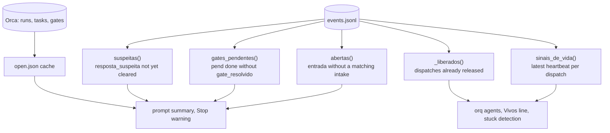
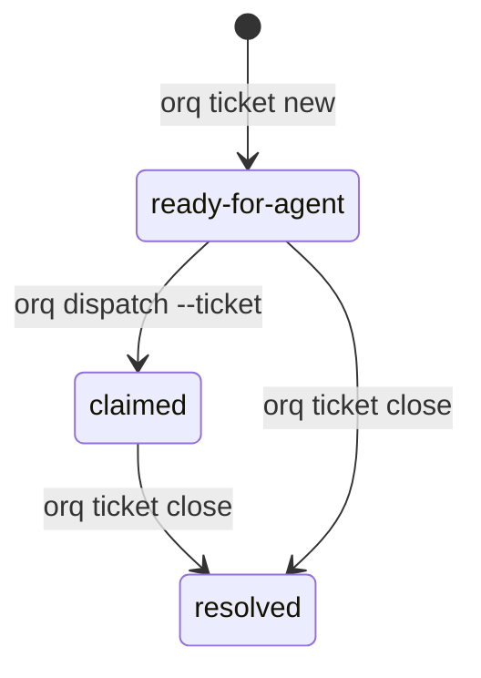
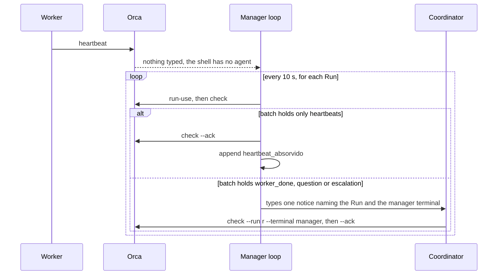
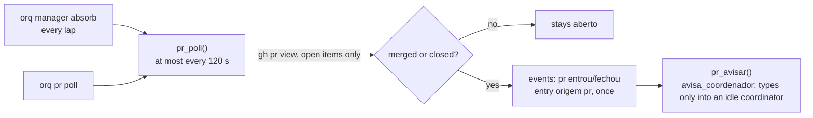

# orq design

This document explains the concepts behind orq and why it is built the way it is. The README covers installation and commands.

The interface is English: commands, flags, state files and event types. Internal identifiers, comments and docstrings are English too (ticket 133). A few recorded payload values and the dict keys the code keeps in memory still carry Portuguese names; they are quoted verbatim in `code` so you can grep for them. Where a payload field is shown with a Portuguese name, the file on disk spells it in English through `KEYS_EN` (see "On disk in English").

## Roles

Three kinds of terminal take part.

The coordinator is the Claude Code or Codex session the user talks to. It creates Runs and tasks in Orca and dispatches workers.

Workers are Claude Code or Codex sessions Orca starts for a task (`orq dispatch --agent claude|codex`). Their first prompt is always Orca's dispatch preamble.

A secondmate (`mate`, ticket 80) is a coordinator for one group of projects: a Claude Code or Codex session opened by `orq mate open` with `ORQ_MATE=<group>` in its environment, bound to its own Run. It talks to the coordinator only through `events.jsonl` (see "Secondmates by group").

The agent manager (`manager`) is a plain shell running `painel-agent-manager.sh`. It has no model and costs no tokens.

The hooks are installed globally, so they run in every session, workers included. Each one first works out its role:

1. No `ORCA_TERMINAL_HANDLE` in the environment means the session is outside Orca, and the hook exits without calling anything.
2. A prompt that is the dispatch preamble marks the session as a worker in `cursor.json` (`papeis[session_id] = "worker"`). From then on the session stays a worker, even if it later runs `run-create` by mistake.
3. A session with no worker mark and a Run bound to its terminal (`orca orchestration run-current`) is the coordinator. orq remembers that session's Run so it can report a lost binding later, for example after hibernation or resume.

Orca's `worker-list` is not used as a role signal. Without `--run` it is scoped to the Run bound to the calling terminal, and a Run a worker created by mistake never lists that worker.

## Entries and effects

An entry (`entry`) is something that demands a decision from the coordinator. There are four sources:

- a prompt typed by the user (`origem: usuario`)
- an action item from an automation report (`origem: relatorio`)
- a `worker_done` message that carries a `reportPath` (`origem: relatorio_worker`)
- a linked pull request that was merged or closed (`origem: pr`, see "Pull requests linked to a task")

Each entry gets a sequential id (`e1`, `e2`, ...). It stays open until an `intake` event with the same id records its effect:

| Effect | Meaning | Reference checked |
|---|---|---|
| `task` | created or changed an Orca task | the task exists in the Run |
| `steer` | adjusted a running task (`orq steer`) | the task exists |
| `send_back` | a delivery was handed back to its worker (`orq send-back`); `_sent_back` turns the dispatch into `devolvida` until the next `worker_done` | the task exists |
| `pend` / `decision` | became something only the user can do or decide | the pending id exists in the file or in a `pend add` event |
| `conversation` | answered on the spot, nothing to track | none; refused for report items |
| `discarded` | dropped on purpose | none; `--note` gives the reason |

The model does the classifying. The code only checks that a classification was recorded and that it points at something real, so closing an entry dishonestly would mean citing a task that exists and that the dashboard shows.

## events.jsonl

`events.jsonl` in `ORQ_HOME` is an append-only log with one JSON object per line and a `ts` field. Nothing is ever rewritten (the one exception is the phase 2 migration below). Main event types:

| `tipo` | Written by |
|---|---|
| `entry`, `intake` | prompt hook, ingest, `orq intake` |
| `pend` (`op: add/done`), `gate_resolved`, `gate_failed` | `orq pend`, ask hook, ingest |
| `answer`, `suspect_answer`, `lavish_answer` | ask hook, `orq lavish-answer` |
| `heartbeat_absorbed`, `heartbeat_seen` | prompt hook, manager loop, waiter |
| `not_started` | `orq dispatch`: the prompt did not land, even after the Enter |
| `dispatch`, `steer`, `release`, `ticket`, `manager` | the matching commands |
| `dispatch_end` | `orq release`: `dispatch`, `reason` (`entregue`, `falhou`, `parou: orçamento`, `parou: decisão pendente`, `parou: limite de uso`, `sem worker_done`, `motivo desconhecido`), `caminho`, `sujo`, `sem_push` |
| `processes` | `orq release`, `orq clean --closed`, `limpar-mergeados.py`: `op` (`encerrar` or `recusado`), `worktree`, `encerrados` (the worker's processes with `cwd` inside it that got TERM), `kill` (those that only fell to KILL), `lista` (`{pid, comando, cwd}` of what the sweep ended or, with `recusado`, would have), `nao_encerrados` and `restantes` (cwd inside but not below the worker's harness: left alone), `limite` (`ORQ_ENCERRA_MAX`, with `recusado`) |
| `pr` (`op: ligar/desligar/sem_task/entrou/fechou/avisado`) | `orq pr`, the `prlink` hook, the poll, the manager loop |
| `clean`, `clean_run` | `orq clean --apply` and the manager loop: one `clean` per removed item (`categoria`, `alvo`, `bytes`, `motivo`, plus `sha`, `branch`, `via` or `bundle` where they apply), one `clean_run` per pass with `quantos` (pairs `[category, n]`, not a dict: the read swaps dict keys between the pt and en names) and `bytes` |
| `usage_notice`, `usage_stopped` | the manager loop warns the coordinator once per level and window; `orq dispatch` refuses on budget |
| `priority` | `orq priority <task> <1-3>`: `task`, `valor` |
| `dispatch_queued` (`op: entrou/subiu/saiu/removido/desistiu`), `machine_notice` | the dispatch queue of the machine budget; the manager loop warns the coordinator once per pressure episode |
| `plan_pause`, `pause_end` | `orq pause` parked a worker (session, cwd, model, `encerrados`: the background processes it ended, `{pid, args, sinal}`); `orq resume --paused` resumed it |
| `hibernate`, `wake` | `orq hibernate` (or the manager loop) closed an idle worker's terminal (`motivo`, `rss_antes_mb`, `rss_depois_mb`, `rss_liberado_mb`); `orq wake`, `steer`, `reply` or the loop's triggers resumed it (`terminal`, `motivo`) |
| `worker_done` | ingest: `msg`, `task`, `dispatch`, `outcome`, `subject`, one per inbox message (no report needed) |
| `away_on`, `away_off` | `orq away` |
| `coordinator_stopped`, `coordinator_resumed` | the coordinator's Stop (away on) and the first non-user prompt after it: `motivo` (`trabalho_esperando`, `esperando_usuario`, `sem_trabalho`) |
| `coordinator_answer` | the coordinator's Stop hook while away mode is on: `texto`, `sessao` |
| `summary_add` | `orq summary add` or the Stop of a long reply with away on (`auto: true`): `text`, `project` |
| `queue` (`op: add/done/rm`) | `orq queue` |
| `control` | `interrupt`, `end`, `relaunch` and `switch`: `acao`, `resultado` (`iniciado`, `ok`, `parcial`, `revertido`, `falhou`), `dispatch`, `novo_dispatch`, `motivo`, `nota`, `head`, `sujo`, `worktree_intacta` |
| `handoff` | `orq switch`: `de` (old dispatch), `agente_de`, `para` (new dispatch), `agente_para`, `head`, `sujo`, `pacote` (sha of `HANDOFF.md`, 12 hex), `escrito_por` (`orq`), `aceita` (the new worker's first turn was seen), `task`, `run` |
| `gate_notice`, `binding_lost`, `alert`, `alert_seen` | Stop hook, prompt hook, ingest |
| `mate` (`op: abrir`), `mate_request`, `mate_delivered`, `mate_resent`, `mate_escalated`, `mate_dispatch` | `orq mate open`, `orq mate request`, `orq dispatch` of a group's request (`mate_dispatch`), the manager loop (`mate_lap`) |
| `mate_slept`, `mate_woke` | `orq mate sleep` and the manager loop (`mates_sleep`); the resume done by `orq mate open` or `orq mate request` |

`orq retro` reads all of these (see "Retro"); a new failure event should get a signal there.

Current state is always computed from the whole log by pure functions:



`open.json` is a cache of what is open across all Runs (backlog, running, blocked, gates, agents). Reading every Run takes seconds, so the prompt hook reads the cache left by the previous prompt and starts a background `orq ingest --refresh`. The cache is at most one prompt old and can be deleted at any time.

`cursor.json` holds bookkeeping that does not belong in the log: the next entry number, ingest positions, session roles and the last Run per session. The next id is `max(cursor counter, highest eN in the log) + 1`, so losing `cursor.json` never reuses an id. An unreadable `cursor.json` is moved aside as `cursor.json.corrompido-<time>` and rebuilt, and the summary reports the recovery for 24 hours.

Concurrency. Hooks, the manager loop, the waiter and manual commands can run at the same moment, so every shared file is protected:

- `flock` on one lock file per resource: `cursor.lock` (log appends and cursor), `pending.lock` (pending list), `ticket.lock` (ticket numbering), `manager.lock` (the manager's Run binding), plus non-blocking `ingest.lock` and `refresh.lock` so only one ingest or refresh runs. When two are needed, the order is fixed: `pending.lock`, then `cursor.lock`.
- JSON files and tickets are written to a temporary file in the same directory and renamed into place, so a reader (such as a dashboard using `fs.watch`) never sees a half-written file.
- Two-step writes, such as updating the pending file and appending its event, block `SIGALRM` until both are done, so the hook's time limit cannot leave one without the other.

### On disk in English (phase 2 of the English migration)

The code keeps reading and building dicts with Portuguese keys; only the disk changed. The maps live in one place, at the top of the state section of `orqlib.py`:

- `KEYS_EN` (JSON keys), `TYPES_EN` (event types) and `VALUES_EN` (the recorded values that change, per key: `tipo`, `pend_tipo`, `tipo_mate`, `fila_tipo`, `efeito`, and the agent and PR states under `estado`). Free text, ids, `op`, `origem` and the states that come from `gh` or Orca pass unchanged. The agent state `liberado` is written `freed`, because the `release` event already stores Orca's `released` under the same key.
- `to_en(obj)` on every write: `_write_json` for a file under `ORQ_HOME` and `_write_event` for each event line. `to_pt(obj)` on every read: `_read_json`, `_read_cursor`, `read_events`, `_retro_events`, the `projects/` reader, `precompact.py` and the TUI (which loads the maps from `orqlib` once). `to_pt` accepts English, Portuguese or a mix, so a late Portuguese line reads like any other.
- `_path(name)` takes the English name and falls back to the Portuguese one in `OLD_FILE` while only that one exists; a write then goes to the old name with English content, and the migration renames it. Locks change name with no fallback (`merge-queue.lock`, `turns.lock`, `manager.lock`, `dispatch.lock`, `pending.lock`…).
- `digest/` (contract digest-v1, Portuguese keys) and `*.example.json` are not translated; the dashboard's `pendencias.json` is outside `ORQ_HOME`.
- `worker_file(dir, name)` reads `HANDOFF.md`, `PAUSE.md` and `final-report.md` from a worktree, or the Portuguese name an old spec still makes the worker write.

A new key written in English must not be a target in `KEYS_EN` (the read would turn it into the Portuguese key). `test_map_en_is_injective_and_round_trips` checks the map is one-to-one and that free text and Orca values survive the round trip.

`scripts/migrar-ingles.py [--dry-run]` converts a live `ORQ_HOME`:

1. Refuses (exit 2) with a dispatched worker in `worker-list` other than the calling terminal, with `orq manager serve` holding its lock or `manager-alive` touched within `PANEL_LIMIT_MIN_S`, or with any `*.lock` held. It also refuses when Orca does not answer.
2. Takes every lock, old and new names, and holds them to the end, so a hook's append waits for the swap.
3. Copies what it will change to `ORQ_HOME/backup-pt-<date>/`.
4. Rewrites `events.jsonl` line by line with `to_en` into a temporary file (an unreadable line goes as is and is counted), checks the line count and swaps with `os.replace`.
5. Translates each top-level `.json` and those in `groups/`, `projects/`, `retro/`, `handoff/`; renames the files in `OLD_FILE` (and `perguntar/` to `ask/`); deletes the old lock files.
6. Prints lines, files and the Portuguese-looking keys left without a translation.

With nothing left in Portuguese it writes nothing, not even a backup, so a second run is harmless.

## Intake and the Stop hook

`orq hook prompt` (UserPromptSubmit) classifies the prompt with a regex on its start:

| Origin | Rule | Becomes an entry |
|---|---|---|
| `notificacao` | starts with `<task-notification` | no |
| `orca` | starts with `You have N orchestration` | no; may be absorbed as a heartbeat |
| `comando` | `<command-`, `<local-command`, `/compact` | no |
| `resumo` | `This session is being continued` | no |
| `dispatch` | Orca's dispatch preamble | no; marks the session as a worker |
| `usuario` | anything else | yes |

Orca types its notice into the terminal even while the user is typing, so a user prompt that ends with the notice is split: the text before it becomes the entry (flagged `com_aviso`), and the notice is handled as an Orca notice.

For a user prompt the hook appends the entry and injects at most five lines of context: the new entry id and the entries still without effect, one line for alerts (stuck workers, suspicious or free-text answers, pending gates, untriaged reports), the open work in Orca with the live workers, the size of the user's pending list, and the `orq intake` syntax.

`orq hook stop` computes the open entries. If there are any, it appends a `gate_notice` event and shows the user a `systemMessage` naming up to three of them. Since ticket 150 it blocks the end of the turn, whatever `stop_bloqueia` says, when a user entry from the same session (or open for more than 30 min) has no intake, naming the ids and `orq intake <e> task|steer|pend|decision|conversation|discarded`. `stop_bloqueia` (default false, a pending user decision) widens the block to any open entry. The budget is 2 blocks per set of open entries per session, counted in `cursor.json` (`stop_hook_active` is ignored, because another hook can set it); the third Stop of the same set passes and records `gate_blocked`. The prompt hook closes entries that are only `/away` or `/away status` with a `conversation` intake, and the "No effect" line of the hook lists only entries from the last 24 h; older ones show in `orq status`.

## Obligations are hooks (ticket 153)

An obligation that depends on someone remembering a command gets forgotten, so it is fired by an event that already exists, and a manual command stays only for decisions, lookups, setup and escapes. The inventory (ticket 153, the ticket 153 report in the plan notes) covers the 82 leaf commands of `orq --help` (56 top-level): 25 are already fired by an event, 7 become automatic, 2 become a reminder that blocks until done, 48 stay manual.

| Group | Commands | Event | Kind | Ticket |
|---|---|---|---|---|
| intake | `intake` | Stop of the coordinator; the command that implies the effect (`dispatch`, `ticket new`, `pend add`, `steer`, `ask`, `mate request`) | block + automatic | 150, 157 |
| delivery into the integrator queue | `integrate queue add`, closing worker terminals on `release` | ingest of a `worker_done` of an orq ticket | automatic | 141 |
| integrator cycle closes what it merged | `cycle done`, `service mark`, `integrate queue rm`, `ticket close`, `release` (orq tickets) | `scripts/integrar.py` fast-forwards `main` | automatic | 154 |
| obligations orq can prove | `fulfill` for `limpeza`, `proximo`, `deploy` | `pr`/`limpou`; a PR of the task into the next environment; the project's `deploy_check` on a manager lap | automatic | 155 |
| obligations left open | `fulfill`, `defer` | Stop of the coordinator, with the ticket 27 budget | block | 156 |
| worker that lost its terminal | `resume` | refresh of `open.json`, read by the prompt, SessionStart and Stop hooks | block (reminder) | 158 |
| push audit | (manual push) | `githooks/pre-push`, integrator cycle before the fast-forward | block | 139 |
| delivery conformance, phase completeness, scratch status | `send-back` of an incomplete delivery, the phase check before a PR, the scratch `**Status:**` | ingest of a `worker_done` of a dispatch with items; `pr open`; `ticket close` | automatic | 201 |
| away summary, Orca mailbox, dispatch headers, PR per environment | `summary add`, `inbox`, `dispatch-queue rm`, `pr link` | Stop with away; the command itself | automatic | 144, 140, 142, 143 |
| already automatic | `hook`, `ingest`, `pr poll`, `pr auto`, `steers`, `digest`, `hibernate`, `wake`, `mate sleep`, `usage`, `manager absorb/check/interval`, `busy`, `flow`, `project trust` … | hooks, manager lap, limpar-mergeados, worktree setup | done | — |
| manual by design | decisions (`dispatch`, `steer`, `reply`, `end`, `relaunch`, `switch`, `pause`, `ask`, `pend add`, `defer`, `away`, `night`), lookups, setup | — | manual | — |

Implicit intake (ticket 157). The Stop block of ticket 150 is the backstop; this is the automatic side. When the coordinator runs a command that already says what the entry became, `orq` records the intake itself: `dispatch` and `ticket new` give `task <task>`, `pend add` gives `pend <id>` (`decision <id>` for `--type decision`), `ask` gives `decision <id>`, `steer` gives `steer <task>` and `mate request` gives `mate <pN>`. The hook now stores the terminal handle in the `entry` event, and `implicit_intake` looks for user entries that are open and carry the handle of the terminal the command runs in. A worker terminal never typed an entry, so a worker never records anything. Exactly one open entry: it calls `intake` and prints `intake eN → <effect> <ref> (implicit)` on stderr (stdout keeps only the command's JSON). Two or more: it records nothing and prints the ids and the `orq intake <e> <effect> <ref>` to run. An explicit `--entry` skips the implicit path, and `mate request --answers` too (that entry is one the mate raised). An entry recorded before this change has no handle and is never matched. A later `orq intake` on the same entry corrects the implicit one: the log is append-only and every reader indexes intakes by entry, so the last one wins (a test pins it). The `intake` row of the table above moves from "still manual" to "automatic".

`handoff` stays manual because nothing reliably detects a plan-limit screen; `doctor tasks` stays an escape because `ticket close` completes the task; `start` is a decision (which front), and SessionStart already injects the state.

**`orq doctor old`.** `release` only counts a dispatch as closed when it closed the terminal (`fechado`), so a dispatch whose terminal was already gone (`released`, `already_released`) or whose release answered `release_unknown` stayed "alive" and held its worktree forever (ticket 178, 12 folders). `doctor_old` cross-checks the `dispatch` events, `terminal list` and the ticket status; it never touches a live terminal, an open ticket or a `dispatched` worker, and does nothing when the terminal list fails (no proof of death). Repeating `worker-release` on a dead terminal does not help, so a dispatch already tried gets only the `release` event with reason `antigo`.

## Report ingestion

`orq ingest` runs in the background after each prompt and after each Orca notice. It reads two sources.

Completed automation runs (`orca automations runs`). orq finds the report file the run's output cites under `.scratch/` in the run's repository and turns each numbered item under an action heading (`Action items`, or two older titles) into its own entry. A report without that section becomes a single "read <file>" entry, so a report can never vanish. Orca marks a terminal automation complete before the agent writes the file, so a run without a readable report waits up to an hour.

`worker_done` messages from the inbox. One with a `reportPath` becomes an entry. A task whose title starts with `[scout]` is expected to produce a report; if its `worker_done` has none, orq raises an alert in the summary until `orq alert visto <task>`.

Every message and run is isolated: a bad one is logged and skipped, and a transient Orca failure is retried up to three times. Anything already in the log (matched by its `ref`) is never ingested twice, even if `cursor.json` is lost.

## Tickets

A ticket is a markdown file in `ORQ_ISSUES`, `NN-<slug>.md`, numbered from 01 without reusing numbers:

```
# 02: Add login endpoint

Status: ready-for-agent
Blocked by: 01
Run: run_demo
Task: task_abc123

## What to build
...
## Acceptance criteria
...
## Answer          (added when the ticket closes)
```

The file is the only copy of the content. `orq ticket new` creates the Orca task with the ticket title and a one-line spec, "read and execute the ticket at <path>", with `--deps` pointing at the tasks of any open blockers in the same Run. If `task-create` fails, the file is removed, so no ticket exists without a task.



`orq ticket close` writes the `## Answer` section and sets `Status: resolved` first (with the tickets in the backlog the order and the writer change: see "Stage 2: tickets in the backlog"), then completes the Orca task, then frees the dependents (ticket 105): the closed number leaves the `Blocked by:` line of every dependent (as does any blocker that is already resolved). A dependent left with no blocker and still `ready-for-agent` is *freed*. The command lists them by priority (`priority_of`), records them in the `fechar` event, and `orq status` shows `freed: 91, 88 (P1, P2)` for as long as the ticket stays `ready-for-agent` with no blocker. A liberado of priority 1 or 2 whose header carries both `Model:` and `Effort:` enters the dispatch queue (`_enqueue_dispatch`, so the manager starts it by slot and priority); without them the command warns; priority 3 never starts by itself. The dependent's Orca task, if `blocked`, goes to `ready` (a `pending` one is left to Orca, which releases it when its deps complete). Orca failures here are warnings: the files are already right. `orq doctor tasks` is the sweep for what was left behind: a `blocked`/`pending` task whose ticket is resolved becomes `completed` with `{ticket, supersededBy}`, and one with no ticket is only listed. If Orca fails when completing the task, the ticket stays resolved and the command prints the manual fix. Two optional header lines (ticket 142) hold a freed ticket out of the automatic queue, in `_release_dependents` and in `next_without_user` alike (one pure helper, `dispatch_wait`): `Dispatch: manual[, reason]` never enters; `Waiting: integrator empty` enters only with `integrate-queue.json` empty and no `cycle` event with `_no_push() > 0`. `orq ticket list` appends the reason to the ticket line and `orq status` adds `outside the dispatch queue: NN (reason)`. The ticket stays ready-for-agent: the coordinator dispatches it with `orq dispatch --ticket`. With `ORQ_BACKLOG_TICKETS` the `Dispatch:` and `Waiting:` headers (ticket 142) live in the ticket's body as `despacho:` and `espera:` lines, which `scripts/converte-backlog.py` writes and `ticket_of_item` reads back.

Binding the Run. `ticket new`, `ticket close`, `steer`, `release` and `doctor tasks` run inside `_no_run(run)`: when the coordinator does not command the Run, orq runs `run-use` for it under the coordinator's own handle and, on exit, binds back the Run that was bound before (Orca binds one Run per terminal). With the manager linked to this coordinator it does not switch: the coordinator's terminal owns the loose Runs and a `run-use` to a manager Run would take it out, so the old refusal (`orq manager bind --terminal … --run …`) stands.

## Pending list

The user's own to-do items live in `pendencias.json`, which a dashboard can watch. orq is the only writer: `orq pend add`, `orq pend edit` and `orq pend done` change the file under a lock and log each change as a `pend` event. With `ORQ_BACKLOG` set the items live in a tasks-axi backlog instead and `pendencias.json` is only a mirror (see "Backlog in the tasks-axi format").

An item has an `id`, a type (`action`, `decision`, or `notify` for someone to notify), a title and optional fields (`detail`, `stream`, `link`, `command`, `waiting`). `waiting` marks an item waiting on a third party, and such an item is never asked as a question.

A decision is asked in the same turn it is created, with the AskUserQuestion `header` equal to its id (hence the 12-character limit). The PostToolUse hook `orq hook ask` records the answer and closes the decision only when exactly one option was picked. Free text, "Other", or an option with a note attached is recorded with `livre: true` and leaves the decision open, because orq cannot tell whether the user has decided. The summary keeps asking the coordinator to close it with the decided wording. A multi-select question with the header `ja-fez` ("already done?") closes every item whose option description starts with `[<id>]`.

A decision created with `--task` also creates an Orca gate that holds that task. Closing the decision resolves the gate with the answer. Orca only resolves a gate from a terminal bound to the gate's Run, so orq records the Run, waits until it is bound, and retries from the next ingest.

## Backlog in the tasks-axi format (ticket 101)

Stage 1 of moving the work register to [tasks-axi](https://github.com/kunchenguid/tasks-axi) is the pending list and a read-only view of the tickets; stage 2 (ticket 102, "Stage 2: tickets in the backlog" at the end of this section) moves the ticket commands onto it. Everything here is off until `ORQ_BACKLOG` (or `ORQ_HOME/backlog.path`, ticket 167: the file reaches every process, the variable only new sessions) names a `backlog.md`; with it unset orq behaves exactly as before, so the cutover is the user's decision, not a side effect of merging.

**Read in Python, write through the CLI.** A tasks-axi process takes 74 to 120 ms and the hooks have a 100 ms ceiling, so no hook calls it. `backlog.py` parses the grammar of `tasks-axi/dist/src/backends/markdown-grammar.js` (section header = state, tags at the end of the line, body = the indented lines after it); 134 tickets and 18 pending items read in about 7 ms, and the prompt hook costs about 4 ms more than with the JSON. Every write is one or more `tasks-axi` calls with `TASKS_AXI_FILE` in the environment, the working directory in the backlog's folder (where `.tasks.toml` lives), never `--file`, and never on a symlink (the CLI's `rename` would replace it with a plain file). Before the first write of each process `backlog.confere_versao` requires `tasks-axi --version` to be exactly `0.2.6` and refuses with the install command otherwise: the grammar is 0.x. A contract test (`test_ticket101_contrato_*`) runs the real CLI through a series of mutations and compares each `--json` answer with what the Python reader sees; without the CLI installed it fails on purpose.

**A pending item is a backlog item.** `repo: pend`, `kind` = `acao|decisao|avisar`, the title as the title, `since` as `desde`. `frente`, `link`, `comando`, `espera`, `gate`, `gate_run` and `task` are `key: value` lines at the top of the body, then one blank line, then `detalhe`; the reader takes the leading lines whose key is known (`META_PENDING`), so a detail that itself starts with `link: …` is protected by the blank line the writer puts in front of it. Every pending item carries a hold (`captain` for the user's own, `external` with the reason `esperando <who>` when `espera` is set), and `ate` is the hold's `--until`; the hold keeps the item out of `tasks-axi ready`, and `pending_after` still decides what "Depois" means. Closing is `done --no-prune`, with the answer appended to the body as a note: the history stays in the file and in the event log. `--no-prune` plus `done_keep = 100000` in the `.tasks.toml` next to the backlog keep the archive from taking tickets orq still reads (numbering, `Blocked by`).

**One mutation path.** `_mutate_pending(fn, evento)` is unchanged for its callers: it loads the live items, runs `fn(items)` and, with `ORQ_BACKLOG`, applies the difference through the CLI (gone = `done`, new = `add` + `hold`, changed = `update` + `hold`; the new hold replaces the old one), then rewrites `pendencias.json` from the backlog for the dashboard and logs the event. `pend add`, `pend edit` (new), `pend done`, `hook ask`, `lavish-answer` and `orq ask` all go through it, so the AskUserQuestion header still closes a decision and the gate still resolves from `pend done` (the gate id and Run are in the body). Three things the CLI does not do for us, so orq does them: it checks the id against the whole backlog first (a repeated `add` exits 0 and does nothing); an id that was a closed pending item starts over (`rm` + `add`, the `since` restarts today); and an edit that empties the body does the same, because `update --body` refuses an empty value. A title that ends in something the grammar reads as a tag (`(repo: …)`, `blocked-by: x`) is refused before anything is written.

**What stops being atomic.** The JSON write and the event used to share one lock and an alarm shield; now the CLI call sits in the middle. A failure after the `add` and before the `hold` undoes the `add`; the other multi-call paths are best effort and print the CLI's message. A `pend done` of a decision whose gate was not resolved is still reconciled by the ingest (`reconcile_gates`).

**Tickets.** `tickets()` reads the backlog (`backlog.ticket_de_item`: id `tNN`, `kind: ticket`; `spec:` is the ticket file, `orca: <task> <run>` the link to Orca, `modelo:`, `effort:`, `issue:`, `despacho:` and `espera:` the optional header fields) when `ORQ_BACKLOG_TICKETS` is also set (or `ORQ_HOME/backlog.tickets` exists; an empty variable wins and turns it off). It is a second switch on purpose: the cutover of the pending list and the cutover of the tickets are two decisions. `blocked_by` lists only the blockers still open on an open ticket (the old reader kept the number of a resolved one until `ticket close` rewrote the header) and every blocker on a Done one, and the dict carries `fechado_em` so the digest shows the real closing date instead of the file's mtime.

**Migration.** `scripts/converte-backlog.py` reads `ORQ_ISSUES`, `ORQ_PENDENCIAS` and `events.jsonl` (dates of `ticket new|close`, the file's mtime when the log has none) and writes a new backlog (`--out`, refuses one that exists unless `--force`) plus the `.tasks.toml`. `Blocked by` is read only from the numbers that open the field, so `none (… 30/09)` blocks nothing (the old `findall(\d+)` read 30 and 09). The repo is the title prefix before `:` (`orq: …`), and a title with no prefix has none. It then runs `tasks-axi render` (the file must come back the same, blank lines aside) and compares Done, blocking edges and ready counts with the sources and with `tasks-axi ready`; any difference exits 1. Rehearsal on a copy of the real data: 134 tickets (95 Done), 18 pending items, 27 edges, 9 ready, all equal.

**Digest and dashboard.** `orq digest` builds `pendencias` and `tickets_orq` from the same readers (`_pending_ro()`, `tickets()`), so the `digest-v1` contract does not change shape. The dashboard on 8765 reads `digest/atual.json` and falls back to `pendencias.json`, which is regenerated after every pending mutation.

### Stage 2: tickets in the backlog (ticket 102, M5 to M7)

Design of record: `tasks-axi-licoes.md` in the plan notes, section 5 and the M5 to M7 rows. With both switches on, the ticket's state has one home, the backlog item; the file `issues/NN-slug.md` is only the text, and the Orca task keeps the runtime (Run, dispatch, mailbox, gates). The only two points that move the work state are `dispatch` (after `worker-start` succeeded: `tasks-axi start`) and `ticket close` (`tasks-axi done`, then `task-update --status completed`), as the design asked; the same two-step warning stands when the second step fails.

**`ticket new`.** Order: validate the title (`backlog.problema_titulo`: a tail the grammar would read as a tag, or a leading `-`, is refused before anything exists), pick the number under `ticket.lock` (`_largest_ticket`: the highest of the file names and of every `tNN` in the machine's, the process's and the groups' backlogs, so a ticket that left for a group keeps its number), write a header-less file, `task-create`, then one `tasks-axi add tNN ... --blocked-by tMM ... --body "spec:/orca:/..."`. A failed `add` removes the file and completes the task with `{"desfeito": ...}` (there is no task delete); the number is free again because nothing remains. `--blocked-by` needs the blocker in the same backlog (a CLI rule). `repo` is `backlog.repo_do_titulo` (the converter uses it too). `Model`, `Effort`, `Dispatch` and `Waiting` used to be lines the coordinator typed into the file header; with no header they are options of `ticket new` and of `ticket edit`, which rewrites the meta lines of the body through `update --body`. Without the backlog the same options write the header lines, so the commands mean the same in both modes.

**`ticket close`.** `done tNN --no-prune` first: a refusal leaves the file, the task and the item untouched. Then `## Answer` goes to the file (a failure is a warning that carries the first 80 characters of the answer), the Orca task is completed, and `_release_dependents(n, antes)` finds the dependents from the snapshot taken before the `done` (afterwards the reader no longer lists the closed blocker) and applies the same rules as before for liberados and the dispatch queue. There is no `Blocked by` line to rewrite: the CLI's rule that a Done blocker does not block is the whole mechanism.

**`dispatch --ticket`.** `_gate_backlog` is firstmate's gate: the item exists, has no active hold (the same rule as `ready`: until the day itself) and no open blocker, otherwise the command refuses before the queue, the worker or the task is touched. A ticket that is already In flight is accepted as before (a relaunch).

**`orq doctor backlog`.** `doctor_backlog` reads every known backlog and one `task-list` per Run named by a ticket, and reports Done with an open task, In flight with a task that is not `dispatched`, Queued whose task ended or is `dispatched`, a task the Run does not list, a missing spec, and an `issues/` file with no item in any backlog. It never writes and exits 1 when it finds something. The repair is printed as the command to run, with `TASKS_AXI_FILE` for the CLI ones. Tickets without an `orca:` line (01 to 06) are not checked against Orca.

**Backlog by group (M7).** `groups/<name>.json` may carry `backlog` (default `grupos/<name>/backlog.md` next to the machine's backlog; `backlog_group`). `orq backlog move NN... --group G` calls `tasks-axi mv`, which moves a connected set or nothing and refuses a stranded edge. orq adds three rules: only Queued items go; the edge to a blocker that is already Done is cleared first (the CLI treats it as a stranded dependency, and almost every ticket has one) and restored if the `mv` fails; and the destination folder gets the `.tasks.toml` (`done_keep = 100000`) before the move. The `spec:` path is relative to the folder of `ISSUES`, so it still resolves from the group's backlog, and the `orca:` line travels in the body. `_mate_command` starts a mate with `ORQ_BACKLOG=<its backlog>` when that file exists. Known limit: that mate's pending list is the one in its own backlog and `_mutate_pending` rewrites `pendencias.json` from it, so a mate must not run `orq pend` (it raises decisions with `orq mate raise`, and the guard already refuses AskUserQuestion for it).

**Divergences from the design of record.** (1) The design said the headers of the `.md` files are removed at the cutover. They are not: the user asked that nothing in `issues/` be lost, so old files keep their frozen `Status`/`Blocked by`/`Run`/`Task` lines (nobody reads them with the switch on) and only the tickets created after the cutover are header-less. (2) The design had `done --pr <url>` at close. `ticket close` has no PR to hand over (`prs.json` belongs to the task), so the item closes without it; `orq pr` stays as it was. (3) The design put `mv` after the pilot as a plain call; the Done-blocker rule above is what the real CLI forced. (4) `backlog.tickets` is a file switch like `backlog.path` (ticket 167): without it a worker or a session that was already open would keep writing ticket files while the coordinator wrote the backlog. (5) `converte-backlog.py --complete` fills the gap the cutover left: tickets created between the migration and the switch, appended through the CLI (so their `since` is the day of the run, not the day of creation).

**Sync with GitHub issues (evaluated, not built).** The coordinator asked whether generic, sanitized tickets could sync with GitHub issues through tasks-axi's remote backend. In 0.2.6 there is none: the CLI ships the markdown backend only, and its README lists `sqlite` and `github / jira / linear` as planned. When one ships, the safe shape is an allow-list, not a mirror of the file: only items marked as generic (a tag chosen for that, never inferred from the repo prefix) with a title and body that pass the audience check (`ORQ_TERMOS`), one-way for the text and two-way only for the closed state; items with product names, the `orca:` line and the user's pending items never leave the machine. Until then the tickets stay local, as decided on 01/10.

## Agent manager

Orca types "You have N orchestration messages" into the terminal bound to a Run, and only if that terminal runs a recognized agent. A plain shell gets nothing typed. Orca also identifies the caller by `ORCA_TERMINAL_HANDLE`, so another process can act for the bound terminal by setting that variable.

orq uses both facts. `orq manager bind --terminal <manager>` runs `run-use` with the manager's handle and writes `manager.json` (`{coordinator, manager, runs}`). After that, every Orca call orq makes from the coordinator goes out with the manager's handle, and Orca's notices go to a terminal that ignores them.

Orca binds one Run per terminal, and binding another Run fences the first. To serve several Runs, the manager rotates: before any command that has to come from the bound terminal (`worker-start`, `send`, `check`, `task-create`, `task-update`, `worker-release`), orq rebinds the manager to that command's Run, holding `manager.lock` across the bind, the read and the acknowledgement. The lock matters because a delivery read under one binding cannot be acknowledged after the terminal has left the Run and come back. `orq dispatch` into a new Run adopts that Run into the manager first, so the coordinator is never left bound to it.

A Run the manager does not hold goes out under the coordinator's own handle instead, so a Run the coordinator created with a raw `run-create` stays reachable. Which Run a command targets never comes from the manager's `run-current`: that is wherever the panel stopped and changes every lap. Without `--run`, orq uses the Run bound to the coordinator's own terminal, or the manager's only Run, and refuses when the manager holds several. Decision gates are created in the task's Run and resolved under the same lock as the check that the coordinator commands that Run. The panel writes `manager-alive` from its own shell on every lap; when it is older than 60 s, `orq status`, `orq summary` and the prompt hook say the panel stopped, because Orca notices reach the coordinator only through it.



Repeated notices. `manager-notice.json` stores, per Run, the ids of messages already announced and the time of the last notice. A notice goes out only for ids not seen before, and ids are marked seen only after the text was actually submitted. Before typing, orq checks that the coordinator is idle (`orca terminal wait --for tui-idle`) and that the user has no half-typed draft (`orca terminal read`). Orca itself refuses to type into a busy agent (`agent_prompt_blocked`), which catches the cases `tui-idle` misses. If the coordinator is busy, the loop tries again next round.

Slow rounds are not a dead panel (ticket 105). With a high load one round took more than 60 s and the coordinator was told the panel was stopped while the process was alive. `manager absorb` now touches the `manager-alive` stamp at the start of the round, after each Run and at the end, and appends the round's duration to `manager.json` (`voltas_s`, the last `REMEMBERED_ROUNDS` = 10). `panel_limit_s` is the larger of 90 s (`PANEL_LIMIT_MIN_S`) and 3× (`PANEL_ROUNDS_X`) the average round. A stamp older than 60 s but inside the limit reads "panel slow (N s per round)"; past the limit it reads "panel stopped for N min", as before. The shell loop still touches the stamp before calling orq, so a broken `orq.py` is still caught.

The interval follows the load (ticket 120). Measured on 01/10 with 10 Runs bound: one round is 60 to 76 subprocesses, almost all `orca` calls (about 0.1 s each; `worker-list`, `task-list` and `run-show` dominate, and the last two run once per Run in `_run_stopped`), 4 to 5 s idle and 7 to 16 s in the real panel. `gh` does not show up, because `pr poll` keeps its 120 s floor. Since the cost is the `orca` calls, not `gh`, sleeping longer does cut the calls per minute, in proportion. `panel_interval_s` returns the last round's duration clamped to `PANEL_INTERVAL_S` = 10 and `PANEL_INTERVAL_MAX_S` = 30, so a slow round keeps the panel busy at most half of the time, and a fast one brings it back to 10 s. The shell asks `orq manager interval` and sleeps 10 s if that fails. The per-Run `_run_stopped` calls are the next thing to cut, and stay out of this ticket.

While a notice waits to be read, the loop stays on that Run for up to 120 s (`ORQ_GERENTE_PRESO_S`), because the coordinator's raw `check` only works while the manager is bound to it.

End of life of Runs. Orca has no command to close a Run and Runs have no status, so orq decides. Each `absorver` round, a Run with no task in `ready`/`pending`/`dispatched`/`blocked`, no unread message, and no task activity for `RUN_STOPPED_MIN` minutes (30, `ORQ_RUN_PARADO_MIN`) leaves `manager.json` (`manager` event, `op: soltar`, with the reason). The last Run always stays, and `orq dispatch` into a released Run adopts it again. A Run seen alive (open task or recent activity) is not checked again for `RUN_STOPPED_CACHE_S` seconds (300, `ORQ_RUN_PARADO_CACHE_S`, cache in `run-parado.json`), so a round with unchanged Runs makes no `run-show`/`task-list` calls (ticket 134: 20 calls per round for 10 Runs before, 0 after the first round); a Run that really stopped is released at most that much later. Activity is the newest task creation or completion, not the Run's `updated_at`, which the manager itself moves with every `run-use`. The summary and `open.json` list only Runs with open work or activity in the last 24 h (`RUN_RECENT_H`), and never a Run whose objective says "test" or "disposable"; `orq runs` prints Run, objective, open/completed tasks, manager membership and last activity, and `orq runs --all` includes the archive.

## Heartbeat handling

There are three paths, all built on the same rule: only a batch made entirely of heartbeats is ever acknowledged. Any other type, including an unknown or missing one, lets the notice through untouched.

Notice for the coordinator's own Run (or a Run of its manager). The prompt hook peeks at the mailbox (`check --peek`). If everything unacknowledged is a heartbeat, it consumes and acknowledges up to four consecutive batches, records `heartbeat_absorbed` with each heartbeat's dispatch, task and phase, and blocks the prompt with `decision: block`, so the model never sees it. A batch that is not all heartbeats stays open for the coordinator.

Late notices. A busy coordinator receives queued notices one after another. The first absorbs the whole mailbox and the rest find it empty. An empty mailbox within 120 s of an absorbed batch is blocked too; outside that window the notice passes.

Notice for another Run. `check` on a Run the terminal is not bound to fails, so orq reads the global inbox instead. If every unread message addressed to that Run is a heartbeat, the prompt is blocked and `heartbeat_seen` is recorded, but nothing is consumed; the messages come out in a batch when the coordinator binds that Run.

The waiter script (`orca-wait-runs.py`) acknowledges heartbeats with the same function. Acknowledging the same delivery twice is harmless in Orca, so the hook, the waiter and the manager loop can race without losing messages. The recorded heartbeats feed `orq agents`: a running dispatch whose last heartbeat is older than 15 minutes is shown as stuck, with the `orq steer` command to send.

## Reading the mailbox (ticket 140)

Orca binds one Run per terminal and cancels a delivery (`consumer_fenced`) when the consumer that read it loses the binding before the ack. Doing this by hand meant `run-use --id <run> --from <coordinator>`, `check --json`, then `check --ack <deliveryId>`, and binding back to the main Run afterwards. `orq inbox [<run>] [--ack] [--all]` does it as one step: every call carries the coordinator's handle (the manager config's `coordenador`, else the environment), so the bind, the read and the ack share one generation. Heartbeats are counted, never printed. With `--ack`, every `worker_done` in the batch goes through the ingest first (`ingest_mailbox`: the `worker_done` event, the report entry, `integrate queue add` and the integrator notice), because the ack takes the message out of the inbox before the manager reads it (ticket 171). It shares the ingest lock and is deduplicated by message id (`worker_done`, entry, alert, `delivery`, `orq_delivery` events), so the manager ingesting the same message afterwards adds nothing. A Run the manager holds goes through the manager's own bind under its lock. With `--all` the Runs come from the global inbox (unread messages addressed to `run:<id>`). The Run the coordinator was on is bound back at the end. The prompt hook adds `orq inbox <run> --ack` to its context when an Orca notice names a Run.

Ticket 182: the prompt hook does this reading itself. On the Orca notice (`You have N orchestration messages. Run ...check --run <run>`) `inbox_in_prompt` runs `inbox(run, ack=True, detail=True)`, for the bound Run and for any other Run alike (the link goes back afterwards), and puts the result in the coordinator's context instead of the old "run `orq inbox <run> --ack`" hint. Each message that is not a heartbeat comes whole (`_box_block`): id, type, sender, subject, the body cut at 1500 characters (`INBOX_BODY_HOOK`), the summarised payload and, from the events of that message id, what orq already did (`_done_by_orq`: report entry, ticket joined the integrator queue with its branch, the notice to the integrator and its result, delivery warnings, alerts). A `question` also carries `orq reply <msg_id> "<text>"`. Heartbeats are only counted in the header. The ingest of ticket 171 runs before each ack, as in the command. If the read fails (Orca down, `consumer_fenced`) or there is nothing to show (empty inbox, only heartbeats), the context keeps the old hint and the notice goes through. The all-heartbeat block of the hook still runs first and still absorbs a notice made only of heartbeats. A notice glued to a user prompt is not read here: that path records the entry and keeps the hint out.

## Releasing workers

`orq release <dispatch>` acknowledges pending messages that belong only to that dispatch (a batch mixing another worker's messages is left alone), calls `worker-release`, and, if Orca reports the terminal as `retained`, decides whether to close it. Then `_close_setup` closes the setup terminals of the dispatch's worktree: it lists `orca terminal list --worktree path:<worktree>` and closes the shells (no `agentIdentity`) whose `worktreePath` is exactly that path, except the worker's terminal, this coordinator, the Run's coordinator and any terminal of another dispatch still running. A `dispatch` event with `worktree` `current` (or none) means the worktree is not the dispatch's, so nothing is listed. The `release` event carries `setup_fechados`. Known ceiling: a shell the user opened by hand in that worktree is closed too, because `terminal list` does not say who created a terminal.

Ticket 141: the orq ticket's delivery joins the integrator queue by itself. `_ingest_msg` calls `_orq_delivery` for each new `worker_done`: `outcome` `succeeded`, the task is the `Task:` of a ticket in ISSUES (a product ticket is not there, so it never enters), and the branch comes, in this order, from the payload (`branch`), from the worktree `orq-wt/<ticket>` or `orq-wt/t<ticket>` (`_orq_wt_branch`, root `ORQ_WT_ROOT`; ticket 172: the dispatch runs with `--worktree current`, whose branch was the product's `main`), from `git branch --show-current` in the dispatch's worktree, and last from the first Conventional Commits name in the subject/body, only if `git rev-parse --verify refs/heads/<name>` finds it in a repository of `ORQ_REPOS` (ticket 169: `docs/design.md` in the text is not a branch). Ticket 172: `main`, `development` and `staging` never enter the queue, and a worktree branch has to exist in `ORQ_REPOS` (`_orq_branch`). `commit` comes from the payload or the first SHA. It runs `integrate_queue_add`, then types one line into the integrator (the non-released `servico` dispatch whose `dispatch` title says "integrador"), `digita` and, if busy, `type_text_busy`. The `orq_delivery` event records the branch, worktree, commit and the typing result; with no integrator or a busy one the queue entry still stands and the integrator reads it on its cycle. No branch: the log plus an `delivery` event with the warning "sem branch" (it reaches the coordinator like the other delivery warnings), and the coordinator adds it by hand. The helper never aborts the ingest of the report.

It closes a terminal Orca owns with no retention reason. Orca also marks a terminal `user_takeover` whenever any data passes through its xterm, including the terminal's automatic replies, so that flag does not prove a person typed anything. orq therefore closes a `user_takeover` terminal only when it was created by this dispatch and the worker's own Claude Code transcript shows no human prompt. It never closes the coordinator's terminal, the Run's coordinator terminal, a terminal reused by another running dispatch, or one retained for any other reason.

## Worker control

Three commands act on a worker that is running (or, for `end` and `relaunch`, already stopped). Each is an event of type `control`, and `orq agents` prints the last five under the dispatch (`control: interrupt ok 14:02; relaunch ok 14:03 (new ctx_…)`); the new dispatch of a relaunch lists it too, as `(from ctx_…)`.

| Command | Steps | If a step fails |
|---|---|---|
| `orq interrupt <dispatch>` | `terminal send --interrupt` to the worker's terminal | Event `falhou`. Nothing to undo: the worker stays alive. Claude Code does not confirm a cancelled turn, so the event says so |
| `orq end <dispatch> --reason <why>` | `worker-stop` if it still runs, then `orq release` | Stop fails: event `falhou`, nothing changed. Release fails: event `parcial`, the worker is stopped, its terminal retained and the worktree where it was; `orq release` finishes it. Stopping cannot be undone |
| `orq relaunch <dispatch> --note <what changed>` | checks, `worker-stop`, `worker-start --task <same task> --retry-of <old dispatch> --worktree <same worktree>`, the note as a steer, `release` of the old dispatch | see below |

`orq pause` does not apply to a dispatch that already sent its `worker_done` (Orca can still list it as `dispatched` for a while): there is no turn to pause and no `PAUSE.md` will come, so it used to wait the full `ORQ_PAUSA_ESPERA_S` (300 s). With task or dispatch ids the command refuses at once, before any steer, and names `orq release <dispatch>`; by priority criterion it skips those workers and lists them as `entregue` with the same hint.

`relaunch` refuses before it stops anything when the worktree is gone, the coordinator is not bound to the worker's Run, the task is missing or the old model and effort are unknown. Orca's `worker-stop` fences the dispatch, closes its agent terminal and never touches the worktree; the task becomes `blocked`, which `worker-start --retry-of` accepts. The relaunch records the worktree's head and dirty-file count first and checks afterwards that the worktree exists and the head is still in its history (`worktree_intacta`).

Going back after the stop is limited to what can be brought back. If the requested `--model`/`--effort` does not start, the worker starts with the old profile (`revertido`, the first error in `erro` and in the warning). If nothing starts (`falhou`), the old terminal stays retained for inspection, the worktree is untouched and the error prints `orq relaunch <dispatch> --note '<the note>'`; running it again skips the stop, because the dispatch is already settled. A `worker-start` that times out is never retried, since a second worker would land in the same worktree.

An Orca task keeps its spec, so the note cannot go into it. It goes as the first steer of the new worker (`Relaunched after <dispatch>. What changed: …`), with the usual notice and read check. If that steer or the release of the old dispatch fails, the event still says `ok` and the warning names the command to run.

## Handing a worker to the other harness (ticket 87)

`orq switch <dispatch> --to codex|claude [--model m --effort e]` continues a worker on the other harness when the first one hit its plan limit. It copies the shape of `relaunch` and adds the package. The analysis behind it (ai-memory, lessons 1 to 7) lives in the plan notes.

Order: (1) refuse before touching anything: `--to` is the same harness, worktree gone, Run not bound to the coordinator, no equivalent profile, `usage_check` of the target harness at the pause level, no machine slot (`machine_slot`, the dispatch itself leaves the count), task missing; (2) `controle passar iniciado`; (3) `worker-stop` of the old dispatch if it still runs; (4) write `HANDOFF.md`; (5) trust the folder for Codex (`trust_codex`); (6) `worker-start --run --task --retry-of <old> --worktree <same> --agent <other> --model --effort`; (7) wait for the first turn of the new dispatch (`_check_start`: hook prompt, or the task title on screen, with one Enter); (8) `steer` "read HANDOFF.md first" and `release` of the old terminal; (9) event `handoff`, then `controle passar ok`.

**Who runs it.** Like `relaunch`, `switch` runs from the terminal that Orca binds to the worker's Run (the consumer): `worker-start` and `steer` fail with `consumer_fenced` anywhere else, and the check (`coordinator_run`) refuses first with the `run-use` hint. A worker terminal cannot run it. The real proof (Claude to Codex, ending in `worker_done`) only worked once the coordinator had the proof Run bound to its own terminal.

**Profile.** `HANDOFF_PROFILE` follows the `worker-routing` table: Sonnet low/medium/high/xhigh/max → Luna low/medium/xhigh/max and Sol low; Opus low/medium/high → Sol; Opus xhigh/max → Astra low/medium. Back to Claude: Luna → Sonnet, Sol → Opus (Sol low → Sonnet high), Astra low/medium → Opus xhigh/max. Haiku, Fable and any pair outside the table are refused with "pass --model and --effort".

**The package.** `HANDOFF.md` in the worktree root, written by the orq from facts, so the old worker needs no turn (path B of the design; the old worker never writes it). First line `<!-- orq-passagem v1 de=<old dispatch> para=<harness> -->`. Sections, action before prose: Next step, Open questions (`decision` pending items bound to the task), Decisions already made (the task's `steer` events and the dispatch's `worker_answer`), Git state (head, branch, `status --porcelain`, commits and `diff --stat` since `origin/main`), Partial report (last heartbeat phase, `PAUSE.md`, `final-report.md` (or the old `relatorio-final.md`)), End of the transcript, Where the rest is (transcript path and the `orca search --agent <old>` command), How to act. The end of the transcript is the last 20,000 characters of visible user and assistant messages (6,000 per message; no reasoning, meta records, tool calls or Codex environment context), between `<!-- historico-inicio -->` and `<!-- historico-fim -->`, with a line before it saying it is history and not instruction; `<!--` inside it is escaped. The transcript comes from `turns.json` (`transcrito`) or Orca's session index. The file goes into the repository's `info/exclude` so the new worker does not commit it. The spec is not in it: the Orca task keeps it and `worker-start` delivers it again.

**Fallback `worker_done` from `final-report.md` (or the old `relatorio-final.md`) (ticket 92).** After the inbox, `ingest_final_reports` walks `turns.json`. A dispatch counts when it has no `worker_done` event, the hook stored its `cwd`, its turn is closed (`fim`), and `<cwd>/relatorio-final.md` is newer than both the turn start and the ingest start point (a file left by an earlier dispatch in the same worktree does not count). It writes a `worker_done` event (`origem: relatorio-final`, `msg: relatorio-final:<dispatch>`, outcome `succeeded`, because the worker only writes the file when it finishes) and an `entry` of origin `relatorio_worker` with the file path. Ingest runs the inbox first, so a real `worker_done` wins; one that arrives after the fallback is skipped, so nothing is delivered twice. Divergence from the analysis: the design asked only for the fallback; the outcome is assumed, not read from the file.

**Open passages in `orq status`.** `handoff_lines` prints `Passagens abertas (N)` for each `handoff` event older than 15 min (`HANDOFF_OPEN_MIN`) that was not `aceita` and whose new dispatch still has no turn in `turns.json`. A turn that starts later closes it without a new event.

**Marker difference.** The design put the new dispatch id in the first line. The package is written before `worker-start`, so the new id does not exist yet; the line carries the harness, and the `handoff` event carries both dispatch ids.

**Failure.** After the stop there is no going back to the harness that hit the limit. If `worker-start` fails (`controle passar falhou`, `passo: worker-start`), the old dispatch stays stopped with its terminal retained, the worktree and `HANDOFF.md` stay, and the error prints `orq switch <dispatch> --to <harness>`; running it again skips the stop. A `worker-start` that times out is never retried. A failed steer or release leaves `ok` with the command in `aviso`.

**Not in this ticket.** Perceiving the limit on the worker's screen, the neutral `orq transcript` reader with tool calls, the open-passage alert in `orq status`, and the coordinator's own handoff are tickets 3 to 7 of the analysis. Here the end of the transcript is messages only.

### The package for a worker with no turn (ticket 88)

When the worker hit its plan limit it has no turn left, so the package cannot depend on it. `orq handoff <dispatch> [--to codex|claude]` writes `HANDOFF.md` from facts only and touches nothing else: no stop, no `worker-start`, no message to the worker. `orq switch` builds the same text (`_handoff_text`), so both paths give one file. Nothing in it comes from the model.

**Transcript reader.** `read_transcript` (`orqlib.py`) is the one neutral reader for both formats; `orq transcript <dispatch> [--last N] [--json]` prints it and `_visible_records` (the package's history block) is a thin view over it. It reads the last `TRANSCRIPT_END` bytes and yields `mensagem`, `chamada` and `resultado` events (messages capped at `HANDOFF_MSG_MAX`, tool text at `TRANSCRIPT_TOOL_MAX`). Reasoning (`thinking`, Codex `reasoning`), meta records (`isMeta`, `summary`, `session_meta`, `event_msg`), Codex `<environment_context>`, unreadable lines and truncated texts are counted in `cortes`, never silently dropped. Same cuts as ai-memory's `parse_claude`/`parse_codex`; unlike it, tool calls stay (name and arguments), since the package and the coordinator need what the worker ran.

Sections, in the order of the analysis (2.3): Next step, Open questions, Decisions already made, Git state, Partial report, End of the transcript, Where the rest is, How to act. What each one reads:

- **Next step**: always "Unknown" when the worker left no note. If the last transcript record is a tool call, a tool result or a prompt with no answer, it starts with "the session stopped without closing the turn" (lesson 3): the tool may have run halfway, so check `git status` first.
- **Open questions**: the worker's `question` or `escalation` in the Run inbox with no reply (`open_questions`), plus the pending decisions tied to the task.
- **Decisions already made**: the task's steers and the coordinator's answers (`worker_answer`), each answer next to the question it answered when the inbox still has it.
- **Git state**: head, branch, dirty paths with the count, commits and `diff --stat` since `origin/main`, and the PR linked to the task (`prs.json`).
- **Partial report**: the last heartbeat phase, `PAUSE.md` and `final-report.md` (or the old `relatorio-final.md`) if present, and the worker's last visible answer from the transcript, fenced as history.
- **Where the rest is**: transcript path, `claude --resume <id>` or `codex resume <id>` for the old session, and the `orca search` command. Any source that failed shows up here as "not read: <source>".
- **How to act**: fixed text, plus whether the old worker holds the E2E queue (`e2e_queue` matches its worktree), since that lock dies with nobody to release it.

**Deadline.** `HANDOFF_DEADLINE_S` is 20 seconds. The reads that can hang (inbox, the Orca session index, each git call) share what is left of it, with a cap per read; a read that fails or runs out becomes a "not read" line and the rest of the file is written as usual. `worker-show` (10 s) runs before and is not part of the budget. The tests cover a hung inbox (`FAKE_SLEEP_CMD=inbox:60`) and check the whole command ends within 20 s.

**Fixture.** `fixtures/tela-claude-limite.txt` is the limit screen the tests put in the worker's terminal. Its text is a stand-in for the real Claude message, which ticket 4 still has to capture. The package does not read the screen, so nothing here depends on that text.

## Resuming after a crash

A power cut kills every Orca terminal, but Orca keeps the dispatches as `dispatched` and Claude keeps each session's transcript. `orq resume` brings the work back.

Automatic signal (ticket 158). The command used to run only if someone remembered it, and until then the fallen worker showed as `stuck` with an `orq steer` suggestion that had no terminal to reach. `build_agents` now gives such a dispatch the state `no_terminal` (sorted right after `stuck`; not in `ANDA`, since it holds no memory or slot), using `_lost_terminal(w, vivos, pausados, hibernados)`, the same predicate `resume` uses for its candidates: `dispatched`, handle not in `orca terminal list`, not in `cursor.pausados`, not hibernated. `vivos` None (Orca silent or list truncated) proves nothing, so the state does not change. `refresh_bg` rebuilds `open.json` with it; `no_terminal_line` reads that cache (no Orca call in the hook) and `state()` adds "N worker(s) perderam o terminal sem worker_done: orq resume --dry-run" to the prompt and SessionStart context until the cache stops listing the worker (after `resume` a `resumed` event gives the dispatch its new terminal). `next_without_user` returns it first, so the Stop with away on blocks on it. `orq agents`, the digest (`_agent_state`) and the TUI show the state. The "Obligations are hooks" list (ticket 153 inventory, group G5) moves `resume` after a crash from "still manual" to "automatic".

What is recorded. The worker's prompt hook already writes `turns.json` per dispatch; it now also stores `cwd` from the dispatch preamble (the launch directory, kept when the worker later `cd`s) next to `sessao`, the Claude session id. The model comes from `worker-show`, or the `dispatch` event.

What `orq resume` does, in this order:

1. Reads `orca terminal list`. A truncated or failed list refuses the whole command: without proof of who died nothing is started.
2. Agent manager. When `manager.json` belongs to this coordinator, or to a coordinator whose terminal is gone, and its manager terminal is gone (or only the coordinator changed), it opens a tab running `sh painel-agent-manager.sh` and calls `manager_bind` with the old Run list, so `manager.json` ends as `{coordinator: <this one>, manager: <new tab>, runs: <all old Runs>}`. A `manager.json` of a live coordinator is left alone.
3. Workers. Every dispatch with `dispatchStatus: dispatched` whose `agentTerminalHandle` is not in the terminal list gets `orca terminal create --worktree path:<cwd> --title "<title> (retomado)" --command "claude --resume <session> --model <model> --dangerously-skip-permissions '<continue message>'"`. The message is the one used by hand on 30/09: check `git status`, rerun the suite that was pending, send `worker_done` as before, and write `final-report.md` (or the old `relatorio-final.md`) at the worktree root if Orca refuses the new handle.
4. Writes a `resumed` event (dispatch, new terminal, old terminal, session, cwd). `_all_workers` applies it, so `agentes`, `release` and `steer` see the new terminal as the dispatch's own, and a second `resume` does not list it again.
5. Reads the new terminal's screen for up to `ORQ_RETOMAR_ESPERA_S` (20 s). `esc to interrupt`, or a screen that changed between reads, is `resumed`; `No conversation found` or no activity is `sem_atividade`. A dispatch with no stored session or cwd is `sem_sessao`, and one whose folder is gone is `sem_worktree`; none of these starts a terminal, and each warning carries the `orq relaunch <dispatch>` line that starts a fresh worker from the task spec. The `resumed` event also stores the worktree's `head` and dirty-file count.

From firstmate (`docs/agent-control.md`, `bin/fm-control.sh`): the session id is read from what the worker's own hook recorded, never guessed from the newest transcript; a missing worktree refuses before anything starts, and the head and dirty state are checkpointed; when the session cannot resume, the durable spec (here `relaunch`) replaces it. firstmate does not copy: it has no `resume` verb (its relaunch restarts from the brief on disk), and orq adds one because Claude Code's `--resume <id>` is deterministic when the id and the folder are known.

`--dry-run` lists the same rows and creates nothing. `--run` limits it to one Run, `--json` prints the raw result.

`worker_done` from a resumed session carries the same `dispatchId` in its payload, which is how ingest matches it, so the changed handle does not matter to orq. When Orca itself refuses the message the worker leaves `final-report.md` (or the old `relatorio-final.md`); ingest reads it as a fallback `worker_done` (ticket 92): see below.

`orq manager unbind` used to refuse after a crash because `manager.json` named the old coordinator. It now takes over when that coordinator's terminal is gone. `orq manager bind` does the same, and keeps the old Run list when the old coordinator or manager is gone (with both alive, a new manager still restarts the list unless `--take-over` is given; ticket 54).

## Plan usage budget and pause by priority (ticket 51)

Source of the numbers. Claude Code hands `rate_limits` (`five_hour` and `seven_day`, each `used_percentage` and `resets_at` in epoch seconds) to the statusline on stdin; the OMC HUD wrapper (`~/.claude/hud/omc-hud-cache.sh`) saves that JSON per session as `~/.claude/hud/cache/stdin.<session>.json` on every frame. It is the same figure as the footer (`5h:…% wk:…%`) and is account-wide, so `plan_usage` reads the newest frame (`ORQ_HUD_CACHE` overrides the folder). Reading a file means no network and no Orca call, so hooks can use it. A frame older than 30 min says nothing (level `desconhecido`, nothing is refused). A window whose `resets_at` already passed counts as 0%. Fixture: `fixtures/hud-stdin.json`.

Thresholds live in `ORQ_HOME/usage.json`, over the defaults `{"semana_avisa": 85, "semana_pausa": 92, "cinco_h": 90}`. Levels: `pausa` (week >= 92%), `segura` (5 h >= 90%), `avisa` (week >= 85%), `ok`. `orq usage` prints the level.

- `orq dispatch` refuses at `pausa` and `segura` (`usage_check`, next to the night-mode breaker). Priority 1 passes the 5 h hold but not the weekly pause. The refusal names the window and when it turns.
- The manager loop (`manager absorb`) types one line into the coordinator per (level, window reset) through `usage_notify`; going back to `ok` clears the memory, so the next crossing warns again. At `pausa`, if the other harness is at `ok` (week under `semana_avisa`, 5 h under its limit), the line also carries `orq switch <dispatch> --to <other>` for each worker of the paused harness that `orq pause` would pick by default (`_propose_handoff`); with no room on the other side, or no number for it, the line only says to pause.

Priority. Every task has a priority, 1 (high) to 3 (low): the last `orq priority <task> <n>` event wins, then the `--prioridade` of the dispatch, then the default from the title (`default_priority`: security and production 1; failover, diagnostics, panel and digest 3; the rest 2). It shows in `orq agents` (`P2`), in the "Vivos" line of `orq status`, and as `prioridade` on each `rodando` entry of `digest/atual.json`, sorted high first (the 8765 panel shows the same order with a `P<n>` badge). `orq pause` and the budget refusal use it.

`orq pause [--up-to-priority N] [task…]`. Targets: named tasks/dispatches alone; else priority >= N; with no argument priority 3 plus workers whose last heartbeat phase is `investigating`. A worker in a final phase (`review`, `verif`, `final`) is spared in both automatic modes (listed as `preservados`). For each target: refuse if `turns.json` has no session/cwd (no way back), `steer` the pause message (write `PAUSE.md` at the worktree root with where it stopped and the next step, stop any E2E, end the turn, no `worker_done`), wait up to `ORQ_PAUSA_ESPERA_S` (300) for a `PAUSE.md` newer than the one that existed, then `orca terminal close` and store the dispatch in `cursor.json` `pausados` (task, session, cwd, model, priority) with a `plan_pause` event. Before the close, `terminate_children` ends the worker's background processes (ticket 84): the descendants of every child of the agent that matches `HARNESS[agent]["filho"]` (test runs, `node`, `sleep`/`until` monitors; not the agent, not its MCP servers, which the close takes, not the ancestors of the `orq` process). SIGTERM to all, then SIGKILL after `ORQ_ENCERRA_ESPERA_S` (5) to those still in `ps`; nothing outside that tree is touched, and the worker's own E2E stack goes down through its destroy, not here. The list goes into the `plan_pause` event and the `orq pause` output. `orq hibernate` needs no kill: it refuses a worker with a live child. Under `ORQ_PROCESSOS`, `_signal_name` edits the JSON instead of signalling (`ignora_term` on an entry survives SIGTERM). No new file in time: terminal stays open (`sem_pausa_md`) and nothing is killed. The dispatch stays `dispatched` in Orca with a dead terminal; plain `orq resume` skips it.

`orq resume --paused` resumes those with `claude --resume` (same `_start_session` as the crash recovery, message asking to read and delete `PAUSE.md`), highest priority first, and writes `resumed` plus `pause_end`. It refuses while usage is still at `pausa`/`segura` unless `--force`.

## Machine budget and dispatch queue (ticket 79)

Why. On 2026-10-01, with the weekly limit lifted, the coordinator started 14 new workers and resumed 6 more (plus the manager and itself); several brought up full E2E stacks (app server, bundler, databases, cache). A 24 GB, 12-CPU laptop froze and had to be restarted. `dispatch` only looked at plan usage, never at what the machine could carry; that is why the budget below exists.

Config. `ORQ_HOME/machine.json` over `MACHINE_DEFAULTS`; a key of the wrong type or unknown counts as absent, and `orq machine set <key> <json>` validates before writing. `max_workers` 4 live workers; `max_caros` 2 live workers whose model matches a glob in `modelos_caros` (`claude-opus-*`, `gpt-6-astra*`, `gpt-6-sol*`; an expensive worker also counts toward `max_workers`; an unknown model is not expensive); `mem_livre_min_mb` 3072, `livre_pct_min` 15 and `carga_max` 12 define high pressure; `pausar_sob_pressao` false; `mem_piso_mb` 1024 and `runs_isentos` (`["Orquestrador*"]`, globs against the Run id or objective) are the exemption of ticket 85, below; `max_e2e` 1 is informational, since `scripts/e2e-lock.sh` already runs one stack at a time.

Reading (`machine_read`, native macOS tools, no dependency). Free memory = (free + inactive + speculative + purgeable pages) x page size from `vm_stat`; free percentage = the `memory_pressure` line; load = 1-minute load average (the number behind `sysctl vm.loadavg`, read with `os.getloadavg`); RSS per process family from `ps -axo rss=,comm=`. A source that fails reads as unknown and never as high pressure. Tests replace the whole reading with the JSON file named by `ORQ_MAQUINA_LEITURA`; its optional `processes` key is the simulated process sample (`[{pid, ppid, cpu, rss (KB), args}]`) that `machine_origin` reads.

Live workers (`machine_occupancy`). Dispatches with status `dispatched` whose terminal is in `orca terminal list` (all of them if that list is unavailable), model from the `dispatch`/`resumed` event or `worker-show`. A delivered, released, paused or hibernated worker has no live terminal or is no longer `dispatched`, so its slot opens by itself. `worker-list` lags: a dispatch recorded in `events.jsonl` (`dispatch`/`resumed`) within the last `RECENT_DISPATCH_WINDOW` (120 s) that `worker-list` does not show yet also holds a slot, so a burst of dispatches cannot all see the same free slot (ticket 145).

Dispatch. `dispatch` takes `dispatch.lock`, then `machine_bar`: pressure first, then slots, then the expensive ceiling. If blocked it writes an item to `dispatch-queue.json` (the spec in a copy under `ORQ_HOME/dispatch-queue/`, the same model and effort, priority, entry, ticket) and answers `estado: enfileirado`; the same ticket or title in the same Run is not queued twice. The lock covers the check and the `worker-start`, so parallel dispatches cannot all pass the ceiling. The model is never swapped for a cheaper one to start sooner. `usage_check` and night mode still refuse before anything is queued.

Resume. `orq resume` sorts the fallen dispatches by priority (`priority_of`), starts them while the budget allows and queues the rest as `resumed` items (`--dry-run` shows `a_enfileirar`). `orq resume --paused` stops at the ceiling and leaves the rest paused (`sem_vaga`). `orq relaunch` swaps one worker for one: the dispatch itself leaves the count, so only an expensive model above the ceiling, or a relaunch of an already dead dispatch above `max_workers`, is refused before anything is stopped.

Manager loop (`machine_round`, one call per lap of `manager absorb`). Under high pressure it starts nothing (but the exempt Run's items) and, once per episode (`cursor.json` `machine_notice`, cleared when pressure ends), types into the coordinator the reason, the queue length, how many background processes each live worker has (`_children_by_task`, also `filhos` in the `machine_notice` event) and, when the orq's own processes are the cause, `orq pause <task>` for the lowest-priority live worker (final-phase workers are spared, as in `orq pause`); with `pausar_sob_pressao` it runs that pause itself, so the lap lasts up to `ORQ_PAUSA_ESPERA_S`. When the load comes from outside it names the outsiders instead and neither suggests nor runs a pause. Without pressure `drain_dispatch` takes the queue in priority order (oldest first on a tie), skips an item whose expensive ceiling is full so a cheaper one behind it can start, drops a `resumed` whose dispatch already ended or came back, and starts one item per lap, so memory shows what the last one cost before the next. The drain runs `despachar(_drenando=True)` as the coordinator (`_as_coordinator`): the manager's own handle does not command the Runs. A held item (plan usage, night mode) waits `WAIT_HELD_S`; any other error counts in `falhas` and the third one removes the item and says so.

Who owns the load (ticket 85). On 2026-10-01 the manager advised pausing a worker at load 13.12, but Spotlight (`mds_stores` at 146% CPU, reindexing) and OrbStack (77%, with another project's buildkit container) caused it; the heaviest worker `node` sat at 13%, so pausing would only have delayed the work. `machine_origin` reads `ps -axo pid=,ppid=,rss=,pcpu=,command=` and splits it: the orq's processes are every `claude`/`codex` and its descendants (workers, manager, coordinator, their MCP servers and test runners) plus any process with `e2e` in its command and its descendants; everything else is outside, grouped by app or executable name (`OrbStack` from `OrbStack.app/...`, `mds_stores`). `machine_cause` then answers per cause of the high pressure: for the load motive, whether the orq holds half or more of the CPU; for a memory motive, of the RSS. Any motive owned by the orq makes the cause `orq`; otherwise it is `fora`, with the three biggest outsiders by CPU and by memory. An unknown sample (no `ps`) is treated as `orq`, the old behavior. Limits: the `ps` CPU of macOS is an average that decays over about a minute, a container of OrbStack counts as one outside process, and a user's own `claude` session outside the orq counts as the orq's.

Exemption (ticket 85). `exempt_run` matches `runs_isentos` against the Run id or objective (one `run-show`, asked only when something would block). Since ticket 168 the exemption covers only a service worker (`--service` or `orq service mark`) or a P1 item of an exempt Run; a P2/P3 ticket counts toward `max_workers` and queues without a slot. A dispatch, resume or drain of that kind (`machine_bar_item(..., prio, servico)`) skips the pressure and the `max_workers` ceiling and stops at `max_caros` (a cost limit: an expensive model waits for a slot, as the user asked), at `mem_piso_mb`, the free-memory safety floor (`machine_floor`), and at `max_e2e`, which holds through the global E2E queue, which has no exemption. Under high pressure the manager drains only the exempt items (`drain_dispatch(so_isentos=True)`), after the notice.

Where it shows. `orq status` prints `Machine: 3/4 workers (2/2 expensive), 1 free slot; N in the dispatch queue: …` (and the high-pressure reason) when there is something to say. `open.json` carries `maquina` for the panel. The digest page has a "Machine" line under "Running now"; `atual.json` is unchanged because its key set is a contract.

Known limits. `resume` does not hold the lock while it resumes many workers, so a drain lap during it can overshoot the ceiling by one. A relaunch counts the live set at the start, not after the stop. Load average lags: a burst of builds shows up after the next worker is already starting, which is why the queue drains one item per lap.

## A freed ticket never leaves the queue silent (ticket 170)

On 01/10 the closing of tickets 101 and 141 queued 167 and 154 for automatic dispatch, and the manager gave both up within a minute with `New worktrees require --name`: the queue emptied, the tickets stayed `ready`, and nobody was told. Two causes, two fixes.

- `_release_dependents` used `new-top-level` with no `--name`. `_released_worktree` now picks `current` for an orq ticket (ticket 136 already tells the worker where to work) and, for a project ticket, `new-top-level` plus `--name` from the title: `_slug`, cut to 40 letters, trailing dash removed.
- `desistiu` was only an event. `drain_dispatch` now writes `ticket`, `run` and the hand-dispatch command into the event, and `_notify_abandoned` types one notice into the coordinator (the item leaves the queue, so it cannot repeat). `away_abandoned` feeds `next_without_user`, so the away Stop hook blocks while a `desistiu` has no later `dispatch` for the same ticket (or Run and title) and the ticket is still `ready` with no open blocker. Ticket 172: the notice and the Stop reason carry the real command, `orq dispatch --run <run> --ticket <n> --model <m> --effort <e>` (the event stores `modelo` and `effort`; older events without `comando` get it rebuilt from the ticket header, never `None`). The notice puts the command first because `digita` cuts at `NOTICE_MAX`.

Ticket 175: `away_abandoned` also matches by title, because events written before 172 carry only `id` and `titulo`. A later `dispatch` with the same title, or a ticket with that title that is no longer `ready` or is blocked, clears the item. `orq dispatch-queue discard <id> --reason` writes a `descartado` event that clears it by id (the manual escape). `desistiu` now also stores `task`, and `_abandoned_command` omits `--run` when the item has none.

Known limit: a busy coordinator loses the typed notice; the Stop block is the net.

## The queue item keeps its project (ticket 315)

On 02/10, closing ticket 124 freed about 28 tickets into the dispatch queue. `_release_dependents` queued them with no project, and the manager (`orq manager serve`, started by launchd) resolved the project at dispatch time with `dispatch_project`, which falls back to the cwd. The service's cwd was not the orq clone, so the worker terminals were born in the root of another project's repository. The workers still found the right path from the spec, but the terminal root and the Orca project were wrong.

- The project is decided where the coordinator is. `_release_dependents` resolves `dispatch_project(ticket.Project, run)` (header, then the Run's project, then the coordinator's cwd) and `_enqueue_dispatch` stores it as `projeto`. `_released_worktree` follows the project: a freed ticket with a project goes up as `new-top-level` in that repo (`current` would be the worktree of the manager's terminal); `current` only remains for an orq ticket with no project.
- The manager does not decide. `dispatch_worker(..., _draining=True)` calls `dispatch_project(..., use_cwd=False)`, so the item's `projeto`, the ticket's `Project:` or the Run's project apply and the cwd never does. With none, and with projects registered, it raises `queue item without a project`. That is a queue failure like any other: it counts in `falhas`, and at `QUEUE_FAILURES` the item leaves with `desistiu` and the coordinator gets the hand-dispatch command. With no project file at all there is nothing to confuse, and the dispatch stays the plain one in the cwd.
- `Project: <name>` is a ticket header line (the backlog stores it as the `projeto` meta). `ticket new` writes it from `--project`, then the Run's project, then the coordinator's cwd; with none, no line. `orq dispatch --ticket` reads it before the Run's project.
- `serve_install` writes `WorkingDirectory` with the orq clone (`orqpaths.CODE`). launchd would otherwise start the service in `/`.

## Hibernating idle workers (ticket 60)

A worker is a live `claude` (node plus the session's MCP servers) and keeps its memory while it waits at the prompt for hours: delivered and not released, waiting for the user's decision, for a PR merge, for someone else's E2E. Hibernating records the session and closes the terminal; waking resumes the same session. It reuses what `orq pause` (ticket 51) and `orq resume` (ticket 48) already do, and the state lives in `cursor.json` `hibernados` (`{dispatch: {task, run, titulo, agente, modelo, effort, sessao, cwd, terminal, entregue, motivo, desde, rss_liberado_mb}}`), so it survives an Orca crash. Orca does not learn about it: the task stays as it was, and `busy_worktrees` still protects the worktree.

Criterion (`hibernate_reason`, pure, over a row of `agents()`; `hibernate_idle`, once per `HIBERNATE_ROUND_S` = 60 s from the manager loop). It looks only at workers whose turn is closed in `turns.json` (the Stop hook wrote `fim`, no later prompt or heartbeat): state `stopped`, `running` with a declared wait, or `delivered` and not retained by Orca.

| Reason | Condition |
|---|---|
| `idle at the prompt` | parked more than N min, N = 15 (`ORQ_HIBERNA_MIN`; `hibernate.json` `min` wins) |
| `delivered and not released` | `worker_done` given, terminal still open, more than N min since the turn ended |
| `waiting: pending <id>` / `PR #n waiting for merge` / `ticket NN blocked by MM` | the task has a pending item (`pend add --task` now stores `task` on the item), an open linked PR, or a ticket whose `Blocked by` is not `resolved`; more than `externa_min` = 2 min parked |

A wake-up inside N min of the last `wake` does not count (the new turn may not be in `turns.json` yet): the parked time starts at the later of the turn end and the `wake` event.

Guards, in order, in `_hibernate_agent` (shared by the loop and `orq hibernate`): protected terminals (the caller's `ORCA_TERMINAL_HANDLE`, `manager.json` coordinator and manager, the Run's `coordinator_handle`); session and cwd from the worker hooks (otherwise it is not an orq worker, or there is no way back); no question; the screen (`_busy_screen`: spinner `esc to interrupt`, `N shell still running` / `background terminals running`, or a menu waiting for an answer); `free_terminal` (Orca's `tui-idle` and an empty input box); no child process. Child process: `_processes` reads `ps -axo pid=,ppid=,rss=,command=` and `lsof -a -d cwd -Fpn` for the agent processes only; the agent of the worktree is the `claude` whose cwd is the worker's, and a live child is any descendant matching `HARNESS[agent]["filho"]` (Claude: `/shell-snapshots/`, the `zsh -c source ~/.claude/shell-snapshots/…` that runs every Bash tool command, background ones included, while MCP servers are plain `node` children). No `ps`, no process at that cwd (the worker `cd`'d), or no pattern for the harness (Codex): no proof, the loop skips, `orq hibernate --force` goes ahead. A live child is never forced. Refusals in the loop are silent (logged); the next lap checks again. `ORQ_PROCESSOS` (a JSON list of `{pid, ppid, rss, args, cwd}`) replaces `ps`/`lsof` in tests.

The record is written before `orca terminal close`, so a crash in between never lets `orq resume` start a worker that was meant to sleep; a failed close removes it. After the close, `agents_rss_mb` (sum of RSS of the `claude`/`codex` processes and their descendants, the MCP servers included) is measured again, waiting up to `ORQ_HIBERNA_RSS_ESPERA_S` = 5 s for the process to leave `ps`. The difference is `rss_liberado_mb` in the `hibernate` event and in `hibernados`, and `orq agents` closes with the total.

Waking is `wake`: `_start_session` (the resume of the harness in a new terminal in the worktree, a `resumed` event so `_all_workers` applies the new terminal) with `MSG_WAKE` (what arrived, check git status, how to finish) plus `MSG_ESCALATE` (the escalation command, because the resumed session lost the dispatch preamble). Triggers:

- `orq steer` on a hibernated worker (even a delivered one, which the plain steer refuses): no `send` to the dead terminal, the text goes in the resume; the `steer` event carries `acordado`.
- `orq reply` on a hibernated worker's message: replies through Orca as before, then wakes with the answer.
- The manager loop (`wake_triggers`, after the PR poll): a `pend done` event with the worker's `task`, or a `pr` event `entrou`/`fechou` for it, newer than the hibernation. Not for workers hibernated after delivering. A failed terminal create keeps the entry and is retried every lap.
- `orq wake <task|dispatch> [--text]` by hand.

`orq resume` skips hibernated dispatches (its `pausados` rule, extended); `orq release` and `_stop_worker` (`end`, `relaunch`) drop the entry. `agents()` keeps a hibernated dispatch even though its terminal is gone (and, if delivered, not released), as state `hibernated` with `hibernado_desde` and `motivo_hibernado`; the digest lists it under `running` as "hibernado desde HH:MM".

Known limits: the child-process proof matches by cwd, so a coordinator `claude` in the same worktree with a running command blocks the worker (safe side); Codex workers hibernate only by hand with `--force`; N is global, not per priority.

## Dead manager, takeover and PR heads (ticket 54)

Three bugs seen on 2026-09-30.

**A manager terminal that disappears.** After a terminal switch the agent manager's terminal was gone and six `worker_done` sat in the inbox unannounced, because Orca routes the notices to the manager and nothing noticed it was missing. The coordinator's `prompt` hook now runs `check_manager_bg`: when the `manager-alive` stamp is older than `PANEL_STOPPED_S` (60 s) or missing, and the last check is also older than 60 s, it starts `orq manager check` detached. That command asks `orca terminal list` whether the `manager.json` manager still exists and writes `{ts, terminal, morto}` to `manager-check.json`. The hook never waits for Orca; `panel_notice` only reads the file, so the one-line warning (`the agent manager terminal (<handle>) disappeared from Orca ... Bring it back with: orq manager spawn`) shows on the next prompt, in `orq status` and in `orq summary`. A fresh stamp means no Orca call at all, and a stale one costs at most one call a minute. A list that failed or was truncated proves nothing and does not mark the manager dead. A dead file whose `terminal` is no longer the one in `manager.json` is ignored.

`orq manager spawn` replaces the by-hand recipe (move `manager.json`, run `manager bind` per Run): it creates a terminal running `painel-agent-manager.sh` and rebinds every Run of `manager.json` to it, taking the file over for this coordinator. It refuses while the old terminal is still listed (`--force` raises another anyway) and when Orca gave no reliable list.

**`manager bind` and `desligar` after a switch.** With the old coordinator still listed in Orca, `ligar` dropped its Runs and `desligar` refused. `--take-over` on both makes this coordinator take the file: `ligar` keeps the old Run list and adds the new ones, `desligar` hands every Run back. Without the flag another live coordinator's file is left alone, as before.

**`prlink` with several PRs from different branches.** A loop creating four PRs from two branches (`--head "$h"`) linked all four to the first branch. The hook now keeps a head only when it is sure: one literal `--head` for every URL (a loop over `--base`), one `--head` per URL in order, or the cwd's branch. A variable (`$h`) or a count that does not match leaves that URL without a head, and `orq pr auto <url> --cwd <dir>` asks `gh pr view <url> --json headRefName` (outside the hook, same 15 s ceiling as the poll) and finds the worktree of that branch from `<dir>`. If `gh` cannot answer, the PR lands in `sem_task` as before.

## Manager without a terminal: `orq manager serve` and `orq manager tui` (ticket 128)

The spike (the ticket 128 report in the plan notes, Orca 1.4.218) tested Orca calls from a process stripped of every `ORCA_*` variable except `ORCA_TERMINAL_HANDLE`. A handle of a live terminal with no agent works for `run-create`, `run-use`, `check` and `--ack`, no TTY needed. The same handle still works after `orca terminal close`, and messages sent while the terminal is gone wait in the mailbox. A handle Orca never saw fails with `stable_pane_required` or `no_active_sender_terminal`. Inside an Orca terminal, `ORCA_PANE_KEY` wins over a bad handle: a `run-create` from a worker terminal with a fake handle bound the Run to the worker. Nobody tested whether a closed terminal's handle survives an Orca restart, because the test would take every worker down.

The choice is the second option of the ticket. The terminal stays only as the binding's anchor, and the loop runs outside it. `serve` creates no terminal. It uses the `manager` of `manager.json`, which `orq start`, `manager bind` and `manager spawn` already create, and rereads the file every lap, so a takeover applies without a restart.

- **Lap.** Every `SERVE_LAP_S` (10 s, `ORQ_GERENTE_VOLTA_S`): touch `manager-alive`, then run `orq manager absorb --estado` as a child with `ORCA_TERMINAL_HANDLE` set to the manager's handle and every other `ORCA_*` removed, then `orq digest` every 6 laps. A fresh process per lap means a new `orqlib.py` takes effect on the next lap and a broken one cannot kill `serve`. One line per lap goes to `logs/manager.log`.
- **State for the TUI.** `--estado` writes `manager-state.json` after the lap: `{ts, pid, terminal, lines, agents, machine: {cfg, reading}}`, where `agents` is the same list as `orq agents --json` and `reading` is `machine_read()`.
- **One manager.** `gerente-serve.pid` is both the pid file and the lock: `serve` holds `flock` on it for its whole life, so a free lock means no `serve`, whatever pid is written there. A second `serve` exits 1 naming the pid. `orq manager absorb` without `ORQ_SERVE_PID` set to the owner exits 3 and does nothing, and `painel-agent-manager.sh` on exit 3 shows the log tail instead of absorbing. The panel is therefore a standby: once `serve` stops, the next panel lap absorbs again.
- **launchd.** `--install` writes `~/Library/LaunchAgents/com.orq.manager.plist` (`RunAtLoad`, `KeepAlive`, `ThrottleInterval` 30, stdout and stderr to the log, `PATH` from install time plus `ORQ_HOME`, no `ORCA_*`, `WorkingDirectory` set to the orq clone) and runs `launchctl bootout` then `bootstrap gui/<uid>`. `--stop` runs `bootout` when the plist exists, because `KeepAlive` would restart a killed process, then sends SIGTERM to the lock owner and waits for the lock. `serve` finishes the current lap on SIGTERM. `ORQ_LAUNCH_AGENTS` and `ORQ_LAUNCHCTL` replace the paths in tests.
- **Who unloaded the job (ticket 316).** On 02/10 `com.orq.gerente` left launchd twice with the plist still in place and nothing in `gerente.log` beyond a SIGTERM. Cause: `test_ticket128_serve_locks_a_single_manager...` ran `serve --stop` with no `ORQ_LAUNCH_AGENTS` and no `ORQ_LAUNCHCTL`, so `serve_stop` found the real plist and ran the real `launchctl bootout gui/<uid>/com.orq.gerente`. `bootout` sends SIGTERM, which is the "parou depois de 24 volta(s)" line, and it leaves the plist on disk, which is the state found. Any worker running `test_orq.py` in a clone on the same machine could do it. The code paths that unload the job are only `serve_stop`, `serve_install` (the reload) and `serve_uninstall`; no hook calls launchctl. The second disappearance left no log line at all, which fits a `bootout` landing while the serve was between laps or being replaced, but nothing recorded proves it was the same test.
  Two guards now exist. Every launchctl call goes through `_launchctl`, which fails loud when `ORQ_TESTING` is set and `ORQ_LAUNCHCTL` is not a fake. `test_orq.py` sets `ORQ_TESTING=1` and points `ORQ_LAUNCH_AGENTS` at a temporary folder, so a test neither reaches the real launchctl nor sees the real plist. And `_launchctl` and the SIGTERM in `serve_stop` each append a `launchd` event to `events.jsonl` with `op` (`bootout`, `bootstrap` or `stop`), `pid`, `ppid`, `parent` (the parent's command line), `cwd` and `argv`, so the next fall has an author.
- **Why a lap takes 25 to 100 s (ticket 316, measured, not changed).** `gerente.log` on 02/10 shows laps of 23 to 103 s with 10 to 11 Runs bound, and `manager.json` `rounds_s` holds 20 to 94 s. Every lap calls `run-use` and `check` on every bound Run, two Orca processes per Run, plus the steer, screen, PR, E2E, mates, machine and hibernate passes. Measured at load average 93: a single `orca orchestration check --peek` takes 0.34 to 0.92 s, and so does `orca --version` (0.63 s), so the cost is process start under load, not Orca's work; 10 sequential peeks took 5.7 s. A 2.5 s timeout is hit only when one call stalls behind that load, and the lap then pays the full 2.5 s again on the next call. Proposal, not built: (1) check a Run every lap only when it has open work (`open.json`) or an unconfirmed notice, and the idle ones every 6th lap (about a minute, like the digest); (2) replace the fixed `TIMEOUT_ORCA` by `clamp(3 x median of the last calls, 2.5 s, 15 s)`, kept in `manager.json` next to `rounds_s`, with one retry before a Run is skipped.
- **Liveness.** Nothing changes for the coordinator. `serve` keeps `manager-alive` fresh, so `panel_notice` and `check_manager_bg` stay quiet even when the anchor terminal is closed, which matches the spike: the closed handle keeps working. If Orca forgets the handle (after a restart, untested), every lap logs Orca's error and the fix is the usual `orq manager spawn` on the coordinator.

`orq manager tui` runs `tui/src/index.ts` with Bun. `tui/src/dados.ts` reads the files and builds seven blocks, each line a string or a list of `{t, c, b}` runs (text, semantic color, bold). `tui/src/tela.ts` turns each block into an OpenTUI `BoxRenderable` with a border and title, paints each run with the hex the theme's palette gives its color, and later refreshes only replace the text. It reads `manager-state.json` (counted as fresh for 60 s), the `manager-alive` mtime, `open.json`, `digest/atual.json`, `integrate-queue.json`, `dispatch-queue.json`, `machine.json` and the last 64 KB of `events.jsonl`, minus the noisy types (`intake`, `entry`, `heartbeat_absorbed`, `gate_notice`). It does not call Orca: the `serve` lap already brought the workers, and polling Orca from the TUI every 3 s would double the load. When the state file is stale, workers come from `open.json` and the title says how old it is. The machine block then shows no reading. `bun test` in `tui/` renders the fixtures in `tui/fixtures` with `createTestRenderer` and checks every block.

**Backlog block and GitHub colors (ticket 321).** The backlog is read with `backlog.read_value` from `backlog.py`, through one `python3 -c` that returns every task of the machine backlog (group `geral`) and of each group (`groups/<name>.json` `backlog`, or `grupos/<name>/backlog.md` next to the machine's), so the grammar has a single reader and the contract test against the real `tasks-axi` still covers it. The call runs only when a `backlog.md` mtime changes, not every 3 s. It also derives `blocked` (`is_blocked`: an open `blocked-by`, checked across all backlogs) and `held` (`active_hold`). A task's state on screen is `feito`, else `bloqueado`, else `andamento` (in flight), else `retido` (hold), else `pronto`. A blocker is `em andamento` if in flight, `também bloqueado` if it is blocked itself, `retido`, or `parado` if it is queued and ready. The worker of an in-flight task is the `orq agents` row whose `task` is the `orca: <task> <run>` line of the ticket, or with no such line the row with the same title; `idade_s` is the time without a heartbeat (yellow from 10 min, red from 30). A queued task whose `(since)` is 7 or more days old is flagged. `Vista` (state filter, group filter, first row) lives in `index.ts`; `montarBlocos(estado, vista, {largura, altura})` stays pure, so the filter, the scroll and the narrow terminal are tested without a terminal. The backlog takes the height the other blocks leave (at least 10 lines; the end of the screen is what gets cut), a queue longer than 3 shows the first three and a count, and a row is cut at the width. `tema.ts` holds GitHub Dark and Light key by key (`verde`, `amarelo`, `vermelho`, `azul`, `roxo`, `secundario`), and `bun test` checks that each one keeps 4.5:1 against its background and that the rendered state and priority spans carry those hexes. `fundo` is still only the contrast reference: the TUI paints no background.

The command is `orq manager serve|tui` for now; the English migration (ticket 122) renames it to `orq manager serve|tui` with the old name as an alias.

## Worker of an orq ticket never commits on the live main (ticket 136)

Ticket 27's worker committed straight on `main` of the live checkout while the integrator advanced the same `main` from its worktree. The rule used to live only in each spec's text. Two guards now do not depend on it: `dispatch` appends the `## Worktree do orq` block (`orq_worktree_block`) to the spec of any orq ticket (`orq_ticket`: project `orq` or a title starting with `orq`), or once to the ticket file when dispatching by `--ticket`; and `githooks/pre-commit` refuses a commit on `main` when the repo is not a linked worktree, unless `ORQ_INTEGRADOR=1`. The cwd is not used to detect an orq ticket: the coordinator usually runs in another project.

## Delivery conformance, phase completeness and one tracker (ticket 201)

On 02/10 the "phase 1 integrated" of #2039 (PRs #1294/#1295) went out without tickets 04, 07, 10 and 11, and the coordinator told the user the health monitor of 02 was not started at boot, from a subagent's wrong search. Nothing proved item by item what each ticket asked for, the startup behavior had no test through the real boot, the PR said "phase 1" without reading the plan, and the scratch tickets stayed `ready-for-agent`.

- **Conformance.** `dispatch_conformance` collects the items (`spec_items`: each `- [ ]`, then each top-level bullet of `## Acceptance criteria`) of the spec, of the ticket being executed (the `--ticket` file, or the only `issues/NN-*.md` the spec cites) and of the scratch ticket it was born from: the only `.scratch/<feature>/issues/NN-*.md` those cite, and only when the title names its number. A citation inside a cited file is not followed, and a ticket cited for context (a second one, a repro) brings neither items nor a link. `dispatch` appends `conformance_block` (the numbered list) to the spec, or once to the ticket file with `--ticket`, and records `conformidade` (the items), `entrada_real` and `scratch` in the `despacho` event. `_ingest_msg` calls `_delivery_conformance` before `_orq_delivery`: it reads the worker_done subject and body, the `reportPath` file and the worktree's `final-report.md`, and `conformance_missing` wants a `## Conformance` (or `Conformidade`) line `N. ...` with a proof in backticks for every item. The final report is read from the turn's cwd, Orca's worktree and `<ORQ_WT>/<ticket>`, skipping one older than the dispatch. The verdict is a `conformidade` event (`ok`, `faltando`, `enviado`); with something missing it calls `send_back` with the list and the delivery stays out of the integrator queue. A failed send-back becomes an `aviso` in the event. After two send-backs of the same dispatch (`CONFORMANCE_SEND_BACKS`) the next incomplete delivery raises the `conformidade_repetida` alert instead, so a false negative does not loop. `orq inbox --ack` runs inside the prompt hook, so it records the verdict without sending back (a send-back can resume a session); the manager's ingest sends it. The `final-report.md` fallback (`ingest_final_reports`) goes through the same check. `pr open` of that dispatch refuses while the last verdict is not ok. A dispatch with no items is not checked.
- **Real entry point.** `production_behavior` looks only at the title and the items (startup, boot, every N s, a cron), so a ticket that only mentions the startup in its context does not ask for it. When it applies, the block asks for one line with `[real entry]`, and a delivery without it goes back like a missing item.
- **Phase completeness.** `phase_check` finds each phase the text cites and each plan it points to (`cited_plans`: a `.scratch/<feature>` path, a `Plano:` file, or a scratch folder whose name has the cited issue number as a whole token, never inside a date such as `erros-2026-09-28`), under `scratch_roots` (the worktree, its main checkout, since `.scratch` is gitignored, and each project's `path:` repo). A scratch ticket counts as delivered (`scratch_done`) from the file and the log only, so the check holds for any cut of the log: Status `resolved` in the file; an orq ticket linked to it (`scratch:` or the title, `#2039 fase 1: 04: ...`) with a `ticket fechar` event; a dispatch linked to it (`scratch` in the event or the title, `#2039 fase 1, ticket 02: ...`) with a `succeeded` worker_done (or, for older ingests, a delivery event with no failed worker_done), and whose last verdict is not a failed conformance and that was not sent back; or a delivered dispatch whose title integrates it by number (`integrar a fase 1 (02, 05, 08)`). Orca's task status is not used: on 02/10 the delivered tasks of 02, 05 and 08 read `ready`. `pr open` refuses before the push when a cited phase is incomplete and records `fase_declarada` after it opens.
- **One tracker.** A dispatch that cites a scratch ticket records it; with `--ticket` the orq ticket gets `scratch:` (backlog meta, or a `Scratch:` header) through `ticket_edit`. `ticket close` sets the scratch `**Status:**` to `resolved` (`set_scratch_status`). `orq doctor scratch` crosses the declared phases (`fase_declarada`, and a delivered dispatch whose title integrates a phase) with the scratch tickets still `ready-for-agent`.

Rehearsal on the real case: with the log cut before tickets 196 to 200 (2026-10-02 12:50), `orq phase "#2039 fase 1"` over `.scratch/failover-heatwave-2039-implementacao/` answers `missing 04, 07, 10, 11`, and `orq doctor scratch` lists 01, 02, 03, 05, 06, 08 and 09 as delivered with a stale Status and 04, 07, 10 and 11 as left out of the declared phase. With today's log the phase is complete.

Limits: the check sees only `orq pr open`; a PR created with `gh pr create` by hand is linked by the hook and not checked, and `pr open <branch>` skips the conformance verdict (it has no dispatch). The orq integrator (`scripts/integrar.py`) writes no PR text, so it has no phase to check; a product integration is a dispatch, checked through its delivery. The block written once into a ticket file keeps its numbering if the ticket's items are edited afterwards. The title fallback depends on the coordinator's title convention (`#<issue> ... ticket NN`).

## Integrating branches outside the live checkout (ticket 55)

The live clone is the repository and the installation at once: the hooks, `orq` and the manager panel run whatever is checked out there. A `git merge` with open conflicts in it leaves `<<<<<<<` in `orqlib.py`, and then `orq` dies with a `SyntaxError` on every command, every worker's PreToolUse and PostToolUse hooks fail, and the panel and the digest stop.

Two rules, one for each side of that failure:

- **Integration happens in a worktree.** `scripts/integrar.py <branch>...` adds `<ORQ_WT>/integra-<branches>` (branch `integra/<branches>`, from the live `main`; `ORQ_WT_DIR` moves the directory), merges each branch there, runs the tests (`ORQ_TESTES`, default `python3 test_orq.py && python3 test_precompact.py`) and only then runs `git merge --ff-only` in the live checkout, which is the only way `main` moves. It then removes the worktree and the branch. On a conflict it stops with the live checkout untouched; the worker resolves in the worktree, commits, and runs `integrar.py --avancar <worktree>`, which refuses uncommitted changes, leftover conflict markers and red tests before it advances. If `main` moved meanwhile the fast-forward fails and the message says to merge `main` into the worktree and run `--avancar` again. Nobody runs `git merge`, `git pull` or `git checkout <branch>` in the live clone.

  Ticket 154: after that fast-forward, and only after it, `integrar.py` calls `orq integrate conclude --hash <short hash of the new main> <branch>...` (`integrate_conclude`). The branches come from `orq-branches`, a file in the integration worktree's own git dir, written before the first merge so that `--avancar` after a conflict still has them. For each branch on `integrate-queue.json` it runs `integrate_queue_rm`, `ticket_close` with the Answer `integrado na main em <hash>` and `release` of the worker whose `dispatch` event carries that ticket (and is not released yet). A branch that is not on the queue closes nothing. Then it records one `cycle` event with `hash`, `branches` and `tickets`, on the integrator's service dispatch (`--dispatch`, or the unreleased service whose title says "integrador"; with none the event has no dispatch, and the Stop still reads it). A step that fails (ticket already resolved, worker still running, Orca down) is a warning on stderr and the rest still runs; if the whole call fails `integrar.py` prints the command to repeat, because `main` already moved. A red test or a fast-forward that fails never gets here, so nothing is closed. `orq cycle done` of a known dispatch that is not released and not a service yet now logs `service_marked` first (reporting a cycle proves it is a service); an unknown or released dispatch is still refused, and `orq service mark` stays as the escape. The push is still manual and goes through the audit (ticket 139).
  Ticket 176: the orq tickets' worktrees (`<ORQ_WT>/<ticket>`) are not product PRs, so `limpar-mergeados` never sees them, and the integrator fast-forwards `main` while the push stays manual. `clean_orq_worktrees` (`orq worktrees clean [--dry-run]`, also run at the start of each `integrar.py` cycle) tests each folder against `origin/main` and not against the local `main`, because only the pushed state is safe to discard. The test is `git merge-base --is-ancestor <branch> origin/main`, and, for history that was rewritten before the push (same subject on `main`, different hash), the user's decision: the ticket is resolved AND every commit of the branch has a same-subject commit on `origin/main`, with no patch-id. Because `-D` is then needed, the refs go first into a bundle (`git bundle create` plus `verify`) and a failed bundle removes nothing. A ticket with a dispatch that was not released (running, delivered, returned) and a worktree younger than 24 h are never touched: the 129 was removed while its worker had just created it. Removal is `git worktree remove` without force; a failure leaves the folder and reports the reason.
- **A hook never breaks a turn, and never goes quiet about it (ticket 228).** The entry points `orq.py hook ...`, `precompact.py` and `hooks/limpar-mergeados-hook.py` wrap the import of `orqlib`; if it fails for any reason, or the interpreter is older than 3.12 (`orq.py` checks `sys.version_info` before the import, since `orqlib` is a SyntaxError under 3.9), they call `fail_safe.bail_out`: exit 0, one line in `ORQ_LOG` (`~/.claude/logs/orq.log`), the marker `hook-failed.json` in `ORQ_HOME` and, at most once every 10 minutes (the marker's own `alerted_at`, `ORQ_AGORA` is the test clock), a `systemMessage` on stdout and a macOS notification (text by argv, 3 s limit, `ORQ_ALARME=off`). `run_hook` gives the same warning for an exception or a timeout in the `session`, `prompt` and `stop` events, merged into the one JSON the hook prints. Writing the marker or the notification failing goes back to the old silence: the warning never breaks the hook. `fail_safe.py` imports nothing from orq and is written for Python 3.9, so it survives a broken `orqlib.py`. A command typed by hand (`orq status`) still raises, so the cause is visible. The marker is read by `orq status` and the manager round (`fail_safe.broken_line`); the manager also types it once into the coordinator. It is removed when the interpreter that wrote it imports `orqlib` (kind `import`) or runs that hook (kind `run:<hook>`) again; another interpreter's marker stays. `coordinator()` falls back to `cursor.runs[sid]` when `run-current` fails, as the guard already did, so a slow Orca no longer switches the gate off for that turn; with no remembered Run, `hook session` answers with an `additionalContext` that says the context did not load.

Limits: the fast-forward rewrites the live files one by one, so a process that starts in that instant can read a mix of old and new (milliseconds, and both are green). The hooks outside the orq repo (`worker-routing-guard.py`) do not import the orq and are not wrapped.

## Where orq finds itself (ticket 124)

The clone is the code and, by default, everything else. `orqpaths.py` (stdlib only and Python 3.9 syntax, like `fail_safe.py`, because the hooks' fallback path imports it too) resolves four folders once per process:

- `CODE`: the main checkout of the repository that holds `orqpaths.py`. From a linked worktree (its `.git` is a file, `gitdir: <repo>/.git/worktrees/<name>`) it answers `<repo>`, so a worker that runs `python3 orq.py` in its worktree reads the live state, as it did when the default was a fixed path. It reads `.git` instead of calling git: the hooks run under a 100 ms ceiling.
- `HOME` (`ORQ_HOME`): the state, default `CODE`. Every runtime file is in `.gitignore`.
- `PLAN` (`ORQ_PLAN`): tickets (`issues/`), reports (`relatorios/`), the design map (`desenho.md`), the forbidden terms and the backups; default `CODE/plan`. `ORQ_ISSUES`, `ORQ_RELATORIOS`, `ORQ_MAPA`, `ORQ_DESENHO` and `ORQ_TERMOS` still override one path each.
- `WT` (`ORQ_WT`; the older `ORQ_WT_ROOT` is still read): the orq ticket worktrees and the integrator's, default `CODE/.worktrees`.

Read compatibility: while the install path from before this ticket is still a link to the clone (`LEGACY_LINK`), a `plan/` or `.worktrees/` that does not exist yet falls back to the old folder. Once the folder exists in the clone, or the link is gone, the clone wins. The old paths appear only in `orqpaths.py`, on lines marked `legacy`; a test fails on any other versioned line that names them (recorded fixtures and the tests' own inputs excepted).

`orq install` (`install`) wires the harnesses to `CODE`. `repoint_hooks` edits, as text, every orq command in `~/.claude/settings.json` and `~/.codex/hooks.json` that runs another folder's `orq.py` or `precompact.py`, plus an orq `statusline.sh` in `statusLine`; each Codex group keeps its position (trust is positional, ticket 77), and a changed command still needs `/hooks` once. `install_hooks` then appends the example groups still missing. A group counts as present by `_command_key`: an orq hook by its call with the pt hook name mapped (`hook lugar` is `hook place`), any other command with `~/` and `$HOME/` expanded, so a hook installed long ago in another spelling is not appended twice. Both write through `_replace_config`, into the file a symlinked config points at and with its old mode. `install_links` points each `INSTALL_LINKS` entry at the clone: it compares the link text, so a link that resolves through the old path is rewritten too, and it never replaces a real file. `pin_orq_link` writes `~/.local/bin/orq`. A launchd agent that points elsewhere is reported and left alone, because rewriting it restarts the serve.

The hooks stay global, not in a `.claude/settings.json` inside the clone. Workers run in the projects' worktrees, where a project-level file of the orq clone does not load, and the same hooks in both places would fire twice in a coordinator opened in the clone.

`orq project add` proposes the `ambientes` block of a new project from its remote: the default branch is production, and every other remote branch without a `/` is an environment before it. A remote with only the default branch gets no block, which means the direct flow.

## Secondmates by group (ticket 80)

Why. The user talks to one coordinator, and the coordinator piles up the detail of every domain and compacts often. A secondmate holds one domain (a group of projects) and its workers; the coordinator keeps the decisions. The full design, with the alternatives, is `secondmate-por-grupo.md` in the plan notes.

Groups. `ORQ_HOME/groups/<name>.json` (`groups()`; a file that does not parse, or whose `projetos`/`prefixos` are not lists, is skipped and logged). `group_of(groups, titulo, cwd, grupo)` is pureads the filesystem to compare paths: an explicit group wins (an unknown one is an error), then a title prefix (case-insensitive), then a cwd inside a project folder (a real subfolder, not a string prefix; `_inside` compares by file identity, `os.path.samefile`, so a symlink, `/tmp` against `/private/tmp` or a different case on a case-insensitive volume still match, and a project folder that no longer exists falls back to comparing strings). Two groups on the same criterion is ambiguous and, like no match, stays with the coordinator. `orq groups --title` prints `{grupo, motivo, mate}`, where `mate` is the live terminal or null. `orq status` prints one line per group with a recorded mate terminal (or asleep), `mate <group>: working|idle for N min|sleeping|down (<terminal>)` plus ` | requests: <corr> <state>` for open requests (`mate_lines()`); state and requests come from `_group_mate`, the same helper `groups_text` uses. A group with no mate has no line, and with no mate at all the status is unchanged and `orq status` does not call Orca for this.

Opening. `orq mate open <group>` refuses while the recorded terminal is still listed (one mate per group) and when Orca gives no reliable list. With a recorded session it resumes (`HARNESS[agent]["resume"]`, `MSG_MATE_RESUME`); otherwise it starts the harness with `CHARTER_MATE` (`HARNESS[agent]["abrir"]`), both as `ORQ_MATE=<group> <command>` (not `env ORQ_MATE=…`: in the user's fish, `env` is a grc function that pipes the output through a colorizer, and Claude without a TTY on stdout runs non-interactively, `sdk-cli`, and exits after the turn; seen 2026-10-01) and preceded by `cd <cwd>;` (recorded, then the group's `cwd`, then its first project): Orca only creates a terminal in a worktree it knows, which the orq clone is not, so the terminal opens in the current checkout and moves into the folder, where the resume finds the session. For Claude (`HARNESS["claude"]["digita_prompt"]`) the command carries no prompt: `_agent_ready` waits up to `ORQ_MATE_ESPERA_S` (90 s; a resume took over 20 s on a loaded machine) for the Claude box on screen (`tela.pronto`: `bypass permissions`, `? for shortcuts`, `esc to interrupt`) and the charter or the resume message is typed as one line, so a long multi-line prompt never goes through the shell. Without the box in time, or with the failure screen, the terminal is closed rather than left as a shell that would receive the requests. The mate is not a dispatch: no preamble, so the hooks treat it as a coordinator once it binds its Run, and Orca has no capability to revoke. The charter tells it to reuse the Run `orq groups` already lists for it before creating one. Its Run never joins `manager.json` (`_adopt` only adopts Runs of the file's coordinator), so Orca types the Run's notices straight into the mate. Gotcha (ticket 106, Claude Code 2.1.287, 2026-10-01): in an Orca terminal (fish) `env ORQ_MATE=x claude …` runs non-interactively (`sdk-cli`, or `Input must be provided … --print` without a prompt) and exits after the turn, with or without a prompt on the command line. `ORQ_MATE=x claude …`, `claude '<prompt>'` and `claude --resume <session> '<msg>'` stay interactive (`cli`, live `❯`, accepts a steer after the first turn), so the mate is launched with the plain assignment and no orq path puts `env` in front of an agent (`test_ticket106_no_orq_command_launches_the_agent_behind_env`).

Hooks in a mate (`ORQ_MATE` set). `prompt` opens and `stop` closes a turn in `cursor.json` `mates[<group>].turnos` (the last 20, `[inicio, fim]`), next to the session, the terminal and the first cwd (`mate_turn`); `coordinator()` adds each Run the mate binds to `mates[<group>].runs`. An entry typed into the mate carries `grupo`, and so does a `relatorio_worker` entry from one of its Runs (`_run_group`). `abertas(events, grupo)` returns only the reader's entries: the mate's own (`ORQ_MATE`), or, without a group, the coordinator's; `active_coordinator` ignores entries with `grupo`, so typing into a mate never defers the coordinator's notices. `guard` refuses AskUserQuestion with the `orq mate raise --type decision` command.

Channel. Both ways go through `events.jsonl`, and typing into a terminal is only the doorbell. `orq mate request <group> --text T [--deadline S] [--answers eN]` writes `mate_request` (`corr` `pN`, the next number under `cursor.lock`, and `prazo`, default 120 s) before typing `orq ▸ pedido pN ...` into the mate; a `digita` that went through writes `mate_delivered`. `--answers eN` closes the mate's entry `eN` with the new intake effect `mate` (its reference must be an existing `pN`). `orq mate raise --type answer|decision|pr|blocker|summary --text T [--corr pN] [--link]` (from the mate, or with `--group`) appends an `entry` with `origem: mate`, `mate`, `tipo_mate` and `corr`; `answer` needs `--corr`, and an unknown `corr` is refused so an answer cannot vanish. The typed texts start with `orq ▸ pedido ` and `orq ▸ mate ` (a prefix nobody types), which `origin_name()` classifies as `aviso_orq`: not entries.

Deadline (`mate_pending`, pure). Only an `entry` origin `mate` with the same `corr` resolves a request. Without `mate_delivered` it is `a_entregar`. With `prazo` 0 delivery is enough. Otherwise the clock starts at the delivery or at the repost, whichever is later: the first mate turn that started after it decides (later turns, such as Orca notices or heartbeats, never push the deadline): still open, `aguardando`, up to `OPEN_TURN_CAP_S` (30 min, for a turn whose Stop never ran); ended, the deadline is that end plus `prazo`; no turn started, the delivery plus `prazo`. `mate_delivered` and `mate_resent` carry the time taken before typing, because the mate's prompt hook records the turn start before `digita` returns. Past the deadline it is `reenviar`, past it again after the repost `escalar`, and then `escalado` for good. This is firstmate's rule (`bin/fm-pending-reply-lib.sh`, commit `1f2c9548`): count from the end of the turn, repost once, escalate once, never loop, never resolve from chat.

Manager loop (`mate_lap`, every lap, before the machine queue). Delivers what waited for the mate to be idle, reposts (`mate_resent`), escalates to the coordinator (`mate_escalated`), announces each new mate entry once (`cursor.json` `mate_avisada_ate`, the highest entry number announced) with the `orq intake` and `orq mate request --answers` commands, and announces once per terminal (`mates[<group>].morto`) a mate whose terminal left `orca terminal list`. Notices to the coordinator go through `notify_coordinator`, so they follow the ticket 82 deferral; `adiado` counts as delivered.

Idle mate (ticket 127). The study of firstmate's secondmate is the ticket 127 report in the plan notes (commit `6af8331`): firstmate never puts a mate to sleep (idle is the healthy state, `AGENTS.md:141`, `:287`), so the thresholds and the sleep are orq's own; what it copies is the rule that only positive proof authorizes an action (`bin/fm-secondmate-liveness-lib.sh:14-18`) and that an open request is never ignored. `mate_status` (pure; `_idle_min` holds the clock) says `sleeping` (`dormiu` set and no terminal), `idle for N min` or `working`. Idle needs all of: the last turn in `mates[<group>].turnos` closed for `ORQ_MATE_OCIOSO_MIN` (10) minutes, counted from the later of its end and `aberto_em` (set by `mate_open`, so a mate that just woke does not go back to sleep on its old turn; a turn open longer than `OPEN_TURN_CAP_S` counts from its start); no open request from `mate_pending`; no worker in the mate's Runs other than released or ended (`_mate_has_worker`; hibernated, delivered and `aguardando_integracao` all count, since their notices are typed into the mate's terminal). Without a turn or `aberto_em` recorded, or without the Orca terminal list, the mate is `working`: no proof, no action. `mates_sleep` (manager loop, after `hibernate_idle`) sleeps a mate idle for `ORQ_MATE_DORMIR_MIN` (20) minutes through `mate_sleep`, which refuses the coordinator's, the manager's and the caller's terminal, a missing session id, an open request, a live worker, and a screen that is busy or holds a draft (`_busy_screen`, `free_terminal`, the same checks as a worker); a refusal is logged and the next lap checks again. It writes `dormiu` and clears `terminal` before `orca terminal close` (a fall in between leaves a sleeping mate, not a "caiu" notice or a resume), keeps `sessao` and `cwd`, and records `mate_slept`. If the group has a `ready` ticket (`group_of` on the title prefix) and `machine_panel` shows a free slot, it tells the coordinator through `notify_coordinator` ("mate orq ocioso, tem 104 e 117 prontos") once per idle episode (`prontos_avisados`) and does not sleep. Waking: `mate_request` on a sleeping mate runs `mate_open` first (resume with `MSG_MATE_WAKE`, `mate_woke`) and then records and types the request; `mate_open` clears `dormiu`. `orq resume` skips a sleeping mate (`dormiu`), and `mate_lap` never reports it as fallen (no terminal). Not done: a limit on sleep/wake cycles and the freed memory (RSS) in the event.

Routing and proposals (ticket 181). Before, nothing applied the group's membership rule: on the night of 01 to 02/10 the coordinator dispatched dozens of `orq:` tickets itself. Now `orq dispatch` asks `dispatch_group(title, ticket, project, run)` (the title of `--ticket` when there is no `--title`; the project's repo folder as the cwd of `group_of`). A group whose mate is open (terminal listed by Orca) or asleep routes: `dispatch_to_mate` sends `mate_request` and writes `mate_dispatch` (`grupo`, `corr`, `motivo`, `ticket` or `titulo`, `modelo`, `effort`); no worker-start happens and no implicit intake is recorded. `--direct` skips the routing and `dispatch_worker(direct=...)` writes `direct: "--direct: group G (by title)"` in the `dispatch` event. Not routed: `--service` dispatches, dispatches made with `ORQ_MATE` set (the mate would send work back to itself), and groups whose mate is absent or down (the coordinator dispatches, as before). A queued dispatch (machine budget) loses the `direct` mark: the queue item does not carry it.

Proposal to open a mate. `mate_ready(tks, groups, queue)` counts, per group, the tickets that are `ready-for-agent`, have every blocker closed and are outside the dispatch queue, matched by title prefix. `mate_proposals` (pure) keeps the groups with neither a terminal nor `dormiu` and at least `_ready_min` ready tickets (the group's `mate_ready_min`, otherwise `mate_ready_min` in `machine.json`, default 3). `mate_proposal_lap` runs in the manager loop after `mate_lap`: it notifies the coordinator once per proposal (`cursor.json` `mate_proposal_notified`, a group leaves the list when it stops qualifying), or, with `"mate_auto": true`, calls `mate_open` once and reports a failure to the coordinator. `next_without_user` ends with "open the mate of group X" for the proposals without `mate_auto`, so the away-mode Stop lists it (and stops listing it after `AWAY_BLOCKERS` repeats, like any other reason). `mate_lines` adds `group <name>: N ready (…) | mate alive|sleeping|down|absent` to `orq status`.

Compared with firstmate: creating a secondmate there is the model's or the captain's explicit decision and routing uses a `scope:` in natural language judged by the model; the deterministic parts are the registry (`data/secondmates.md`), the relaunch of a dead mate and the status channel. orq follows it for opening a mate (proposal; `mate_auto` is the opt-in) and differs on routing, which is a rule over `projects` and `prefixes`.

Recovery and budget. `orq resume` resumes every mate whose terminal is gone and whose session is known (`mates` in its result, `a_retomar` with `--dry-run`). The mate's workers go through the same machine budget, since `orq dispatch` is the same; a queued item from a mate stores `mate` and `coord` (its terminal), and the drain runs it with that handle and `ORQ_MATE` (`_as_coordinator(it)`), because the coordinator's handle does not command the mate's Run. The mate itself does not count toward `max_workers`.

A resume that does not come back (`_agent_ready` for Claude, `_came_back` for Codex) closes the new terminal and forgets the session, so the next `orq mate open` starts from the charter instead of leaving a shell that would receive the requests. The mate's prompt hook leaves the coordinator's deferred notices alone, and its Stop hook writes nothing to the away-mode digest. A queued item from a mate drains with the mate's current terminal. A mate can only answer requests of its own group, `--answers` is checked before anything is written, and the typed request is one line.

Known limits. No automatic relaunch of a fallen mate (the coordinator runs `orq mate open`). No `max_mates`. `open.json`, the "Vivos" line and `orq agents` still list the mate's workers to the coordinator. Push and PR stay with the coordinator.

## Worker idle state

Orca reports a working state for a dispatch (`projection.stage.activity` in `worker-list` and `worker-show`, fed by the terminal title), but it stays `working` from the moment the input is accepted until `worker_done`. Measured on a live worker sitting at its prompt for 100 s, with the terminal title already showing the idle glyph, the field never changed. It cannot tell a working worker from one that stopped, so orq records the turns itself.

`orq hook prompt` and `orq hook stop` run in every Claude Code session, including a worker's. In a session already decided as a worker (the dispatch preamble was its first prompt), they write `turns.json` (`{dispatch: {task, sessao, inicio, fim}}`) and do nothing else: no Orca call, no Run, about 65 ms. The preamble carries the dispatch (`--dispatch-id`) and the task (`Your task ID is`) and opens the record; later prompts (a steer, a notice) reopen the newest record of that session, and Stop closes it. Slash commands are not turns. A session without a decided role writes nothing, and records older than 7 days are dropped on the next write.

`orq agents`, the summary and the panel then split an open dispatch that has no `worker_done`, after the question check:

| State | Rule |
|---|---|
| `not_started` | No turn recorded and no heartbeat `NOT_STARTED_S` (120 s) after the dispatch: the `worker-start` that never got its Enter. Immediate when the log has a `not_started` event for the dispatch (see below) |
| `stopped` | The last turn ended at least `STOPPED_S` (60 s) ago and no heartbeat came after it: the worker stopped at the prompt, shown as minutes since the turn ended |
| `stuck` | A turn is open and there is no heartbeat for `STUCK_S` (15 min), as before |
| `limit` | The screen ends with the plan's usage-limit notice (`screen_limit`, ticket 90). Wins over `running`, `stuck`, `stopped` and `not_started`; an open menu (`asking`) still wins over it. A worker at its limit has no turn left, so no steer reaches it. The state ends when the notice leaves the screen or the worker shows a sign after it |
| `running` | Anything else |

`orq dispatch` does not trust Orca's `input_accepted`. After `worker-start` it waits up to `START_WAIT_S` (8 s, `ORQ_INICIO_ESPERA_S`) for the prompt to land: the worker's prompt hook wrote a turn for the dispatch in `turns.json`, or the terminal tail shows the title outside the input box. If not, it sends one Enter (harmless on an empty box, `enter: true` in the output) and waits again. If the prompt still did not land it logs `not_started` (`run`, `task`, `dispatch`, `terminal`), prints `estado: nao_iniciou` with an `aviso` (also on stderr) and the dispatch shows as `not_started` from then on. Limit: a worker whose hooks are not installed also ends up here when the tail does not show the title.

`delivered` needs a `worker_done` for the dispatch in the inbox. A dispatch that is no longer dispatched, has an open terminal and no `worker_done` (stopped, cancelled, inbox window passed) is `ended`, never `delivered`.

A heartbeat whose phase is `waiting: <reason>` (optionally `waiting: <reason> until HH:MM`, local time) declares a wait. The dispatch stays `running` until the declared time, or `WAIT_CAP_S` (60 min) after the heartbeat when no time is given. Past that it is `stuck` with the reason `wait expired`. Any other phase keeps the 15 min rule. The summary shows the phase once in `Vivos:`.

Three more signals count as waiting when no phase declares it. A phase written `waiting…` reads like `waiting:`. A worker whose screen footer says `N shell still running` or `monitor still running` stays `running` with the reason in `waiting`, until `SCREEN_CAP_S` (45 min) without a heartbeat; then it is `stuck` with the reason `shell with no heartbeat`. A worker the coordinator paused with `orq interrupt` stays `running` (`interrupted by the coordinator`) until it gives a sign after the interrupt (a newer heartbeat or a new turn). The screen is read only by `orq agents` and the refresh (`terminal read --screen`, one read per running Claude worker, in parallel) and cached in `open.json`; the prompt hooks never read it, and a cached read stops counting once a heartbeat or a new turn is newer than it.

Two more states say the worker is not stuck (ticket 105). `awaiting_integration`: the dispatch's ticket (from the `dispatch` event) is on the integrator queue, `integrate-queue.json`, fed by the coordinator with `orq integrate queue add <branch> <ticket>` and emptied with `rm <ticket>`. It replaces `stopped`, `stuck` and `not_started` only; a worker that is running stays `running`. The row names the branch and prints no steer command, and `hibernate_reason` counts it as an outside wait the orq already knows (`waiting: integration of <branch> (ticket N)`), so it hibernates after `externa_min`. `service`: `orq dispatch --service` marks the `dispatch` event; Orca revokes the worker's capability after its first `worker_done`, so such a dispatch would sit forever as `delivered` (delivered, not released). It is `service` instead, never counted in "Delivered, not released", never hibernated as delivered, and the row reads "service, last cycle HH:MM <hash>: <note>". The worker reports each cycle with `orq cycle done --dispatch <id> --hash <commit> [--note …]`, which only appends a `cycle` event (no Orca call, no capability) and, since ticket 154, marks a known unreleased dispatch as a service first (see "Integrating branches"); an unknown or released one is refused. `orq release` still ends one by hand. `orq service mark <dispatch>` (ticket 135) logs a `service_marked` event that `_services` reads like the `service` flag on `dispatch`, so a legacy integrator dispatched before `--service` stops showing as `delivered` in `orq agents`, in the Stop's rule (1) and in the delivered-not-released line; it raises when the dispatch is in neither the `dispatch` log nor `open.json`, or was already released.

The three states that need a nudge print the `orq steer` command. `turno` in each row is `not_started`, `stopped`, `aberto` or `unknown`. `unknown` is never idle: it is what a dispatch gets when the agent is not Claude Code (no orq hooks), when Orca did not report the agent, or while it is still inside the 120 s window. `turns.json` is read fresh by the summary, so a steered worker leaves `stopped` on the next prompt instead of waiting for the cache.

Limits: a Stop that another hook turns into a continuation is recorded as an end, so a worker can show `stopped` for a moment while it is still going (a heartbeat after the end clears it). A dispatch that was already running when the hooks shipped has no record and shows `not_started` only if it also has no heartbeat.

## Steer delivery

`orq steer` writes the message with `send --to dispatch:<id> --priority high`. Orca then types its own notice into the worker's terminal and stamps `delivered_at` on the message row; when it does not (seen with a normal-priority message), the worker sits at its prompt with an unread message. `orq` types the notice itself only when `delivered_at` is empty, so the worker never gets two.

**Worker in the middle of a turn.** Orca types its notice only when the worker is idle, so a long turn would deliver without seeing the correction. When the idle typing is refused (`ocupado`), `type_text_busy` reads the screen and types `You have 1 orchestration message… Ajuste do coordenador: <up to 300 characters, one line>` only if the spinner (`esc to interrupt`, the same text in both agents) is on screen, the box has no draft, and `screen_question` finds no menu in any harness; otherwise nothing is typed. Claude Code queues the text and injects it at the next tool result. The `steer` event gets `aviso_terminal: ocupado_digitado` and a `steer_typed_busy` event is written; `redeliver_steers` is unchanged for the `parado` case. If Orca refuses the send (`agent_prompt_blocked`) the steer stays as before. Codex: the same typing is attempted through the shared screen patterns, but whether Codex queues input mid-turn was not verified, so there the notice may wait for the turn to end.

**Waiting without turns.** Every spec `orq dispatch` builds, and the task `orq ticket new` creates, ends with an `## Waiting` block (`WAITING_BLOCK`): end the turn after an `ask` or an escalation; run an external wait (CI, PR, merge) as one blocking command with the tool's maximum timeout (600000 ms in Bash); if it returns unchanged, repeat the same command with no check in between; never background a command to poll it. A worker that sleeps in a loop burns a full context per turn and never looks idle to `orq hibernate`; this block lets it stop for real. The E2E queue already waits inside its command, so the worker must not wrap it in a loop of its own.

**User request in the spec.** `orq dispatch --entry eNNN` (without `--ticket`) puts the literal text of that entry (up to the 2000 characters the hook stores) in a `## User request` section at the top of the spec, right under the title and before what the coordinator wrote; the `worker-routing` skill tells the worker's review to check "done" against it. `orq steer <task> <text> --entry eNNN` appends the new request to the message body under `## User request (addition)` and records it as `request` on the `steer` event. Without `--entry` nothing changes. A bare `orq intake <e> steer <task>` only records the effect; it sends nothing.

Orca's only read state on a message is `read`, and a `check --terminal <worker>` without `--ack` leaves it at 0: the delivery stays outstanding, the next `check` replays it, and newer messages hide behind it. `orq` therefore counts a steer as read when `read` is 1 or when the message id shows up in the tail of the worker's transcript (found through the session id in `turns.json`).

Each manager loop looks at the open steers. Ninety seconds after the send, or after the last retype, or after the end of the worker's turn when that ended later (a turn longer than the tolerance is not a missed read: the worker was busy and reads at the end; lesson #6126), an unread steer to a worker in `parado` (the hooks' idle state) gets the notice typed again through the same guarded typing the coordinator notices use, so a running turn or a user draft blocks it and costs no attempt. After three retypes and 90 more seconds the loop records an `alert` event (`steer_nao_lido`) and stops. The alert shows in the summary and as `alert` in `orq agents`, and goes away with `orq alert visto <task>`, `orq release` or a delivered worker. A worker with an open question (`perguntando`) gets neither a retype nor the alert: it is waiting for the coordinator, and the steer stays open until the worker is back. A steer that is read, or whose dispatch already delivered, is closed with a `steer_end` event. Steers older than 30 minutes fall out of the loop. A worker at its prompt with a draft that Orca typed and never submitted is blocked as well, so it never reaches the alert: a known gap.

`orq reply <msg_id> "<text>"` looks the message up in the inbox and takes its `run_id`, binds the manager to that Run under the manager lock and calls `reply`. Orca refuses the reply from any terminal not bound to the message's Run.

## Compaction handoff

`precompact.py` runs on PreCompact in the coordinator. Within a 20 s budget (the hook timeout is 30 s) it writes `handoff/<date>.md` with the bound Run, the last ten user entries with their effects, the design notes path, live and delivered agents (with the `orq release` and waiter commands), the pending list, open tickets and the user's open PRs. Each section fails on its own. `handoff/ultimo.md` is a symlink to the newest file, and the snapshot is also saved to `engram` when that CLI exists.

After compaction, `precompact.py retomar` (SessionStart with source `compact`) injects the first 60 lines of `ultimo.md`, and flags it as stale if it is older than 15 minutes. The most important sections come first so the cut never drops them. `orq hook session` runs on every session start and adds a fresh status, the open tickets and the notes path in at most 12 lines, so a new coordinator session can resume without the user explaining anything.

After a handover between harnesses (ticket 93), `orq handoff coordinator` runs `precompact.py passagem --de <h> --to <h>`: the same `montar`/`gravar` as PreCompact, plus `handoff/passagem.json` (`arquivo`, `de`, `para`, `ts`, `run`, `aceita`), and no Engram save (the server is shared). `de` is the other harness of `--to`, or the one the terminal says it is (`CLAUDECODE`, then any `CODEX_*`); with neither it refuses. `hook_session` appends the snapshot (60 lines, headed as the old coordinator's state, not instruction) to the usual context when the record is under `HANDOFF_COORDINATOR_WORTH_S` (15 min) old, `de` is not the harness of the hook, and no other session accepted it; acceptance (`aceita`: session, harness, time) is written under `handoff.lock`, so two sessions opening together do not both get it, while the accepting session still reads it on resume. A missing or unreadable record changes nothing. Divergence from the analysis (section 7 of `ai-memory-licoes.md`): none in what it asks; the acceptance record is the "state of the passage" of lesson 1, applied here too.

## AskUserQuestion guard

Orca's notice is typed into the coordinator's terminal. When an AskUserQuestion widget is open, that text lands in the widget, and Enter picks the first (recommended) option on the user's behalf.

Two defenses follow.

`orq hook guard` (PreToolUse on AskUserQuestion) refuses the widget in a worker session always (see below) and, in the coordinator, while any worker is dispatched in any Run, apart from Runs another live terminal coordinates. The refusal tells the coordinator to put the decision on a review page instead, a browser page whose answer cannot be typed by a terminal notice. In the author's setup that page is built with `lavish-axi`, and `orq lavish-answer` records its answers under the same rules as the widget: only an explicit choice closes a decision. The list of active dispatches is cached for 10 s. `touch <ORQ_HOME>/ask-guard.off` disables the guard if a dispatch is stuck.

Without active workers the widget is allowed, and `orq hook ask` still checks each answer. It is marked suspicious (recorded, but closing nothing) if the prompt hook saw an Orca notice in the previous 3 s, if the answer text is itself a notice, or if Orca delivered a message within 5 s and the answer is just the recommended option. `orq audit-answers` scans a past transcript for answers that picked only the recommended option within 2 s of an Orca delivery and lists them for the user to check.

## `orq ask`: the decision page on either harness

Codex has no `AskUserQuestion`. Its `request_user_input` exists but is available only in Plan mode; in Default mode the call is refused (checked in codex-cli 0.159.3 and in the openai/codex issues asking to lift the limit). The official command reference, https://learn.chatgpt.com/docs/developer-commands?surface=cli, lists no question tool or slash command; the only pause it documents is the approval gate (`--ask-for-approval`), which asks about commands, not decisions. So the decision channel cannot depend on a harness tool.

`orq ask --id <pend> --question ... --option ... --option ...` does the whole loop in one blocking command:

1. Creates the decision pending item if the id is new (a pending item of another type is refused).
2. Writes `ask/<id>.html` under `ORQ_HOME`: one radio per option, the recommended one labelled and never preselected (a stray Enter must not decide for the user), a free-text box, "decide later" and "let's talk". The page queues one `data.items` batch with `id`, `header` (the pending id), `answer` and `disposicao`, the format `orq lavish-answer` reads.
3. Opens it with `lavish-axi` and in an Orca browser tab (`orca tab create --url <session url>`; a failure only adds a warning with the URL).
4. Waits on `lavish-axi poll` (`--wait-min`, 30 by default, `ORQ_PERGUNTAR_MIN`) and feeds the output to `lavish_answer`, so the rules are the same as the widget's: an explicit choice closes the decision and resolves its gate, free text keeps it open.

Delivery is confirmed before the decision closes (lesson #6169): `pending_done(confirmar=True)` resolves the gate first and removes the pending item only if Orca answers `gate.status == "resolved"`. Anything else (refusal, timeout, a Run the coordinator does not command, an ambiguous reply) raises `EntregaNaoConfirmada`, fails closed, writes no `lavish_answer` event (so the same batch can be run again) and the item reports `nao entregue`.

A timeout, a session ended without sending, or an empty choice leave the pending item open and print a warning. On Claude Code it coexists with `AskUserQuestion`, which the guard still refuses while a worker runs (and the refusal now names this command); on Codex it is the default path. Because it blocks, the coordinator runs it as the harness's tracked background job and the finished job wakes it.

## Prompts stuck on a worker's screen

Claude Code asks for a human in three ways that never reach the coordinator: a permission prompt ("Dangerous rm operation on possibly-empty variable path… Do you want to proceed?", shown even with permissions bypassed), an open `AskUserQuestion`, and "trust this folder". Only someone looking at the terminal sees them, so the worker sits there.

**Detection.** `screen_question` reads the last `SCREEN_LINES` (30) lines of a worker's screen, the same read that finds `N shell still running`. A menu counts as open when it ends the screen with consecutive numbered options starting at 1, one carrying the `❯` cursor, and at most `SCREEN_FOOTER_MAX` (4) footer lines after it; the question text decides the kind (`trust`, `permissao`, `pergunta`). A `❯ 1. …` left in the history, a numbered list in the assistant's answer, or a menu the screen has scrolled past do not match (`fixtures/tela-*.txt`). `orq agents` and the refresh show such a worker as `asking` with `PERGUNTA NA TELA (<kind>): <text> [1) … | 2) …]`.

**One notice.** On each loop the manager (`notify_screens`) reads the screens of the Claude workers that have a turn record, types one line into the coordinator (the question, the options and `orq answer-screen <task> <option>`) and logs `screen_question`. The same menu is not announced again; when it leaves the screen the manager logs `screen_question_end`, so a repeat later is announced anew. A busy coordinator or one with a draft is left alone and the next loop tries again, as for every other notice.

**Plan limit (ticket 90).** `screen_limit` reads the last 15 lines for the notice, matching only at the start of a line (a worker quoting the phrase mid-sentence does not count) with the per-harness `limit` pattern in `HARNESS[...]["tela"]`. Claude Code 2.1: `You've hit your session limit · resets 6:50pm (…)` followed by `Usage limit reached · continuing automatically at 6:50pm · esc to cancel` (both phrases come from a real transcript, 01/10; Claude resumes by itself at the reset), and `Weekly limit reached ∙ resets Oct 5, 9am` for the week. Codex 0.159: `You've hit your usage limit. …` and `You're out of credits`. A notice followed by `esc to interrupt` is stale: the worker is running again. `notify_screens` types one line into the coordinator per dispatch (`screen_limit` event; it is never repeated for the same dispatch) and `orq agents` shows `limit` with the notice. Fixtures: `tela-claude-limite-sessao.txt`, `tela-claude-limite.txt`, `tela-codex-limite.txt`. **No Codex limit screen was captured**: the Codex fixture wraps the phrase found in the binary's strings in a reconstructed layout, so conferir it against a real one when it shows up. The detector reads the screen only: `orq pause` and the usage-limit gate still decide from `orca account list`.

**Answering.** `orq answer-screen <task> <option>` reads the screen again, refuses if no menu is open or the option does not exist (a number typed into an ordinary prompt would become a message to the worker), types the option number with Enter into the worker's terminal and logs a `control` event `answer-screen` with `por` (the terminal that answered), the option and the question. `<option>` is the number or the start of the label. Limit: the number is sent with Enter, so a menu that takes the digit alone also receives an empty Enter, harmless on the next empty prompt.

**Avoiding it.** The `AskUserQuestion` PreToolUse hook (`orq hook guard`) now also runs in worker sessions, decided by the role recorded from the dispatch preamble: it denies the box and tells the worker to escalate with `orca orchestration ask` or `send --type escalation`. It reads `cursor.json` only, no Orca call. The coordinator's branch is unchanged. The `worker-routing` skill asks specs for commands that do not trip Claude Code's guard (`rm -rf "${S:?}"/*.exit` instead of `$S/*.exit`).

**Resumed sessions.** `orq resume` adds to the continuation message the coordinator's handle and the escalation command (`orca orchestration send --from "$ORCA_TERMINAL_HANDLE" --to run:<run> --type escalation … --task-id … --dispatch-id …`), because a `claude --resume` session has lost the dispatch preamble that carried them.

## Worker-routing guard

`hooks/worker-routing-guard.py` (PreToolUse on Bash and Agent) refuses `orca orchestration worker-start` without `--model` and `--effort`, `orq dispatch` without `--model` and `--effort`, an Agent call without `model` (forks excepted), and `orca worktree rm` without `--run-hooks`. It only matches `orq dispatch` in command position, so text inside quotes such as a commit message does not trigger it. The refusal points to the `worker-routing` skill, which picks the model from how ambiguous the task is and the effort from how much reasoning this run needs.

## Reminders (ticket 204)

`orq remind "<text>" --in 1h30 | --at 15:00`, `remind list [--all]`, `remind cancel <id>` (pt `lembrar`). State is `reminders.json` (`seq`, `rems`: `id`, `what`, `due` in UTC, `made`, `status` open|fired|canceled, `fired`); the key names avoid the ones the pt/en translation maps (`items`, `text`, `at`). `--at` is local HH:MM, rolled to tomorrow when it is not in the future.

`remind_round` runs in every manager round (`manager_absorb`). For each open reminder with `due <= now` it sets `fired` under `reminders.lock` first and notifies after, so a reminder fires at most once even if the notice fails. The notice is `fail_safe._notify(text, sound="Glass")` (so `ORQ_ALARME=off` and `ORQ_OSASCRIPT` apply), a `lembrete fired` event and a panel line; with away on and a coordinator bound it also goes through `notify_coordinator` (ticket 107). More than `REMIND_LATE_S` after its time, the text says `late by N min`: a sleeping machine or a dead manager fires it on the first round after. `intake <entry> reminder` closes the entry without a ref.

## Night mode

`orq night on --until HH:MM [--max-dispatches N] [--max-failures 3]` stores `night` in `cursor.json` (end time as the next HH:MM, dispatch ceiling, failure limit, start time) and logs `night_on`. `orq night off` clears it and logs `night_off`; `orq night` prints the state. Off, nothing changes.

**Away arms the same state (ticket 213).** Until then `orq night` and `orq away` were two independent switches and a night run with only away on had no cap, no breaker and no `GIT_TERMINAL_PROMPT=0`. `orq away on [--until HH:MM] [--max-dispatches N] [--max-failures 3]` (`away_on`) stores `ausente` and the same `night` key, marked `via: away`, and logs `away_on` and `night_on`. Defaults: end at the next 08:00 local, no cap, 3 failures. Away on again with no flag keeps the budget; with a flag it re-arms the budget and keeps the original `ligada_em` of the away window. `orq away off` clears both (and logs `night_off`); `orq night on` with away on replaces the key (one state, no `via`, so the external guard applies) and `orq night off` clears only the night. The `via: away` state differs from a plain night in three ways: `orq hook external` stays inert (away pushes after the audit, tickets 126 and 139; the external-action policy of away is its own ticket), `night_lines` prints `[orq away]` lines (park decisions with `orq pend add`, stop dispatching when the budget runs out) in place of the night rules, and a refusal adds a pending decision `away-parou` ("away: stopped dispatching: <reason>; re-arm with `orq away on --until HH:MM`") on the first `night_stopped` of the arming, so `orq away off` lists it with the decisions. The dispatch environment (`night_environment`) applies to both. No new hook: the prompt, session and dispatch checks read the `night` key they already read.

While on, `orq status`, `orq hook prompt` (user prompts and Orca notices) and `orq hook session` give the coordinator two lines: the rules (no AskUserQuestion, park decisions with `orq pend add` and keep going on what is independent, no push or merge, stop dispatching when the budget runs out) and the budget or, after a refusal, the stop reason. `orq agents` prints the stop reason once. The hooks only read `cursor.json` and the log, never Orca.

`orq dispatch` checks before doing anything and refuses, logging `night_stopped` with the reason, in three cases: past the end time, at the dispatch ceiling (`dispatch` events since `night_on`), or at the failure limit in a row. A failure is counted from the dispatches since `night_on`, in order, using the `worker_done` messages of the last 200 inbox messages and the `release` events:

- counts: `worker_done` with `outcome: failed` and no `reportPath`, or a dispatch released with no `worker_done` (the worker died);
- resets to zero: `outcome: succeeded`, or `failed` with a `reportPath` (the worker wrote up why it cannot be done, which is its decision and not a broken environment);
- a dispatch still running neither counts nor resets.

If the inbox call fails, the time and ceiling checks still apply and the failure count is skipped (logged). The refusal exits non-zero with a message that points to `orq pend add` and `orq night off`. Limit: the hooks do not stop the coordinator from other Orca commands, only `orq dispatch` refuses.

### External-action guard

`orq hook external` (PreToolUse on Bash, in every session, workers included) denies these commands while night mode is on: `git push` (any flags), `gh pr merge`, `gh workflow run`, `git commit --no-verify` or `-n` (also inside a cluster such as `-anm`), `orca worktree rm --force`, and `git reset --hard` outside a linked worktree (a worker's own worktree is fine; the main checkout and `git -C <main>` are not). The reason points to `orq pend add` and `orq night off`. Off, it prints nothing.

It matches only in command position, after stripping heredoc bodies and quoted text, so a commit message or an `echo` that mentions `git push` does not trigger it (the same rule as `worker-routing-guard.py`). It reads `cursor.json` and, for the reset, the local git dir; no Orca call. A commit that fails the pre-commit hook stays as it is: the worker repairs what the hook flagged.

The pre-push hook closes the other half of the same gap (ticket 139): the coordinator used to audit by hand, before each push of `main`, the author of every new commit, the `Co-Authored-By` trailer, the forbidden terms and the README. `audit_publication(revs)` in `orqlib.py` does it as one function so the hook and the integrator share it: the hook feeds it `remote..local` (or `local --not --remotes` for a new branch), the integrator runs `orq audit-publication <base>..<head>` before the FF. The README rule is per range, not per commit, so a code commit followed by its docs commit passes. Without the private terms file the check warns and skips only the terms.

While night mode is on, `orq dispatch` starts the worker with `GIT_TERMINAL_PROMPT=0` and `commit.gpgsign=false` through `GIT_CONFIG_*` in the `orca` process environment, adding to any `GIT_CONFIG_COUNT` already set instead of replacing it, and logs the variable names in the `dispatch` event (`ambiente`). Limit: the variables go to the `orca` CLI; whether the Orca runtime copies them into the agent terminal is checked by the real-Run test, not by the fake Orca. The hook is regex on the command text: `bash -c "git push"`, a script that pushes, or `gh api` calls are not caught.

### Morning card

Every `orq release` writes a `dispatch_end` event with the dispatch's final state as a named reason, read from the inbox and the log: `entregue` or `falhou` (the `worker_done` outcome), `parou: orçamento|decisão pendente|limite de uso` (from `orq end --stopped-by budget|decision|limit`; without `--stopped-by` a stopped worker with no `worker_done` is `sem worker_done`), and `motivo desconhecido` when the inbox call fails (it never guesses). The event also keeps the worktree as it was at release: `caminho`, `sujo` (files with uncommitted changes) and `sem_push` (commits outside `origin/main`). A repeated release keeps the last event per dispatch; `release_pending` writes none.

`orq summary --night` prints the card for the latest `night_on`, in at most 40 lines and English: one line per dispatch with its reason (`rodando` while it has no `dispatch_end`), why dispatching stopped (`night_stopped`), dirty worktrees, branches with commits not pushed, parked decisions (`pend add` during the night, still open), whether the manager was alive, the longest gap in the log, and the commands to paste (`git -C <worktree> status --short` and `git -C <worktree> log --oneline origin/main..HEAD`, only for the worktrees that need them). `night_card` is a pure function of the log, `cursor.json` and the pending file; for dispatches without `dispatch_end` the command adds the worktree seen now through `worker-show` (best effort, at most 10). Lists cap at 8 dispatches and 3 per section, with `+N` for the rest.

**Coordinator stops (ticket 215).** With away on, `hook_stop` records `coordinator_stopped` (`coordenador_parou`) when the Stop lets the turn end (a block does not count) and the previous turn event is not another stop, so once per turn. The `motivo` is computed there, without the coordinator saying anything: `trabalho_esperando` when `next_without_user` finds a step (a delivery to integrate, a ready ticket with a free slot, a cycle without push), `esperando_usuario` when there is none and a `decisao` is open, `sem_trabalho` otherwise. The interval ends at the next `entrada` (the user's prompt), `coordinator_resumed` (`coordenador_retomou`, written by `hook_prompt` when a notice from the manager, Orca or a notification wakes a stopped coordinator) or the next `coordinator_stopped`. `away_report` lists the intervals longer than 10 minutes in "Coordinator stopped" (start, end, minutes, motive) and repeats the `trabalho_esperando` ones in "Problems". The card's log gap skips a gap that opens on a `coordinator_stopped`: that silence is the coordinator's, and "the machine may have slept" stays for the gaps with no such event.

The manager panel stamps `gerente_volta` in `cursor.json` at every `orq manager absorb` round. The card calls the manager alive when the last round was at most 5 minutes before the end of the night, and prints when it stopped otherwise. A gap is 10 minutes with no event in the log between two consecutive events (or the start and end of the night); the card prints the longest as "the machine may have slept at HH:MM". A quiet log is not proof of sleep, so the wording stays a maybe. The SessionStart hook adds the first line of the card (how many dispatches, how many per reason) while the night ended less than 12 hours ago, whether by `orq night off` or by reaching its end time.

## Pull requests linked to a task

A feature moves through the environments of its project by the same branch: a pull request into each environment in order (for example `development`, `staging`, `main`), plus a `merge/<feature>-<environment>` request when a conflict shows up. The environments come from the project file (`environments`, `flow`, see Projects); orq code never names them. Orca's task holds only a spec, so orq keeps the link in `prs.json` (`{itens, ultimo_poll}`), written under `pr.lock` with a temporary file and a rename like the other state files.

`orq pr link <task> <url> [--issue N]` registers a request, `orq pr list [--task]` lists them and `orq pr unlink <task> <url>` drops one. An item holds the task, URL, number, base branch, `estado` (`aberto`, `mergeado` or `fechado`), the optional GitHub issue and `avisado`. Linking asks `gh pr view` once for the state and base, but does not need the answer: without it the request enters `aberto` with no base and the poll fills it in. A request that is already merged or closed enters resolved and already announced, because whoever links it knows. One URL belongs to one task. The task id is not checked against Orca, since linking makes no Orca call.



The poll runs outside every hook (`orq hook prompt`, `stop`, `session` never call `gh`). The manager loop calls it on each lap and `orq pr poll` calls it by hand. It spaces `gh` calls by `PR_POLL_S` (120 s, `ORQ_PR_POLL_S`; `--force` skips the wait), does nothing when no request is open, holds a non-blocking `pr-poll.lock` so only one poll runs, and asks `gh` once per repository (`gh pr list --state all --json …`) for every linked request, never once per request; a request the list does not carry falls back to `gh pr view`. Besides the state, the answer gives `mergeable` and the check rollup, which the poll keeps on each open request as `ci` (`mergeable`, `falhas`, `rodando`, `lido_em`) and its branch as `head`. A `gh` that fails or is missing leaves the request open for the next round.

A merge or close moves the item to its new state and appends an event `entrou` or `fechou` and an entry (`origem: pr`, `ref` = the URL) in one locked step. Because the entry's `ref` is the URL, running the step again never adds a second entry. The entry text reads `PR #1216 entrou em development (task_abc, issue #1210): pronto para staging`. It stays open until the coordinator records an effect with `orq intake`, and the prompt summary lists it in the extra line as `PR: ... [eN]`. Then `pr_notify()` types `orq: <text>. Entrada eN.` into the coordinator through `digita`, the guarded typing the manager already uses, and marks `avisado` first, under the `pr.lock`, then types, so two panels or a restart in the middle of a lap never type the same notice twice (a refused or busy send clears the mark so the next lap retries; an `avisado` event in the log also counts as already noticed). A busy coordinator or a draft in its box types nothing and the next lap tries again. A prompt that starts with `orq: PR ` has origin `aviso_orq`: the hook records no entry for it, since the poll already did. Without a manager, the entry still exists and shows in the next prompt summary; nobody types the line.

`orq status` adds one line per feature: `PR task_abc: #1216 development ✓ · #1220 staging aberto`, plus the next step. The suggestion (`pr_next(itens, fx)`, `fx` = `task_flow(task)`) comes from the furthest merged base along the project's environments up to production: `pronto para <next>`, or `em <production>` at the end. With the direct flow only the production base counts, so it never asks for another environment. It is empty while a request of that feature is still open, or when only closed requests exist. orq never opens the next request; the line is a hint for the coordinator. A feature whose requests were all resolved more than 7 days ago leaves the status line. The per-prompt context never carries this list, only the open entry.

### Linking on `gh pr create`

The coordinator does not have to remember `orq pr link`. The PostToolUse hook `orq hook prlink` (matcher `Bash`, coordinator session only, no Orca call) reads the output of `gh pr create`, takes the pull request URL, and starts `orq pr auto <url> --head <branch> [--wt <dir>]` outside the hook (detached; with `ORQ_NO_BG` it runs to the end, as the tests need). The branch is the `--head` value, or the cwd's branch (a leading `cd <dir> &&` changes the cwd). The hook handles every PR URL in the output (a loop that opens the development and the staging PR in one command): each URL is paired with a `--head` in order when the command has one per URL, otherwise all share the single head or the cwd's branch. It skips a URL that is already linked or already listed.

`orq pr auto` finds the owning task in `branch_task` (ticket 250): first `named_task`, which needs no network: a dispatch whose `--name` is the branch, with or without the user prefix Orca adds on either side (`leodiegoo/ci/x` and `ci/x` are the same), or a PR of the same branch that is already linked (`prs.json` items keep `head`), so the PR to main inherits the task of the ones to development and staging; then the dispatch whose worktree (`worker-show`, the 12 newest dispatches) is the worktree holding the branch (`git worktree list`). The owner gets the same `pr_link` as a manual link. With no owner the URL goes to `sem_task` in `prs.json` (event `pr`, `op: sem_task`) and `orq status` prints `PR sem tarefa: #N (<branch>) <url>` until someone runs `orq pr link`, which removes it from the list.

**What the hook says (ticket 250).** After starting `orq pr auto` the hook waits up to `PR_LINK_WAIT_S` (1.5 s, inside the 3 s `HOOK_TIMEOUT`) and reads `prs.json`: "linked to task T" only for a PR that is in `itens`; "is without task ... `orq pr link <task> <url>`" for one that went to `sem_task`; "not linked yet" when the background process is still looking (the worktree lookup asks Orca). It used to promise a link whatever happened, which is how six PRs opened with `rtk proxy gh pr create` sat unlinked.

### One reading of the command for every hook (ticket 250)

`rtk` is a global rule, so any command may arrive as `rtk <cmd>` or `rtk proxy <cmd>`, and agents also write `env X=1 git push`, `a && b` and `for ...; do git push; done`. `cmdnorm.segments(cmd)` blanks heredocs and quotes, splits on `; & | ( ) { }` and newlines, drops a leading `do`/`then`/`if`/`!` and the `rtk`, `rtk proxy`, `env`, `VAR=x`, `command`, `time`, `sudo`, `nohup`, `exec` prefixes, and returns each simple command. The hooks that read `tool_input.command` (`external`, `place`, `prlink`, `worker-routing-guard.py`) match their `^`-anchored regexes on those segments, so the same command with and without a prefix gets the same verdict; each has a test that runs both. A new hook that reads the command uses `cmdnorm`, never a regex on the raw text. Limit (ponytail): regex, no shell parser, so `bash -c "git push"` and a `$(git push)` inside quotes pass.

**`orq pr open` (ticket 143).** The manual steps of a delivery, in one command: `orq pr open <dispatch|branch> --title T --body FILE [--environments a,b]`. The target is a dispatch (`ctx_…`, worktree from `worker-show`, branch from `git branch --show-current`) or a branch (worktree from `git worktree list`, owner from `branch_task`). Order matters: validate title and body (Conventional Commit title; empty body, `Generated with`, the robot emoji, `claude.com/claude-code` and `Co-Authored-By` are refused; a missing Summary/Evidence/Merge Danger section is only a warning on stderr), then `fetch` and `git merge-tree --write-tree` of the branch against `origin/<env>` for every environment, and only then rename, push and `gh pr create`. A conflict raises before the rename and the push, naming the files and the `merge/<feature>-<env>` branch to create from that environment. Default environments: those of the project before production in the `promocao` flow (production alone in `direto`); `--environments` overrides, sorted in the project's order. Production is refused while some earlier environment has no merged PR for the task. Each created PR is linked with `pr_link` and `queue_auto` (the `prlink` hook then finds it already linked). If `gh pr create` fails halfway, the error lists the PRs already opened. `ORQ_GIT` overrides the git binary, like `ORQ_GH`.

**Visual evidence (ticket 219).** Evidence used to be assembled by hand (a worker ran the spec before and after, pushed PNGs to a branch, built the table). `orq pr evidence` does it: the files go to `evidence/pr-<n>` from a throwaway repository (`_evidence_branch`), so the PR's worktree never changes; an existing branch is continued, so old SHAs keep working, and the links use the commit SHA, not the branch name, which breaks if the branch is recreated. Each file is read back with `gh api …/contents/<file>?ref=<sha>` before the comment is posted; the comment carries a marker and a re-run updates it. `evidence_verdict` follows the no-mistakes rule: `untested` or not-live is never `go`. `orq pr open` reads `caminhos_ui` from the project file and refuses an empty Evidence section when `base...branch` touches those globs (`n/a: <reason>` passes); the same event opens the `evidencia` obligation, which `pr evidence` closes with `_close_auto`. Limit: render proof in a logged-in browser stays manual.

When the requests into every environment before production are merged, none is open and none is in production, the suggestion becomes `pronto para main (development e staging entraram: abrir o de main)` (names from the project; `dev entrou` with a single earlier environment), and the poll's entry carries it, so the coordinator is woken with that text.

Register the hook in `settings.json` (see `settings.hooks.example.json`). Limits: two tasks dispatched to the same worktree (`current`) resolve to the newest one; a branch renamed after the dispatch and never named with `--name` has no owner and lands in `sem_task`; the hook confirms only that a link was started, not that it succeeded.

Limits: a `merge/` request counts as entering its base environment, so its merge can hide that the feature's own request has not gone in. The panel's lap waits for its slowest `gh` call (15 s at most). `gh` is asked by URL, so a private repository needs the user's own `gh` login. The order development, staging, main is fixed in `AMBIENTES`.

### Notice obligations (ticket 114)

A merge entry used to be closed with `orq intake eN conversation` while the work the merge asked for (production deploy, the issue comment, branch cleanup) was left to the coordinator's memory. Now `_apply_prs` appends, right after the merge entry, one event `{"tipo": "obrigacao", "op": "nova", "entrada": "eN", "chave", "texto", "task"}` per row of `OBRIGACOES[base]` (`merge_obligations`). A row whose text cites a field with no value is skipped: `{issue}` (from the linked request or the `issue:` header of the task's open ticket), `{ticket}` (that ticket's number) and `{proximo}` (the environment in `pr_next`'s `pronto para X`). A closed request creates none.

An obligation is open until an event `feito` (with `prova`) or `adiada` (with `motivo` and the `ticket` it created) for the same `(entrada, chave)` (`open_obligations`, a pure read of the log). `orq fulfill` refuses an empty proof and an obligation that is not open; `orq defer` creates the ticket with `ticket_new` first and records `adiada` only after it exists, so a failure leaves the obligation open. The last close appends `intake conversa` with the note `obligations fulfilled` when the entry has no effect yet. `intake` refuses `conversation` and `discarded` on an entry with an open obligation; `task`, `steer`, `pend` and `decision` still work, and the obligations stay in the preamble regardless of the entry. `ticket_close` closes the matching `ticket` obligation by itself.

`obligations_line` goes at the end of the prompt's extra line, outside its 560-character cap, so it neither cuts the warnings before it nor gets cut. `hook_prompt` adds it to the context of an `orq: PR ` notice, the line the manager types for a merge (other `aviso_orq` notices do not carry it). The Stop hook blocks (`decision: block`) while an obligation has been open for `OBLIGATION_MIN` minutes (10; `obligations_to_chase`, ticket 156), naming up to four as entry, key and text with `orq fulfill` and `orq defer`. The `cobrada` warn-once event is gone. The block uses `_gate_blocks` with the ids `entrada:chave`: at most `GATE_BLOCKERS` (2) blocks per set of open obligations per session, then a `systemMessage` and `gate_blocked`, the same budget as the intake block (ticket 27). A secondmate (`ORQ_MATE`) neither sees nor is warned about the coordinator's obligations.

Ticket 155 closes by itself what orq can prove, through `_close_auto` (a `feito` event with `auto: true`; the last one still closes the entry). `cleaned_close` runs from `limpar-mergeados.py` right after it appends the `pr`/`limpou` event: it closes `limpeza` of that task only when `removidos` is non-empty and `pulados` and `guardados` are empty; otherwise `obligations_line` appends the reason (`_cleanup_reason`) to the obligation's text. `pr_link` (so `pr auto` too) calls `_close_next`: a request of the same task whose base equals the environment in the obligation text (`abrir o PR de <ambiente>,`) closes `proximo` with its URL. `deploy` is read from the optional `deploy_check` of the project file (`projects()`): the manager lap (`deploy_verify`) runs it per open `deploy` obligation, at most every `PR_POLL_S`, with `{base}` and `{sha}` (the `base` and `sha` the merge event stored on the obligation; `sha` is the gh `mergeCommit`) and `{orq}` (the folder of `orqlib.py`, so a project file reaches the scripts of the clone without a fixed path), in the project's folder, 60 s at most. Exit 0 closes with the first stdout line, exit 2 is "still building", anything else records `obrigacao falhou` and warns the coordinator once. The last run of each obligation is kept in `deploy-check.json`. Limits: `proximo` only closes on a request whose base the gh already told orq (a request linked before the gh answered closes on the next link, not on the poll); the command runs through `sh -c`, so it is as trusted as the project file; the Stop hook does not block on obligations left open (ticket 156).

**`deploy_check` for ZCloud projects and the production PR (ticket 184).** `scripts/quave-deploy-check.py` is the project's `deploy_check`: a JSON-RPC `tools/call get-app-env-status` to the quave-one MCP over HTTP (`https://mcp.quave.cloud/`; stateless, no `initialize` needed, answered as one SSE `data:` line), token from `QUAVE_MCP_TOKEN` or the `quave-one` server in `~/.claude.json`. It reads `latestDeployment` (`gitCommitId`, `isSuccess`, `isFailed`, `version`) and counts it as covering the commit when it is the commit or a descendant (`git merge-base --is-ancestor`, with one `git fetch` when the object is unknown): a deploy of an older commit means "not started yet" (exit 2), never a failure of this PR. Exit 0 / 2 / 1 as in ticket 155, plus 3 when the question itself cannot be asked (token, unknown id, HTTP 4xx, odd answer), which warns the coordinator once; a network failure is 2 so a blip does not warn. `--ids` maps the git flow environment to one or more appEnvIds (`+`; all must cover). The ids are in the project file, not in the script or the repository. An id that has no deployment at all (`latestDeployment: null`) would hold the obligation open forever, so it stays out of `--ids`. The project file reaches the script through `{orq}`, so it holds no path of the machine. Python exits 2 for a missing script file, which orq reads as "still building": a `deploy_check` pointing at a script that is not there waits silently.

`pr_production_open` runs on the manager lap after `deploy_verify`. A task qualifies when its project flow is `promocao`, every environment before production has a merged PR of the task, none of its PRs is open, and none has production as base (a closed one counts: reopening it is a human call). `_open_production` reads the title, body and head of the first environment's PR with `gh pr view`, writes the body with the line `<env> and <env> already entered (#a, #b)` on top and calls `pr_open(head, title, body, [production], project folder)`, so merge-tree against production, push, `gh pr create`, linking and the `proximo` obligation closing are the ones of ticket 143. The attempt is guarded by the `pr`/`production_opened` or `pr`/`production_failed` event of the task, re-read under `pr-production.lock`, so two panels do not open two PRs. Any `ValueError`, `OSError`, `RuntimeError` or timeout (a conflict with production, no worktree left for the branch, a title outside Conventional Commits, a generator footer in the body, gh down) is recorded and warned once, with no retry: repeating push and `gh pr create` every lap is worse than one manual `orq pr open`. Limit: with no manager there is no lap, so nothing opens; the PR is then the manual `orq pr open` it always was.

Limits: `worker_done`, worker questions and automation reports create no obligation, since they already have their own path (the worker list, `orq reply`, report triage). `limpeza` is checked by hand until the post-merge cleanup (ticket 113) is in `main`. There is no `issue:` field in tickets made by `orq ticket new`; write it by hand. The entry and its obligations are separate log lines: a poll killed between them leaves the entry with no obligation, and the next poll does not recreate them.

## Digest and away mode

`orq digest [--since ISO] [--html] [--open]` writes `ORQ_HOME/digest/atual.json`, the file the dashboard reads (contract: `orquestrador-plan/contratos/digest-v1.md`, version 1), replaced in one step, and prints its path plus a count line. `--html` also writes a page, `digest/<YYYY-MM-DD>.html` (self-contained, light and dark by the system, every outside string through `html.escape`). `--open` writes the page and opens it in an Orca tab (`orca tab create --url file://…`, in the worktree of the terminal that calls); if Orca does not answer, the paths are still printed and the exit code stays 0.

The JSON (contract digest-v1, whose keys stay Portuguese) has `fila`, `features`, `pendencias`, `linha` and `rodando`, plus `versao`, `geradoEm` and `ausente {ligado, desde}`:

- `fila`: steps `{passo, nome, por, prs, feito}`. When the coordinator declared steps with `orq queue`, those are the list. With none declared, the order comes from the tickets' `Blocked by`: one step per feature (the task that has PRs linked), where a feature waits for the features of the tickets its own ticket depends on, directly or through a ticket in the middle that has no PR; without a ticket or a dependency the link order holds, and a cycle cannot block the page (link order, warning on the page). Each PR carries `numero`, `url`, `base`, `estado` (`OPEN`, `MERGED`, `CLOSED`, from the last poll) and `titulo` (from `gh` when the PR was linked, else `PR #N`), development before staging before main. `feito` is: marked with `orq queue done`, or every PR of the step MERGED or CLOSED. In the derived list a step is done when it has PRs, none is open and nothing is left to promote (`pr_next` is empty or `em main`).
- `features`: one group per task with linked PRs, in the merge order from the tickets: `{tag, nome, nota, prs}`. `nome` is the ticket title (the task id without a ticket); `tag` and `nota` come from `orq pr link --tag --note` (null and empty when not given).
- `pendencias`: the pending file items as they are, plus `depois` (true for those the summary hides in "Depois").
- `linha`: empty unless away mode is on; then every event since it was turned on (or since `--since`): worker deliveries and failures (`worker_done`: `ok` or `sec`), PRs that went in (`ok`) or were closed (`sec`), the coordinator's replies to workers and its own replies (`info`), and decisions (`ok`). At most 100, newest kept. The page always shows a window (away-mode start, else the user's last message, skipping the request that started the digest).
- `rodando`: one item per live worker, `{titulo, estado, desde}`, the state in plain words (the phase it declared, `parado no prompt`, `esperando a sua resposta`…), with no task, Run or terminal id.

`orq queue add --step N --name <name> --why <why> <PR>…` declares (or replaces) step N, refusing PR numbers that are not linked to a task with `orq pr link`; `done N` marks it done by hand (valid even with an open PR); `rm N` drops it; `lista` prints each step with its PRs as the poll last saw them: `✓` ready to merge, `✗ <check names>` red checks, `⚠ conflict`, `⏳ CI running`, `ℹ failure in another environment: <workflow>` (a failed check whose workflow name carries another environment's word — development, staging, production → main — is listed apart and neither marks the PR `✗` nor blocks it: GitHub ties checks to the commit, and one branch opens a PR per environment; the table is `WORKFLOW_AMBIENTE` in `orqlib.py`), `?` never read, and `(stale read, N min)` when the read is older than `ORQ_LEITURA_VELHA_MIN` (10; an old read does not count as ready). Under a step, `⚠ #B conflicts with #A (step N): files` appears when `git merge-tree --write-tree` between the branches of a PR and a PR of an earlier step conflicts (looked up in the `ORQ_REPOS` clones, `origin/<branch>` first; a branch it cannot find gives no warning). The last line, `Next to merge: step N`, is the first step still to do whose open PRs are all ready. This answers "can I merge?". The digest carries the same fields (`contratos/digest-v1.md`: `mergeable`, `falhas`, `rodando`, `lidoEm`, `velha`, `pronto` per PR; `pronto` and `avisos` per step; `proximoPasso`). The steps live in `merge-queue.json` (`{passos}`, under `merge-queue.lock`, tmp plus rename) and each change is logged as a `queue` event. A PR unlinked later disappears from its step.

Everything is read from orq's own files (`events.jsonl`, `prs.json`, `merge-queue.json`, the pending file, `open.json`, the tickets). No `gh`, no Orca call (except `--open`). PR state is whatever the last poll left in `prs.json`, and the page says when that was, or that no poll has run. `worker_done` exists in the log because ingest now writes one event per inbox message, once (`msg` is the dedup key); before, only messages with a `reportPath` left a trace.

Statusline: `statusline.sh` (POSIX sh) wraps the OMC HUD launcher (`ORQ_HUD`, default `~/.claude/hud/omc-hud-cache.sh`), set as `statusLine.command` in `~/.claude/settings.json` so the generated HUD files stay untouched. `away_on` writes the local `HH:MM` to `estado/away` and `away_off` removes it; the wrapper only runs `cat` on that file, with no Python. Marker absent or unreadable: the HUD output passes through unchanged. Marker present: ` away desde HH:MM` in yellow is appended to the first line.

`orq away [on|off|status]` (slash command `/away`, `commands/away.md`) (its Portuguese alias is `orq ausente`) works on the state: no op toggles, off prints the count of `linha` entries plus `http://localhost:8765/` and opens nothing. `orq away on [--until HH:MM] [--max-dispatches N] [--max-failures 3]` stores `ausente` in `cursor.json`, logs `away_on` and also arms the night budget (ticket 213, see "Night mode"); `off` clears both; `orq away` prints the state (with a warning when no manager is connected, since nobody then runs the PR poll). While it is on, `orq hook stop` of the coordinator records its reply as a `coordinator_answer` event (`last_assistant_message` from the Stop input, else the last assistant text at the end of `transcript_path`) and calls `digest_generate`, so each reply refreshes `atual.json`. It is fail-open: a failure goes to the log and the Stop goes on, including its unmatched-entry warning. The hook never runs `gh` or Orca for this; a worker's Stop never gets here. It stays on until `orq away off`.

**Summaries on disk (ticket 144).** `summary_add` writes `<repo of the project>/.scratch/resumos/<local date>.md` and logs `summary_add`, which `build_digest` turns into an `info` entry. The time comes from `now()`, which honors `ORQ_AGORA` (an ISO UTC stamp; only tests set it), so the heading never depends on what the coordinator typed. The Stop calls `_stop_summary` before it logs `coordinator_answer`: the turn runs from the previous `coordinator_answer`, a reply over `SUMMARY_STOP_MIN` (300) letters with no `summary_add` in that span gets its first line (at most `SUMMARY_STOP_MAX`, 400, letters) as an automatic one, and a Stop whose `cwd` is in no project writes nothing. Failures stay fail-open with the rest of `digest_no_stop`.

**What changes with away on (ticket 126).** Away used to only log and refresh the digest; now it also decides what the coordinator may do, through hooks that read only orq's own files (`cursor.json` `ausente` is the source of truth, `estado/away` its mirror):

- `orq hook guard` (PreToolUse on `AskUserQuestion`) denies the call with "away on: record it with `orq pend add --type decision` ...", before and regardless of the active-dispatch check. `ask-guard.off` still releases it. The Lavish stays allowed: `orq ask` builds and opens the page and writes its URL in the pending item's `link`, then returns `efeito: aberta` with a warning, never polling. The pending item is the whole record: the answer arrives later with `orq lavish-answer` or `orq pend done`.
- A worker stuck on a decision is parked with `orq pend add --type decision --task <id>`: the gate blocks its task in Orca (that was already how `--task` worked). `machine_occupancy` drops a hibernated dispatch from the live set even when the terminal list fails, so a worker waiting on the user and hibernated (`orq hibernate`) frees its slot in the machine budget.
- `hook_stop` (coordinator only, never a mate) adds `decision: block` with `reason` when `next_without_user` (pure) finds a next step: (1) a worker `entregue` whose ticket is open and not in `integrate-queue.json`; (2) a `[PENDENTE` line in the integrator's `ciclos.log` (`ORQ_CICLOS_LOG`, default `<ORQ_WT>/integracao/ciclos.log`) newer than the last concluded cycle line and not yet announced (ticket 137: the integrator stalls on a dirty live tree, `main` does not advance, so there is no commit to push; the reason carries the line and `git status --short` of the live checkout, and the line is recorded as `pending_notified` so it blocks once); (3) a `cycle` event (service dispatch) while `git rev-list --count @{u}..HEAD` in the orq install is above zero; (4) a ticket `ready-for-agent` with no open blocker, priority 1 or 2, valid `Model:`/`Effort:`, not in the dispatch queue and with room in `machine_slot` (live workers counted from the cached `open.json` through `reavalia`, no Orca call). Nothing found, or any error, lets the Stop go. Each block is logged as `away_block`; the same reason blocks at most `AWAY_BLOCKERS` (3) times in `AWAY_BLOCKER_MIN` (30) minutes, so a coordinator that cannot make progress is never locked in. With away off none of this runs.

**The manager wakes an idle coordinator (ticket 174).** The Stop only runs when the coordinator finishes a turn; with no new message there is no turn. On 2026-10-02 the integrator closed two cycles (service worker, capability revoked after its first `worker_done`, so its heartbeat never reached the Run) and nothing woke the coordinator for 5 hours. `manager_absorb` now calls `wake_stopped` every loop: with away on and a coordinator in `manager.json`, `_work_without_user` (the same read the Stop uses, shared with `away_block`) gives the next step that needs no user, and when there is none an open obligation past `OBLIGATION_MIN` counts. `acorda-parado.json` (`{motivo, desde, avisado}`) records the current reason and since when the manager has seen it; a reason that disappears clears it, so the count restarts. After `WAKE_STOPPED_MIN` (5) minutes `notify_coordinator` types `orq: coordinator idle for N min with work that does not depend on the user: <reason>` (prefix in `ORQ_NOTICES`, so it is an `aviso_orq`, not a user prompt); the same reason is not typed again for `WAKE_REPEAT_MIN` (30) minutes. A busy terminal or a draft leaves `avisado` unset and the next loop retries. Service workers need nothing new: `orq cycle done` logs the `cycle` event (no Orca call), and the cycle with commits without push is one of the reasons above.

**The wake does not wait for a `cycle` event (ticket 180).** The 174 gated the "commits without push" reason on a `cycle` event, and the integrator never writes one: it advances the live `main` by hand (`git merge --ff-only integracao`, then `orq integrate queue rm <ticket>`, then a line in `ciclos.log`), not through `scripts/integrar.py`, so `integrate conclude` never ran. On 2026-10-02 `events.jsonl` had no `cycle` line at all, `acorda-parado.json` was never created, and after the 06:22 fast-forward of the 129 (2 commits ahead of `origin/main`) the coordinator sat idle until 07:35. `_no_push()` is now read on every call (`rev-list --count @{u}..HEAD` of the live install, 2 s timeout, `ORQ_SEM_PUSH` pins it for the tests), and `next_without_user` and `dispatch_wait` use it alone; the `cycle` hash only shows in the text when there is one. `main` only moves through the integrator, so unpushed commits there are the reason to audit and push, whoever advanced it. `manager.json` named the right coordinator (`term_82521e58`, the terminal of the user's prompts), so the handle was not the problem.
- `orq away off` prints, after the usual line, the away report (ticket 166), read only from `events.jsonl` and the pending file, no LLM, nothing older than `away_on`. Sections, in order, empty ones left out: decisions left for the user (open `decisao` items born in the window, with `link` or "sem link"), other open pending items, problems (failed `worker_done`, `alert`, `gate_failed`, PRs closed without merge), summaries (`resumo` events, ticket 144), worker deliveries, PRs linked or merged (full URL), tickets opened or closed. Ticket 215 adds, after tickets, the morning card's sections computed over the away window (`_card_parts`, shared with `night_card`): the stop reason of each dispatch, dirty worktrees, branches with commits not pushed, whether the manager was alive, the log gap and the commands to paste; each appears only when it has content. Parked decisions are not repeated (they are already the first section). The same text goes to `digest/ausencia.md` (the digest carries it as the additive `ausencia` key and the page as a `<pre>`, so `orq digest --open` shows it) and to `<ORQ_RESUMOS, default ./.scratch/resumos>/<date>-ausencia.md`; the last printed line is that path, for the coordinator to deliver in its first reply. Summaries still written by hand to `.scratch/resumos/<date>.md` are not read: only `resumo` events are.

Limits: a `cycle` from any service worker (a secondmate too) counts for rule (2); the commit count looks at the install's own branch only; the memory-pressure level is not part of the slot check in the Stop (`orq dispatch` still applies it).

Limits: the file is only as fresh as the last PR poll (the manager loop or `orq pr poll`). PR numbers are taken as unique (one repository). Delivery warnings (`delivery`) are not in the digest. A feature with no ticket shows its task id. A reply of the coordinator that has no text (only tool calls) leaves no entry. `linha` turns empty the moment away mode is turned off, although the events stay in the log.

## Harnesses: Claude Code and Codex (ticket 73)

orq runs with either harness as coordinator and dispatches workers of either. The inventory and the design behind this live outside the repo, in the plan notes; this section is what the code does.

**The table.** `HARNESS` in `orqlib.py` holds, per agent, what changes from one to the other: the resume command, the screen patterns (menu cursor, question types, background-process line, resume failure text) and the efforts the agent accepts. An agent missing from the table has no orq hooks and no screen reading, so its turn state stays `unknown`. The launch command is not in the table: Orca builds it from `worker-start --agent <id> --model --effort`.

**Hooks.** Codex fires the same events with nearly the same JSON (`session_id`, `transcript_path`, `cwd`, `prompt`, `tool_name`, `tool_input`, `tool_response`, `last_assistant_message`) and accepts the same outputs (`hookSpecificOutput.additionalContext`, `permissionDecision: deny`, `decision: block`). The hook command takes the harness as its last argument (`orq.py hook prompt codex`); without it the hook is Claude's, so the hooks already installed stay valid. Three differences are handled in the hooks themselves:

- the edit tool is `apply_patch`, and the file is read from the patch (`*** Update File: <path>`);
- Codex has no `CLAUDE_PROJECT_DIR`, so the place check uses the coordinator's home, the cwd of its first prompt kept in `cursor.json` (`casas`);
- Codex has no AskUserQuestion, so the ask guard and the answer hook have nothing to catch there, and `orq audit-answers` refuses a Codex coordinator session.

`codex.hooks.example.json` lists the hooks for `~/.codex/hooks.json`. Codex trusts each hook by its position (`hooks.json:<event>:<group>:<hook>` in `[hooks.state]` of `config.toml`), so new groups go at the end of each event, and the hooks are reviewed once in `/hooks` (or the session runs with `--dangerously-bypass-hook-trust`). An untrusted hook does not run and gives no sign to orq: the Codex TUI only shows `⚠ N warnings`. In the interactive TUI (codex-cli 0.159.2) SessionStart fires with the first prompt, right before UserPromptSubmit, not when the window opens; the open-tickets context still reaches the first turn.

**Sessions.** The worker's prompt hook records `harness` and `transcrito` (the hook's `transcript_path`) in `turns.json`. A worker the hooks never saw is found in Orca's session index: `orca search <dispatchId> --agent <a> --scope conversation`, first hit whose evidence is a user prompt (the coordinator cites the dispatch too, in tool output). The Codex resume is `codex resume <session> -m <model> -c model_reasoning_effort="<effort>" --dangerously-bypass-approvals-and-sandbox '<message>'`; flags after `resume` do not clash with an alias that puts `--yolo` before it.

**Plan usage.** The quotas are separate. Claude reads the HUD frame first and falls back to `orca account list`; Codex reads `orca account list` (`rateLimits.codex.weekly` and `.session`, `resetsAt` in milliseconds). `orq dispatch` checks the quota of the chosen harness, the manager warns once per harness, and `orq resume --paused` leaves a worker whose harness is still over the limit (`uso_alto`).

**Trust.** Codex keeps folder trust by the main repository root, and a linked worktree of a trusted repo does not ask again (checked with codex-cli 0.159.2). For a Codex worker, `orq dispatch` writes `trust_level = "trusted"` into `~/.codex/config.toml` (`ORQ_CODEX_CONFIG`) for the coordinator's repository root before `worker-start`, and for the worktree Orca created after it. A config that does not parse as TOML is left alone.

**Screen.** The Codex TUI uses `›` as the menu cursor, asks "Trust this folder?", and shows `N background terminal running` on the working line while a background command runs. Unknown session ids print "No saved session found". `orq answer-screen` types the option number and then sends Enter on its own: in the Codex menu, the number and Enter in a single send do not confirm. The fixtures `tela-codex-*.txt` are screens read from a real Codex terminal in Orca.

**What is weaker on Codex.**

- No AskUserQuestion: the coordinator asks with `orq ask`, and a decision answered in text stays open until `orq pend done`.
- No `/away` slash command, and none to install. Checked against codex-cli 0.159.3 and the open-source tree: slash commands are a fixed enum of built-ins (`/skills` only opens the skills menu), `~/.codex/prompts/` is not read, and a user skill is invoked as `$name`. The `away` skill (`$away on|off|status`) is the Codex form; `$away status` was run in a real `codex exec` and printed the same line as `/away`. `/away` is the only orq-provided command in `~/.claude/commands`, so nothing else needs a twin. Revisit if Codex adds user commands.
- A Codex coordinator or worker whose orq hooks are untrusted is invisible to the turn tracking, like any agent without hooks.

## Projects (tickets 94 and 95)

First slices of per-project settings: the files and the harness (94), the Run's project and `--repo` (95). The plan notes hold the whole design (`firstmate-licoes-2.md`, section 4); this is what the code does.

- `projects()` reads `ORQ_HOME/projects/*.json` on every call. A project is `{repo, harness, grupo, ambientes, producao, fluxo, erro}`; `erro` is set for a file that is not JSON, has no `repo`, whose `harness` is not in `HARNESS`, or whose `ambientes`/`fluxo` are malformed (`_file_environments`). `ambientes` is None without the block. Those stay in the listing with the reason and are never resolved.
- `dispatch_project(nome, run)`: `--project` wins, then `run_project(run)`; an unknown or invalid name raises, whichever of the two it came from. Otherwise `project_by_folder` takes the project whose `repo: path:<dir>` contains the cwd (then the cwd's main checkout, for linked worktrees), longest path first. `id:` and `name:` selectors have no folder to compare, so only `--project` and the Run reach them.
- `project_flow(nome)` returns `{ambientes, producao, fluxo, declarado}`: the file's block, or one environment, `default_branch` (the remote's `origin/HEAD`, `BRANCH_NO_REMOTE` when there is none), direct flow. `task_flow(task)` finds the project of a feature: the `dispatch` event's Run, its `run_project`, else the cwd's project, else the default. `pr_next`, `pr_lines`, `pr_poll`, the digest (`_points` builds the legend and the dot of each base, the first environment `d`, the middle ones `s`, production `p`) and the `--base-branch` default of `dispatch` all go through them. `test_ticket115_no_environment_name_stays_fixed_in_the_code` greps `orqlib.py` for hardcoded names.
- Joins with 103, 111, 113 and 114: `_workflow_of_other_environment(workflow, base, fx)` matches a workflow name against the project's environments (and "production" against `fx["producao"]`); `merge_obligations` picks `PRODUCTION_OBLIGATIONS` or `ENVIRONMENT_OBLIGATIONS` by the PR's base against `task_flow`; `queue_auto` names the step "<name> para <production>" and lists the environments that already merged; the `merge/<feature>-<environment>` suffix comes from `_known_environments` (every project's block plus the default branch); `FINAL_BASE` (env `ORQ_FINAL_BASE`) only forces the base that closes a branch, otherwise it is the task's production. `repo_flow(pasta)` is the same answer for a folder, served by `orq flow --repo`, which `limpar-mergeados.py` calls (`repo_flow` there) to fill `PROTECTED` and `is_final`.
- `despachar(agente=None)` resolves the harness as `--agent`, project harness, `claude`. The `dispatch` event already stores `agente`, so resume, relaunch and hibernate read it as before. A queued dispatch (ticket 79) is queued with the harness already resolved.
- `run_project` (`run`, `project`) is appended by `orq run project`; `run_project` reads the last one. The plan notes say "at `run-create` or in `orq run project`": orq has no `run-create` wrapper (the coordinator calls Orca's directly), so only the command exists. Validation at write time keeps a typo out of the log, and the check at dispatch time covers a file removed later.
- `dispatch` (ticket 95): with a project, `repo` goes to `worker-start --repo`, the worktree becomes `new-top-level` (Orca refuses `--repo` with `current`), and the `dispatch` event gets `projeto`. `repo_folder(seletor)` gives `trust_codex` the repository root: `path:` directly, `id:`/`name:` through `orca repo list` (`displayName` for `name:`), None when unknown, and then the cwd root is trusted as before. `_enqueue_dispatch` stores the resolved `projeto` and `worktree`, and `_promoted_from_queue` passes `projeto` back, because the manager drains from its own cwd and a `--project` given once is in no event.
- Divergences from the plan notes: the order has no "task harness" step because tasks carry no harness; `--worktree current` is not forced to `new-top-level` when the project was found only through the cwd (it would break a dispatch the user asked for explicitly, in the same repository); an explicit project or a Run project with `current` is refused instead of overridden.
- Ticket 96: the last three fixed-to-the-cwd or fixed-to-one-project values come from the file. `projects()` also returns `e2e_queue` and `transcritos` (a non-string value makes the file `invalid`). `e2e_queue()` without an argument tries the explicit folder, then `E2E_LOCK_DIR`, then each file's `e2e_queue` (`~` expanded), and returns the first stuck queue, else the first non-empty one; the old `~/.cache/*-e2e/queue` glob is gone, because another project's queue would show on this project's status line. `TRANSCRIPTS` is now only the `ORQ_TRANSCRITOS` override (None otherwise); `transcript_dirs()` lists each valid file's `transcritos`, else the folder Claude Code derives from the `repo: path:` (`PROJECTS` + the path with `[^A-Za-z0-9]` as `-`), plus the cwd's, and `_coordinator_session` searches all of them. The environments (`AMBIENTES`) had moved in ticket 115. The reference project's file carries its queue folder, so its queue line is the one of today. Divergences from the plan notes: no new field is needed for the transcripts of a `path:` project (it is derived), and `transcritos` is only an override; with several projects the queue line shows one queue (stuck first), not one per project.
- Not yet: `modelos`, `sem_cota`, the project column in `orq agents`, `orq start`.

## Adding a project: `orq project add` (ticket 125)

Before this, a new project needed `orca repo add` by hand and an `orca.yaml` written by hand. `add_project(alvo, …)` does the three steps in one call and validates all of them before touching anything: the repository root (`_repo_root`), the project file (an existing one is kept, and refused when its `repo` is another folder), the `orca.yaml` (`build_orca_yaml`, then read back with `read_orca_yaml`) and the `ambientes` block (`_file_environments`). Then, in this order: `orca repo add` plus `set-base-ref origin/<production>` only when `_repo_in_orca` does not find the repository, the project file, the `orca.yaml`.

- **Two kinds of content in the `orca.yaml`.** The fixed part (`HARNESS_TRUST`, `SCRATCH_ENTER`, `SCRATCH_LAP`) is in code and always written. The blocks (`ORCA_BLOCKS`, found by `_detected_block`) exist only when a file or folder marks them, because one project's own way is not a default: a project without Meteor must not get Meteor cleanup. A proposal written by the agent replaces the detected blocks, since the user decided the blocks need not be deterministic; the fixed part still goes around it. The file's `orca.blocos` / `setup_extra` / `archive_extra` fix a wrong detection without code.
- **The validator is the contract, because there is no YAML library.** The standard library has none, so `read_orca_yaml` reads the subset Orca itself reads (it also parses by lines): known top-level keys, `scripts.setup|archive` as a `|` block or one plain line. Anything else is a `ValueError` naming the line. Unknown top-level keys are refused because the Orca app flags a file with them; the set (`ORCA_YAML_ROOT`) was read from the installed app on 01/10 and is the thing to update when Orca adds a key.
- **No overwrite.** An existing `orca.yaml` is a decision of the repository's owners. The command returns the diff and `orca_yaml_estado: mantido`; the agent asks the user and re-runs with `--replace-orca-yaml`. `--dry-run` is how the agent shows the file to the user first.
- **Codex trust.** Its line in `setup` is `orq project trust`, which calls `trust_codex` for the cwd and its repository root. The dispatch already trusts the worktree after Orca creates it (ticket 73), but the setup runs before the user ever opens Codex there by hand.
- **Not done (ticket 124 owns it):** detecting `ambientes` from the remote's branches. Without the block the base is `origin/HEAD`, as in `project_flow`.

**The mate in the project's Orca repository.** `mate_open` passes `--worktree path:<root>` to `orca terminal create` when `_repo_in_orca` finds the group's project (`projeto_mate`, else the first of `projetos`) among the registered repositories; Orca only creates terminals in worktrees it knows, so an unregistered folder keeps the old route (current checkout, then `cd`). The saved `cwd` of the mate does not change, so `--resume` still runs where the session was born.

## `orq start`: one coordinator, from inside any harness (ticket 97)

The user opens Claude or Codex in the orq's folder and that session is the coordinator. `orq start` makes it one without creating a second coordinator: it only ever creates the manager's terminal.

1. **Harness.** `--agent`, else the first ancestor process that is a harness (`own_harness`, reusing `_processes`). The inherited environment alone never decides: it can come from an older session. With no ancestor and no `--agent` it stops.
2. **Hooks.** The calls of the harness's example file (`settings.hooks.example.json`, `codex.hooks.example.json`) must all be in its hooks file, compared as `event + orq.py hook <kind>` or `precompact.py [retomar]`, so `~` versus an absolute path and the trailing `codex` argument do not matter. A missing hook refuses before the Orca is touched, with the install command. Codex also gets the position-based trust check of ticket 77 (`untrusted_codex_hooks`), but only as a warning: trust is given in `/hooks` inside the same Codex, so refusing would block the only way to fix it.
3. **Run.** `--run` runs `run-use`; `--objective` runs `run-create` (one Run per front); with neither it reuses the Run the coordinator already commands (`default_run`) and stops asking for `--objective` when there is none.
4. **Manager.** No `manager.json`, or the manager's terminal gone: a new terminal with `painel-agent-manager.sh`. A live manager is reused. The manager of another coordinator that still exists needs `--take-over`; one whose coordinator is gone is taken over, as in `manager bind`. Binding goes through `manager_bind`, so the Runs of the old manager are kept.
5. **Status.** The same text as `orq status` (`status_text`).

Differences from the sketch in `firstmate-licoes-2.md`: there is no `--project` (the `projects/<name>.json` layer of ticket 94 is not in this branch's base, and `run_project` belongs to the next slice), and the Codex trust check warns instead of refusing. Limit: the harness is read from `ps`, so a harness wrapped by another launcher whose executable is not named `claude` or `codex` needs `--agent`.

## English names with Portuguese aliases (ticket 129)

`parser()` builds the one `ArgumentParser`; `main` calls it. Every command and subcommand is registered under its English name with the Portuguese one as an argparse alias (`add_parser("release", aliases=["liberar"])`), so `--help` lists `release (liberar)`. argparse stores the name that was typed, so `normalizar(a, args)` runs right after `parse_args` and rewrites `a.cmd`, `a.op` and `a.acao` to English with the `ALIASES` table; the dispatch in `main` compares only English. `ALIASES[""]` holds the commands and each other key holds the subcommands of one English command (`"integrate queue"` holds the `acao` level).

Flags are added by `_arg(parser, "<pt>", ...)`, which reads the English name from `FLAG_EN` and registers both (`--title`, `--titulo`) with the `dest` from `ARG_DEST` (the English attribute the code reads, e.g. `a.title`). Values of `choices` go through `_value_from_pt(...)`: both spellings are accepted and the Portuguese value comes out of the parser. Positional `op` choices (`away on|off`, `night on|off`, `backlog move`) are normalized to English like the subcommands.

Every use of a Portuguese alias writes one `apelido pt: <pt> -> <en>` line to `orq.log` (commands, subcommands, flags, and the `--type`, `--stopped-by` and intake effect values). A later phase counts those lines for seven days before it removes the aliases, so nobody is cut off by surprise. The hook names `lugar`, `externas` and `prligar` (now `place`, `external` and `prlink`) are not logged and stay valid forever, because the installed hooks call them and Codex asks to trust a hook again when its command changes.

`orq away` keeps the old behavior of the alias: the old Portuguese command printed the state where `orq away` toggles, so the main loop remembers the typed name (`ausente`) before normalizing and takes the old branch. The alias goes away with the others.

Names chosen here that the plan glossary did not list: `devolver` is `send-back`, `revisar` is `review`, `caixa` is `inbox`, `transcrito` is `transcript`, `auditar-publicacao` is `audit-publication`, `limpar` is `clean`, `servico marcar` is `service mark`, `integrar concluir` is `integrate conclude`, `projeto` is `project` (`confiar` is `trust`), `backlog mover` is `backlog move`, `ticket editar` is `ticket edit`, `gerente intervalo` is `manager interval`, `mate dormir` is `mate sleep`, `pr abrir` is `pr open`. Flags: `--corpo` is `--body`, `--ambientes` is `--environments`, `--ultimos` is `--last`, `--fechados` is `--closed`, `--destino` is `--dest`, `--despacho` is `--dispatch`, `--parar`, `--instalar` and `--desinstalar` are `--stop`, `--install` and `--uninstall`.


## English identifiers, comments and docstrings (ticket 133)

Every function, class, constant, variable and parameter name in `orqlib.py`, `orq.py`, `backlog.py`, `precompact.py`, `fail_safe.py` (formerly `falha_segura.py`), `scripts/`, `hooks/` and the tests is English, and so are the comments and docstrings. The rename was mechanical and changed no behavior. What stays Portuguese on purpose:

- **Dict keys the code keeps in memory** (`e["tipo"]`, `t["titulo"]`, `cfg["max_caros"]`): they are strings, not identifiers; the disk boundary translates them (`para_en` / `para_pt`, see "On disk in English"). A keyword argument that ends up as such a key (`append_event(...)`-style helpers, `dict.update(erro=...)`, `str.format(coord=...)`) keeps its Portuguese spelling too; a keyword that names a parameter of one of our functions is English. There are about a hundred of these keyword names, all of them keys of recorded events or placeholders of message templates.
- **Environment variable names** (`ORQ_HOME`, `ORQ_RETOMAR_ESPERA_S`, `FAKE_*` in the tests): they are the configuration surface of installed hooks and of the user's shell.
- **Data the code parses as written**: the flow values `promocao` and `direto`, the obligation keys, the older ticket header lines, the keys of `digest-v1`, and the pt scenario text in the tests' fixtures and assertion messages.

Two things follow from the rename. `parser()` gives each flag an explicit English `dest` (`ARG_DEST` for the flags added by `_arg`, `dest=` for the others), so `a.title` replaces `a.titulo`; and a test that builds a keyword dict for one of our functions (`next_without_user(**{...})`, `clean_orq_worktrees(**_k176(repo))`) spells its keys with the English parameter names.

## Design decisions

Orca stays the source of truth for tasks. It already stores backlog, dependencies, gates, dispatches and a durable mailbox. A separate `tasks.json` would be a second truth that drifts. orq stores only what Orca lacks: the link from a request to what it became, and the user's own to-do items.

The Python standard library only. The hooks run in every Claude Code session, workers included, so they must start fast and install with a `git clone`. There is no virtualenv to break and no dependency to audit.

An append-only log instead of a database. A log can be inspected with `grep`, cannot be corrupted by a partial update, and makes every state a pure function over past events, which the tests exercise directly with fixture events. A lost or corrupt cursor can be rebuilt from it. The cost is that every read scans the whole file and nothing rotates it yet.

Scripts own the mechanics and the model owns the judgment. Asking the model to remember every request fails exactly when context is compacted. So hooks record entries deterministically, the model classifies each one with a single command, and the code rejects a classification that points at nothing.

Warn before blocking. The Stop hook only warns until real usage shows how often entries end a turn without an effect. A block costs a turn and can annoy, so it has to be justified by data first.

Heartbeats stay out of the coordinator's context. Orca has no option to silence notices, and each one is a prompt that wakes the model. Blocking in UserPromptSubmit stops them at no model cost. A shell as the manager, rather than a second Claude session, costs no tokens per message and does not depend on a model to relay messages correctly.

In doubt, wake the coordinator. Anything not provably a heartbeat passes. A spurious wake-up costs a few tokens; a swallowed `worker_done` or question stalls a worker.

Hooks fail open, fast. A hook that crashes or hangs must never stand between the user and the model. Every hook has an internal 3 s `SIGALRM` limit (inside a 5 s timeout in `settings.json`) that also covers a stdin that never closes and a stuck lock. Errors go to `orq.log` and, for the coordinator's session, prompt and stop hooks, to the user (see "A hook never breaks a turn"), and the slow work (reading every Run) happens in a detached background process.

Files with locks and atomic renames. The state is small, several processes touch it, and a dashboard reads it with file watchers. `flock` plus rename gives consistency without a server.

One gateway to Orca. Every call goes through `orca()`, which handles the manager's handle and rebinding. `ORQ_ORCA` points it at a fake Orca in tests, and the fake reproduces the real scoping and fencing rules, since tests against a lenient fake once hid a real bug.

Do not trust a signal that cannot bear weight. `user_takeover` fires without a person, and `tui-idle` is satisfied early in a turn. orq checks such signals against a second source (the worker's transcript, Orca's own refusal to type) before acting on them.

The ticket file is the only copy of its content. Orca's task only points at the file, so there is one place to edit and nothing to keep in sync.

A visible mark instead of colour. Messages orq shows the user start with a fixed emoji prefix, because ANSI colour in hook messages could not be shown to render and would show up as escape codes if it did not.

## Retro: learning from its own failures (ticket 78)

orq already leaves the trace of everything that goes wrong; nothing read it. `orq retro` reads it, and a weekly analysis step turns it into proposals. Two parts:

- **Collector** (`orq retro`, deterministic, no LLM, about 5 s for three days of log). `orq retro [--since D] [--until D] [--project TRECHO] [--json] [--no-gh] [--no-transcripts] [--save]`; the window defaults to the last 7 days. It counts failure signals and prints a table, one pointer per case, and a model/effort table. Every signal is listed even at zero (`failures in the period: 0`); `n/d` means "not consulted" (no `gh`, no transcripts), never zero.
- **Analysis** (the `skills/orq-retro` skill, a Sonnet worker). It reads the collector, follows the pointers, drops noise, and proposes at most 5 changes, each in exactly one class: **checagem** (hook, test or guard in orq, for a mechanical error), **texto** (AGENTS.md, standard worker spec or memory, for a judgement error), **calibragem** (the `worker-routing` table) or **gatilho** (the knowledge already lives in a skill; the change is its `description:` line, never new text). Each proposal also carries a **causa**: `orq` if the orq's briefing, preamble or command led to the error (ticket to the orq Run `run_e9410bf401fb`, never AGENTS.md of the project), `projeto` otherwise (project Run `run_e7566c12893b`). The report also drafts, without applying, the edit of the navegabilidade automation prompt. Lesson from backpass (cause, not appearance). The first three classes are the ones of the user's `retro` skill: this skill feeds it with the collector instead of a single session. **Nothing is applied without the user's ok** on a Lavish page; approved proposals become orq tickets or document edits.

Signals (`tipo` of the event, or other source, in parentheses). Counts and cases are per window:

| Signal | Source |
|---|---|
| `not_started`, with the reason from the `relaunch` note | `not_started` |
| `steer_sem_leitura`, flagged when the worker delivered afterwards; `steer_reentregue` | `steer` without a `steer_end` `lido`; `steer_redelivered` |
| `retry`, `controle_falhou`, `intervencao` | `control` |
| `pergunta_de_worker` (question or escalation answered) | `worker_answer` |
| `worker_falhou`, `sem_entrega` | `worker_done` not `succeeded`; `dispatch_end` `sem worker_done`, `falhou`, `motivo desconhecido` |
| `liberado_sujo`, `liberado_sem_push`, `entrega_com_aviso`, `checkout_em_uso` | `dispatch_end`, `delivery` (`checkout_em_uso`: the live clone named in the warning or the released path) |
| `entrada_sem_tratamento` (distinct entries), `intake_descartado` | `gate_notice`, `intake` |
| `alert`, `binding_lost` | the matching events |
| `correcao_do_usuario` | a user entry whose first word is `não`, `ops`, `ajust*` or `errad*`, within 30 min of a delivery |
| `regra_violada` | the worker transcripts (`turns.json` gives the session): `push_de_worker`, `trailer`, `agents_global` (write under `~/.agents`), `producao` (`gh workflow run`, `gh pr merge`), `checkout_em_uso_do_orq` (git merge, rebase, commit... or an edit inside the live checkout) |
| `pr_ci_vermelho`, `pr_pediu_mudanca` | `gh pr view` for each PR linked in the window |

Each case carries title, model, effort and a pointer: `events.jsonl:<line>` (`sed -n <line>p`), `<transcript>:<line>` or the PR URL. `--project` keeps the cases whose path, title or task contains the text.

The rule scan looks only at the command that runs: heredoc bodies and quoted text are dropped first, so a `git push` inside `python3 - <<EOF` or an `echo` is not a push. The trailer rule also reads the commit message, but only when `git commit` or `gh pr create` is in the real command. New rules go in `_retro_violations`; the patterns are narrow on purpose.

Week over week. `--save` writes only the numbers to `ORQ_HOME/retro/<end>.json`. The next run prints them in an `antes` column, and `orq digest` adds a `retro` key to `atual.json` (the last 4 rounds: `ate`, `falhas`, `metricas`) plus a line per round on the HTML page. The key is additive and absent until a round is saved, so a v1 reader keeps working. `falhas` is the plain sum of all signals, a thermometer: compare signal by signal.

Gap ledger (ticket 210). `--save` also folds every case into `ORQ_HOME/retro/gaps.json` (`{lacunas: [...]}`, one entry per gap), because the rounds keep only numbers and a gap seen once a week for a month never added up. The identity of a gap is the signal, or the rule id for `regra_violada`; an LLM proposal (the navigability automation) cites an existing `id` from `orq retro gaps --json` instead of inventing one. An entry holds `id`, `classe` (a default by signal family, `texto` or `checagem`; the skill's reading of the cases wins), `sessoes` (distinct ids: the dispatch, else the task, else the event's session, else the day), `ponteiros` (the latest 20), `primeira_vez`, `ultima_vez` and `estado`:

| `estado` | meaning | next |
|---|---|---|
| `aberta` | under 2 sessions | 2 sessions: `proposta` |
| `proposta` | 2 or more distinct sessions, in any weeks: the skill proposes it (the exception stays: one case that lost work or broke orq) | `accept`: `aceita`; `reject`: `rejeitada` |
| `rejeitada` | `orq retro reject <id> --reason T` stores the session count of that moment; there is no defer button, rejecting is remembered | more sessions than at the rejection: `proposta` |
| `aceita` | `orq retro accept <id> --ticket N` | ticket `N` closed (`ticket close` event): `coberta` |
| `coberta` | the ticket that answered it closed | a session not yet counted: starts over as `aberta` |

A gap with no sighting for 90 days leaves the file, rejection included (`GAP_MAX_AGE_DAYS`). The same session twice, or the same window twice, changes nothing. `orq retro gaps` settles the ledger as of now in memory; only `--save`, `reject` and `accept` write. The `retro` output and the saved round are unchanged. Not built: the backpass model call that merges duplicate gaps (`src/consolidate.js`); look at it only if duplicates show up.

Limits: `pr_ci_vermelho` is the state of the checks now, not at delivery time. `liberado_sujo` counts the dirt the main checkout already had; the analysis step discounts a constant baseline. Windows start where `events.jsonl` does, so the first saved round is a baseline. `intake_descartado` and `entrada_sem_tratamento` measure the coordinator's habits, not bugs. The collector writes nothing besides the saved round and the gap ledger.

### Weekly trigger (proposed, not created)

Friday 16:00 local, an Orca automation in the project workspace, so it only runs while Orca is open and the machine awake, like the other automations. Cron `0 16 * * 5`, one Sonnet session (`claude-sonnet-5-5`, effort high), prompt:

> Run the `orq-retro` skill with the default 7-day window and `--save`. Apply nothing: the output is the Lavish page and the report at `<plan notes>/relatorios/retro-YYYY-MM-DD.md`.

Cost: the collector is local and free (log read, transcripts read, one `gh pr view` per PR of the week); the analysis is one Sonnet turn of a few minutes, once a week. On demand it is the same skill, without `--save`.

## Non-goals and known limits

Non-goals: replacing Orca's task store, scheduling work in code (the model decides what to dispatch and with which model), and shipping a UI. A dashboard can read `pendencias.json`, `events.jsonl` and `open.json`, but none is included here.

Known limits:

- The Stop hook warns and never blocks.
- `events.jsonl` is never rotated, and every read scans all of it.
- `orq agents` and the guard look at the 300 newest dispatches; the "asking" state looks at the last 200 inbox messages.
- Everything about the manager depends on its loop running. With the loop stopped nothing is acknowledged or announced, and a notice can take one round (about 10 s plus the `orq agents` call) to arrive. While a notice is waiting, the other Runs are not visited for up to 120 s.
- Raw `orca` commands against a manager-bound Run need `env ORCA_TERMINAL_HANDLE=<manager>` and only work while the manager is bound to that Run. Gate creation and resolution do not rebind.
- A worker is recognized only if its first prompt passed through an orq hook.
- `orq ticket new`, `orq steer` and `orq intake ... tarefa` only work on the Run bound to the coordinator or its manager, because Orca refuses task writes from other terminals.
- The worker's tab title set by `orq dispatch` does not stick; Claude Code rewrites it.
- `orq release` reads the worker's whole transcript: a Claude one under `~/.claude/projects`, a Codex rollout from the path its hooks recorded. Workers of any other agent keep their terminals open.
- Some constants are tuned to the author's setup: the ingest start date, reports living under `.scratch/`, the Portuguese action headings, and the default protected branch names in the cleanup script (overridable with `ORQ_PROTECTED_BRANCHES` and `ORQ_FINAL_BASE`).
- macOS and Linux only, single user, one machine.

## Orphan worktrees (ticket 45)

`limpar-mergeados.py` used to remove a worktree only when a PR into `main` had merged its branch, so a branch that landed by cherry-pick, a research branch without a PR and a branch the user left behind stayed forever. `decide_orphan` now covers a worktree with no merged PR: it goes (removed through Orca with `--run-hooks`, then the local branch deleted) when `git cherry origin/main HEAD` shows no `+` commit, the tree is clean, no live orq worker uses it, no PR is open from the branch and its last activity is more than 24 h old (a worktree that was just created has no commit either). `prototype/*`, anything in `limpar-mergeados.keep` and the protected branches never go. `orq busy` prints the paths with a worker not yet released (dispatched, or terminal not `released`); if it fails the cleanup treats every worktree as busy. Deleting the branch with `-D` is safe there because the cherry already proved every commit is in `main`.

`orq status` adds one line, at most once a day (`worktrees-notice.json` keeps the day): `Worktrees paradas (2): feat/x (15 dias, 0 commits fora da main); …`. A worktree is stopped when it has no live worker and no activity (`lastActivityAt` of `orca worktree list`) for more than 3 days; the main worktree and archived ones are left out, three are listed and `+k` counts the rest. The day is written only when the line is printed, and an Orca failure gives no line. Tests: `test_worktrees_paradas_*` in `test_orq.py` and the cherry-pick, `prototype/*` and busy-worktree cases of `limpar-mergeados.py --self-test`.


## Hook latency (ticket 49)

Every hook runs as `python3 orq.py hook <kind>`, and Python recompiles a script on every run (only imported modules get a `.pyc`). At 292 KB, compiling `orq.py` alone took the ticket-24 worker hook past its 100 ms ceiling. The code now lives in `orqlib.py`; `orq.py` is a 10-line entry point that imports it (cached in `__pycache__`), runs `orqlib.main()`, and swaps itself for `orqlib` in `sys.modules`, so `import orq` (tests, `hooks/limpar-mergeados-hook.py`) still sees the same globals. The `settings.json` commands are unchanged. The two self-spawns (`ingest`, `_orq_cmd`) call `orq.py` next to `orqlib.py`. `ThreadPoolExecutor`, `tempfile` and `hashlib` are imported on first use, which drops about 20 ms of stdlib imports from every hook. Keep new heavy imports out of the module top level.

Measured with `Amb` (fake Orca, isolated `ORQ_HOME`), median of 15 runs, machine under load 48 (so the ceiling has slack on an idle one):

| hook | before | after |
|---|---|---|
| worker `stop` (ticket 24) | 103 ms | 53 ms |
| worker `prompt` | 98 ms | 52 ms |
| coordinator `place` | 96 ms | 56 ms |
| coordinator `external` | 100 ms | 52 ms |
| coordinator `prlink` | 96 ms | 52 ms |
| coordinator `prompt` | 129 ms | 82 ms |

The coordinator `prompt` hook was never under the ceiling (it calls Orca); the tests that hold 100 ms are the worker, `place` and `external` ones.

## Notices to the coordinator

The manager types notices into the coordinator's terminal (a PR merged or closed, a stuck E2E queue, plan usage, a worker menu on screen). On 01/10 one of them landed in the middle of a sentence the user was typing: the box was read empty, the user started typing, and the `send` with Enter arrived after. Two changes close that race.

**One channel per state.** `notify_coordinator(handle, texto, contexto)` is the only way those four notices reach the coordinator.

| Coordinator | What happens | Returns |
|---|---|---|
| away mode off (ticket 182; before it, ticket 107 typed nothing, so deliveries sat until the next user message) | `notify_coordinator` types when the coordinator is stopped and the prompt box is empty (`type_text`: tui-idle and no `draft`, read twice), whatever the age of the last prompt. With a draft or a turn in progress it holds: the notice goes to the same `avisos` list and `deliver_notices` retries it on every lap, until it types or the next user prompt carries it in the context | `enviado`, or `adiado` when held |
| away mode on and user prompt less than `COORDINATOR_IDLE_MIN` minutes ago (10, `ORQ_COORD_OCIOSO_MIN`; read from the last `entry` with `origem: usuario`) | nothing is typed; the notice goes to the `avisos` list in `cursor.json` | `adiado` |
| idle longer than that | `digita`, with two reads of the box | `enviado`, or the reason (`ocupado`, `rascunho`): nothing was typed, the lap retries |

`adiado` counts as delivered, so the callers mark their state (`e2e-notice.json`, the PR's `avisado`, the usage key, the `screen_question` event) and never repeat it. The next user prompt drains the list: `hook_prompt` appends `[orq] Notices that were not typed (you were writing): …` to the context, once. The PR notice carries `contexto: false` because its entry is already in the summary's `PR: … [eN]` line; the other three show up in the context. If the user goes quiet instead, `deliver_notices()` (every manager lap, after the notices) types the oldest queued notice once the coordinator has been idle for `COORDINATOR_IDLE_MIN` (with away off, as soon as the prompt box is empty), one per lap; the next one finds the coordinator busy and waits. The lines the manager types start with `orq: PR `, `orq: E2E queue`, `orq: plan usage` or `orq: worker ` (`ORQ_NOTICES`), and `origin_name()` classifies them as `aviso_orq`, so they never count as a user prompt and never keep the coordinator "active".

**Typed notices stay short (ticket 98).** `digita` and `type_text_busy` pass the text through `_short`: up to `NOTICE_MAX` (150) characters go as they are; a longer text is written whole to `HOME/avisos/<sha1[:12]>.txt` (same text, same file) and what is typed is its beginning followed by `… completo em <absolute path>`, within the ceiling. The beginning is kept because `ORQ_NOTICES` and `orq ▸ pedido ` prefixes classify the line (`origin_name()`); the tail, such as the reply instruction of a mate request or the steer excerpt (`STEER_NOTICE_MAX`, 300), lives in the file. Source: firstmate #6240, where a ~290-character doorbell stopped reaching the pane on every re-tap. Divergence from the lesson's example: none in the ceiling (150); the cut is applied at the two senders, not at each caller, so every notice (PR, E2E queue, plan usage, pressure, mate request, steer) is covered. Menu answers (`orca send` of a digit) are not notices and stay as they are.

**Two reads of the box.** `digita` and `type_text_busy` read the box (or screen), wait `NOTICE_GAP_S` (3 s, `ORQ_AVISO_GAP_S`) and read again right before the `send`; a draft in either read means nothing is typed. This covers workers too (ticket 74): nobody types there on purpose, but a user can.

**macOS notification.** `"notificar_macos": true` in `manager.json` also runs `osascript -e 'display notification …'` for each deferred notice (`ORQ_OSASCRIPT` replaces the binary in tests). It is off by default and never touches the terminal.

**The wake line (ticket 86).** The `You have N orchestration messages. Run \`orca orchestration check --run <r> --terminal <manager>\`.` line that `manager_absorb` types is the manager's own text, not Orca's (Orca's has no `--terminal`; it starts and ends with a newline). In the 01/10 incident it was typed straight with `digita`, so it ignored the rule above and landed in the user's half-written prompt. It now goes through `notify_coordinator(..., minutos=WAKE_IDLE_MIN)`: a worker_done must still wake the coordinator without waiting 10 minutes, so its window is 2 minutes (`ORQ_WAKE_OCIOSO_MIN`). Inside the window it is queued (entry carries `minutos`), counts as delivered, shows once in the next prompt's context and is typed by `deliver_notices()` as soon as its own window has passed; the queue no longer blocks a 2-minute notice behind a 10-minute one. The "machine under pressure" notice (`_machine_notify`) takes the default 10-minute window. Limit: past the window the user can still start typing between the second read and the `send`.

**Orca's own notice (read from Orca's app.asar, 01/10, ticket 86).** Who gets it: the terminal in `Run.coordinator_handle` (`run:<id>` mailbox resolves to `getRun(id).coordinator_handle`), if that terminal is an agent with a live status of idle or working; a plain shell (the manager panel) gets nothing, which is why `handle_orca()` impersonates the manager. Switching it off: there is no per-terminal or per-Run flag in `run-use`/`check`/the CLI help. It is skipped only while a `check --wait` is blocking on that mailbox for the same message types, or a delivery is outstanding. Operating a Run without becoming its consumer: not possible; `coordinator_handle` is whoever ran `run-use`/`run-create` last (one Run per terminal, `consumer_generation` rises on each), and the manager panel's lap rotates it through all its Runs (the Run shows `null` while the manager is on another one). orq already keeps the coordinator out of it: `orca()` runs `run-use` with the manager's handle before every command on a manager Run. Observed live: in three sampling runs (25 to 90 s, polling `run-show`) `coordinator_handle` of the orq Run was the coordinator in two of them, once each and for less than a sampling interval; the caller was not identified (`ps` hides the environment of Orca's processes), so a message arriving in that window would be typed by Orca. Request to send to the Orca team: "orchestration run-use --no-pointer (or a Run/terminal setting) to stop Orca typing `You have N orchestration messages` into that terminal; the mailbox stays readable with `check`. Today the text is written to the pty of `coordinator_handle` with no draft check, and lands inside whatever the user is typing."

## E2E queue in `orq status`

`e2e_queue()` reads the machine-wide E2E queue that the product repo's `scripts/e2e-lock.sh` keeps (one `<order>-<pid>` ticket directory per arrival under the folder the project file names in `e2e_queue`, or `E2E_LOCK_DIR`). It only reads: it never prunes a ticket or asks Docker. The first ticket is the holder; the line in `orq status` (and one extra entry in the digest's `rodando`, state `rodando` or `presa`) says who holds it, for how many minutes and how many tickets wait.

The queue counts as stuck (`presa`) when the holder has no live pid and no `session` file (the owner died and nobody pruned the ticket), or when it has a `session` (opened by `e2e-infra.sh start`) but no live test process for more than `E2E_SESSION_MIN` (15) minutes. Limit: without a Docker check, a stack opened on purpose and left idle past that time also reads as stuck. `notify_e2e_queue()`, called from the manager lap, types one line into the coordinator per stuck ticket (`e2e-notice.json` keeps the ticket).

## Closed PRs without merge (ticket 104)

The merge cleanup (`limpar-mergeados.py`) and the orphan cleanup (ticket 45) leave one case behind: a branch with commits whose PRs were all closed without merge (the work moved elsewhere). `_apply_prs` now keeps the PR's `head` when it resolves, and when the last PR of a task closes with none open or merged it appends a `pr`/`fechada` event. The mark is derived from `prs.json` (every item of the task is `fechado`), so there is no new state to drift.

`clean_closed()` does the work. It runs from `pr_poll` (also when no PR is open, since a closed task has nothing left to poll) and from `orq clean --closed`. The poll waits `ORQ_FECHADO_DIAS` after the newest `resolvido_em`; the command ignores the wait. Per branch it skips environment branches (`task_flow`) and any branch that is head or base of an open PR (one `gh pr list --state open`), and skips when `gh` or the Orca does not answer. Then it saves the report (`.scratch/*/relatorio-final.md`, `relatorio*.md`) to `ORQ_RELATORIOS`, runs `orca worktree rm --run-hooks`, and only then deletes the local branch and the remote one (`ls-remote` first). A failure before the removal leaves everything in place and marks the task `erro`, retried only by the command.

Why a preview first: deleting a remote branch is the one irreversible-looking step, so the automatic run only prints `limparia …` (task marked `previa`) until a real `orq clean --closed` writes `limpar-fechados.json`. The `limpou_fechado` event carries the remote tip and a note that GitHub restores the branch from the closed PR.


## `orq review`: only the no-mistakes review (ticket 146)

Source: `no-mistakes-licoes.md` (ticket 69, sections 5 and 6, candidates 1, 2 and 7). no-mistakes is a fixed nine-step pipeline that assumes one PR per branch, so it clashes with the three-PR git flow, the E2E queue and the `/pr` body. Only the review is worth borrowing, as an optional coordinator step.

`revisar(task)` accepts a task id or a ticket number, finds the last `dispatch` of the task, asks Orca (`worker-show`) for its worktree, and runs `no-mistakes init` (repeatable) and `no-mistakes axi run --intent <ticket text> --skip test,document,lint,push,pr,ci` there. `rebase` still runs: with a branch already based on `main` it is a no-op. Guards, in order: `usage_check(2)` (the P1 pass of `segura` is deliberately not used), machine pressure (`machine_level`), and one expensive slot (`_review_slot`: expensive workers plus the live pids in `revisao-nm.json` against `max_caros`). Limit: `orq dispatch` does not count a review in progress, so a dispatch during a review can exceed `max_caros` by one; count it in `machine_occupancy` if that bites.

`NM_HOME` is `~/.no-mistakes-orq` (`ORQ_NM_HOME`); the personal one is untouched. `config.yaml` is written only when absent (model `claude-sonnet-5-5`, effort `low`, `auto_fix.review: 0`, intent inference off since `--intent` is given). `--model` and `--effort` of `axi run` are Pi-only, so for Claude the model goes through `agent_config.claude`. Measured on 2026-10-01 with no-mistakes v1.84.0 on a three-line diff: 24 s and about 160 k cache-read tokens, against 161 s and 1.5 M on Opus for the ticket 69 pilot (a bigger diff, so not a like-for-like number).

The review stops at its approval gate, so after reading the output the orq runs `no-mistakes axi abort`: without it the worker's branch stays `pipeline_owned` ("do not make local follow-up commits"). The abort happens in a `finally`, and the `nm_review` event is written on failure too (field `erro`). Tokens and findings come from `agent_invocations` rows started since the run began; the orq NM_HOME only holds orq runs, so no per-run filter. A `NM_HOME` path past about 100 characters makes the daemon fail to start (socket path length). An `ask-user` finding is reported as it came, through the existing worker, orchestrator, user chain; there is no `--yes`.

## Tests after `__main__` never run (ticket 173)

`test_orq.py` builds its test list when the `if __name__ == "__main__":` block starts, so a `def test_` below that block is never collected and its suite passes green without it (tickets 135 and 158 shipped that way). `_tests_after_main` scans the source for such definitions: the runner lists them as failures on every run, filtered or not, and `test_ticket173_guard_refuses_def_test_after_main` covers the scan and fails if the file has one.

## Residue cleaning (ticket 326)

`orq clean` exists because nothing owned what the orq leaves behind: on 02/10 there were 92 files in `avisos/`, 99 worktrees (606 MB), 111 local branches, a `backup-pt-*` folder, 7 bundles and 14 `settings.json.bak-*`. It is a dry run by default and `--apply` removes; `clean_plan()` only reads and `clean_apply()` does the removing, so the manager and the CLI share one rule set.

- One rule per category, one place for what must never go. `_clean_protected()` refuses `plan/` (except the bundles in `plan/backups`), the live state (`events.jsonl`, `cursor.json`, `backlog.*`, `projects/`, `groups/`) and any file git tracks, and `clean_apply()` asks it again, so a bug in a lister cannot delete a protected path.
- Worktrees reuse `clean_orq_worktrees()`; the only change there is that a ticket on the integrator queue counts as live, so a delivery still waiting for the integrator keeps its worktree. A branch at the exact tip of `main` is never listed: a worker's branch before its first commit is an ancestor of `main` too, and it is not integrated work.
- A bundle holds the commits `main` lacks. For a branch already in `main` there is nothing to bundle (`git bundle` refuses an empty range), so the `clean` event keeps the tip sha and `git branch <name> <sha>` brings it back.
- Flock files (`*.lock`) are not residue: the code recreates them on use, and deleting one while a process holds it lets two processes hold "the" lock. Only a lock or pid file with a numeric owner that is dead and a free flock goes.
- `_short()` writes `avisos/<hash>.json` next to every long notice with its `valid_while`, the name of a function in `NOTICE_CONDITIONS` (`e2e_stuck`, `manager_down`, `machine_pressure`). `notify_e2e_queue` and the machine-pressure notice pass theirs; every other notice has `null` and only the 24 h age expires it. An unknown name counts as valid.
- Tiers: `notices` and `state` every hour (cheap, reversible by the next notice), the size categories once a day. Away mode and machine pressure hold only the size tier, because that is the one that spends I/O. `clean-run.json` keeps the stamps; `ORQ_NO_CLEAN` turns the manager's call off (the test suite sets it).
- The test lines in the real `events.jsonl` are the one category the manager never applies and a plain `--apply` skips: rewriting the live log is the user's decision (`--test-lines`), done under `cursor.lock` after a copy in `plan/backups`. The marker ids (`x`, `run_a`, `term_x`) are `CLEAN_TEST_IDS`.
- Under `ORQ_TESTING`, `~/.claude` is not read unless `ORQ_CLAUDE_DIR` points at a fake: a test must not list or delete the real backups.

## Why the defaults are what they are (moved out of the README)


- Machine budget: the author's machine has 24 GB of RAM and 12 CPUs, and fourteen workers starting at once froze it (ticket 79). The defaults of machine.json (max_workers 4, max_expensive 2, max_load 12, mem_free_min_mb 3072, free_pct_min 15, mem_floor_mb 1024) were picked for that machine.
- Pressure by owner (ticket 85): the notice names the biggest outside processes (example seen: "mds_stores 146%, OrbStack 77%") and the manager neither suggests nor performs a pause, because pausing a worker would only delay the work.
- Pause and background processes (ticket 84): `orq pause` ends the worker's background processes before closing the terminal; processes outside the worker's tree are left alone.
- Burst of dispatches (ticket 145): a dispatch recorded in the last 120 s that `worker-list` does not show yet still holds its slot, so a burst queues what is past max_workers.
- Process sweep (01/10): a sweep of the main checkout ended 103 processes, so only linked worktrees (a `.git` file) are swept; the main checkout (a `.git` directory) runs the coordinator, the manager and every `--worktree current` worker.
- Process sweep by ownership (ticket 218, from gnhf: it ends only what it launched, by the process group of its own child, never by path). `cwd` says where a process is, not whose it is: the set is `cwd` inside the linked worktree AND the tree of a harness process (claude, codex) with `cwd` in it (`_worker_tree`). Measured 02/10: Orca's `terminal show` / `terminal list` give no pid or tty (fields: `handle`, `ptyId`, `incarnationId`, `worktreeId`, `worktreePath`, `title`, `agentIdentity`, ...), and `ps eww` shows no environment, so `ORCA_TERMINAL_HANDLE` in the process env cannot be matched either; the harness process is the anchor. `release` snapshots the tree (`worktree_owned_pids`) before the terminal closes, because afterwards the agent is gone and its leftovers have `ppid` 1. With no anchor and no snapshot the sweep fails closed and the event lists what was left (`restantes`); `orq release <dispatch> --processos` (also on an already released dispatch) lifts the ownership filter. Circuit breaker `ORQ_ENCERRA_MAX` (12): a larger set ends none, logs `op: recusado` with the list and opens a pending item.
- Obligations are hooks (01/10): the coordinator missed `orq intake` (16 entries), the integrator-queue add, closing the terminal after release, the audit before a push, closing the ticket after integrating and the deploy check after a merge. Hence "an obligation is fired by an event".
- Manager panel (ticket 79 era): the panel once died ten laps in a row on a NameError from a half-edited orq.py; hence "work in a separate worktree, move the live copy only through scripts/integrar.py".
- Typed notices are short (ticket 98, firstmate #6240): a ~290-character notice did not reach the pane on every re-tap; AVISO_MAX = 150.
- Codex hook position trust (ticket 77): Codex records hook trust by position (`hooks.json:<event>:<group>:<hook>`), so inserting a group in the middle unsets the trust of the ones after it.
- Codex request_user_input only works in Plan mode and is refused in Default mode (codex-cli 0.159.3).
- Orca's own "You have N orchestration messages" notice has no off switch; orq keeps the coordinator from being the Run's coordinator_handle.
